# Indicators and `ba'e`: railroad diagrams

These are the rules of [Indicators and `ba'e`](../../../grammars/indicators/cll.md), one diagram for each rule, in the order of the document.

`node tools/sync.js` writes this page and the diagrams from the document, so edit the document instead.

[Railroad diagrams](../../design.md#railroad-diagrams) in the design document explains how to read them.

## The stream

These rules are in [this section of the document](../../../grammars/indicators/cll.md#the-stream).

### `text`

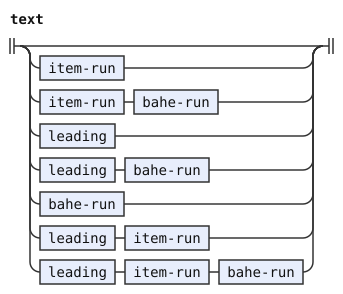

### `item-run`

The diagram leaves out its conditions.

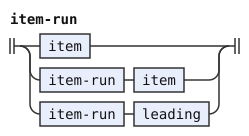

### `item`

The diagram leaves out its tags, conditions and emission.

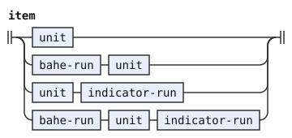

### `unit`

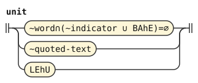

### `bahe-run`

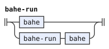

### `bahe`

The diagram leaves out its emission.

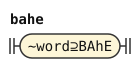

## Indicator runs

These rules are in [this section of the document](../../../grammars/indicators/cll.md#indicator-runs).

### `indicator-run`

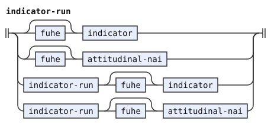

### `indicator`

The diagram leaves out its tags, conditions and emission.

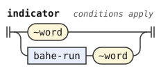

### `fuhe`

The diagram leaves out its tags, conditions and emission.

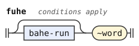

### `attitudinal-nai`

The diagram leaves out its tags and emission.

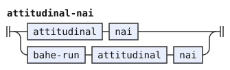

### `attitudinal`

The diagram leaves out its tags and conditions.

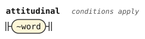

### `nai`

The diagram leaves out its tags and emission.

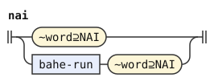

## Leading runs

These rules are in [this section of the document](../../../grammars/indicators/cll.md#leading-runs).

### `leading`

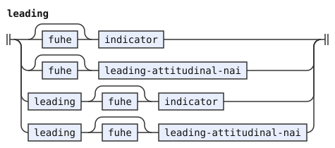

### `leading-attitudinal-nai`

The diagram leaves out its emission.

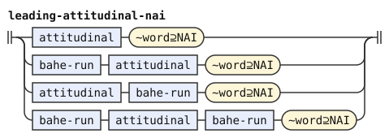
