# jbogenbau: from characters to tokens: railroad diagrams

These are the rules of [jbogenbau: from characters to tokens](../../../grammars/notation/lexical.md), one diagram for each rule, in the order of the document.

`node tools/sync.js` writes this page and the diagrams from the document, so edit the document instead.

[Railroad diagrams](../../design.md#railroad-diagrams) in the design document explains how to read them.

## The text

These rules are in [this section of the document](../../../grammars/notation/lexical.md#the-text).

### `text`

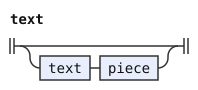

### `piece`

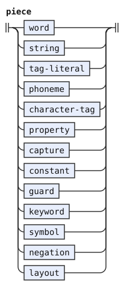

## Names and tag literals

These rules are in [this section of the document](../../../grammars/notation/lexical.md#names-and-tag-literals).

### `word`

The diagram leaves out its tags and emission.

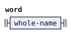

### `tag-literal`

The diagram leaves out its tags and emission.

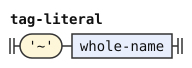

### `whole-name`

The diagram leaves out its conditions.

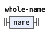

### `name`

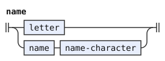

### `lower-name`

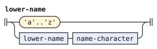

### `upper-name`

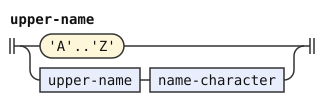

### `name-character`

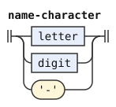

### `letter`

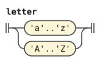

### `digit`

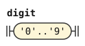

## Strings, character tags, properties and phoneme tags

These rules are in [this section of the document](../../../grammars/notation/lexical.md#strings-character-tags-properties-and-phoneme-tags).

### `string`

The diagram leaves out its tags and emission.

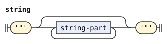

### `string-part`

The diagram leaves out its conditions.

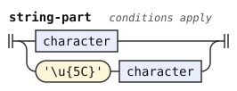

### `character-tag`

The diagram leaves out its tags and emission.

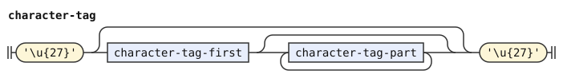

### `character-tag-first`

The diagram leaves out its conditions.

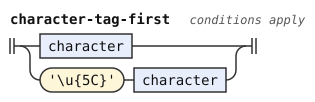

### `character-tag-part`

The diagram leaves out its conditions.

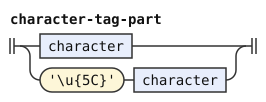

### `property`

The diagram leaves out its tags and emission.

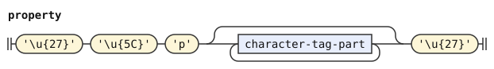

### `phoneme`

The diagram leaves out its tags and emission.

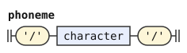

### `character`

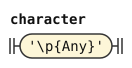

## Captures, constants, guards and keywords

These rules are in [this section of the document](../../../grammars/notation/lexical.md#captures-constants-guards-and-keywords).

### `capture`

The diagram leaves out its tags, conditions and emission.

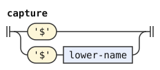

### `constant`

The diagram leaves out its tags, conditions and emission.

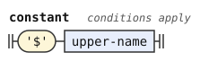

### `guard`

The diagram leaves out its tags and emission.

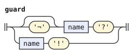

### `negation`

The diagram leaves out its conditions and emission.

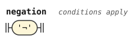

### `keyword`

The diagram leaves out its tags, conditions and emission.

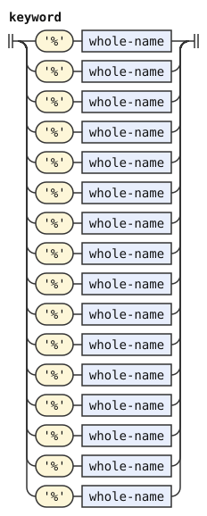

## Symbols

These rules are in [this section of the document](../../../grammars/notation/lexical.md#symbols).

### `symbol`

The diagram leaves out its tags and emission.

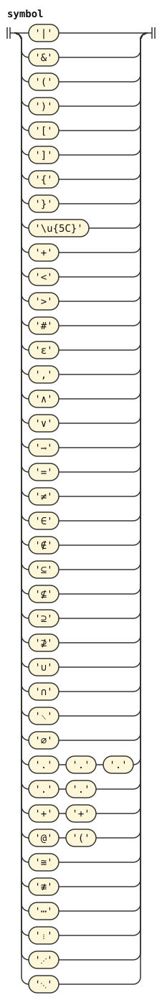

## Layout

These rules are in [this section of the document](../../../grammars/notation/lexical.md#layout).

### `layout`

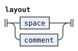

### `space`

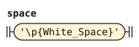

### `comment`

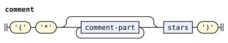

### `comment-part`

The diagram leaves out its conditions.

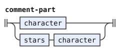

### `stars`

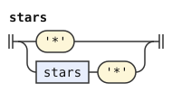
