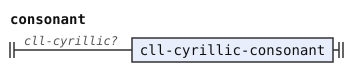
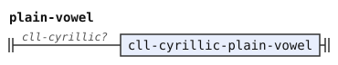
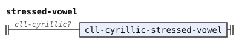
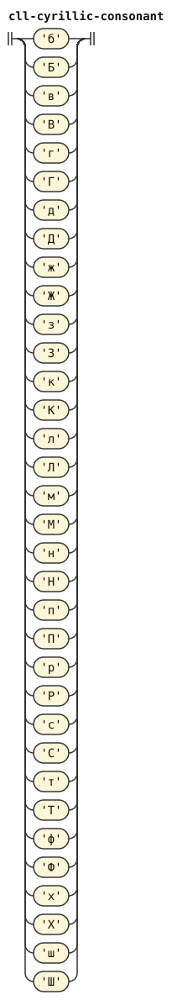
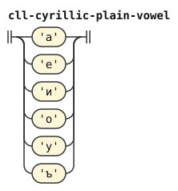
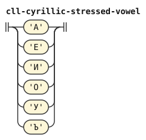

# The Cyrillic orthography of CLL: railroad diagrams

These are the rules of [The Cyrillic orthography of CLL](../../../grammars/phonemes/cyrillic-cll.md), one diagram for each rule, in the order of the document.

`node tools/sync.js` writes this page and the diagrams from the document, so edit the document instead.

[Railroad diagrams](../../design.md#railroad-diagrams) in the design document explains how to read them.

## Introduction

These rules are in [the introduction of the document](../../../grammars/phonemes/cyrillic-cll.md).

### `consonant`

`%extend-rule` adds these alternatives to a rule of an earlier document.

### `plain-vowel`

`%extend-rule` adds these alternatives to a rule of an earlier document.

### `stressed-vowel`

`%extend-rule` adds these alternatives to a rule of an earlier document.

### `cll-cyrillic-consonant`

The diagram leaves out its tags and emission.

### `cll-cyrillic-plain-vowel`

The diagram leaves out its tags and emission.

### `cll-cyrillic-stressed-vowel`

The diagram leaves out its tags and emission.

