# zbalermorna: railroad diagrams

These are the rules of [zbalermorna](../../../grammars/phonemes/zbalermorna.md), one diagram for each rule, in the order of the document.

`node tools/sync.js` writes this page and the diagrams from the document, so edit the document instead.

[Railroad diagrams](../../design.md#railroad-diagrams) in the design document explains how to read them.

## Introduction

These rules are in [the introduction of the document](../../../grammars/phonemes/zbalermorna.md).

### `consonant`

`%extend-rule` adds these alternatives to a rule of an earlier document. The diagram leaves out its tags and emission.

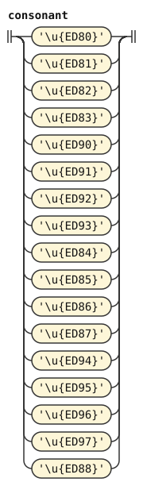

### `apostrophe`

`%extend-rule` adds these alternatives to a rule of an earlier document. The diagram leaves out its emission.

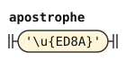

### `core-char`

`%extend-rule` adds these alternatives to a rule of an earlier document.

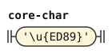

### `comma`

`%extend-rule` adds these alternatives to a rule of an earlier document.

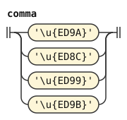

### `plain-vowel`

`%extend-rule` adds these alternatives to a rule of an earlier document. The diagram leaves out its tags and emission.

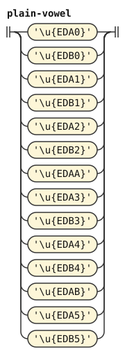

### `stressed-vowel`

`%extend-rule` adds these alternatives to a rule of an earlier document. The diagram leaves out its tags and emission.

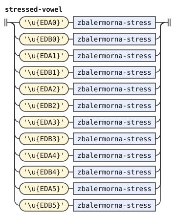

### `zbalermorna-stress`

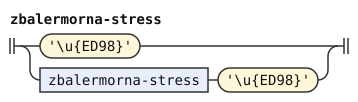

### `vowel`

`%extend-rule` adds these alternatives to a rule of an earlier document.

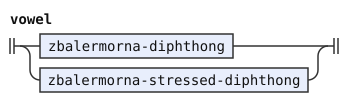

### `non-vowel`

`%extend-rule` adds these alternatives to a rule of an earlier document.

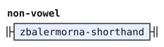

### `any-lojban-char`

`%extend-rule` adds these alternatives to a rule of an earlier document.

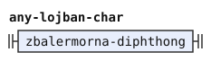

### `mark-char`

`%extend-rule` adds these alternatives to a rule of an earlier document.

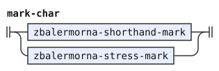

### `zbalermorna-stress-mark`

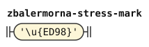

### `zbalermorna-diphthong`

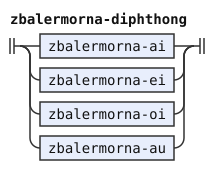

### `zbalermorna-ai`

The diagram leaves out its emission.

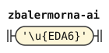

### `zbalermorna-ei`

The diagram leaves out its emission.

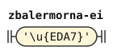

### `zbalermorna-oi`

The diagram leaves out its emission.

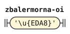

### `zbalermorna-au`

The diagram leaves out its emission.

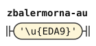

### `zbalermorna-stressed-diphthong`

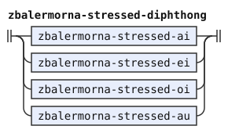

### `zbalermorna-stressed-ai`

The diagram leaves out its emission.

### `zbalermorna-stressed-ei`

The diagram leaves out its emission.

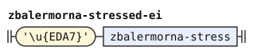

### `zbalermorna-stressed-oi`

The diagram leaves out its emission.

### `zbalermorna-stressed-au`

The diagram leaves out its emission.

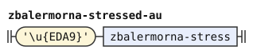

### `zbalermorna-shorthand`

The diagram leaves out its emission.

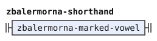

### `zbalermorna-marked-vowel`

The diagram leaves out its tags.

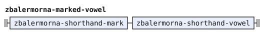

### `zbalermorna-shorthand-vowel`

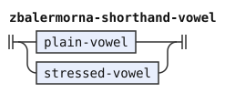

### `zbalermorna-shorthand-mark`

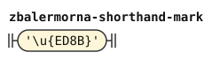
