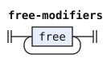

# The CLL grammar: railroad diagrams

These are the rules of [The CLL grammar](../../../grammars/syntax/cll.md), one diagram for each rule, in the order of the document.

`node tools/sync.js` writes this page and the diagrams from the document, so edit the document instead.

[Railroad diagrams](../../design.md#railroad-diagrams) in the design document explains how to read them.

## Introduction

These rules are in [the introduction of the document](../../../grammars/syntax/cll.md).

### `#`

## The text and its paragraphs

These rules are in [this section of the document](../../../grammars/syntax/cll.md#the-text-and-its-paragraphs).

### `text`

### `text-1`

### `paragraphs`

### `paragraph`

## Statements and fragments

These rules are in [this section of the document](../../../grammars/syntax/cll.md#statements-and-fragments).

### `statement`

### `statement-1`

### `statement-2`

### `statement-3`

### `fragment`

### `prenex`

## Sentences and bridi-tails

These rules are in [this section of the document](../../../grammars/syntax/cll.md#sentences-and-bridi-tails).

### `sentence`

### `subsentence`

### `bridi-tail`

### `bridi-tail-1`

### `bridi-tail-1-final`

The diagram leaves out its conditions.

### `free-modifiers`

### `bridi-tail-2`

### `bridi-tail-3`

### `gek-sentence`

### `tail-terms`

## Terms

These rules are in [this section of the document](../../../grammars/syntax/cll.md#terms).

### `terms`

### `terms-1`

### `terms-2`

### `term`

### `termset`

## Sumti

These rules are in [this section of the document](../../../grammars/syntax/cll.md#sumti).

### `sumti`

### `sumti-1`

### `sumti-2`

### `sumti-3`

### `sumti-4`

### `sumti-5`

### `sumti-6`

### `sumti-tail`

### `sumti-tail-1`

## Relative clauses

These rules are in [this section of the document](../../../grammars/syntax/cll.md#relative-clauses).

### `relative-clauses`

### `relative-clause`

## Selbri and tanru

These rules are in [this section of the document](../../../grammars/syntax/cll.md#selbri-and-tanru).

### `selbri`

### `selbri-1`

### `selbri-2`

### `selbri-3`

### `selbri-4`

### `selbri-5`

### `selbri-6`

### `tanru-unit`

### `tanru-unit-1`

### `tanru-unit-2`

### `abstractor-chain`

### `linkargs`

### `links`

## Numbers, lerfu strings and mekso

These rules are in [this section of the document](../../../grammars/syntax/cll.md#numbers-lerfu-strings-and-mekso).

### `quantifier`

### `mex`

### `mex-chain`

### `mex-1`

### `mex-2`

### `rp-expression`

### `rp-operand`

### `operator`

### `operator-1`

### `operator-2`

### `mex-operator`

### `operand`

### `operand-1`

### `operand-2`

### `operand-3`

### `number`

The diagram leaves out its conditions.

### `lerfu-string`

The diagram leaves out its conditions.

### `number-continuation`

### `lerfu-word`

## Logical and non-logical connectives

These rules are in [this section of the document](../../../grammars/syntax/cll.md#logical-and-non-logical-connectives).

### `ek`

### `gihek`

### `jek`

### `joik`

### `interval`

### `joik-ek`

### `joik-jek`

### `plain-joik-jek`

The diagram leaves out its conditions.

### `joik-before-ke`

The diagram leaves out its conditions.

### `selbri-5-not-ke-group`

The diagram leaves out its conditions.

### `operator-1-not-ke-group`

The diagram leaves out its conditions.

### `gek`

### `guhek`

### `gik`

## Tenses and modals

These rules are in [this section of the document](../../../grammars/syntax/cll.md#tenses-and-modals).

### `tag`

### `stag`

### `tense-modal`

### `simple-tense-modal`

Its flag is `leftmost-longest`.

### `time`

### `time-offset`

### `space`

### `space-offset`

### `space-interval`

### `space-int-props`

### `interval-property`

## Free modifiers, vocatives and indicators

These rules are in [this section of the document](../../../grammars/syntax/cll.md#free-modifiers-vocatives-and-indicators).

### `free`

### `vocative`

### `indicators`

### `indicator`

## The non-formal rules

These rules are in [this section of the document](../../../grammars/syntax/cll.md#the-non-formal-rules).

### `any-word`

### `anything`

