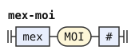
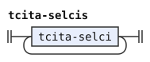

# The Zantufa grammar: railroad diagrams

These are the rules of [The Zantufa grammar](../../../grammars/syntax/zantufa.md), one diagram for each rule, in the order of the document.

`node tools/sync.js` writes this page and the diagrams from the document, so edit the document instead.

[Railroad diagrams](../../design.md#railroad-diagrams) in the design document explains how to read them.

## Introduction

These rules are in [the introduction of the document](../../../grammars/syntax/zantufa.md).

### `#`

### `any-word`

### `anything`

## The text and its paragraphs

These rules are in [this section of the document](../../../grammars/syntax/zantufa.md#the-text-and-its-paragraphs).

### `text`

### `paragraphs`

### `paragraphs-tail`

### `paragraphs-1`

### `paragraphs-2`

### `paragraph`

## Statements and fragments

These rules are in [this section of the document](../../../grammars/syntax/zantufa.md#statements-and-fragments).

### `statement-terms`

### `statement`

### `statement-1`

### `statement-2`

### `statement-3`

### `gek-statement`

The diagram leaves out its conditions.

### `gek-branches`

### `fragment`

The diagram leaves out its conditions.

### `prenex`

### `na-clause`

### `terms-vau`

### `ku-word`

## Sentences and bridi-tails

These rules are in [this section of the document](../../../grammars/syntax/zantufa.md#sentences-and-bridi-tails).

### `sentence`

The diagram leaves out its conditions.

### `bridi-tail-before-no-gik`

The diagram leaves out its conditions.

### `bridi-tail`

### `bridi-tail-link`

The diagram leaves out its conditions.

### `tag-cu`

### `bridi-tail-1`

### `bridi-tail-1-link`

The diagram leaves out its conditions.

### `tag-bo`

### `tag-ke`

### `bridi-tail-2`

### `bridi-tail-3`

The diagram leaves out its conditions.

### `ke-selbri-2-kehe`

### `ke-clause`

### `selbri-2-kehe`

### `gek-bridi-tail`

The diagram leaves out its conditions.

### `gik-bridi-tails`

### `gik-term`

### `tail-terms`

## Terms

These rules are in [this section of the document](../../../grammars/syntax/zantufa.md#terms).

### `terms`

### `term`

### `term-link`

The diagram leaves out its conditions.

### `joik-tag-cu`

### `term-1`

### `term-2`

The diagram leaves out its conditions.

### `ke-group-of-terms`

The diagram leaves out its conditions.

### `sumti-kehe`

### `brigahi`

The diagram leaves out its conditions.

### `tag-term`

The diagram leaves out its conditions.

### `tag-term-argument`

### `fa-jai`

### `bo-word`

### `gek-term`

## Sumti

These rules are in [this section of the document](../../../grammars/syntax/zantufa.md#sumti).

### `sumti`

### `sumti-1`

The diagram leaves out its conditions.

### `sumti-1-run`

### `sumti-1-link`

### `sumti-2`

The diagram leaves out its conditions.

### `sumti-2-run`

### `sumti-2-link`

### `sumti-3`

### `sumti-4`

### `sumti-5`

The diagram leaves out its conditions.

### `lerfu-boi`

### `lerfu-operator`

The diagram leaves out its conditions.

### `joik-ek-sumti`

### `operand-kehe`

### `sumti-tail`

The diagram leaves out its conditions.

### `sumti-tail-1`

The diagram leaves out its conditions.

## Relative clauses

These rules are in [this section of the document](../../../grammars/syntax/zantufa.md#relative-clauses).

### `relative-clauses`

### `relative-clause`

## Selbri and tanru

These rules are in [this section of the document](../../../grammars/syntax/zantufa.md#selbri-and-tanru).

### `selbri`

The diagram leaves out its conditions.

### `selbri-1`

The diagram leaves out its conditions.

### `ke-word`

### `selbri-2`

### `selbri-3`

### `later-selbri-4`

The diagram leaves out its conditions.

### `joik-selbri-5`

### `selbri-4`

### `selbri-5`

### `selbri-6`

### `tanru-unit`

### `tanru-unit-1`

The diagram leaves out its conditions.

### `gek-tanru-unit`

The diagram leaves out its conditions.

### `nahe-word`

### `mex-moi`

### `gik-selbris`

### `gik-term-or-cu`

### `linkargs`

### `links`

## Mekso

These rules are in [this section of the document](../../../grammars/syntax/zantufa.md#mekso).

### `quantifier`

The diagram leaves out its conditions.

### `mex`

### `mex-link`

The diagram leaves out its conditions.

### `mex-1`

### `bihe-link`

The diagram leaves out its conditions.

### `mex-group`

### `mex-2`

### `mex-rp`

### `mex-forethought`

### `operator`

The diagram leaves out its conditions.

### `operators`

The diagram leaves out its conditions.

### `operator-run`

### `cu-word`

### `operand`

The diagram leaves out its conditions.

### `number`

### `lerfu-string`

### `lerfu-word`

## Connectives

These rules are in [this section of the document](../../../grammars/syntax/zantufa.md#connectives).

### `ek`

### `gihek`

### `joik`

### `joik-ek`

### `joik-gihek`

### `gek`

### `gik`

## Tenses and modals

These rules are in [this section of the document](../../../grammars/syntax/zantufa.md#tenses-and-modals).

### `tag`

### `tag-link`

The diagram leaves out its conditions.

### `tcita-selcis`

### `tcita-selci`

The diagram leaves out its conditions.

## Free modifiers

These rules are in [this section of the document](../../../grammars/syntax/zantufa.md#free-modifiers).

### `free`

The diagram leaves out its conditions.

### `parenthesis-text`

The diagram leaves out its conditions.

### `vocative`

### `number-post`

### `lohai-word`

### `free-not-number`

The diagram leaves out its conditions.

### `lerfu-post`

### `free-not-lerfu`

The diagram leaves out its conditions.

### `vocative-post`

### `free-not-vocative`

The diagram leaves out its conditions.

