# CLL word forms: railroad diagrams

These are the rules of [CLL word forms](../../../grammars/words/cll.md), one diagram for each rule, in the order of the document.

`node tools/sync.js` writes this page and the diagrams from the document, so edit the document instead.

[Railroad diagrams](../../design.md#railroad-diagrams) in the design document explains how to read them.

## Cmavo

These rules are in [this section of the document](../../../grammars/words/cll.md#cmavo).

### `cmavo-shape`

The diagram leaves out its tags and conditions.

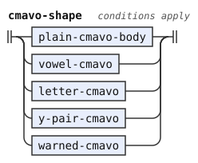

### `plain-cmavo-body`

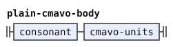

### `vowel-cmavo`

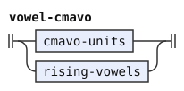

### `cmavo-units`

### `cmavo-unit`

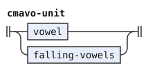

### `letter-cmavo`

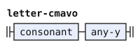

### `y-pair-cmavo`

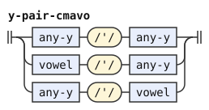

### `warned-cmavo`

The diagram leaves out its conditions.

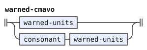

### `warned-units`

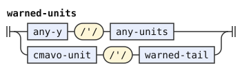

### `warned-tail`

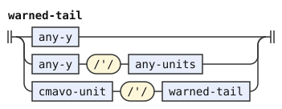

### `any-units`

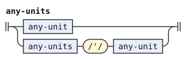

### `any-unit`

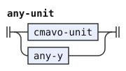

### `y-letters`

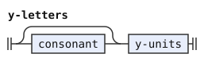

### `y-units`

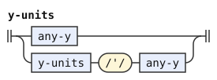

### `cmavo-nucleus`

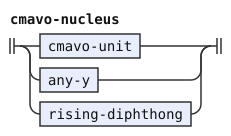

### `first-marked-cmavo`

The diagram leaves out its conditions.

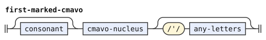

### `last-marked-cmavo`

The diagram leaves out its conditions.

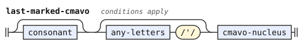

### `name-intro-cmavo`

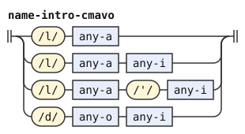

## Brivla

These rules are in [this section of the document](../../../grammars/words/cll.md#brivla).

### `brivla-shape`

The diagram leaves out its tags and conditions.

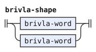

### `brivla-word`

The diagram leaves out its tags and conditions.

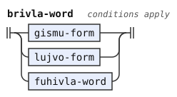

### `gismu-form`

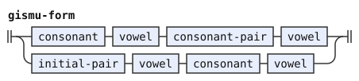

## Lujvo

These rules are in [this section of the document](../../../grammars/words/cll.md#lujvo).

### `lujvo-form`

The diagram leaves out its conditions.

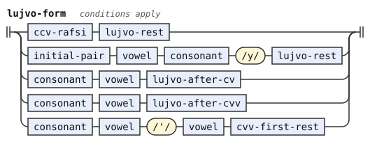

### `lujvo-after-cvv`

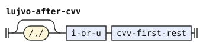

### `cvv-first-rest`

The diagram leaves out its conditions.

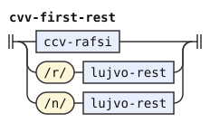

### `lujvo-rest`

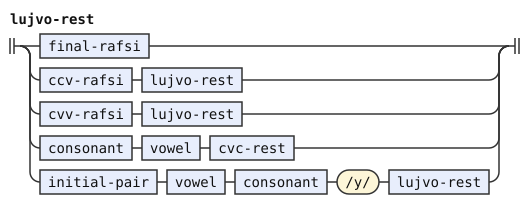

### `cvc-rest`

The diagram leaves out its conditions.

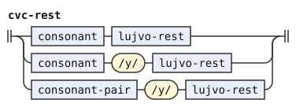

### `final-rafsi`

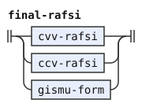

### `ccv-rafsi`

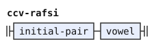

### `cvv-rafsi`

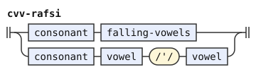

### `mandatory-y`

The diagram leaves out its conditions.

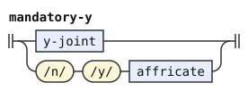

### `y-joint`

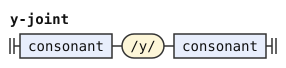

### `affricate`

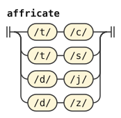

### `pair-across-y`

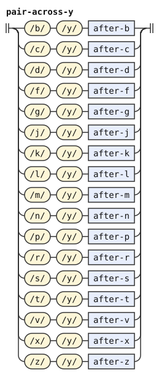

### `lujvo-after-cv`

The diagram leaves out its conditions.

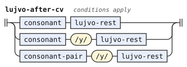

### `tosmabru-positive`

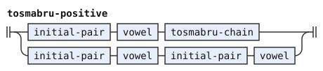

### `tosmabru-chain`

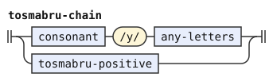

### `tosmabru-y`

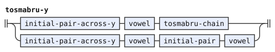

### `initial-pair-across-y`

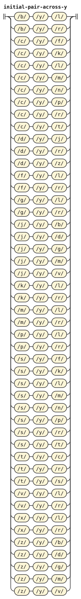

## Borrowings

These rules are in [this section of the document](../../../grammars/words/cll.md#borrowings).

### `fuhivla-word`

The diagram leaves out its conditions.

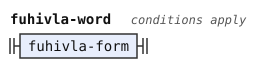

### `fuhivla-form`

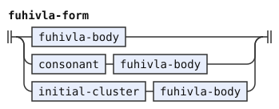

### `fuhivla-body`

The diagram leaves out its conditions.

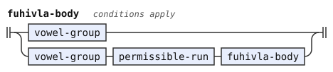

### `vowel-group`

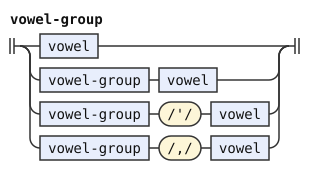

### `clustered-start`

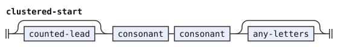

### `counted-lead`

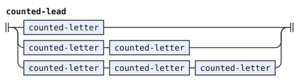

### `counted-letter`

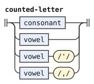

### `combination`

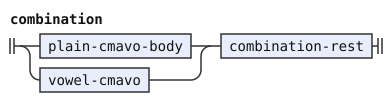

### `combination-rest`

The diagram leaves out its conditions.

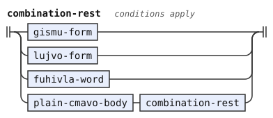

## Cmevla

These rules are in [this section of the document](../../../grammars/words/cll.md#cmevla).

### `cmevla-shape`

The diagram leaves out its tags and conditions.

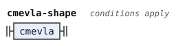

### `cmevla`

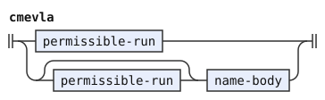

### `name-body`

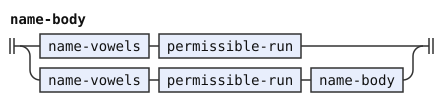

### `name-vowels`

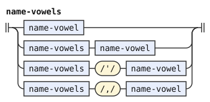

### `la-doi-inside`

### `la-or-doi`

## Commas

These rules are in [this section of the document](../../../grammars/words/cll.md#commas).

### `falling-vowels`

### `rising-vowels`

### `falling-i`

### `one-syllable`

### `syllable-vowels`

### `has-comma`

