# Word forms: railroad diagrams

These are the rules of [Word forms](../../../grammars/words/forms.md), one diagram for each rule, in the order of the document.

`node tools/sync.js` writes this page and the diagrams from the document, so edit the document instead.

[Railroad diagrams](../../design.md#railroad-diagrams) in the design document explains how to read them.

## Runs

These rules are in [this section of the document](../../../grammars/words/forms.md#runs).

### `text`

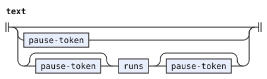

### `runs`

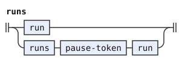

### `pause-token`

The diagram leaves out its emission.

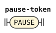

### `run`

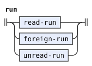

### `read-run`

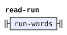

### `foreign-run`

The diagram leaves out its emission.

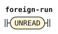

### `unread-run`

The diagram leaves out its conditions and emission.

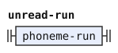

### `phoneme-run`

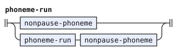

### `nonpause-phoneme`

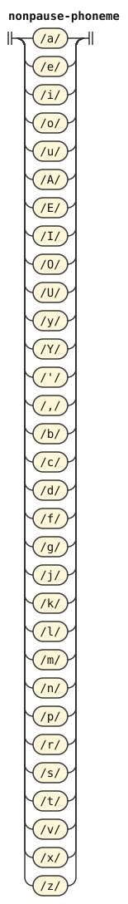

## Words in a run

These rules are in [this section of the document](../../../grammars/words/forms.md#words-in-a-run).

### `run-words`

The diagram leaves out its tags and conditions.

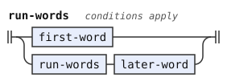

### `first-word`

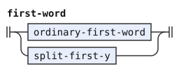

### `ordinary-first-word`

The diagram leaves out its conditions and emission.

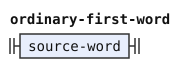

### `later-word`

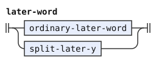

### `ordinary-later-word`

The diagram leaves out its conditions and emission.

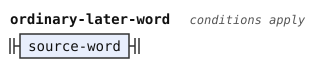

### `split-first-y`

The diagram leaves out its tags, conditions and emission.

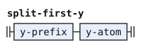

### `split-later-y`

The diagram leaves out its tags, conditions and emission.

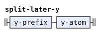

### `y-prefix`

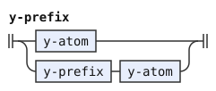

### `y-atom`

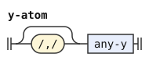

### `bu-form-ahead`

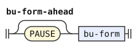

### `bu-form`

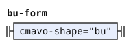

## Words

These rules are in [this section of the document](../../../grammars/words/forms.md#words).

### `source-word`

The diagram leaves out its tags.

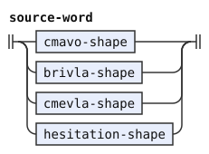

### `hesitation-shape`

The diagram leaves out its tags.

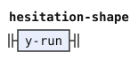

### `y-run`

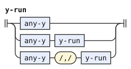

### `any-y`

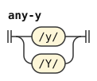
