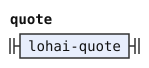
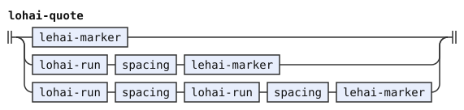
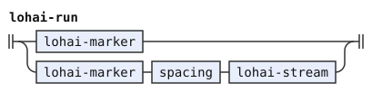
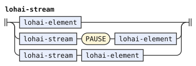
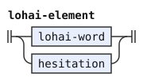
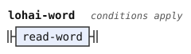
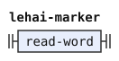

# Replacement quotes: railroad diagrams

These are the rules of [Replacement quotes](../../../grammars/words/lohai.md), one diagram for each rule, in the order of the document.

`node tools/sync.js` writes this page and the diagrams from the document, so edit the document instead.

[Railroad diagrams](../../design.md#railroad-diagrams) in the design document explains how to read them.

## Introduction

These rules are in [the introduction of the document](../../../grammars/words/lohai.md).

### `quote`

`%extend-rule` adds these alternatives to a rule of an earlier document.

### `lohai-quote`

The diagram leaves out its tags.

### `lohai-run`

The diagram leaves out its tags.

### `lohai-stream`

### `lohai-element`

### `lohai-word`

The diagram leaves out its conditions and emission.

### `lohai-marker`

The diagram leaves out its tags, conditions and emission.

### `lehai-marker`

The diagram leaves out its tags, conditions and emission.

