# Zantufa word forms: railroad diagrams

These are the rules of [Zantufa word forms](../../../grammars/words/zantufa.md), one diagram for each rule, in the order of the document.

`node tools/sync.js` writes this page and the diagrams from the document, so edit the document instead.

[Railroad diagrams](../../design.md#railroad-diagrams) in the design document explains how to read them.

## Introduction

These rules are in [the introduction of the document](../../../grammars/words/zantufa.md).

### `m`

`%redefine-rule` replaces a rule of an earlier document. The diagram leaves out its conditions.

### `source-word`

`%redefine-rule` replaces a rule of an earlier document. The diagram leaves out its tags and conditions.

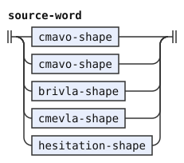

### `runs`

`%redefine-rule` replaces a rule of an earlier document. The diagram leaves out its tags and conditions.

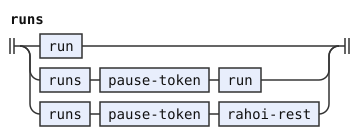

### `read-run`

`%extend-rule` adds these alternatives to a rule of an earlier document. The diagram leaves out its tags.

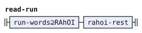

### `run-words`

`%redefine-rule` replaces a rule of an earlier document. The diagram leaves out its tags and conditions.

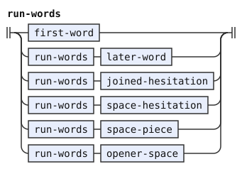

### `rahoi-rest`

The diagram leaves out its tags and conditions.

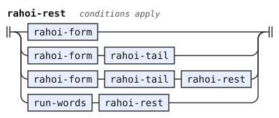

### `rahoi-tail`

The diagram leaves out its tags and conditions.

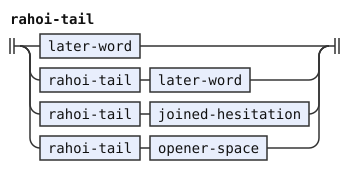

### `space-hesitation`

The diagram leaves out its emission.

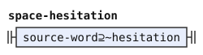

### `opener-space`

The diagram leaves out its emission.

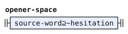

### `space-piece`

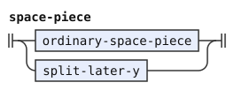

### `ordinary-space-piece`

The diagram leaves out its conditions and emission.

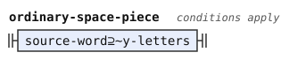

### `only-hesitation`

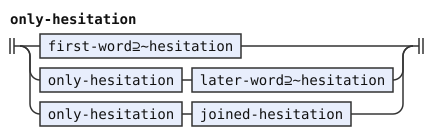

### `rahoi-form`

The diagram leaves out its conditions and emission.

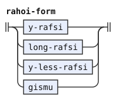

### `joined-hesitation`

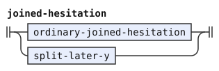

### `ordinary-joined-hesitation`

The diagram leaves out its conditions and emission.

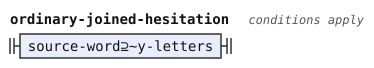
