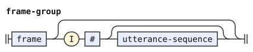
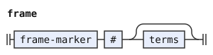

# Discourse frames (ki'ei)

This dialect is a small example of extending the grammar of *The Complete Lojban Language* (CLL). It adds the proposed particle `ki'ei`. An utterance is a statement or a fragment, as in CLL's `paragraph`. A frame is a context for subsequent utterances. The proposed meaning sets the world in which those utterances hold as true.

The dialect includes CLL and then extends its forms and syntax stages. The CLL documents explain the inherited rules and parsing policy.

- [The CLL dialect](cll-ebnf.md)
  ```jbogenbau
  %include "cll-ebnf.md"
  ```

A payload is the material after a marker. The payload after `ki'ei` accepts any number of CLL terms, including zero. For example, `ki'ei ko'a .i broda` supplies an argument, and `ki'ei pu zu ku .i broda` supplies a tense. The empty form `ki'ei .i broda` supplies no terms.

The CLL word stages already accept the word form of `ki'ei`. The classifier declaration adds this particle to the inherited CLL lexicon. The forms stage assigns its class before the later stages read it.

```jbogenbau
%extend-stage forms
%classifier lexicon
  "ki'ei" ∈ KIhEI
```

The syntax stage reads the new class as the terminal `KIhEI`. The word and indicator stages preserve this class on an ordinary `ki'ei` token. The dialect needs no marker rule or class condition.

The replacement paragraph rule accepts an initial sequence of utterances and subsequent groups with frames. It also accepts groups with frames at the start of a paragraph. Each group contains its frame and the subsequent `.i` sequence.

```jbogenbau
%extend-stage syntax
%redefine-rule paragraph
  utterance-sequence [{frame-group}] | {frame-group}

%rule utterance-sequence
  (statement | fragment) [{I # [statement | fragment]}]

%rule frame-group
  frame [I # [utterance-sequence]]

%rule frame
  KIhEI # [terms]
```

<details><summary>Railroad diagrams of the 4 rules from <code>paragraph</code> to <code>frame</code></summary>
<p></p>
<p></p>
<p></p>
<p></p>
</details>

In `ki'ei ko'a .i broda .i brode ki'ei ko'e .i brodi`, the first group contains two utterances. The second group contains one. An earlier utterance can precede the first group, as in `broda ki'ei ko'a .i brode`.

The terms end at `.i`, another `ki'ei`, `ni'o`, or the enclosing text boundary. The grammar requires `.i` before an utterance after a frame. It accepts a frame without subsequent utterances, as in `ki'ei ko'a`. It also accepts consecutive frames, as in `ki'ei ko'a ki'ei ko'e .i broda`.

The CLL rules place `ni'o` outside each paragraph. This dialect places each frame above the `.i` sequence inside that paragraph. The grammar records these boundaries without deciding how an interpreter carries context across them.

This example accepts terms as payloads. It rejects a full predicate payload, such as `ki'ei ce'u purci ce'u .i broda`. It adds no pronoun for the selected world.
