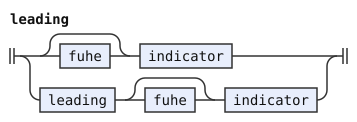
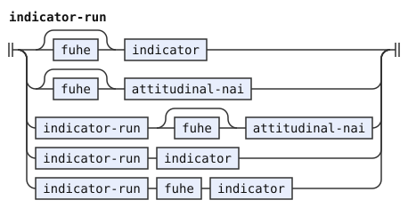

# The experimental indicators

This document is a layer (a document that changes earlier rules) over [the indicator stage of *The Complete Lojban Language* (CLL)](cll.md). A dialect is a pipeline of stages, defined by one pipeline document. A stage is one step of a pipeline, with its own grammar. The [experimental](../dialects/experimental.md) dialect stitches this layer after the CLL document, that is, it reads the two as one grammar.

This layer adds bare NAI indicators and changes leading runs. It keeps the CLL stage's flat attachment. [The notation document](../../docs/notation.md) explains the notation.

A bare `nai` is an indicator, which [the experimental word forms](../words/experimental.md) mark through an implication. Outside a quotation boundary, a `nai` after a word attaches to it. For example, `mi nai klama` is `mi klama` with the indicator `nai`. In `je nai`, the `nai` attaches to `je`. A bare `nai` stays in the stream at the start of a text or directly after `lu`. After `to` or `to'i`, it attaches to the opener.

An attitudinal expresses an attitude. A `nai` directly after an attitudinal attaches to the attitudinal, as in the CLL document. So `mi ui nai klama` gives `mi` the indicator `ui`, and `ui` carries `nai`. Any other `nai` is an indicator of its own. That includes a `nai` after a `fu'e`, as in `mi ui fu'e nai klama`, and a `nai` after a word that is not an attitudinal.

Without the condition below, the grammar admits both attachments of `nai`. The condition removes the reading where `nai` attaches separately to the word. This document restates `indicator-run` with that condition. If a run ends in an attitudinal, its next indicator of its own is not a `nai`. A `fu'e` before that `nai` lifts this. A `ba'e` between an attitudinal and its `nai` goes with the `nai`, as in the CLL document.

A `nai` is an indicator here, so a run of items never begins with one.

A leading run needs no pair form. The syntax reads `ui` and `nai` as separate indicators there. So this document restates `leading` without the pair form of the CLL document. After this, nothing reads the rule `leading-attitudinal-nai` of the CLL document.

A FUhE needs an indicator after it. So `mi fu'e ui klama` is a text, and `mi fu'e klama` is not. The restated `indicator-run` lets each indicator take its own `fu'e`.

Indicators after `lu` begin the quoted text. Indicators after `to` and `to'i` attach to the opener. So `to ui mi klama toi` attaches `ui` to `to`.

```jbogenbau
%redefine-rule leading
  | [fuhe] indicator | leading [fuhe] indicator

%redefine-rule indicator-run
  | [fuhe] indicator | [fuhe] attitudinal-nai
  | indicator-run [fuhe] attitudinal-nai
  | $r(indicator-run) $i(indicator)
  | indicator-run fuhe indicator
%conditions
  NAI ⊈ tags($i) ∨ classes(last($r)) ∩ (UI ∪ CAI) = ∅
```

<details><summary>Railroad diagrams of <code>leading</code> and <code>indicator-run</code></summary>
<p></p>
<p></p>
</details>

## Differences from camxes-exp

camxes-exp, the experimental grammar of the camxes parser, accepts a bare NAI through its `indicator` rule. Both grammars require an indicator after FUhE. Both preserve the quotation boundary after LU, and camxes-exp's `TO_post` attaches indicators to TO.

In [camxes-exp](https://github.com/lojban/ilmentufa/blob/778ea138f7d150121ca722db7536ce3b123943ac/camxes-exp.peg#L389-L1159), `post_clause` repeats `indicators <- FUhE_clause? indicator+`. It nests further FUhE groups and bare NAI inside every clause whose post is [`post_clause`](https://github.com/lojban/ilmentufa/blob/778ea138f7d150121ca722db7536ce3b123943ac/camxes-exp.peg#L422).

[`UI_post`](https://github.com/lojban/ilmentufa/blob/778ea138f7d150121ca722db7536ce3b123943ac/camxes-exp.peg#L1159), [`CAI_post`](https://github.com/lojban/ilmentufa/blob/778ea138f7d150121ca722db7536ce3b123943ac/camxes-exp.peg#L588), [`DAhO_post`](https://github.com/lojban/ilmentufa/blob/778ea138f7d150121ca722db7536ce3b123943ac/camxes-exp.peg#L640), [`FUhO_post`](https://github.com/lojban/ilmentufa/blob/778ea138f7d150121ca722db7536ce3b123943ac/camxes-exp.peg#L713), and [`NAI_post`](https://github.com/lojban/ilmentufa/blob/778ea138f7d150121ca722db7536ce3b123943ac/camxes-exp.peg#L977) use that rule. [`FUhE_post`](https://github.com/lojban/ilmentufa/blob/778ea138f7d150121ca722db7536ce3b123943ac/camxes-exp.peg#L707) does not use it. This layer keeps those groups and separate NAI indicators flat.

For example, camxes-exp nests `fu'e ui` inside DAhO in `mi da'o fu'e ui klama`. This layer attaches DAhO and the FUhE group directly to `mi`. The same difference holds after UI, CAI, FUhO and NAI.

In `mi .e ui da'o nai do`, camxes-exp nests bare NAI inside DAhO, under UI. This layer attaches the separate indicators UI, DAhO and NAI directly to `.e`.
