# jbogenbau: from tokens to a grammar

The syntax stage is the second stage of the notation dialect, `../dialects/notation.md`. A stage is one step of a pipeline, with its own grammar. A token is one unit that a stage reads or emits. The stage reads the tokens that `lexical.md` emitted.

The stage builds the tree from which a library reads the grammar's rules and directives. Its rule names matter to that reader: the table in `../../docs/engine.md`, §9, says what each named constituent becomes. `../../docs/notation.md` explains the notation for authors.

The tokens arrive with tags. A tag marks a token by name, phoneme or character. The lexical stage tags a token `~identifier`, `~string`, `~tag`, `~phoneme`, `~character`, `~property`, `~capture`, `~constant` or `~guard`. It tags a keyword that the notation knows with its own identifier, such as `~keyword-rule` for `%rule`. It tags `...` with `~ellipsis`, `..` with `~double-dot`, and `++` with `~double-plus`. Any other symbol is one character, which keeps its character tag, such as `'|'`, `'{'` or `'\\'`.

## Choosing among parses

Every rule and directive begins with a keyword, and a keyword begins nothing else. So where one ends is never in doubt.

Inside one, no list can end in two places either. A separated list has a separator that begins no item. Some lists have no separator. They are a text's statements, a directive's operands, a classifier's entries and its keys, the guards of an entry or an alternative, a sequence's primaries and an item's attachments. In each of these, no token that can continue an item can also begin the next one. Guards end before a key or an expression, and keys before `∈` or `∉`.

The guards of a guarded term need one more step. Each item is an any-of and `⟹`, and the union after the last one can begin as another item does. But only another guard reads a `⟹` outside parentheses. So in `$a ⟹ $b ⟹ ~x`, the list cannot end after `$a ⟹`, since the union cannot read the second `⟹`. So the greedy reading has nothing to settle anywhere, and every list can be flat braces.

```jbogenbau
%ambiguity-resolution greedy
```

## Documents

A grammar text is a sequence of rules, directives, constant definitions, classifiers and implications. A directive is its keyword and any number of operands, each a name, a string, a tag, a range or a property. A constant definition is `%const` or `%redefine-const`, the constant, and a term, its value. A library reads the tree into a DOM (document object model), its own form of the grammar. At that point, the library makes sure that each directive has the operands that it takes, so that an error names the directive (`../../docs/engine.md`, §9).

```jbogenbau
%rule text
  [{statement}]

%rule statement
  rule | directive | prefer-directive | constant-definition | classifier | implication-declaration

%rule prefer-directive
  ~keyword-prefer reference '>' reference

%rule constant-definition
  constant-definer constant-reference term

%rule constant-definer
  ~keyword-const | ~keyword-redefine-const

%rule directive
  directive-name [{argument-word | argument-string | argument-tag}]

%rule directive-name
  | ~keyword-ambiguity-resolution | ~keyword-stage
  | ~keyword-include | ~keyword-features

%rule argument-word
  ~identifier

%rule argument-string
  ~string

%rule argument-tag
  ~tag | ~phoneme | ~character | range | property
```

<details><summary>Railroad diagrams of the 10 rules from <code>text</code> to <code>argument-tag</code></summary>
<p>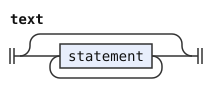</p>
<p>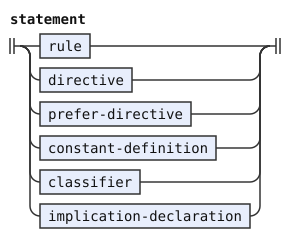</p>
<p>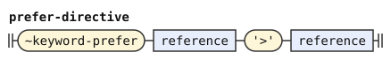</p>
<p>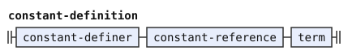</p>
<p>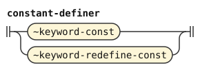</p>
<p>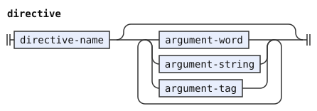</p>
<p>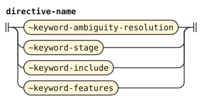</p>
<p>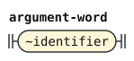</p>
<p>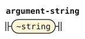</p>
<p>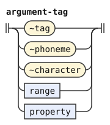</p>
</details>

## Classifiers and implications

A classifier is `%classifier`, its name, and any number of entries. An entry is its gates, one or more keys, `∈` or `∉`, and a class. A key is a string, and a class is a name or a tag literal. An entry ends with its class, and the next one begins with a gate or a key, so line breaks are only layout here. The reader refuses a warning on an entry and a key that is not a canonical sound. It also refuses a class that does not begin with a capital (`../../docs/engine.md`, §9).

An implication is `%implies` and two terms joined by `⟹`. Each term is a union, not a guarded term, so its `⟹` is always the one of the implication. The reader makes sure that both are closed terms whose type is a tag set.

```jbogenbau
%rule classifier
  ~keyword-classifier classifier-name [{classifier-entry}]

%rule classifier-name
  ~identifier

%rule classifier-entry
  [{guard}] {classifier-key} classifier-operator classifier-class

%rule classifier-key
  ~string

%rule classifier-operator
  '∈' | '∉'

%rule classifier-class
  ~identifier | ~tag

%rule implication-declaration
  ~keyword-implies union '⟹' union
```

<details><summary>Railroad diagrams of the 7 rules from <code>classifier</code> to <code>implication-declaration</code></summary>
<p>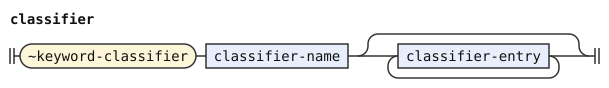</p>
<p>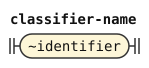</p>
<p>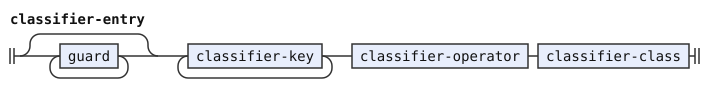</p>
<p>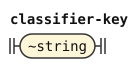</p>
<p>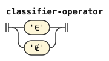</p>
<p>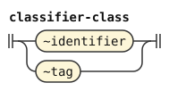</p>
<p>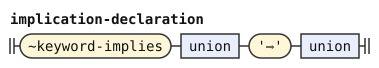</p>
</details>

## Rules

A rule has a keyword, optional flags, name, alternatives and clauses, in that order. Flags are names in parentheses, and only `leftmost-longest` is accepted on definitions and redefinitions. Empty lists, duplicates, arguments and flags on extensions are errors. The keyword defines, redefines or extends a rule. A rule's name is a name or `#`, the free-modifier slot, and each clause occurs at most once in a fixed order. Every separator can stand first, so each alternative can start its own line with `|`.

```jbogenbau
%rule rule
  definer [rule-flags] rule-name body [tags-clause] [conditions-clause] [emits-clause] [opaque-clause]

%rule definer
  ~keyword-rule | ~keyword-redefine-rule | ~keyword-extend-rule

%rule rule-flags
  '(' {rule-flag \ ','} ')'

%rule rule-flag
  ~identifier

%rule rule-name
  ~identifier | '#'

%rule body
  | ['|'] {alternative \ '|'}
  | ranked-alternative

%rule alternative
  [{guard}] conjunction [alternative-tags]

%rule ranked-alternative
  [{guard}] ranked-choice [alternative-tags]

%rule ranked-choice
  conjunction '≻' {conjunction \ '≻'}

%rule guard
  ~guard

%rule alternative-tags
  '<' term '>'
```

<details><summary>Railroad diagrams of the 11 rules from <code>rule</code> to <code>alternative-tags</code></summary>
<p>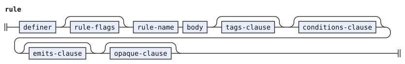</p>
<p>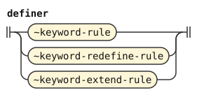</p>
<p>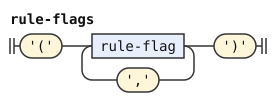</p>
<p>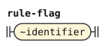</p>
<p>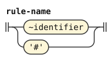</p>
<p>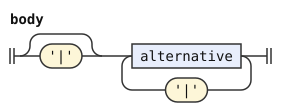</p>
<p>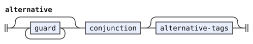</p>
<p>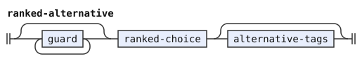</p>
<p>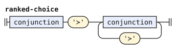</p>
<p>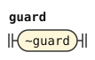</p>
<p>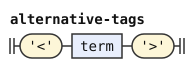</p>
</details>

## Expressions

`&` joins sequences, and a sequence is one or more primaries. Parentheses group a choice, whose alternatives carry neither guards nor tags. Brackets hold an optional choice, and braces a repetition. A `+` or `++` right after `[` marks an elidable optional (`../../docs/notation.md`, "Elided terminators"). The reader makes sure that its terminator stands first, as written, with no group around it, and that no capture stands inside it. It reads this from the tree, before it drops the groups.

Inside braces, the item is a choice, and so is the separator after a backslash, if there is one. So `{a | b \ c | d}` separates items `a` or `b` with `c` or `d`. The marker `...` of a chain stands right after `{` for a left chain, or after the item for a right chain. A chain, like a list, can leave out the backslash and the separator, as in `{... x}` and `{x ...}`. The reader reads which of the two it is from where the marker stands among the parts (`../../docs/engine.md`, §9). It refuses a chain that is not the whole expression of its alternative, and a capture inside braces.

A terminal is a name that begins with a capital, a tag literal, a character tag, a phoneme tag, a range or a property. A string is not a terminal. A range is two character tags joined by `..`, such as `'a'..'z'`.

A reference or a terminal can carry a test on its own span, such as `LE="la"` or `cmavo∩UI=∅`. A test is `=`, `≠`, `⊇` or `⊉` and an operand, or `∩`, an operand, and `=∅` or `≠∅`. The operand is one term: a string, a tag, a range, `∅`, a constant, or a term in parentheses. So `UI⊇(A ∪ B)` needs its parentheses. A test belongs to the one symbol before it, so every item of `{UI="ui"}` is tested.

The grammar reads a test after any primary, and a constant as a primary. The reader refuses a test after a group, an optional, braces, a capture, `ε`, `#` or another test. It also refuses a constant in a body, and an operand that is not a closed term of the right type. It names the reason for each.

```jbogenbau
%rule conjunction
  ['&'] {sequence \ '&'}

%rule sequence
  {primary}

%rule primary
  | reference | tag | character | phoneme | range | property
  | tested | capture | group | optional | repetition | empty
  | constant-reference

%rule tested
  primary test

%rule test
  | test-comparator test-operand
  | '∩' test-operand test-emptiness

%rule test-comparator
  '=' | '≠' | '⊇' | '⊉'

%rule test-emptiness
  ('=' | '≠') '∅'

%rule test-operand
  | string | tag | character | phoneme | range | property | name | empty-set
  | '(' term ')' | constant-reference

%rule reference
  ~identifier | '#'

%rule tag
  ~tag

%rule character
  ~character

%rule phoneme
  ~phoneme

%rule range
  character ~double-dot character

%rule property
  ~property

%rule capture
  ~capture '(' primary ')'

%rule group
  '(' choice ')'

%rule optional
  '[' ['+' | ~double-plus] choice ']'

%rule repetition
  | '{' choice ['\\' choice] '}'
  | '{' ~ellipsis choice ['\\' choice] '}'
  | '{' choice ~ellipsis ['\\' choice] '}'

%rule choice
  | ['|'] {conjunction \ '|'}
  | ranked-choice

%rule empty
  'ε'
```

<details><summary>Railroad diagrams of the 20 rules from <code>conjunction</code> to <code>empty</code></summary>
<p>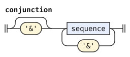</p>
<p>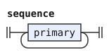</p>
<p>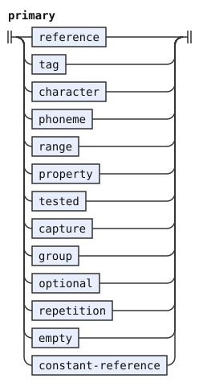</p>
<p>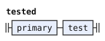</p>
<p>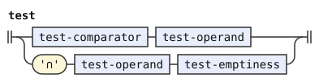</p>
<p>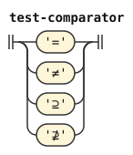</p>
<p>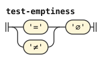</p>
<p>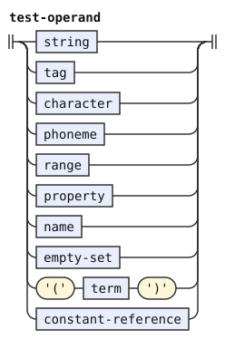</p>
<p></p>
<p>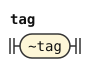</p>
<p>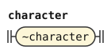</p>
<p>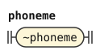</p>
<p>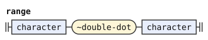</p>
<p>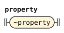</p>
<p>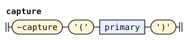</p>
<p>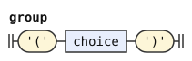</p>
<p>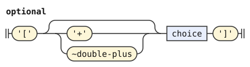</p>
<p>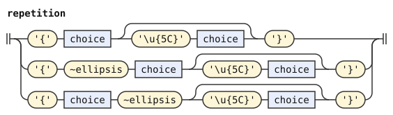</p>
<p>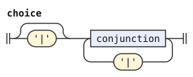</p>
<p>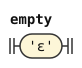</p>
</details>

## Clauses

`%tags` says what tags every alternative's constituent carries. `%conditions` lists what must hold of the captured parts.

`%emits` says what the constituent hands on. That is a list of items. An item is a capture, with tags of its own between `<` and `>`, or an inserted tag. An inserted tag is a capital-initial name, a tag literal, a character tag or a phoneme tag. The grammar also reads a range or a property there, so that the reader can refuse it by name. The clause can also be `ε`, nothing, which also makes the constituent not count.

An item can have attachments: captures in parentheses, any number before its target and any number after its tags. The grammar reads them on any item, and around `$` too. The reader refuses them where the item is not a named capture, and it refuses `($)`.

`%opaque` is a keyword alone. During emission, it makes the constituent one part, which sounds `?` and shows its text.

```jbogenbau
%rule tags-clause
  ~keyword-tags term

%rule conditions-clause
  ~keyword-conditions [','] {implication \ ','}

%rule emits-clause
  ~keyword-emits ([','] {emit-item \ ','} | 'ε')

%rule opaque-clause
  ~keyword-opaque

%rule emit-item
  [{emit-before}] emit-target [emit-tags] [{emit-after}]

%rule emit-before
  '(' ~capture ')'

%rule emit-after
  '(' ~capture ')'

%rule emit-target
  ~capture | ~identifier | ~tag | ~character | ~phoneme | range | property

%rule emit-tags
  '<' term '>'
```

<details><summary>Railroad diagrams of the 9 rules from <code>tags-clause</code> to <code>emit-tags</code></summary>
<p>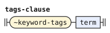</p>
<p>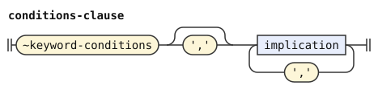</p>
<p>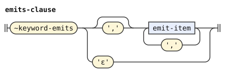</p>
<p></p>
<p></p>
<p></p>
<p></p>
<p></p>
<p></p>
</details>

A condition joins others with `∧`, `∨` and `⟹`. These operators bind in that order, and `⟹` groups to the right. Parentheses group, and `¬` negates the condition after it. A capture alone is a condition, true where the alternative has it.

The grammar reads a run of conditions joined by `⟹` as one list, and the reader groups it to the right. Right recursion completes every level again at each `⟹`. So the work of a parse grows with the square of the run's length. A list does not.

```jbogenbau
%rule implication
  {any-of \ '⟹'}

%rule any-of
  ['∨'] {all-of \ '∨'}

%rule all-of
  ['∧'] {condition \ '∧'}

%rule condition
  comparison | call | negation | presence | '(' implication ')' | tree-comparison

%rule comparison
  union comparator union

%rule comparator
  '=' | '≠' | '∈' | '∉' | '⊆' | '⊈'

%rule negation
  '¬' condition

%rule presence
  ~capture
```

<details><summary>Railroad diagrams of the 8 rules from <code>implication</code> to <code>presence</code></summary>
<p></p>
<p></p>
<p></p>
<p></p>
<p></p>
<p></p>
<p></p>
<p></p>
</details>

## Terms

A term is a string, a set of strings, a tag set, a span or a tree pattern. A range is a tag set, and `..` binds tighter than any other operator, since its two sides are character tags. `∩` binds tighter than `∪` and `∖`, which bind equally and group from the left. A term guarded by a condition, `A ⟹ t`, is `t` where `A` holds and nothing where it does not. It binds looser than `∪`, `∩` and `∖`, so it stands in parentheses inside a larger term. Only a whole tag term can be a guarded term without parentheses.

Guards in a row, `A ⟹ B ⟹ t`, are one list of conditions before the union, for the reason above. The reader groups them to the right: `A ⟹ (B ⟹ t)`.

A property is not a tag set, but the grammar reads one in a term, so that the reader can refuse it by name. A bare name in a term is a tag literal when it begins with a capital. Otherwise it names a rule or a classifier, which only a function's argument can do. A constant, such as `$SU-STOPS`, stands for its value. The reader tells the two apart and gives each term its type (`../../docs/engine.md`, §9, §10).

```jbogenbau
%rule term
  union | guarded-term

%rule guarded-term
  {any-of '⟹'} union

%rule union
  ['∪'] {intersection \ '∪' | '∖'}

%rule intersection
  ['∩'] {term-atom \ '∩'}

%rule term-atom
  | string | tag | character | phoneme | range | property | name | empty-set
  | '(' term ')' | call | capture-reference | constant-reference | pattern-literal

%rule string
  ~string

%rule name
  ~identifier

%rule empty-set
  '∅'

%rule call
  ~identifier '(' {argument \ ','} ')'

%rule argument
  union

%rule capture-reference
  ~capture

%rule constant-reference
  ~constant
```

<details><summary>Railroad diagrams of the 12 rules from <code>term</code> to <code>constant-reference</code></summary>
<p></p>
<p></p>
<p></p>
<p></p>
<p></p>
<p></p>
<p></p>
<p></p>
<p></p>
<p></p>
<p></p>
<p></p>
</details>

## Tree patterns

A tree pattern observes a constructed constituent. A literal starts with the compound token `~pattern-open`, written `@(`, and ends with `)`. The left operand of a tree comparison is a bare capture. Its right operand is a union term with pattern type. The reader reports a bare name there with the specific missing-pattern diagnostic in `../../docs/engine.md`, §10.

First-path `⋰` follows one atom. Descendant `⋮` and last-path `⋱` precede one atom. Parentheses keep sibling grouping, but a nested literal consumes one subtree. Brackets always mean an optional sequence. Braces mean one or more sequences, with an optional separator. The reader rejects tests on rule names, chain syntax and zero-progress repeats.

Terminal tests reuse the existing test grammar.

```jbogenbau
%rule tree-comparison
  capture-reference tree-comparator union

%rule tree-comparator
  '≅' | '≇'

%rule pattern-literal
  ~pattern-open pattern-union ')'

%rule pattern-union
  {pattern-intersection \ '∪' | '∖'}

%rule pattern-intersection
  {pattern-sequence \ '∩'}

%rule pattern-sequence
  {pattern-item}

%rule pattern-item
  pattern-atom | pattern-brackets | pattern-repeat | pattern-path | '⋯'

%rule pattern-atom
  ~identifier [test] | '#' | constant-reference | pattern-literal
  | '(' pattern-union ')'

%rule pattern-brackets
  '[' pattern-union ']'

%rule pattern-repeat
  '{' pattern-union ['\\' pattern-union] '}'

%rule pattern-path
  ('⋮' | '⋱') pattern-atom | pattern-atom '⋰'
```

<details><summary>Railroad diagrams of the 11 rules from <code>tree-comparison</code> to <code>pattern-path</code></summary>
<p></p>
<p></p>
<p></p>
<p></p>
<p></p>
<p></p>
<p></p>
<p></p>
<p></p>
<p></p>
<p></p>
</details>
