# Cyrillic orthography

This document adds gencmu's Cyrillic orthography to the phoneme stage, the first stage of the pipeline. It is the default Cyrillic of the dialects of the [BPFK](../dialects/bpfk.md), the Lojban language planning committee, [experimental](../dialects/experimental.md) and [Zantufa](../dialects/zantufa.md). It has no frame of its own. It uses the shared text, pause and run rules. It adds its letters to the rules of [latin-strict.md](latin-strict.md) and [latin.md](latin.md), so a text can mix scripts.

A dialect that lists neither this document nor [cyrillic-cll.md](cyrillic-cll.md) reads a Cyrillic letter as foreign. [The notation document](../../docs/notation.md) explains the notation.

The consonant rules map Cyrillic letters to their Lojban phonemes. The mappings are `ш` for `c`, `ж` for `j`, `х` for `x`, and the others in the obvious ways. `ъ`, the Bulgarian hard sign, is `y`. The rules also accept letters from other Cyrillic alphabets with the same or nearly the same sounds:

- `э` and `є` for `e`
- `і` for `i`
- `ы` and `ә` for `y`
- `щ` for `c`
- `ґ` for `g`
- `ј` for the glide `i`, as `й`
- `һ` as an explicit apostrophe
- The palochka `ӏ` as a period

```jbogenbau
%rule cyrillic-consonant
  | 'б' </b/> | 'Б' </b/>
  | 'ш' </c/> | 'Ш' </c/> | 'щ' </c/> | 'Щ' </c/>
  | 'д' </d/> | 'Д' </d/>
  | 'ф' </f/> | 'Ф' </f/>
  | 'г' </g/> | 'Г' </g/> | 'ґ' </g/> | 'Ґ' </g/>
  | 'ж' </j/> | 'Ж' </j/>
  | 'к' </k/> | 'К' </k/>
  | 'л' </l/> | 'Л' </l/>
  | 'м' </m/> | 'М' </m/>
  | 'н' </n/> | 'Н' </n/>
  | 'п' </p/> | 'П' </p/>
  | 'р' </r/> | 'Р' </r/>
  | 'с' </s/> | 'С' </s/>
  | 'т' </t/> | 'Т' </t/>
  | 'в' </v/> | 'В' </v/>
  | 'х' </x/> | 'Х' </x/>
  | 'з' </z/> | 'З' </z/>
%emits
  $

%rule cyrillic-apostrophe
  'һ' | 'Һ'
%emits
  $ </'/>

%rule cyrillic-period
  'ӏ' | 'Ӏ'
```

<details><summary>Railroad diagrams of the 3 rules from <code>cyrillic-consonant</code> to <code>cyrillic-period</code></summary>
<p>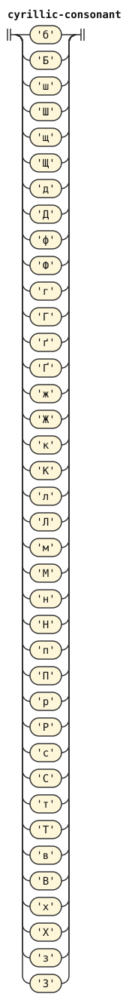</p>
<p>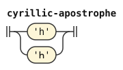</p>
<p>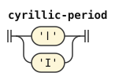</p>
</details>

The orthography has no apostrophe between vowels. Two adjacent vowel letters are two syllables, so `аи` is `a'i`. The orthography writes a diphthong with the short forms `й` and `ў`, so `ай` is `ai`.

So a full vowel letter carries the tag `syllabic`, which the vowel-group rules of [latin-strict.md](latin-strict.md) read. The stage inserts an apostrophe between adjacent syllabic vowels. `й`, `ј` and `ў`, the glides, carry no such tag, and they join the vowel beside them into a diphthong.

A capital full vowel letter, or a combining accent after one, marks stress, as in Latin. A glide never marks stress, as the Latin `ĭ` of [latin.md](latin.md) does not. The full vowel carries the syllable's stress. So a capital glide is plain, and an accent after a glide makes its run foreign. Inside an all-capital run, the stage folds a capital vowel or glide, that is, it reads the letter as plain.

```jbogenbau
%rule cyrillic-plain-vowel
  | 'а' </a/ ∪ ~syllabic>
  | 'е' </e/ ∪ ~syllabic> | 'э' </e/ ∪ ~syllabic> | 'є' </e/ ∪ ~syllabic>
  | 'и' </i/ ∪ ~syllabic> | 'і' </i/ ∪ ~syllabic>
  | 'о' </o/ ∪ ~syllabic>
  | 'у' </u/ ∪ ~syllabic>
  | 'ъ' </y/ ∪ ~syllabic> | 'ы' </y/ ∪ ~syllabic> | 'ә' </y/ ∪ ~syllabic>
  | 'й' </i/> | 'Й' </i/> | 'ј' </i/> | 'Ј' </i/>
  | 'ў' </u/> | 'Ў' </u/>
%emits
  $

%rule cyrillic-stressed-vowel
  | 'А' </A/ ∪ ~syllabic> | ('а' | 'А') stress-mark </A/ ∪ ~syllabic>
  | 'Е' </E/ ∪ ~syllabic> | 'Э' </E/ ∪ ~syllabic> | 'Є' </E/ ∪ ~syllabic>
  | ('е' | 'э' | 'є' | 'Е' | 'Э' | 'Є') stress-mark </E/ ∪ ~syllabic>
  | 'И' </I/ ∪ ~syllabic> | 'І' </I/ ∪ ~syllabic> | ('и' | 'і' | 'И' | 'І') stress-mark </I/ ∪ ~syllabic>
  | 'О' </O/ ∪ ~syllabic> | ('о' | 'О') stress-mark </O/ ∪ ~syllabic>
  | 'У' </U/ ∪ ~syllabic> | ('у' | 'У') stress-mark </U/ ∪ ~syllabic>
  | 'Ъ' </Y/ ∪ ~syllabic> | 'Ы' </Y/ ∪ ~syllabic> | 'Ә' </Y/ ∪ ~syllabic>
  | ('ъ' | 'ы' | 'ә' | 'Ъ' | 'Ы' | 'Ә') stress-mark </Y/ ∪ ~syllabic>
%emits
  $

%rule cyrillic-folded-vowel
  | 'А' </a/ ∪ ~syllabic>
  | 'Е' </e/ ∪ ~syllabic> | 'Э' </e/ ∪ ~syllabic> | 'Є' </e/ ∪ ~syllabic>
  | 'И' </i/ ∪ ~syllabic> | 'І' </i/ ∪ ~syllabic>
  | 'О' </o/ ∪ ~syllabic>
  | 'У' </u/ ∪ ~syllabic>
  | 'Ъ' </y/ ∪ ~syllabic> | 'Ы' </y/ ∪ ~syllabic> | 'Ә' </y/ ∪ ~syllabic>
  | 'Й' </i/> | 'Ј' </i/>
  | 'Ў' </u/>
%emits
  $
```

<details><summary>Railroad diagrams of the 3 rules from <code>cyrillic-plain-vowel</code> to <code>cyrillic-folded-vowel</code></summary>
<p>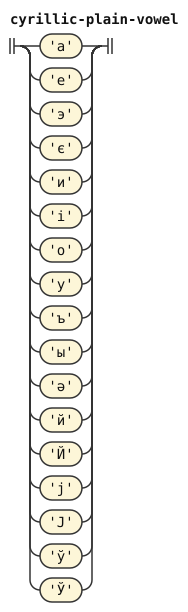</p>
<p>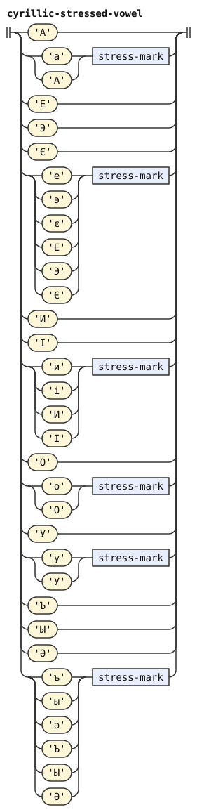</p>
<p>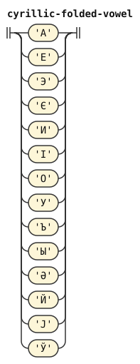</p>
</details>

The feature `cll-cyrillic` selects which Cyrillic rules apply. A feature is a named switch that the grammars test. The letters of this document apply while `cll-cyrillic` is off.

```jbogenbau
%extend-rule consonant
  ¬cll-cyrillic? cyrillic-consonant

%extend-rule apostrophe
  ¬cll-cyrillic? cyrillic-apostrophe

%extend-rule core-char
  ¬cll-cyrillic? cyrillic-period

%extend-rule plain-vowel
  ¬cll-cyrillic? cyrillic-plain-vowel

%extend-rule stressed-vowel
  ¬cll-cyrillic? cyrillic-stressed-vowel

%extend-rule folded-vowel
  ¬cll-cyrillic? cyrillic-folded-vowel
```

<details><summary>Railroad diagrams of the 6 rules from <code>consonant</code> to <code>folded-vowel</code></summary>
<p>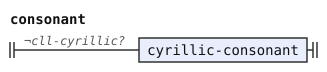</p>
<p>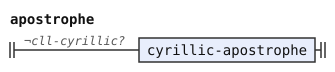</p>
<p>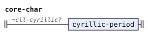</p>
<p>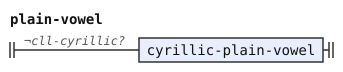</p>
<p>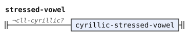</p>
<p>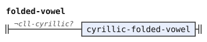</p>
</details>

## Differences from CLL

*The Complete Lojban Language* (CLL) supplies the base consonant mappings and uses `ъ` for `y`.[^cll-s3-12] It does not name the additional Cyrillic letters above. They let writers use letters from their familiar alphabets.

CLL writes diphthongs as vowel pairs, like Latin.[^cll-s3-12] This document instead gives full vowels separate syllables and uses short letters for glides. The same letters therefore need distinct readings in [cyrillic-cll.md](cyrillic-cll.md). The feature `cll-cyrillic` selects between them.

CLL requires only the vowel letter of a stressed syllable to be marked.[^cll-s3-1] This document assigns stress to the full vowel. It accepts capital full vowels and combining accents, but folds capitals inside an all-capital run. Capital glides remain plain, and accented glides make the run foreign.

[^cll-s3-12]: [CLL 1.1, section 3.12](https://lojban.org/publications/cll/cll_v1.1_xhtml-section-chunks/section-oddball-orthographies.html).

[^cll-s3-1]: [CLL 1.1, section 3.1](https://lojban.org/publications/cll/cll_v1.1_xhtml-section-chunks/chapter-phonology.html#section-orthography).
