# The Latin orthography of CLL

This document opens the phoneme stage for the Latin orthography of *The Complete Lojban Language* (CLL). A stage is one step of a pipeline, with its own grammar. Each stage reads what the stage before it emits.

The phoneme stage is the first stage of every Lojban dialect: [CLL](../dialects/cll-ebnf.md), [BPFK](../dialects/bpfk.md), [experimental](../dialects/experimental.md) and [Zantufa](../dialects/zantufa.md). The stage reads the characters of a text and hands the forms stage the phonemes they stand for.

This document reads the Latin orthography of CLL[^cll-c3] and no more. The CLL dialect adds only the Cyrillic of CLL[^cll-s3-12], in [cyrillic-cll.md](cyrillic-cll.md). The other dialects add that too. They also add the conventions of [latin.md](latin.md), such as digits and accents, and the scripts of [cyrillic.md](cyrillic.md) and [zbalermorna.md](zbalermorna.md). [The notation document](../../docs/notation.md) explains the notation.

The terminals of the stage are characters, each written as a character tag in single quotes, such as `'a'`. A token is one unit that a stage reads or emits. A terminal matches one input token by tag. A character token carries only its character tag. So a class of characters is a range, such as `'0'..'9'`, or a Unicode property, such as `'\p{White_Space}'`.

The stage emits one token per phoneme, and each token carries the tag of that phoneme, such as `/a/`. A tag marks a token by name, phoneme or character. So the later stages never see a character, and they read every script alike.

The phonemes are the letters of CLL[^cll-c3], each written as a phoneme tag:

- The consonants `/b/`, `/c/`, `/d/` and so on through `/z/`
- The vowels `/a/ /e/ /i/ /o/ /u/ /y/`, and the stressed vowels `/A/ /E/ /I/ /O/ /U/ /Y/`
- The apostrophe `/'/`
- The syllable break `/,/`, which a comma between two vowels writes

A stressed vowel is a phoneme of its own. So stress is a position in the word grammar and not a mark that the word grammar tests. Two tags stand for what is not a letter. `PAUSE` is a pause of any length, and it also carries the phoneme tag `/./`, whose phoneme is `.`. `UNREAD` is a run that the pipeline did not read as words, here a run with a character that this orthography does not read. The forms stage passes it on, and the word stage admits it only inside a foreign quote or after `fa'o`.

## The text and its runs

The text is pauses and runs. A period or whitespace marks a pause, and a space always ends a word.

A run is what stands between two pauses. It is an ordinary run of letters, or a foreign run. The stage is greedy. Where two parses differ, the stage takes the one that reads the next character over the one that closes a constituent. A constituent is a part of the text that one rule matched. So the stage never cuts a run short where a rule lets it continue.

```jbogenbau
%ambiguity-resolution greedy
```

```jbogenbau
%rule text
  ε | pause | commas | [edge-pause] items [edge-pause]

%rule edge-pause
  spaced-pause | pause-edge

%rule items
  run | items pause run

%rule run
  ordinary-run | foreign-run
```

<details><summary>Railroad diagrams of <code>text</code>, <code>edge-pause</code>, <code>items</code> and <code>run</code></summary>
<p>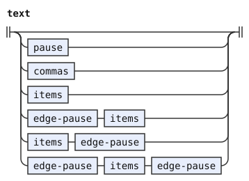</p>
<p>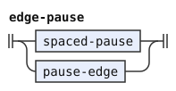</p>
<p>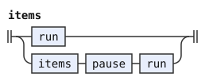</p>
<p>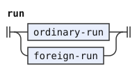</p>
</details>

A pause is one token. Its core is a run of whitespace characters and periods, with any commas inside it. A whitespace character is one with the Unicode property White_Space. A comma next to the core is part of the pause, but it belongs to no token. So `mi , klama` has one pause between its two words, and a quote body next to such a comma takes it in.

CLL[^cll-s3-3] says that a comma "cannot be pronounced as a pause", so a comma alone between two words is no pause. A comma at the start or the end of the text belongs to no token. A text of nothing but commas is an empty text.

```jbogenbau
%rule pause
  spaced-pause

%rule spaced-pause
  [pause-edge] $c(pause-core) [pause-edge]
%emits
  $c <PAUSE ∪ /./>

%rule pause-core
  core-char | pause-core core-char | pause-core pause-edge core-char

%rule pause-edge
  commas

%rule core-char
  space-char | '.'

%rule space-char
  '\p{White_Space}'

%rule commas
  comma | commas comma
```

<details><summary>Railroad diagrams of the 7 rules from <code>pause</code> to <code>commas</code></summary>
<p>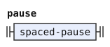</p>
<p>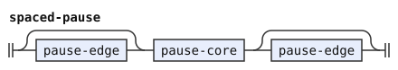</p>
<p>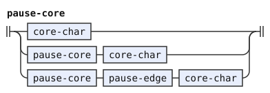</p>
<p>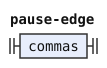</p>
<p>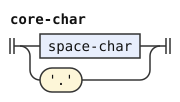</p>
<p>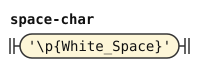</p>
<p>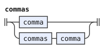</p>
</details>

An ordinary run is letters. A run of adjacent vowel letters is one vowel group, and a group carries the tags of its last vowel. In the Latin orthography, a group is its vowels, one phoneme each.

A script that writes no apostrophe tags its full vowel letters `syllabic`. Two adjacent syllabic vowels are two syllables with the apostrophe between them, which `joined-vowel` emits as a `/'/` token with no text of its own. That is the one thing that the rules of this document know about such scripts, and [cyrillic.md](cyrillic.md) is the one script that uses it. Each vowel of a group is its own token, so a group of three vowels keeps all three. The group rules keep adjacent vowels in one group, and every pair falls under exactly one of the three cases. So a run has one parse.

A comma stands only between two letters of a run. Between two vowels it is the syllable break of CLL[^cll-s3-3], the phoneme `/,/`. So `kore,a` is `e` and `a` in two syllables. CLL[^cll-s4-7] writes it so "because ea is not a valid diphthong". Anywhere else it is nothing, so `ban,gu` is `bangu`.

```jbogenbau
%rule ordinary-run
  letters

%rule letters
  letters-after-consonant | letters-after-vowel

%rule letters-after-vowel
  | vowel-group
  | letters-after-consonant [commas] vowel-group
  | letters-after-vowel syllable-break vowel-group

%rule letters-after-consonant
  | non-vowels
  | letters-after-vowel [commas] non-vowels

%rule non-vowels
  non-vowel | non-vowels non-vowel | non-vowels commas non-vowel

%rule non-vowel
  consonant | apostrophe

%rule syllable-break
  commas
%emits
  $ </,/>

%rule vowel
  plain-vowel | stressed-vowel

%rule vowel-group
  vowel | vowel-group-plain | vowel-group-joined

%rule vowel-group-plain
  | vowel-group⊉~syllabic $v(vowel) <tags($v)> | vowel-group⊇~syllabic $w(vowel⊉~syllabic) <tags($w)>

%rule vowel-group-joined
  vowel-group⊇~syllabic $v(joined-vowel⊇~syllabic) <tags($v)>

%rule joined-vowel
  $v(vowel) <tags($v)>
%emits
  /'/, $v

%rule any-lojban-char
  consonant | plain-vowel | stressed-vowel | apostrophe | comma
```

<details><summary>Railroad diagrams of the 13 rules from <code>ordinary-run</code> to <code>any-lojban-char</code></summary>
<p>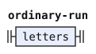</p>
<p>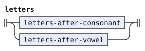</p>
<p>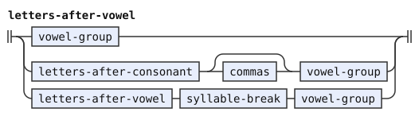</p>
<p>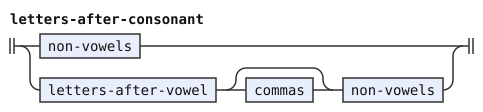</p>
<p>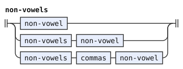</p>
<p>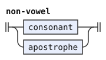</p>
<p>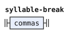</p>
<p>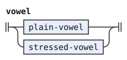</p>
<p>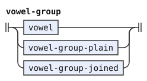</p>
<p>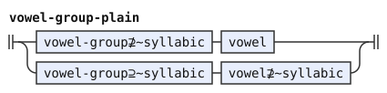</p>
<p>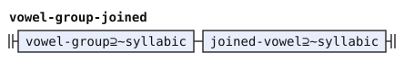</p>
<p>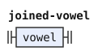</p>
<p>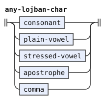</p>
</details>

A run that is not an ordinary run is foreign. It has a letter, a digit, a mark or any other character that this orthography does not read, as `mi klama?` has. The stage emits a foreign run as one `UNREAD` token. The rule is `%opaque`, so the token sounds `?`, and its label is its text. A `zoi` delimiter is a word, which never sounds `?`. So no delimiter matches such a run.

A foreign run has at least one character that no rule of `any-lojban-char` reads by itself. The rule `letters` always reads a run without one. So the stage tests only a run with one, and a long run of letters costs nothing more. A run neither begins nor ends with a comma, which is part of the pause next to it. A run character is any character but whitespace and the period.

```jbogenbau
%rule foreign-run
  $r(foreign-chars)
%conditions
  ¬matches($r, letters),
  ¬matches(head($r), comma),
  ¬matches(last($r), comma)
%emits
  $ <UNREAD>
%opaque

%rule foreign-chars
  | foreign-char
  | lojban-chars foreign-char
  | foreign-chars run-char

%rule lojban-chars
  lojban-char | lojban-chars lojban-char

%rule lojban-char
  $c(run-char)
%conditions
  matches($c, any-lojban-char)

%rule foreign-char
  $c(run-char)
%conditions
  ¬matches($c, any-lojban-char)

%rule run-char
  $c('\p{Any}')
%conditions
  ¬matches($c, core-char)
```

<details><summary>Railroad diagrams of the 6 rules from <code>foreign-run</code> to <code>run-char</code></summary>
<p>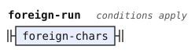</p>
<p>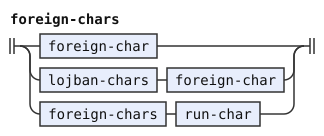</p>
<p>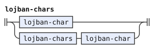</p>
<p>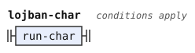</p>
<p>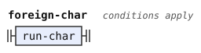</p>
<p>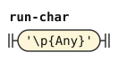</p>
</details>

## Letters

The stage emits a consonant as itself, whatever its case. CLL[^cll-s3-9] writes a stressed syllable of a name in capitals, but only the capital vowel marks the stress. A capital vowel is the stressed phoneme. The apostrophe is the phoneme `/'/`. The stage reads each apostrophe character that the rule `apostrophe` lists as that same phoneme.

CLL[^cll-s3-1] omits `h` from the alphabet. CLL[^cll-s3-3] says that `h` does not write the apostrophe. This stage treats `h` as foreign text. [latin.md](latin.md) reads `h` as the apostrophe.

```jbogenbau
%rule consonant
  | 'b' </b/> | 'B' </b/>
  | 'c' </c/> | 'C' </c/>
  | 'd' </d/> | 'D' </d/>
  | 'f' </f/> | 'F' </f/>
  | 'g' </g/> | 'G' </g/>
  | 'j' </j/> | 'J' </j/>
  | 'k' </k/> | 'K' </k/>
  | 'l' </l/> | 'L' </l/>
  | 'm' </m/> | 'M' </m/>
  | 'n' </n/> | 'N' </n/>
  | 'p' </p/> | 'P' </p/>
  | 'r' </r/> | 'R' </r/>
  | 's' </s/> | 'S' </s/>
  | 't' </t/> | 'T' </t/>
  | 'v' </v/> | 'V' </v/>
  | 'x' </x/> | 'X' </x/>
  | 'z' </z/> | 'Z' </z/>
%emits
  $

%rule plain-vowel
  'a' </a/> | 'e' </e/> | 'i' </i/> | 'o' </o/> | 'u' </u/> | 'y' </y/>
%emits
  $

%rule stressed-vowel
  'A' </A/> | 'E' </E/> | 'I' </I/> | 'O' </O/> | 'U' </U/> | 'Y' </Y/>
%emits
  $

%rule apostrophe
  '\u{27}' | '’' | '‘' | 'ʼ'
%emits
  $ </'/>

%rule comma
  ','
```

<details><summary>Railroad diagrams of the 5 rules from <code>consonant</code> to <code>comma</code></summary>
<p>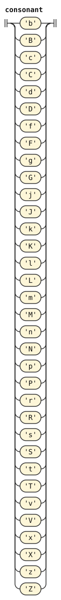</p>
<p>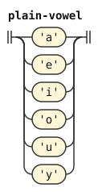</p>
<p>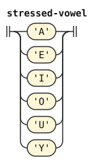</p>
<p>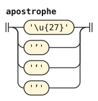</p>
<p>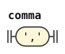</p>
</details>

## Choices beyond CLL

CLL writes a pause as a period.[^cll-s3-3] It does not define spaces. This grammar treats whitespace as a pause because texts separate words with spaces. No CLL word contains a space.

[^cll-s3-12]: [CLL 1.1, section 3.12](https://lojban.org/publications/cll/cll_v1.1_xhtml-section-chunks/section-oddball-orthographies.html).

[^cll-s3-3]: [CLL 1.1, section 3.3](https://lojban.org/publications/cll/cll_v1.1_xhtml-section-chunks/section-lojban-characters.html).

[^cll-s4-7]: [CLL 1.1, section 4.7](https://lojban.org/publications/cll/cll_v1.1_xhtml-section-chunks/section-fuhivla.html).

[^cll-s3-9]: [CLL 1.1, section 3.9](https://lojban.org/publications/cll/cll_v1.1_xhtml-section-chunks/section-stress.html).

[^cll-s3-1]: [CLL 1.1, section 3.1](https://lojban.org/publications/cll/cll_v1.1_xhtml-section-chunks/chapter-phonology.html#section-orthography).

[^cll-c3]: [CLL 1.1, chapter 3](https://lojban.org/publications/cll/cll_v1.1_xhtml-section-chunks/chapter-phonology.html).
