# Latin conventions

BPFK is the Lojban language planning committee. This document adds to [latin-strict.md](latin-strict.md) the conventions that Lojban texts use beyond *The Complete Lojban Language* (CLL), edition 1.1.[^cll-c3] Both documents belong to the phoneme stage, the first stage of the pipeline. The dialects of the [BPFK](../dialects/bpfk.md), [experimental](../dialects/experimental.md) and [Zantufa](../dialects/zantufa.md) read them, after the rules of latin-strict.md. The [CLL](../dialects/cll-ebnf.md) dialect does not. [The notation document](../../docs/notation.md) explains the notation.

Most conventions here admit spellings that latin-strict.md rejects. Two change how it reads an existing spelling: a comma between vowels, and a capital run. A capital run has multiple vowel groups with only capital vowels. The working morphology is the word-form grammar that [bpfk.md](../words/bpfk.md) translates. The conventions are these:

- Punctuation other than the period and the comma is a pause.
- A comma between two vowels is nothing, as it is elsewhere.
- `h` writes the apostrophe.
- A capital run carries no stress mark.
- An accent marks stress, and a breve marks a glide.
- A digit stands for its number word.

## Punctuation

A punctuation character is a pause when no letter, vowel or apostrophe rule reads it, as the next paragraph defines. Texts put quotation marks, brackets and dashes around words, so `mi "klama"` reads as `mi klama`.

A character token carries only its character tag. So the rule `other-char` names the characters that are no letter, mark, digit or whitespace. A letter is a character of the Unicode property `L`. A mark is one of `Mn`, or the stress mark or the shorthand of [zbalermorna.md](zbalermorna.md). A digit is `0` to `9`, and whitespace is a character of the property White_Space. A punctuation character is such a character that no rule of `any-lojban-char` or `core-char` reads by itself.

A pause token covers its core, from its first to its last whitespace character or period, with any punctuation inside it. A token is one unit that a stage reads or emits. Other punctuation at either end of a pause belongs to no token. So a `zoi` body keeps the quotation marks in `zoi gy. "Hello!" .gy.`. The body takes in the text next to it that no token covers, as [the notation](../../docs/notation.md) says under "Opaque text".

Punctuation between two letters, with no whitespace, is a pause token of its own, as in `klama!do`. So is a text of nothing but punctuation. Commas can stand inside such a pause and at its edges. The token runs from the first punctuation character of the pause to the last. A comma at an edge belongs to no token, as next to a pause of whitespace. So `jy?,sai` is `jy` and `sai`.

Punctuation next to the first or the last word of the text belongs to no token.

The phoneme stage cannot know that a pause stands in a quote. So punctuation between two whitespace characters is part of a pause even there, and `zoi gy. !!! .gy.` quotes nothing.

```jbogenbau
%redefine-rule pause
  spaced-pause | punctuation-pause

%rule punctuation-pause
  [commas] $c(punctuation) [commas]
%emits
  $c <PAUSE ∪ /./>

%redefine-rule pause-edge
  edge-char | pause-edge edge-char

%rule edge-char
  comma | punctuation-char

%rule punctuation
  punctuation-char | punctuation punctuation-char | punctuation commas punctuation-char

%rule punctuation-char
  $c(other-char)
%conditions
  ¬matches($c, any-lojban-char),
  ¬matches($c, core-char)

%rule other-char
  $c('\p{Any}')
%conditions
  ¬matches($c, alpha-char),
  ¬matches($c, mark-char),
  ¬matches($c, digit-char),
  ¬matches($c, space-char)

%rule alpha-char
  '\p{L}'

%rule mark-char
  '\p{Mn}'

%rule digit-char
  '0'..'9'

%redefine-rule run-char
  $c('\p{Any}')
%conditions
  ¬matches($c, core-char),
  ¬matches($c, punctuation-char)
```

<details><summary>Railroad diagrams of the 11 rules from <code>pause</code> to <code>run-char</code></summary>
<p>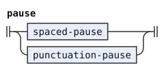</p>
<p>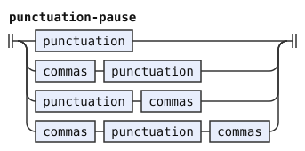</p>
<p>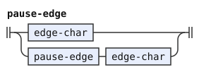</p>
<p>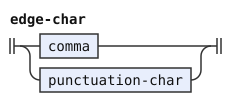</p>
<p>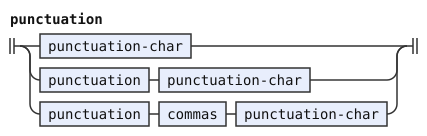</p>
<p>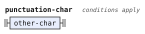</p>
<p>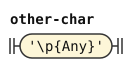</p>
<p>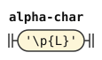</p>
<p>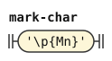</p>
<p>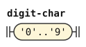</p>
<p></p>
</details>

## The comma

A comma between vowels is ignored, as it is between other letters. It creates no syllable break. The vowels on either side are one vowel group, as if they stood side by side. `me,iin` is `meiin`, and the Cyrillic `ма,и` is `ma'i`, as `маи` is. This document redefines `letters-after-vowel` without the `syllable-break` of latin-strict.md. So nothing reads `syllable-break` in these dialects.

```jbogenbau
%redefine-rule letters-after-vowel
  | vowel-group
  | letters-after-consonant [commas] vowel-group

%extend-rule vowel-group-plain
  | vowel-group⊉~syllabic commas $v(vowel) <tags($v)> | vowel-group⊇~syllabic commas $w(vowel⊉~syllabic) <tags($w)>

%extend-rule vowel-group-joined
  vowel-group⊇~syllabic commas $v(joined-vowel⊇~syllabic) <tags($v)>
```

<details><summary>Railroad diagrams of the 3 rules from <code>letters-after-vowel</code> to <code>vowel-group-joined</code></summary>
<p>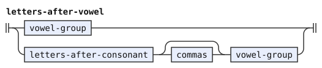</p>
<p>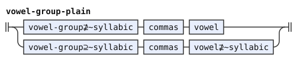</p>
<p>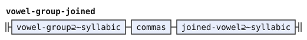</p>
</details>

## The apostrophe

The rule reads `h` and `H` as the apostrophe. A selma'o is a class of Lojban particles. Selma'o names such as KOhA use this spelling.

```jbogenbau
%extend-rule apostrophe
  'h' | 'H'
%emits
  $ </'/>
```

<details><summary>Railroad diagram of <code>apostrophe</code></summary>
<p>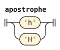</p>
</details>

## Capital runs

A run in which every vowel is a capital carries no stress mark, and the stage reads its vowels as plain vowels. A title or a shout is often written all in capitals, and its capitals do not mark stress. The run must have at least two vowel groups. So a name with one stressed syllable in capitals keeps its stress mark: `.DJORdj.` keeps its stress on `o`. The cost is that the stage reads a word of one vowel group, written in capitals, as stressed: in the text `MI KLAMA`, `MI` is `mI`.

`capital-shape` is that shape: its consonants and digits and its capital vowels, written out so that two groups are required. Consonants stand between every two groups, so the rules never split adjacent vowels into separate groups. `capital-consonants` reads a decimal point between two digits, as `non-vowels` does in an ordinary run (see "Digits"). So `MI2.3KLAMA` is a capital run. `capital-consonants` does not reuse `non-vowels`, because other scripts extend `non-vowel` with forms that hold a vowel. Forms such as the zbalermorna shorthand keep a run from folding.

`capital-run` reads that shape with every vowel folded. An ordinary run is any other run of letters, which the condition states by exclusion. In an ordinary run, a capital vowel marks stress. No capital run matches `foreign-chars` in the bundled grammars, so `foreign-run` needs no separate test for it.

```jbogenbau
%extend-rule run
  capital-run

%redefine-rule ordinary-run
  $r(letters)
%conditions
  ¬matches($r, capital-shape)

%rule capital-run
  capital-shape

%rule capital-shape
  [capital-consonants [commas]] capital-groups [[commas] capital-consonants]

%rule capital-groups
  | folded-vowel-group capital-gap folded-vowel-group
  | capital-groups capital-gap folded-vowel-group

%rule capital-gap
  [commas] capital-consonants [commas]

%rule capital-consonants
  | capital-non-vowel
  | capital-consonants capital-non-vowel
  | capital-consonants commas capital-non-vowel
  | $c(capital-consonants) decimal-point digit
%conditions
  matches(last($c), digit)

%rule capital-non-vowel
  consonant | digit | apostrophe

%rule folded-vowel-group
  folded-vowel | folded-vowel-group-plain | folded-vowel-group-joined

%rule folded-vowel-group-plain
  | folded-vowel-group⊉~syllabic [commas] $v(folded-vowel) <tags($v)>
  | folded-vowel-group⊇~syllabic [commas] $w(folded-vowel⊉~syllabic) <tags($w)>

%rule folded-vowel-group-joined
  folded-vowel-group⊇~syllabic [commas] $v(joined-folded-vowel⊇~syllabic) <tags($v)>

%rule joined-folded-vowel
  $v(folded-vowel) <tags($v)>
%emits
  /'/, $v

%rule folded-vowel
  'A' </a/> | 'E' </e/> | 'I' </i/> | 'O' </o/> | 'U' </u/> | 'Y' </y/>
%emits
  $
```

<details><summary>Railroad diagrams of the 13 rules from <code>run</code> to <code>folded-vowel</code></summary>
<p>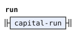</p>
<p></p>
<p>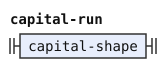</p>
<p>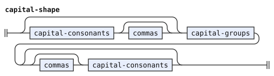</p>
<p>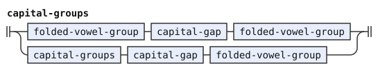</p>
<p>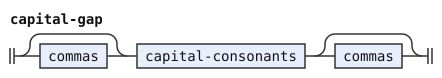</p>
<p>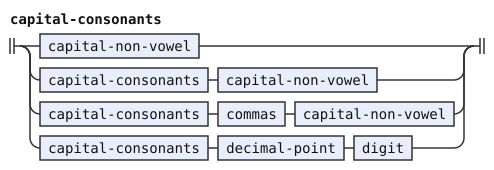</p>
<p>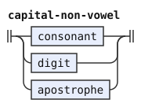</p>
<p>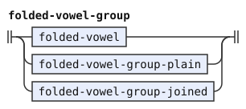</p>
<p>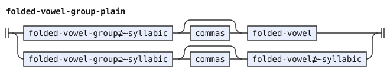</p>
<p>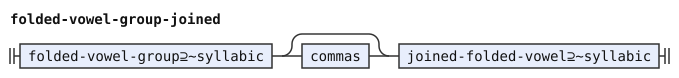</p>
<p>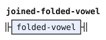</p>
<p>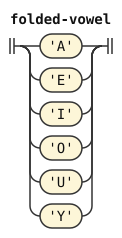</p>
</details>

## Accents and breves

A vowel with an acute or a grave accent, precomposed or combining, is the stressed phoneme, as a capital vowel is. A breve on `i` or `u` marks a glide in some texts. The word grammar finds a glide by its position, so the stage emits the letter plain. A combining mark that no letter rule takes makes its run foreign, as the precomposed letter already is. So the stage reads `i` followed by U+0308 as it reads `ï`.

```jbogenbau
%extend-rule plain-vowel
  | 'ĭ' </i/> | 'Ĭ' </i/> | 'i' glide-mark </i/> | 'I' glide-mark </i/>
  | 'ŭ' </u/> | 'Ŭ' </u/> | 'u' glide-mark </u/> | 'U' glide-mark </u/>
%emits
  $

%extend-rule stressed-vowel
  | 'á' </A/> | 'à' </A/> | 'Á' </A/> | 'À' </A/> | 'a' stress-mark </A/> | 'A' stress-mark </A/>
  | 'é' </E/> | 'è' </E/> | 'É' </E/> | 'È' </E/> | 'e' stress-mark </E/> | 'E' stress-mark </E/>
  | 'í' </I/> | 'ì' </I/> | 'Í' </I/> | 'Ì' </I/> | 'i' stress-mark </I/> | 'I' stress-mark </I/>
  | 'ó' </O/> | 'ò' </O/> | 'Ó' </O/> | 'Ò' </O/> | 'o' stress-mark </O/> | 'O' stress-mark </O/>
  | 'ú' </U/> | 'ù' </U/> | 'Ú' </U/> | 'Ù' </U/> | 'u' stress-mark </U/> | 'U' stress-mark </U/>
  | 'ý' </Y/> | 'ỳ' </Y/> | 'Ý' </Y/> | 'Ỳ' </Y/> | 'y' stress-mark </Y/> | 'Y' stress-mark </Y/>
%emits
  $

%rule stress-mark
  '\u{301}' | '\u{300}'

%rule glide-mark
  '\u{306}'
```

<details><summary>Railroad diagrams of the 4 rules from <code>plain-vowel</code> to <code>glide-mark</code></summary>
<p>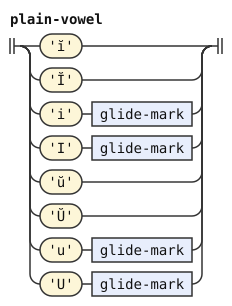</p>
<p>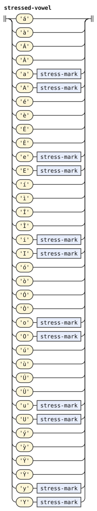</p>
<p>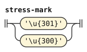</p>
<p>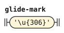</p>
</details>

## Digits

Each digit emits the letters of its number word, so `2` is `re`. A period between two digits is the decimal point, `pi`. `items` says that no pause stands there, and the decimal point needs a digit before it, so `la .djan.2mei` has a pause after `djan`.

```jbogenbau
%redefine-rule items
  | run
  | $i(items) $p(pause) $r(run)
%conditions
  ¬matches(last($i), digit) ∨ text($p) ≠ "." ∨ ¬matches(head($r), digit)

%extend-rule non-vowel
  digit

%extend-rule non-vowels
  $n(non-vowels) decimal-point digit
%conditions
  matches(last($n), digit)

%extend-rule any-lojban-char
  digit

%rule digit
  digit-0 | digit-1 | digit-2 | digit-3 | digit-4 | digit-5 | digit-6 | digit-7 | digit-8 | digit-9

%rule digit-0
  '0'
%emits
  $ </n/>, $ </o/>

%rule digit-1
  '1'
%emits
  $ </p/>, $ </a/>

%rule digit-2
  '2'
%emits
  $ </r/>, $ </e/>

%rule digit-3
  '3'
%emits
  $ </c/>, $ </i/>

%rule digit-4
  '4'
%emits
  $ </v/>, $ </o/>

%rule digit-5
  '5'
%emits
  $ </m/>, $ </u/>

%rule digit-6
  '6'
%emits
  $ </x/>, $ </a/>

%rule digit-7
  '7'
%emits
  $ </z/>, $ </e/>

%rule digit-8
  '8'
%emits
  $ </b/>, $ </i/>

%rule digit-9
  '9'
%emits
  $ </s/>, $ </o/>

%rule decimal-point
  '.'
%emits
  $ </p/>, $ </i/>
```

<details><summary>Railroad diagrams of the 16 rules from <code>items</code> to <code>decimal-point</code></summary>
<p>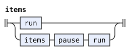</p>
<p>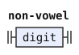</p>
<p>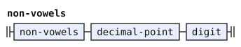</p>
<p>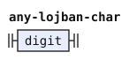</p>
<p>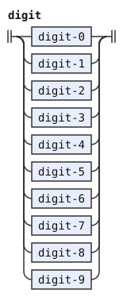</p>
<p>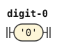</p>
<p>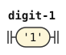</p>
<p></p>
<p>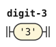</p>
<p>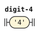</p>
<p>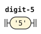</p>
<p>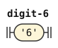</p>
<p>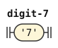</p>
<p>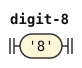</p>
<p>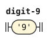</p>
<p>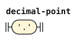</p>
</details>

## Differences from CLL and the working morphology

These conventions extend CLL's Latin orthography. Most admit spellings that CLL does not describe. Commas between vowels and capital runs instead change readings that [latin-strict.md](latin-strict.md) also permits.

The working morphology calls `?` and `!` pauses through `space_char`. This document extends pauses to other punctuation, so it accepts `mi "klama"`, which the working morphology rejects. Both read `jy?,sai` as `jy` and `sai`. The morphology's letter rules skip preceding commas.

camxes-std is the standard camxes parser. It also reads `zoi gy. !!! .gy.` as an empty quote because `!` is space. The phoneme stage cannot know whether a pause stands inside a quote.

The working morphology ignores commas through `comma*` in each letter rule. This document follows that treatment even between vowels. Strict CLL instead uses a comma there as a syllable break.

CLL does not use `h` for the apostrophe. The working morphology accepts it through `h <- comma* ['h] &nucleus`, as this document does.

CLL does not define capital folding, accented vowels or breve glides. This document accepts those conventions. Capital folding supports titles and shouts, while requiring two vowel groups preserves stress in names with one capital syllable.

PA is the number selma'o. The working morphology reads digits directly as PA words and also permits them inside names. This stage emits their letters instead. CLL does not write digits. A period between digits emits `pi` rather than a pause.

[^cll-c3]: [CLL 1.1, chapter 3](https://lojban.org/publications/cll/cll_v1.1_xhtml-section-chunks/chapter-phonology.html).
