# The CLL grammar

This document opens the syntax stage, the last stage of the [CLL](../dialects/cll-ebnf.md) and [BPFK](../dialects/bpfk.md) dialects. It is also the base of the syntax of the [experimental](../dialects/experimental.md) dialect. A dialect is a pipeline of stages, defined by one pipeline document. A stage is one step of a pipeline, with its own grammar.

This document gives the grammar of Lojban from chapter 21 of *The Complete Lojban Language* (CLL), edition 1.1. It uses the notation of that book. That notation is EBNF (Extended Backus-Naur Form). The closing section lists differences from the printed grammar.

A cmavo is a particle, a short structure word. A selma'o is a word class of cmavo. The terminals of this grammar are selma'o. A terminal matches an input token by tag. A tag marks a token by name, phoneme or character. A free modifier is a phrase that stands in many positions.

Afterthought places a connective between its operands. Forethought introduces a connection before its first operand. An operand is one side of a connection or operation.

The prose uses these Lojban terms before the sections that explain them:

- A selbri is the predicate of a sentence.
- A sumti is an argument of a selbri.
- A tanru is a compound selbri.
- A jek is a logical connective between tanru units, such as `je`.
- A joik is a non-logical connective, such as `joi`.
- A stag is a tense or modal inside a connective.
- A mekso is a mathematical expression.
- A brivla is a predicate word.
- A lerfu word is a letter word, such as `.abu` or `xy.`.

The stages before it make the word stream that it reads. The forms stage ([forms.md](../words/forms.md), with a family of word forms and a lexicon) reads phonemes into words. The word stage, [the word stream](../words/stream.md), makes quotes and compounds. The word stage also processes the erasers `si`, `sa` and `su`.

[The indicator stage](../indicators/cll.md) attaches `ba'e` and indicators to their words, before syntax reads them.

Outside a quote, the earlier stages hand on some cmavo as tokens of their own. Each carries its class from [the CLL lexicon](../words/lexicon-cll.md). The material of a quote arrives tagged `word` or `quoted-text`, which is what `any-word` and `anything` read.

[The notation document](../../docs/notation.md) explains the notation. Two of its points matter here. First, an elided terminator takes its `#` with it, so an elided `[+X #]` leaves no free-modifier slot (see `#` below) at that point. Second, when omitted terminators leave a text with more than one parse, the stage chooses the parse as "Choosing among parses" after the grammar says.

CLL writes repetition as `x ...`, and the notation writes it with braces. Notation note 7 calls `...` "optional repetition of the construct to the left".[^cll-s21-1] So CLL's `x ...` is `{x}` here, one `x` and optionally more, and CLL's `[x] ...` or `[x ...]` is `[{x}]`, which allows none.

Where CLL writes `x [s x] ...` and no grouping is at stake, this grammar writes `{x \ s}`. That is a list of `x` separated by `s`. These read the same words as the printed rules. Where the grouping matters, the next paragraph says what the rule writes instead.

Notation note 7 gives `...` left grouping.[^cll-s21-1] A list in flat braces shows no grouping in the tree: its items are children of the rule that writes it. Where the grouping changes the reading, as for logical connectives and tanru, this grammar says so in the rule.

A left chain, `{... x \ s}`, groups from the left, and each level of it is a node of its rule. Where the repeated part is irregular, the rule is written with left recursion instead, which groups in the same way. Each such rule cites the source of its grouping. A right chain, `{x ... \ s}`, groups from the right, as the `bo` forms do. Juxtaposition binds tighter than `&`.

This document writes the grammar literately: each block of rules follows the prose that explains it, and the blocks together are the grammar. The prose says what each construct is for and how the rules do it. Footnotes link to the CLL sources.

A rule flag is a named parsing preference. ["Tenses and modals"](#tenses-and-modals) explains this grammar's flag. Each dialect states the remaining ranking policy after this document. An elided terminator is a closing word left unwritten. The cll-ebnf and bpfk dialects state their policies in their pipeline documents. The experimental layer (a document that changes earlier rules) states its policy itself.

CLL marks a terminator as elidable by writing it between slashes, `/KU/`, or `/KU#/` when its free-modifier slot goes with it. Here each is an elidable optional, marked in its place: `[+KU]`, or `[+KU #]`. An absent one shows in the parse tree as that terminator, elided. Every terminator between slashes in the printed grammar is marked so, and no other optional is.

Notation note 9 defines `#`, a slot for any number of free modifiers.[^cll-s21-1] This document defines `free`, a single free modifier, under "Free modifiers, vocatives and indicators".

```jbogenbau
%rule #
  [{free}]
```

<details><summary>Railroad diagram of <code>#</code></summary>
<p>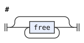</p>
</details>

## The text and its paragraphs

A text is what one speaker or writer produces, from the first word to the last. A text can open with these forms:

- `nai`, a vague negation at the start of a text [^cll-s19-5]
- A run of names, a form of address without a vocative
- Indicators or free modifiers that belong to the whole text
- A connective, `joik-jek`, that joins this text to a previous one in afterthought

After that come the paragraphs. `text-1` permits initial `.i` sentence separators, `ni'o` topic markers, or either alone. Each `.i` can carry an afterthought connective and a tense grouped with `bo`.

A speaker can continue another speaker's text.[^cll-s19-2] `ni'o` marks a change of topic.[^cll-s19-3] Repeated `ni'o` markers indicate larger breaks. A paragraph contains statements or fragments separated by `.i`.

This grammar writes most unbounded sequences with flat braces or left chains, which the parser reads left-recursively. So a paragraph of a thousand sentences costs a thousand steps, not a thousand squared. A right chain is right recursion, and so are a few rules, such as `paragraphs` and `links`.

```jbogenbau
%rule text
  [{NAI}] [{CMEVLA} # | (indicators & {free})] [joik-jek] text-1

%rule text-1
  [{I [jek | joik] [[stag] BO] #}] [{NIhO} #] [paragraphs]

%rule paragraphs
  paragraph [{NIhO} # paragraphs]

%rule paragraph
  (statement | fragment) [{I # [statement | fragment]}]
```

<details><summary>Railroad diagrams of <code>text</code>, <code>text-1</code>, <code>paragraphs</code> and <code>paragraph</code></summary>
<p>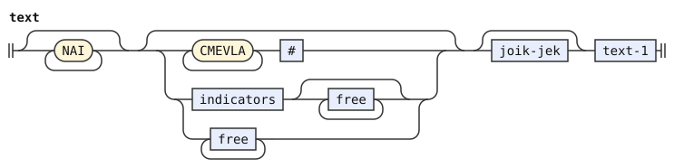</p>
<p>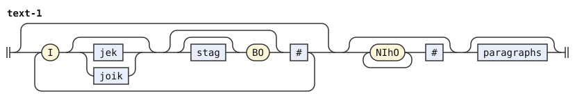</p>
<p>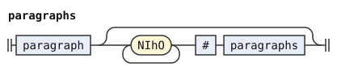</p>
<p>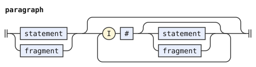</p>
</details>

## Statements and fragments

A statement is a sentence, or a sentence with a prenex before it, or several sentences joined by afterthought connectives [^cll-s14-4]. The four levels state the grouping of those connectives. `statement` takes any number of prenexes, each `terms zo'u`, which bind variables or set topics for the sentence that follows [^cll-s16-2]. `statement-1` is a sequence of `statement-2` joined by `.i` followed by a jek or joik: `.i je`, `.i ja nai`, `.i joi`. These group to the left, by the left-grouping rule of logical connectives [^cll-s14-7][^cll-s14-8].

So `A .i je B .i ja C` is `(A and B) or C`, and the tree shows that grouping. The rule is written with left recursion, not as a chain. The `statement-2` after each connective is optional, and the item of a chain cannot be.

`statement-2` is the right-grouping form. `.i` with an optional connective and an optional tense, then `bo`, binds the sentence after it more tightly than a plain `.i je` does. The rule refers to `statement-2` on its right, so a series of `.i bo` connections groups to the right [^cll-s14-8]. So `mi klama .i bo do klama .i bo la djan cadzu` is `([mi klama] i bo [{do klama} i bo {(la djan) cadzu}])`.

`statement-3` is either a sentence or a `tu'e ... tu'u` block. The block makes a whole text-1 act as one sentence, for connection and for a tense before it [^cll-s14-8]. The block's `tu'u` is elidable and carries its own free-modifier slot.

A prenex binds variables or sets topics for a statement. After `.i` with a connective, the grammar does not allow a separate prenex. This restriction also applies after `.i bo`. A `tu'e ... tu'u` block can hold a prenex.

A fragment is what a speaker utters when the utterance is not a sentence [^cll-s19-5][^cll-s14-13]. It is one of these:

- A bare connective, as the answer to a `ji` or `gi'i` question
- A bare quantifier, as the answer to `xo`
- `na` alone
- A list of terms with an optional `vau`
- A bare prenex
- A relative clause
- A `be` or `bei` phrase that supplies arguments after the fact

`terms [+VAU #]` is a fragment. So the parser never has to read the first word of an utterance as the start of a sentence. That is what makes `le sutra tavla` a legitimate fragment as well as a sentence. "Choosing among parses" says how the stage chooses between the two.

```jbogenbau
%rule statement
  statement-1 | prenex statement

%rule statement-1
  statement-2 | statement-1 I joik-jek [statement-2]

%rule statement-2
  statement-3 [I [jek | joik] [stag] BO # [statement-2]]

%rule statement-3
  sentence | [tag] TUhE # text-1 [+TUhU #]

%rule fragment
  ek # | gihek # | quantifier | NA # | terms [+VAU #] | prenex | relative-clauses | links | linkargs

%rule prenex
  terms ZOhU #
```

<details><summary>Railroad diagrams of the 6 rules from <code>statement</code> to <code>prenex</code></summary>
<p></p>
<p>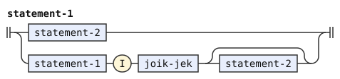</p>
<p>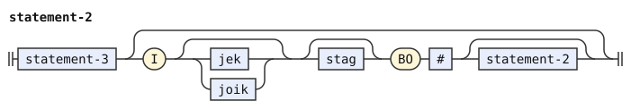</p>
<p>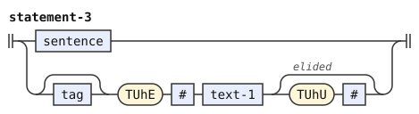</p>
<p>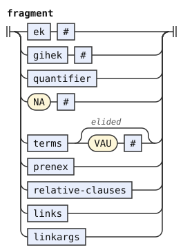</p>
<p>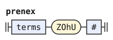</p>
</details>

## Sentences and bridi-tails

A sentence is a bridi: some terms, then optionally `cu`, then the bridi-tail, which holds the selbri and any terms that follow it [^cll-s9-2]. The terms before the selbri are the head. `cu` marks where the head ends. It lets a description close without its `ku`, since `cu` cannot continue the selbri of the description. The terms are optional so that a sentence can begin with its selbri, as `klama` alone does.

A subsentence is a sentence, or a prenex followed by a subsentence. Abstractions and relative clauses contain subsentences, and the prenex of a subsentence is local to it [^cll-s16-8].

The bridi-tail levels state how sentences share a head under a gihek, the connective family `gi'e`, `gi'a` and the rest of GIhA [^cll-s14-9]. `bridi-tail-3` is one selbri with its tail terms, or a forethought `gek-sentence`. `bridi-tail-2` binds two tails with `gihek [stag] bo`, right-grouping, and `bridi-tail-1` joins tails with a plain gihek, left-grouping [^cll-s14-10]. `bridi-tail-1` is written with left recursion, so the tree shows that grouping. It is not a chain, since each tail after a gihek has its own tail terms.

`bridi-tail` at the top lets a gihek be followed by `ke ... ke'e`. The brackets group the tails inside them against the tail to the left. The tail terms after each selbri belong to that selbri. `vau` closes them and is almost always elided.

A KE group after a gihek can otherwise group tails or form a tanru unit. Elided terminators cannot reliably choose between those readings. In `mi broda gi'e ke brode`, both parses elide the same terminators at the same places, so they tie. In `mi broda gi'e ke brode ke'e`, the group elides the `vau` of `brode` before `ke'e`, and the tanru parse elides nothing there. So `late-elision` takes the tanru parse.

A condition on the last tail after a plain gihek prefers the group of tails. `$KE-TAIL` tests the structure of that actual tail. A structural pattern describes a node or its children. Patterns pass through single-child wrappers and retain written or omitted terminator nodes.

`$KE-TAIL` describes one KE selbri with its tail terms, or one KE gek-sentence. Its optional leading tag must satisfy `$STAG-TAG`, because the competing group of tails accepts `stag` there. `$STAG-TAG` accepts a constructed tag with no FIhO or free modifiers. Such a tag reads exactly the words that `stag` reads. `$KE-SELBRI` permits that tag before a whole `$KE-UNIT`. `$KE-GEK` permits it before a KE gek-sentence.

The condition stands in `bridi-tail-1-final`, the form of `bridi-tail` without the `ke` group of tails. It separates the last plain connection from the earlier connections in `bridi-tail-1`. Only that connection can compete with the `ke` form of `bridi-tail`. The grouped form reads one `ke` group last, followed by one run of tail terms.

The `ke` form of `bridi-tail` overlaps a plain gihek only in one case. In that case, the last tail is one `ke` group with one run of tail terms. The condition removes the plain parse in that case and in no other. The tails before the last one are in `bridi-tail-1`, which has no condition.

So `mi broda gi'e ke brode` and `mi broda gi'e ke brode ke'e` each have one parse, the group. In `mi klama gi'e pu ke cadzu ke'e`, `pu` stays on the connective.

In `mi broda gi'e ke brode ke'e le zarci`, `le zarci` is in the outer tail terms, after `ke'e`. Tail terms after a connection of tails apply to both sides of it [^cll-s14-9][^cll-e14-54]. So `le zarci` applies to `broda` and to the group.

The tree still shows the whole left grouping of plain giheks [^cll-s14-10], since `bridi-tail-1` groups to the left. So four tails group as `((A gi'e B) gi'a C) gi'u D`.

A lookahead tests the input that follows a construct. The condition needs no lookahead. The last tail has no following gihek in the same bridi-tail. The condition tests that tail's structure and the text of its tail terms. The `elision-only` test writes back elided terminators, but these tests still read the original words.

In `mi klama lo nu broda gi'e ke brode ke'e gi'a brodi`, this grammar keeps plain `gi'e` inside the `nu`. The condition applies only to the last tail, so it leaves this earlier connection alone. `late-elision` then keeps `gi'a brodi` inside the abstraction.

In `mi klama lo nu broda gi'e ke brode ke'e`, the group stays inside the `nu`. In `mi broda gi'e pu ke me le le brodi brodo ku me'u ke'e`, the inner `ku` is elided. Both CLL dialects still read one `ke` group, so `pu` stays on the connective. The plain parse remains where the group cannot read the same words:

- The tail is not the last one, as in `mi broda gi'e ke brode ke'e gi'a brodi` and `mi broda gi'e ke ga brode gi brodi ke'e do gi'a brodi`. The `ke` form must end its bridi-tail.
- The tail goes on after `ke'e`, as in `mi broda gi'e ke brode ke'e brodi`.
- A free modifier stands between the gihek and `ke`, as in `mi broda gi'e to do toi ke brode ke'e`. The `ke` form has no slot there. `bridi-tail-1-final` reads this case with `{free}`, which requires at least one free modifier.
- The tail has two runs of tail terms. Its own VAU is written, and separate outer terms follow, as in `mi broda gi'e ke brode ke'e vau do`. Another example is `mi broda gi'e ke brode ke'e vau le le brodi brodo ku`. The group has only one run of tail terms after KEhE. `$KE-TAIL-WITH-VAU` tests the actual `tail-terms` child against `$WRITTEN-VAU`. That pattern requires a written VAU leaf after optional terms.

  The condition also requires nonempty outer tail terms. The corpus case `adhoc.syntax.gihek-ke-group-tail-term-vau` pins this boundary. In `mi broda gi'e ke brode ke'e do vau`, the plain parse omits its own VAU after `do`. Its next tail terms contain the written VAU, which cannot satisfy the pattern on the earlier child. Reconstruction keeps the omitted leaf sound empty.

A `gek-sentence` joins two subsentences in forethought. The gek can contain a tense, as in `pu gi A gi B`. `gek-sentence` allows `ke` around a gek-sentence, with an optional tag before that `ke`. It also allows optional `na` before a gek-sentence.[^cll-s14-10]

The gek-sentence's tail terms follow the whole connection and apply to both sides. An optional tag can precede its `ke` group.

```jbogenbau
%const $STAG-TAG @(tag) ∖ @(⋮ (FIhO ∪ free))
%const $KE-UNIT @(KE ⋯ KEhE [#])
%const $KE-SELBRI @([$STAG-TAG] $KE-UNIT)
%const $KE-GEK @([$STAG-TAG] KE [#] gek-sentence KEhE [#])
%const $KE-TAIL @($KE-SELBRI tail-terms) ∪ $KE-GEK
%const $WRITTEN-VAU @([terms] VAU≠"" [#])
%const $KE-TAIL-WITH-VAU @($KE-SELBRI (tail-terms ∩ $WRITTEN-VAU))

%rule sentence
  [terms [CU #]] bridi-tail

%rule subsentence
  sentence | prenex subsentence

%rule bridi-tail
  | bridi-tail-1-final
  | bridi-tail-1 gihek [stag] KE # bridi-tail [+KEhE #] tail-terms

%rule bridi-tail-1
  bridi-tail-2 | bridi-tail-1 gihek # bridi-tail-2 tail-terms

%rule bridi-tail-1-final
  | bridi-tail-2
  | bridi-tail-1 gihek {free} bridi-tail-2 tail-terms
  | bridi-tail-1 gihek $t(bridi-tail-2) $v(tail-terms)
%conditions
  $t ≇ $KE-TAIL ∨ ($t ≅ $KE-TAIL-WITH-VAU ∧ text($v) ≠ "")

%rule bridi-tail-2
  bridi-tail-3 [gihek [stag] BO # bridi-tail-2 tail-terms]

%rule bridi-tail-3
  | selbri tail-terms
  | gek-sentence


%rule gek-sentence
  | gek subsentence gik subsentence tail-terms
  | [tag] KE # gek-sentence [+KEhE #]
  | NA # gek-sentence

%rule tail-terms
  [terms] [+VAU #]
```

<details><summary>Railroad diagrams of the 9 rules from <code>sentence</code> to <code>tail-terms</code></summary>
<p>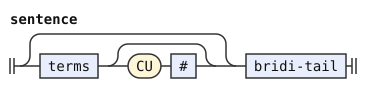</p>
<p>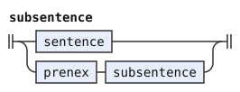</p>
<p>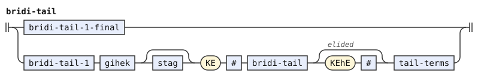</p>
<p>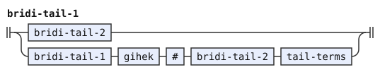</p>
<p>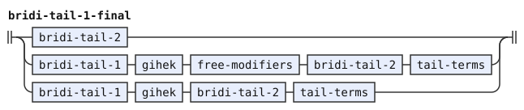</p>
<p>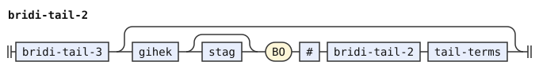</p>
<p>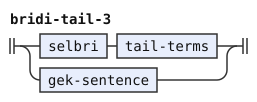</p>
<p>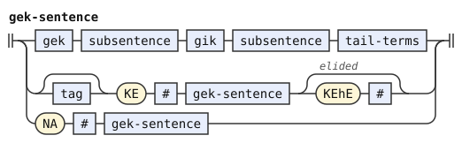</p>
<p>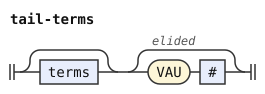</p>
</details>

## Terms

A term is one argument of a bridi, or one tense or modal standing on its own [^cll-s9-3][^cll-s10-13][^cll-s16-11]. It is one of these:

- A sumti
- A sumti or an elided `ku` after a tense, a modal or a place marker `fa`, `fe`, ... (`ca lo nu broda`, `fi mi`, `pu ku`)
- A termset
- A termset after a tense or modal tag
- `na ku`, the sentence-level negation written as a term

A tense or modal with nothing after it takes `ku`, so that it does not swallow the next sumti. The `ku` can be elided when what follows cannot be a sumti. When what follows can be a sumti, "Choosing among parses" says which reading wins.

The three levels of `terms` state the termset connectives [^cll-s14-11][^cll-s16-7]. `terms-2` joins terms with `ce'e` into a termset, `mi ce'e do`. `terms-1` joins termsets with `pe'e` followed by a jek or joik, the afterthought form that connects two sets of arguments at once [^cll-s14-11]. It is a left chain, since afterthought logical connectives group from the left [^cll-s14-7]. `terms-2` is a flat list, since a termset's `ce'e` groups nothing: a termset is a set of terms.

`terms` is a list of those. The parser reads it left-recursively, so that it builds the terms of a long sentence one at a time. A termset in forethought is `nu'i gek terms nu'u gik terms nu'u`. `nu'i terms nu'u` alone brackets several terms into one so that a connective applies to all of them.

`tag termset` lets a tense or modal govern the whole termset. A written `ku` ends the tag as a separate term.

The terms `zu'a nu'i la djordj. la'u lo mitre be li mu` and `zu'a nu'i la'u lo mitre be li mu` show that scope.

```jbogenbau
%rule terms
  {terms-1}

%rule terms-1
  {... terms-2 \ PEhE # joik-jek}

%rule terms-2
  {term \ CEhE #}

%rule term
  sumti | (tag | FA #) (sumti | [+KU #]) | termset | tag termset | NA KU #

%rule termset
  NUhI # gek terms [+NUhU #] gik terms [+NUhU #] | NUhI # terms [+NUhU #]
```

<details><summary>Railroad diagrams of <code>terms</code>, <code>terms-1</code>, <code>terms-2</code>, <code>term</code> and <code>termset</code></summary>
<p>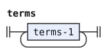</p>
<p>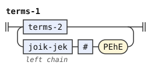</p>
<p>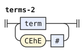</p>
<p>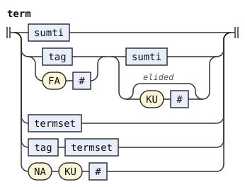</p>
<p>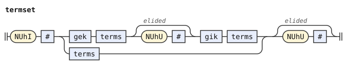</p>
</details>

## Sumti

A sumti is an argument: a description, a name, a pronoun, a quotation, a number, or a connection of these (CLL 6). The levels from `sumti` down to `sumti-4` state the connectives and the grouping, in the same shape as for statements and bridi-tails.

`sumti-1` is a sumti with a `ke ... ke'e` grouped connection after it. `sumti-2` is a sequence joined by ek or joik in afterthought, `mi .e do`, `mi joi do`. It is a left chain, since afterthought connectives group from the left [^cll-s14-7]. `sumti-3` is the `bo` form, a right chain, since a run of `bo` connectives groups from the right [^cll-s14-8]. `sumti-4` is a simple sumti or a forethought connection, `ge mi gi do`.

The top rule `sumti` adds `vu'o` followed by relative clauses. `vu'o` attaches the clauses to a whole connected sumti rather than to its last member [^cll-s8-8].

`sumti-5` places the outer quantifier. A number before a sumti-6 counts its referents: `re lo gerku`. A quantifier directly before a selbri makes a sumti with an implicit `lo`, `re gerku`, whose `ku` is elidable [^cll-s6-8]. Relative clauses can follow either.

`sumti-6` is the closed list of simple sumti. A LAhE word such as `la'e`, or a NAhE word with `bo` such as `na'e bo`, makes a sumti from the referent of another sumti. Relative clauses can stand inside. `lu'u` closes the resulting sumti. `KOhA` is a pronoun. A lerfu string, `.abu` or `xy.`, is a sumti, and `boi` closes it and separates it from a following number or lerfu string.

`la` before names makes a name. `la` or `le` (that is, any member of LA or LE) before a `sumti-tail` makes a description closed by `ku`. `li` opens a mekso closed by `lo'o`. Four forms quote [^cll-s19-9][^cll-s19-10]:

- `zo` quotes the single next word.
- `lu ... li'u` quotes a Lojban text.
- `lo'u ... le'u` quotes a run of Lojban words that need not be grammatical, possibly none.
- `zoi` quotes any text between two copies of a delimiter word.

This grammar states the quote rules over `any-word` and `anything`. The word stage decides where a `zo`, `lo'u` or `zoi` quote ends, and hands on its parts as tokens. It tags each quoted word `word`. It tags a quoted unit, such as a `zoi` body, `quoted-text`. This grammar delimits only `lu ... li'u`. The free-modifier slot of that quote follows it whether or not `li'u` is written.

`sumti-tail` is what follows a descriptor. It begins with an optional inner sumti that possesses or restricts, `le mi zdani`. Then come the inner quantifier and the selbri, `le ci gerku`, or a quantifier and a sumti, `lo re lo gerku`. Relative clauses can come after the inner sumti or replace it [^cll-s6-2][^cll-s8-7].

```jbogenbau
%rule sumti
  sumti-1 [VUhO # relative-clauses]

%rule sumti-1
  sumti-2 [(ek | joik) [stag] KE # sumti [+KEhE #]]

%rule sumti-2
  {... sumti-3 \ joik-ek}

%rule sumti-3
  {sumti-4 ... \ (ek | joik) [stag] BO #}

%rule sumti-4
  sumti-5 | gek sumti gik sumti-4

%rule sumti-5
  [quantifier] sumti-6 [relative-clauses] | quantifier selbri [+KU #] [relative-clauses]

%rule sumti-6
  | (LAhE # | NAhE BO #) [relative-clauses] sumti [+LUhU #]
  | KOhA #
  | lerfu-string [+BOI #]
  | LA # [relative-clauses] {CMEVLA} #
  | (LA | LE) # sumti-tail [+KU #]
  | LI # mex [+LOhO #]
  | ZO any-word #
  | LU text [+LIhU] #
  | LOhU [{any-word}] LEhU #
  | ZOI any-word anything any-word #

%rule sumti-tail
  [sumti-6 [relative-clauses]] sumti-tail-1 | relative-clauses sumti-tail-1

%rule sumti-tail-1
  [quantifier] selbri [relative-clauses] | quantifier sumti
```

<details><summary>Railroad diagrams of the 9 rules from <code>sumti</code> to <code>sumti-tail-1</code></summary>
<p></p>
<p>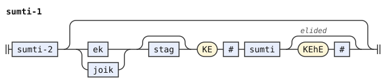</p>
<p>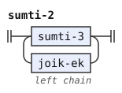</p>
<p>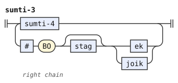</p>
<p>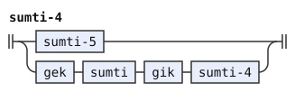</p>
<p>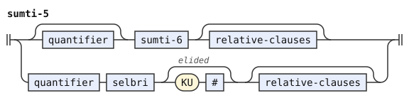</p>
<p>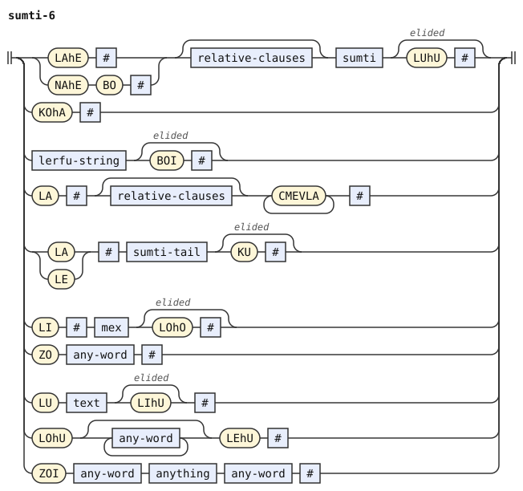</p>
<p>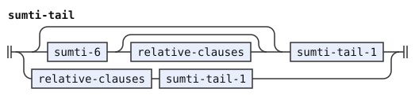</p>
<p>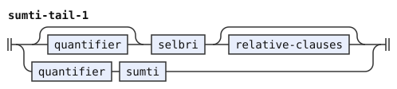</p>
</details>

## Relative clauses

A relative clause attaches to a sumti and restricts or comments on it (CLL 8). `goi` and the other members of GOI take a term, `mi goi ko'a`, `le zdani pe mi`, and `ge'u` closes the clause. `poi`, `noi` and `voi` take a subsentence in which `ke'a` refers back to the sumti, and `ku'o` closes the clause. `zi'e` joins several relative clauses on one sumti. They are a flat list, since `zi'e` groups nothing [^cll-s8-4].

```jbogenbau
%rule relative-clauses
  {relative-clause \ ZIhE #}

%rule relative-clause
  GOI # term [+GEhU #] | NOI # subsentence [+KUhO #]
```

<details><summary>Railroad diagrams of <code>relative-clauses</code> and <code>relative-clause</code></summary>
<p>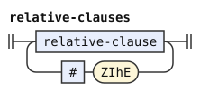</p>
<p>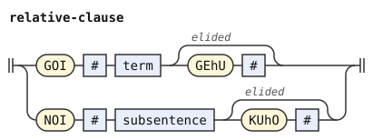</p>
</details>

## Selbri and tanru

A selbri is the predicate of a bridi (CLL 5). A tense or modal can come before it. That is how the tense or modal attaches to the whole bridi when it is not written as a term (`mi pu klama`). The levels below state the tanru grouping. `selbri-1` allows `na` before a selbri, the contradictory negation [^cll-s15-2].

`selbri-2` is the `co` inversion, `sutra co tavla`. It swaps the order of modifier and modified, so the part after `co` is the modifier [^cll-s5-8]. The whole selbri keeps the place structure of the part before `co`. Sumti after the selbri fill the places of the modifier, from its x2 on. `co` groups to the right.

`selbri-3` is a plain tanru: a sequence of `selbri-4` with no connective between them. It groups to the left, by the left-grouping rule of tanru [^cll-s5-3], so `barda gerku zdani` is `(barda gerku) zdani`. It is a left chain, so the tree shows that grouping.

`selbri-4` joins units by a jek or joik in afterthought, `barda je melbi`, or by a joik followed by `ke ... ke'e`. These connections group from the left [^cll-s14-12]. The rule is written with left recursion, so the tree shows that grouping. It is not a chain, since its three forms of connection read different units after the connective. Where the unit after a plain joik is only a `ke` group, the second form reads the same words. The grammar then takes the second form.

`selbri-5` joins units by a jek or joik with `bo`, which binds more tightly than plain juxtaposition, as in `melbi je bo cmalu nixli`. It is a right chain, since a run of `bo` groups from the right [^cll-s5-4][^cll-s14-8][^cll-s14-12].

`selbri-6` is a tanru unit, optionally followed by `bo` and a further `selbri-6`, as in `melbi cmalu bo nixli`. It refers to `selbri-6` on its right, so a run of tanru `bo` groups from the right. For example, `cmalu bo nixli bo ckule` [^cll-e5-30] is `cmalu bo (nixli bo ckule)`. `selbri-6` can also be a forethought connection with a guhek, `gu'e barda gi melbi` [^cll-s5-6][^cll-s14-12]. A `na'e` can negate that connection, within `selbri-6`.

A tanru unit is one brick of the selbri. `tanru-unit` allows `cei` to assign the unit to a pro-bridi (`klama cei broda`). Several `cei` are a flat list, since they assign one unit and group nothing [^cll-s7-5]. `tanru-unit-1` attaches linked arguments, `be ... bei ... be'o`, which fill the places of that one unit rather than of the whole bridi [^cll-s5-7]. `tanru-unit-2` lists the simple units:

- A brivla
- A pro-bridi `go'i` with optional `ra'o`
- A `ke ... ke'e` grouped selbri
- `me sumti me'u`, which turns a sumti into a selbri, optionally with a following `moi`
- A number or lerfu string with `moi`, `mei` or the others of MOI
- `nu'a` before an operator
- A conversion: `se`, `te`, `ve` or `xe`
- `jai` with an optional tense or modal
- A scalar negation `na'e`
- An abstraction: `nu`, `ka`, `du'u` or another word of NU before a subsentence, closed by `kei`

The `SE`, `JAI` and `NAhE` forms refer back to `tanru-unit-2`, so `se se broda` and `na'e se broda` are single units. A jek or joik can connect several abstraction words (`nu je ka`). `abstractor-chain` reads them as a left chain, since such a connection cannot override the left-grouping rule [^cll-s14-19].

Each level of the chain holds its first abstractor. So a single abstractor with `nai` or free modifiers is a node of its own, `[nu nai]`.

The word stage builds each `zei` compound into one `BRIVLA`, which `tanru-unit-2` reads.

```jbogenbau
%rule selbri
  [tag] selbri-1

%rule selbri-1
  selbri-2 | NA # selbri

%rule selbri-2
  selbri-3 [CO # selbri-2]

%rule selbri-3
  {... selbri-4}

%rule selbri-4
  | selbri-5
  | selbri-4 plain-joik-jek selbri-5
  | selbri-4 joik-before-ke selbri-5-not-ke-group
  | selbri-4 joik [stag] KE # selbri-3 [+KEhE #]

%rule selbri-5
  {selbri-6 ... \ (jek | joik) [stag] BO #}

%rule selbri-6
  tanru-unit [BO # selbri-6] | [NAhE #] guhek selbri gik selbri-6

%rule tanru-unit
  {tanru-unit-1 \ CEI #}

%rule tanru-unit-1
  tanru-unit-2 [linkargs]

%rule tanru-unit-2
  | BRIVLA #
  | GOhA [RAhO] #
  | KE # selbri-3 [+KEhE #]
  | ME # sumti [+MEhU #] [MOI #]
  | (number | lerfu-string) MOI #
  | NUhA # mex-operator
  | SE # tanru-unit-2
  | JAI # [tag] tanru-unit-2
  | NAhE # tanru-unit-2
  | abstractor-chain subsentence [+KEI #]

%rule abstractor-chain
  {... NU [NAI] # \ joik-jek}

%rule linkargs
  BE # term [links] [+BEhO #]

%rule links
  BEI # term [links]
```

<details><summary>Railroad diagrams of the 13 rules from <code>selbri</code> to <code>links</code></summary>
<p>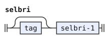</p>
<p>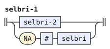</p>
<p>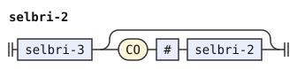</p>
<p>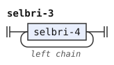</p>
<p>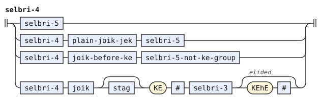</p>
<p>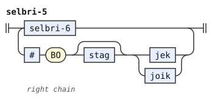</p>
<p>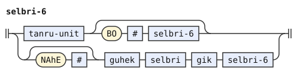</p>
<p>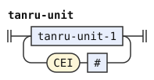</p>
<p>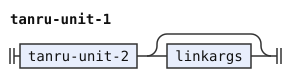</p>
<p>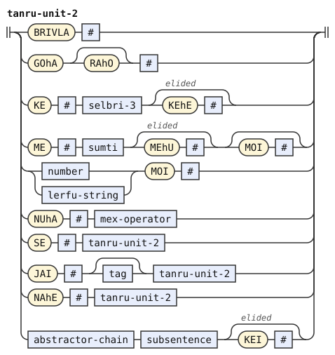</p>
<p>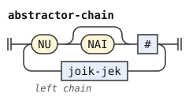</p>
<p></p>
<p></p>
</details>

## Numbers, lerfu strings and mekso

A number is a string of PA words, such as the digits `pa` and `re` and the decimal point `pi`. Lerfu words can follow its first word (`pa re ci`, `pa xy.`). A lerfu string begins with a lerfu word instead [^cll-s18-2][^cll-s17-8].

A lerfu word is a BY word, a `lau` shift before a lerfu word, or a `tei ... foi` compound. The word stage builds each `bu` letter word into one `BY`, which `lerfu-word` reads.

A number or letter string cannot end before another unit of the same run. A written `boi` ends the run. At the syntax stage, the run ends where no complete continuation unit begins.

The indicator stage attaches indicators to their words. So `li pa ui re` contains one number, with `ui` attached to `pa`. The syntax stage receives `pa` and `re` as consecutive continuation units.

A continuation unit is `PA` or a complete `lerfu-word`. It includes a BY word, a lerfu word with LAU prefixes, or a balanced TEI/FOI compound.[^cll-s17-6] `lerfu-word` permits repeated LAU prefixes.[^cll-s17-14][^cll-s21-1] `FOI` closes the inner string and cannot continue it.

The conditions on `number` and `lerfu-string` reject a boundary before another complete continuation unit. Each condition tests the whole run when its rule completes. This boundary holds even when splitting the run is the only way to parse the whole text.

A quantifier is a number closed by `boi`, or a mekso in `vei ... ve'o` brackets [^cll-s18-17][^cll-s17-11]. A mekso is a mathematical expression.

`mex` permits afterthought infix expressions, such as `li pa su'i re`, and reverse Polish expressions introduced by `fu'a`. `mex-chain` groups infix operators left, with the CLL grouping[^cll-s18-5]. Thus, `ci su'i vo pi'i mu` groups as `(ci su'i vo) pi'i mu`.

The first level of the chain is one `mex-1`, the first operand. Each later level holds an operator with both its operands: the level before it and the next `mex-1`. `mex-1` is the `bi'e` form, which binds an operator more tightly than its neighbors. A run of `bi'e` groups from the right [^cll-s18-5].

`mex-2` is an operand, or a forethought operator followed by its operands. An optional `pe'o` comes before the operator, and an optional `ku'e` closes the form.

In reverse Polish notation, an expression is two operands followed by an operator, and each operand can itself be such an expression.

Operators have their own connectives and grouping, in the same shape as selbri. `operator` joins operators by jek or joik or a `ke` group. These connections group from the left [^cll-s14-7][^cll-s14-17]. `operator`, like `selbri-4`, is written with left recursion, so the tree shows that grouping.

As in `selbri-4`, its plain connective is `plain-joik-jek`. So `li ci su'i joi ke pi'i ke'e re du li xa` joins `su'i` to the group `ke pi'i ke'e` through `joik [stag] KE`. `operator-1` gives the guhek forethought and the `bo` forms. `operator-2` is a simple operator or a `ke ... ke'e` group.

`operator-1` connects operators with a guhek or with a jek or joik followed by optional `stag` and required `bo`.

A simple `mex-operator` is a VUhU word, possibly converted by `se` or negated by `na'e`. It can also be an operator made from a mekso through `ma'o`, or a selbri used as an operator through `na'u`. `te'u` closes these last two.

Operands connect in the same way. `operand` takes a `ke` group, `operand-1` the afterthought connectives, and `operand-2` the `bo` form. `operand-1` is a left chain and `operand-2` a right chain, as for sumti [^cll-s14-7][^cll-s14-8][^cll-s14-17]. `operand-3` lists the simple operands:

- A quantifier
- A lerfu string
- A selbri through `ni'e`
- A sumti through `mo'e`
- An array through `jo'i`
- A forethought connection
- A `la'e` or `na'e bo` reference

```jbogenbau
%rule quantifier
  number [+BOI #] | VEI # mex [+VEhO #]

%rule mex
  mex-chain | FUhA # rp-expression

%rule mex-chain
  {... mex-1 \ operator}

%rule mex-1
  mex-2 [BIhE # operator mex-1]

%rule mex-2
  operand | [PEhO #] operator {mex-2} [+KUhE #]

%rule rp-expression
  rp-operand rp-operand operator

%rule rp-operand
  operand | rp-expression

%rule operator
  | operator-1
  | operator plain-joik-jek operator-1
  | operator joik-before-ke operator-1-not-ke-group
  | operator joik [stag] KE # operator [+KEhE #]

%rule operator-1
  operator-2 | guhek operator-1 gik operator-2 | operator-2 (jek | joik) [stag] BO # operator-1

%rule operator-2
  | mex-operator
  | KE # operator [+KEhE #]

%rule mex-operator
  SE # mex-operator | NAhE # mex-operator | MAhO # mex [+TEhU #] | NAhU # selbri [+TEhU #] | VUhU #

%rule operand
  operand-1 [(ek | joik) [stag] KE # operand [+KEhE #]]

%rule operand-1
  {... operand-2 \ joik-ek}

%rule operand-2
  {operand-3 ... \ (ek | joik) [stag] BO #}

%rule operand-3
  | quantifier
  | lerfu-string [+BOI #]
  | NIhE # selbri [+TEhU #]
  | MOhE # sumti [+TEhU #]
  | JOhI # {mex-2} [+TEhU #]
  | gek operand gik operand-3
  | (LAhE # | NAhE BO #) operand [+LUhU #]

%rule number
  PA [{PA | lerfu-word}]
%conditions
  ¬begins(after($), number-continuation)

%rule lerfu-string
  lerfu-word [{PA | lerfu-word}]
%conditions
  ¬begins(after($), number-continuation)

%rule number-continuation
  PA | lerfu-word

%rule lerfu-word
  BY | LAU lerfu-word | TEI lerfu-string FOI
```

<details><summary>Railroad diagrams of the 19 rules from <code>quantifier</code> to <code>lerfu-word</code></summary>
<p>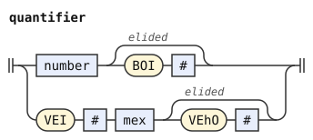</p>
<p>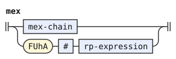</p>
<p>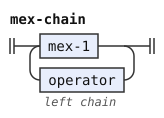</p>
<p>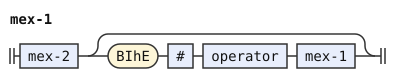</p>
<p>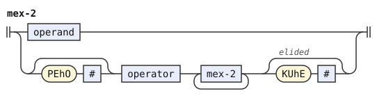</p>
<p></p>
<p></p>
<p></p>
<p></p>
<p></p>
<p></p>
<p></p>
<p></p>
<p></p>
<p></p>
<p></p>
<p></p>
<p></p>
<p></p>
</details>

## Logical and non-logical connectives

Lojban has one set of logical connectives, spelled differently for each level of the grammar [^cll-s14-3]:

- An ek joins sumti (`.e`, `.a`).
- A gihek joins bridi-tails (`gi'e`).
- A jek joins tanru units and, after `.i`, sentences (`je`).
- A gek is the forethought form (`ga ... gi`).

Each afterthought connective can be negated on either side, `na` before and `nai` after, and converted by `se`. A joik is a non-logical connective. It is `joi`, `ce`, `jo'u` and the rest of JOI, or an interval `bi'i` or `bi'o`, possibly bounded by `ga'o` or `ke'i` [^cll-s14-14][^cll-s14-16]. `joik-ek` and `joik-jek` are the pairs that stand in the same position. Each carries a free-modifier slot.

The ordinary alternative of `selbri-4` and `operator` joins two units with a plain connective. The other alternative, `joik [stag] KE`, groups with the connective itself. Where both alternatives read the same words, three rules prefer the `ke` group. `plain-joik-jek` is a jek, or a joik that `ke` does not directly follow.

`joik-before-ke` is a joik that `ke` directly follows. The unit after it cannot be only a KE group. `selbri-5-not-ke-group` and `operator-1-not-ke-group` test the constructed unit against `$KE-UNIT`. A single-child path reaches a whole KE group. BO, link arguments or another tanru child after the group stop that match.

In both CLL dialects, `mi broda joi ke me le le brodi brodo ku me'u ke'e` remains the group. Its inner KU is omitted. Omitted terminators inside the group do not change the outer KE constructor.

The plain reading remains when the unit continues after its KE group, as in `ke brode ke'e bo brodi`. The group form cannot read that unit. A free modifier between the joik and KE also leaves only the plain reading, since the group form has no slot there.

The `sumti` and `operand` rules have a joik-plus-`ke` form too. But no unit of their plain alternatives begins with `ke`, so they keep `joik-ek`. A jek has no `ke` form, so the condition does not apply to it.

A gek is a forethought logical connective, a joik used in forethought with `gi`, or a tense with `gi` (`pu gi ... gi`). A gik separates the two halves: `gi`, optionally negated. A guhek is the forethought connective of tanru units.

["Tenses and modals"](#tenses-and-modals) explains the flag that settles competing divisions before `gi`.

```jbogenbau
%rule ek
  [NA] [SE] A [NAI]

%rule gihek
  [NA] [SE] GIhA [NAI]

%rule jek
  [NA] [SE] JA [NAI]

%rule joik
  [SE] JOI [NAI] | interval | GAhO interval GAhO

%rule interval
  [SE] BIhI [NAI]

%rule joik-ek
  joik # | ek #

%rule joik-jek
  joik # | jek #

%rule plain-joik-jek
  | $j(joik) #
  | jek #
%conditions
  KE ⊈ tags(head(after($j)))

%rule joik-before-ke
  $j(joik) #
%conditions
  KE ⊆ tags(head(after($j)))

%rule selbri-5-not-ke-group
  $u(selbri-5)
%conditions
  $u ≇ $KE-UNIT

%rule operator-1-not-ke-group
  $u(operator-1)
%conditions
  $u ≇ $KE-UNIT

%rule gek
  [SE] GA [NAI] # | joik GI # | stag gik

%rule guhek
  [SE] GUhA [NAI] #

%rule gik
  GI [NAI] #
```

<details><summary>Railroad diagrams of the 14 rules from <code>ek</code> to <code>gik</code></summary>
<p></p>
<p></p>
<p></p>
<p></p>
<p></p>
<p></p>
<p></p>
<p></p>
<p></p>
<p></p>
<p></p>
<p></p>
<p></p>
<p></p>
</details>

## Tenses and modals

A tense or modal (the rule `tag`) turns a sumti into a modal or tense term (CLL 9 and 10). It also marks a selbri or a whole sentence with a tense. `tag` is one or more tense-modals joined by jek or joik, `pu je ca`. Both `tag` and `stag` are left chains, since these connections group from the left and nothing overrides that [^cll-s10-20][^cll-s14-18]. `stag` is the restricted form that is allowed inside connectives before `bo` and `ke`, and in a gek. If `stag` includes a free-modifier slot there, the grammar becomes ambiguous.

A simple tense-modal is a form that `simple-tense-modal` reads. A `tense-modal` adds a free-modifier slot or reads `fi'o selbri fe'u`, which makes a modal from any selbri [^cll-s9-5]. A simple tense-modal has one of these forms:

- A BAI modal
- A time tense, a space tense, or both in either order, followed by an optional CAhA word such as `ka'e`. A CAhA word can also stand alone. The examples `pu`, `va`, `pu va`, `va pu`, `ka'e`, and `pu ka'e` illustrate this whole branch.
- The sticky tense `ki`
- The question word `cu'e`

`ki` sets a reference point [^cll-s10-13]. `se` can convert a BAI modal. `na'e` can negate a BAI modal or a tense, and `ki` can follow either.

A time tense contains these parts in this order [^cll-s10-4][^cll-s10-9]:

- A `zi` distance
- Offsets `pu`, `ca`, `ba`, each with an optional distance
- An interval `ze'a` with an optional direction
- Interval properties

A space tense is likewise a `va` distance, `fa'a`-family offsets, a space interval, and a `mo'i` movement. A space interval is `ve'a` or `vi'a` or both, with an optional direction, and then interval properties. Either of those two parts can stand alone, as in `mi ve'a klama` and `mi fe'e ta'e klama`. `fe'e` before an interval property applies that property to space rather than time. An interval property is `roi` with a number, `ta'e` and the others of TAhE, or a ZAhO event contour. Each can take `nai`.

The `leftmost-longest` flag prefers the earliest simple tense-modal group, then the longest one at that start. It ranks complete parses before the dialect compares elided terminators. A longer group cannot win when it leaves no complete parse.

The rules can divide words before `gi` between an outer tag and the connective's stag in several ways. Those parses elide the same terminators, so `late-elision` ties them. The flag settles this tie.

In `mi viska pu ca gi do gi la djan`, `pu ca gi` forms one connective. In `mi viska pu va ca gi do gi la djan`, `pu va` stays outside the connective `ca gi`.

In `mi viska ba'o pu gi do gi la djan`, `ba'o` stays a tag over the forethought sumti. These time forms cannot form one simple tense-modal. In `mi viska fi'o kansa pu gi do gi la djan`, the modal stays outside the connective. A free modifier between the forms also keeps the separate tag.

```jbogenbau
%rule tag
  {... tense-modal \ joik-jek}

%rule stag
  {... simple-tense-modal \ jek | joik}

%rule tense-modal
  simple-tense-modal # | FIhO # selbri [+FEhU #]

%rule(leftmost-longest) simple-tense-modal
  [NAhE] [SE] BAI [NAI] [KI] | [NAhE] ((time [space] | space [time]) & CAhA) [KI] | KI | CUhE

%rule time
  ZI & {time-offset} & (ZEhA [PU [NAI]]) & {interval-property}

%rule time-offset
  PU [NAI] [ZI]

%rule space
  VA & {space-offset} & space-interval & (MOhI space-offset)

%rule space-offset
  FAhA [NAI] [VA]

%rule space-interval
  ((VEhA & VIhA) [FAhA [NAI]]) & space-int-props

%rule space-int-props
  {FEhE interval-property}

%rule interval-property
  number ROI [NAI] | TAhE [NAI] | ZAhO [NAI]
```

<details><summary>Railroad diagrams of the 11 rules from <code>tag</code> to <code>interval-property</code></summary>
<p></p>
<p></p>
<p></p>
<p></p>
<p></p>
<p></p>
<p></p>
<p></p>
<p></p>
<p></p>
<p></p>
</details>

## Free modifiers, vocatives and indicators

A free modifier, a phrase that stands in many positions, can occupy any `#` slot. The forms are these:

- A `sei ... se'u` discursive bridi, `sei mi cusku`
- A `soi ... se'u` reciprocity marker
- A vocative phrase: `coi` or `doi` and their kin, followed by a selbri, by names, or by a sumti, and closed by `do'u`
- An utterance ordinal, `pa mai`
- A parenthetical text, `to ... toi`
- A subscript `xi` with a number, lerfu string or bracketed mekso

The `se'u`, `do'u`, `toi`, `boi` and `ve'o` here are elidable, but the grammar writes them without `#`. The slot that follows a free modifier is the one that it sits in.

A vocative is a run of COI words, each with an optional `nai`, or `doi`, or both in that order. Indicators are these:

- The attitudinals and discursives, `UI` and `CAI`, with an optional `nai`
- The cancel `da'o`
- `fu'o`, which closes a scope opened by `fu'e`

The forms stage reads `y` as hesitation, and the word stage drops it before syntax.

The indicator stage attaches later indicator runs to their preceding words. This syntax reads separate indicators only at the start of a text. Each indicator can carry its own `fu'e`, which opens an attitude scope.

```jbogenbau
%rule free
  | SEI # [terms [CU #]] selbri [+SEhU]
  | SOI # sumti [sumti] [+SEhU]
  | vocative [sumti | [relative-clauses] (selbri | {CMEVLA} #) [relative-clauses]] [+DOhU]
  | (number | lerfu-string) MAI
  | TO text [+TOI]
  | XI # (number | lerfu-string) [+BOI]
  | XI # VEI # mex [+VEhO]

%rule vocative
  {COI [NAI]} & DOI

%rule indicators
  {[FUhE] indicator}

%rule indicator
  (UI | CAI) [NAI] | DAhO | FUhO
```

<details><summary>Railroad diagrams of <code>free</code>, <code>vocative</code>, <code>indicators</code> and <code>indicator</code></summary>
<p></p>
<p></p>
<p></p>
<p></p>
</details>

## Quote payloads

The word stage delimits every quote except `lu ... li'u` and emits its parts for syntax to assemble. A quoted word carries `word`, and a quoted unit carries `quoted-text`. These two rules read those parts:

```jbogenbau
%rule any-word
  ~word

%rule anything
  ~quoted-text
```

<details><summary>Railroad diagrams of <code>any-word</code> and <code>anything</code></summary>
<p></p>
<p></p>
</details>

## Choosing among parses

Because terminators can be omitted, some texts have more than one parse. The stage chooses among them by the rule that [the notation document](../../docs/notation.md) states under "Ambiguity" and "Elided terminators", with the resolution that each dialect declares. The cll-ebnf and bpfk dialects declare `late-elision elision-only`. The experimental layer declares only `late-elision`.

The flag described under ["Tenses and modals"](#tenses-and-modals) applies first. `late-elision` then compares parses with equal flagged groups. It prefers the parse that omits a terminator later. Equal flagged groups and equal elision counts at every position leave a tie, which is an error.

In cll-ebnf and bpfk, `elision-only` tests the parse that ranking selects after the verdict `resolved`. It does not run after `unique`, and a tie fails before it. It restores that parse's omitted terminators and parses the restored text with the rule flag, without an elision preference. Another reading of the restored text that the flag does not rank below that parse makes the original text an error. Conditions and tags still read the original words. [The notation document](../../docs/notation.md#elided-terminators) gives the check exactly.

Both CLL dialects let a constituent end wherever a parse of the whole text needs it. Their numbers and letter strings remain indivisible.

For example, `le sutra tavla` has two parses. One is a statement with the description `le sutra`, its `ku` elided before `tavla`, and the selbri `tavla`. The other is a fragment that consists of the single description `le sutra tavla`. The fragment elides its `ku` only at the end of the text.

`late-elision` takes the parse that elides a terminator later, so `le sutra tavla` is a fragment. A speaker who means the statement says `le sutra cu tavla` or `le sutra ku tavla`.

## Differences from the printed CLL grammar

This grammar departs from the EBNF printed in CLL in eleven places. The first settles a precedence that the printed text leaves open. The next three repair the EBNF's copy of the YACC grammar, the grammar of the official parser for the YACC parser generator. The EBNF uses that grammar as its source and cites its rule numbers. In each case, the YACC grammar has a path that the EBNF omits. The official parser accepts the text.

The fifth adopts an inference from CLL[^cll-s19-8] about several active FUhE groups. The sixth and seventh use conditions to prefer connective groups when both readings complete. They retain the plain reading when only it completes. Item 7 does not force an enclosing construct to close. In the nested abstraction under "Bridi-tails", `late-elision` instead keeps the plain reading, unlike the official lexer. The seventh also follows the CLL descriptions of grouping.[^cll-s14-10][^cll-s14-18]

The eighth applies the grouping preference described under ["Tenses and modals"](#tenses-and-modals). The ninth follows the number and letter boundaries of CLL[^cll-s17-9][^cll-s18-6]. The tenth repairs rule 83 so a tag governs its whole termset, as CLL[^cll-s10-25] states. The eleventh omits three printed alternatives that the earlier stages make unreachable. This grammar also spells printed `CMENE` as `CMEVLA`, the word stage's class for a name.

Earlier stages also depart from CLL. [The word stream](../words/stream.md) lists six departures under "Departures from CLL, the proposal, and camxes-std". They concern SI, ZEI, BU, hesitation, LOhU, and ZOI. Its prose states each relationship to the Magic Words proposal.

[The indicator stage](../indicators/cll.md) permits several FUhE groups and several BAhE words. Printed rules 411 and 1100 each allow only one. [The word forms](../words/cll.md) and [CLL word stream](../words/cll-stream.md) describe their choices and extensions, including `y` as a vowel. These documents and this section together describe the dialect's departures.

1. Printed rule 972 reads `[NAhE] (time [space] | space [time]) & CAhA [KI]`. CLL[^cll-s21-1] ranks `...` above `&`, and `&` above `|`. It gives no precedence between juxtaposition and `&`. This grammar follows its notation and ranks juxtaposition higher.

   That precedence attaches `[NAhE]` only to the time and space branch, and `[KI]` only to the CAhA branch. The repair instead surrounds the combination with those optionals. It reads `[NAhE] ((time [space] | space [time]) & CAhA) [KI]`.

   The repair admits `ba za ki`, `na'e ka'e`, `pu ki`, and `na'e ca'a` as single simple-tense-modal forms. The alternative precedence preserves rule 972's intended scope but splits `ZEhA [PU [NAI]]` in rule 1030. Either precedence therefore needs a repair. This grammar also parenthesizes `(ZEhA [PU [NAI]])` in `time`. Those parentheses leave its chosen reading unchanged.
2. A text can begin with `.i` separators followed by `ni'o` markers, as in `.i ni'o mi klama`. The printed `text-1` makes the two alternatives. YACC rule 2 (`text_B_2`) lets any number of `.i` forms precede a `ni'o` run. The camxes grammars call the printed form "a bug in the BNF".
3. A `lo'u ... le'u` quote can be empty, `lo'u le'u`. The printed `sumti-6` requires at least one word. YACC rule 436 reads the body of the quote as one token that can be empty.
4. The free-modifier slot after a `lu ... li'u` quote follows the quote whether or not `li'u` is written, so `lu cy. to toi` is a quote followed by a parenthesis. The printed `sumti-6` writes `/LIhU#/`, which drops the slot with the elided `li'u`. YACC rule 432 (`quote_arg`) attaches free modifiers to the whole quote, and its `LIhU` gap carries none. Every other elidable terminator keeps its slot as printed.
5. A run can contain several FUhE groups, as in `ui fu'e ia mi klama`. Printed rule 411 permits one group. CLL[^cll-s19-8] lets local attitudinals coexist with marked attitudes, and FUhO cancels all active attitudes. This grammar infers permission for several FUhE groups. The indicator stage uses the same rule after a word.
6. In `selbri-4` and `operator`, `joik-before-ke` reads a plain joik directly before KE. The following unit cannot be only a KE group. The condition tests `$KE-UNIT` on the parsed unit, as item 7 tests its tail patterns. The printed grammar reads `mi broda joi ke brode ke'e` in two ways. The official lexer makes `joi ke` one token, `JOIK_KE`, so it reads only the group joined by `joi`.

   That lexer also rejects `mi broda joi ke brode ke'e bo brodi`, which has only the plain reading. This grammar keeps the plain reading there, as the printed grammar does.
7. In `bridi-tail-1-final`, the last tail after a plain gihek cannot be one `ke` group with one run of tail terms. Those are the words that the `ke` form of `bridi-tail` can read as a group of tails.

   `bridi-tail-1-final` separates the last plain connection of the printed `bridi-tail-1`, so its condition needs no lookahead. `$KE-TAIL` tests the actual last tail. The exception requires its own written VAU and nonempty following tail terms. Item 6 uses `$KE-UNIT` for its constructed unit.

   The printed grammar reads `mi broda gi'e ke brode ke'e` in two ways. One is a `ke` group of tails after `gi'e` (rule 50). The other is a plain `gi'e` (rule 51) before a tail whose selbri is a `ke` tanru unit. The elided terminators cannot choose: the two parses tie when `ke'e` is elided at the end, and `late-elision` takes the tanru when `ke'e` is written.

   CLL[^cll-s14-10] groups tails with `ke` after a gihek. CLL[^cll-s14-18] puts a tense between a gihek and `ke`, which the tanru parse moves onto the selbri. The lexer of the official parser makes `gi'e ke` one token, `GIhEK_KE`, so it reads only the group. That lexer also rejects `mi broda gi'e ke brode ke'e brodi`, which has only the plain reading. This grammar keeps the plain reading there, as the printed grammar does.

8. The `simple-tense-modal` flag settles the printed grammar's tied divisions before `gi`, as ["Tenses and modals"](#tenses-and-modals) explains.

9. Numbers and letter strings are indivisible. The printed repetition permits shorter prefixes, but CLL[^cll-s17-9][^cll-s18-6] require `boi` between adjacent runs. The conditions reject a boundary before another complete continuation unit.

10. In `term`, `tag termset` lets a tense or modal govern a whole termset. Printed rule 83 omits this alternative. CLL[^cll-s10-25] explicitly allows it, and the examples[^cll-e10-189][^cll-e10-190] give that structure. A written `ku` makes the tag and termset separate terms.

    The CLL errata page records the conflict between the termset passage[^cll-s10-25] and printed rule 83 as NOFIX. Cowan writes:

    > Unfortunately true.  Termsets suck rocks, and some work will have to be done to make everything said about them consistent -- if it is even possible.  Personally, I'd like to just burn them.

    This grammar resolves the conflict in favor of CLL[^cll-s10-25]. The official parser and camxes-std read the tag and termset as separate terms.

11. This grammar omits printed `any-word {ZEI any-word}` in `tanru-unit-2`, `any-word BU` in `lerfu-word`, and indicator `Y`. The word stage already builds `zei` compounds and `bu` letter words and drops hesitation.

This grammar keeps the free-modifier slot after an elided terminator as printed: an elided `[+X #]` leaves no slot. So a free modifier cannot follow an elided `boi`, and where the CLL example[^cll-e17-38] writes `xy. xi ky.`, this grammar requires `xy. boi xi ky.`.

CLL itself says so in two places. CLL[^cll-s14-17] gives the example[^cll-e14-154], `xy. boi xi vei by. ce'o dy. [ve'o]`. After it, CLL says that "the boi in [that example] is not elidable, because the xi subscript needs something to attach to". CLL[^cll-s6-11] says that free modifiers can stand after any elidable terminator, "which, however, must not then be elided". The one exception is `li'u`, as item 4 above says.

### Parser behavior and CLL examples

CLL 1.1 prints the examples[^cll-e16-77][^cll-e16-78] with a second `zo'u` after `.ije`. The example[^cll-e16-77] is `roda zo'u mi prami da .ije naku zo'u do prami da`. The example[^cll-e16-78] is `su'oda zo'u mi prami da .ije naku zo'u do prami da`. This grammar rejects both printed texts. Without the second `zo'u`, `naku` forms a term of the second sentence. The initial prenex binds `da` in both sentences.

Every CLL edition from 1.2.12 onward removes that `zo'u` from the example[^cll-e16-77]. These editions keep it in the example[^cll-e16-78].

The official parser accepts both printed texts. Its lexer has no `lexer_T_1000` driver, so it never produces `I_JEK_820`. Instead, `.ije` without `bo` becomes `I_819`, the paragraph separator. This separator can contain `i` and a connective, and a prenex can follow it. Thus, `.ije` binds as loosely as bare `.i` in that parser.

In the printed EBNF and this grammar, bare `.i` binds loosest. The next level contains ijek and ijoik connections, which group left. The BO forms bind tightest and group right. `.ije` contains two words, `i` and `je`. This grammar keeps them as two words.

CLL[^cll-s14-6] prints the example[^cll-e14-27], `la djan. .ije la .alis. klama le zarci`, with a fragment before the sentence connective. This grammar rejects it. Printed rules 10, 12, and 13 allow fragments only beside bare `.i`.

LLG `techfix.300`, CHANGE 45, removes fragments as operands of sentence connectives. It restricts their connection to I. Its wording is "not by any lower-level form". CLL presents the fragment connection as worse than the sumti connection.[^cll-e14-27][^cll-e14-26] It leaves "the reader uncertain why John is mentioned at all." The 1997 online draft gives that example[^cll-e14-27] the same framing under its earlier numbering.

The official parser accepts the example[^cll-e14-27] because its lexer never produces the statement-level token `I_JEK_820`. On lojban-list, John Cowan addressed fragment connections in "fragment + i-jek" on June 18, 2004. The reply's Message-ID is `20040618052316.ga24048@ccil.org`. His reply says:

> It's wrong, or rather obsolete.

The CLL errata page records the same problem with these prenex examples[^cll-e16-77][^cll-e16-78] under its earlier numbering. Cowan's response carries `NOFIX`. That record does not change printed rules 12 and 13.

CLL 1.1 contains further errors in its examples. This grammar follows the printed rules in each case below. The official parser also rejects these texts or gives a reading that contradicts the gloss or the surrounding text.

The example[^cll-e14-123] uses an ek after PEhE. Rule 81 requires a joik-jek there, so this grammar rejects the text. The official lexer does not know the cmavo `ce'e` and `pe'e` and assumes UI for both words. Its parser accepts a reading that loses the term connections.

The example[^cll-e14-131] ends with NUhU without an opening NUhI. Both parsers reject the text.

The example[^cll-e14-133] intends a forethought termset but prints neither `fa'ugi` nor `gi`. Rules 81 through 83 cannot join its halves with the printed `nu'u fa'u` sequence. The final NUhU has no opening NUhI. Every edition from 1.2.15 onward supplies the forethought connectives. The errata page instead proposes an afterthought termset with `pe'e fa'u`. Both parsers reject the original text.

The examples[^cll-e14-152][^cll-e18-118] share one text. They use GA for a forethought operator connection. Rule 371 requires GUhA instead, so both parsers reject them.

The example[^cll-e18-122] closes an interval with GAhO but supplies no opening GAhO. Rule 806 requires both. Both parsers reject the text.

The examples[^cll-e16-82][^cll-e16-83] omit KUhO before `naku`. Both parsers keep `naku` inside the relative clause. Their readings disagree with the glosses.

The example[^cll-e15-55] prints `nake` for the intended `na'e ke` in its seventh text. Both parsers read NA over the whole selbri. The correction applies NAhE only to the grouped first tanru unit, as the paired lujvo requires.

The example[^cll-e17-36] omits CU after the first sumti. Both parsers read two sumti as a fragment. The gloss instead describes a sentence.

The examples[^cll-e5-121][^cll-e5-123] omit BO after `sutra`. Both parsers connect `cadzu` with `masno` inside the tanru, against the glosses. Every edition from 1.2.15 onward adds BO after `sutra`.

The examples[^cll-e16-89][^cll-e16-92] omit KUhO after `verba`. Both parsers keep the school term inside the relative clause, against the prenex glosses. Every edition from 1.2.12 onward adds KUhO after `verba`.

The example[^cll-e18-126] omits CU before `du`. Both parsers keep `ractu du` inside the second MOhE sumti and read two LI sumti. Every edition from 1.3.3 onward adds CU before `du`.

The example[^cll-e14-173] prints CU where the gloss of the second embedded bridi needs NA. The text repeats the affirmative claim, and both parsers read it as printed. Every edition from 1.2.12 onward replaces CU with NA and renumbers the example.

The printed grammar lets the tail after a plain gihek begin with `ke`, or with a tense and `ke`. So `mi broda gi'e ke brode ke'e` has two parses. In one, `ke ... ke'e` groups the tails after `gi'e`, through the `ke` form of `bridi-tail` (rule 50 of the printed grammar). In the other, `gi'e` is a plain gihek (rule 51), and `ke ... ke'e` groups a tanru that begins the second tail.

With a tense, the two parses also differ in what the tense applies to. In `mi klama gi'e pu ke cadzu ke'e`, `pu` is part of the connective in the first parse, and a tense of the selbri `ke cadzu ke'e` in the second. CLL[^cll-s14-10] groups tails with `ke` after a gihek, and CLL[^cll-s14-18] puts a tense between a gihek and `ke` (the example[^cll-e14-164]). The official parser reads only the group, through a token of its lexer (the part that divides the input into tokens), `GIhEK_KE`.

In `mi klama lo nu broda gi'e ke brode ke'e gi'a brodi`, this grammar keeps the plain `gi'e` inside the abstraction. Only the last tail receives the condition, and `late-elision` keeps the final connection inside `nu`. The official parser uses rule 50's tail group and closes `nu` before `gi'a`. That connective then applies to the outer `klama`.

In the shorter `mi klama lo nu broda gi'e ke brode ke'e`, both parsers keep the group inside `nu`. The official parser therefore agrees when the text ends at `ke'e`.

The official lexer makes `gi'e ke` one token in the plain-reading cases under ["Sentences and bridi-tails"](#sentences-and-bridi-tails). The free-modifier case is the exception. The lexer rejects the other plain-reading cases. This grammar follows the printed grammar there, and accepts them.

A joik directly before `ke`, in a tanru or between operators, has two parses too. In `mi broda joi ke brode ke'e`, one parse joins a `ke` group to `broda` through `joik [stag] KE`. The other joins `broda` with `joi` to a tanru unit that begins with `ke`. Both parses elide the same terminators at the same places, so no ranking of elided terminators can choose. The official parser reads only the first, through its lexer token `JOIK_KE`.

This grammar states that choice as a condition, in the rules `plain-joik-jek` and `joik-before-ke` (see "Logical and non-logical connectives"). So `mi broda joi ke brode ke'e` has one parse, the group joined by `joi`. A jek has no such `ke` form, so `mi broda je ke brode ke'e` keeps its one parse, a jek before a `ke` unit.

The condition applies only where the two parses compete. In `mi broda joi ke brode ke'e bo brodi`, the `ke` group cannot take `bo brodi`, so only the plain reading parses. There `joi` joins `broda` to the unit `ke brode ke'e bo brodi`. The lexer of the official parser makes `joi ke` one token there too, and so it rejects the text. This grammar follows the printed grammar there, and accepts the text.

CLL[^cll-s14-18] gives the example[^cll-e14-169], `mi pu ge klama le zarci gi tervecnu lo cidja`. Here `pu` forms a term with its `ku` elided, rather than a tag before the gek-sentence. The official parser needs written `pu ku` there. Both parsers accept `mi pu ku ge klama le zarci gi tervecnu lo cidja`.

The gek-sentence's tail terms follow the whole connection and apply to both sides. In the printed rule, the tag before `ke` is optional, so `ke ga mi klama gi do cadzu ke'e` is a `gek-sentence`. Rule 54 of the YACC grammar requires a tag there, and the official parser rejects that text. This grammar follows the EBNF.

CLL[^cll-s17-9] requires the indivisible-run boundary for letter strings. The example[^cll-e17-27] requires `boi` before the following `PA` word. CLL[^cll-s18-6] requires the boundary for numbers and function names. CLL[^cll-s17-8] allows digits inside a letter string. CLL[^cll-s17-11] repeats the function example with `boi`.

Rule 371 of the printed grammar joins two operators by a jek or joik with `bo`. An example is `li pa su'i je bo pi'i re`. CLL[^cll-s14-17] says that jeks and joiks with `bo` are not allowed for operators. But CLL 1.1 chapter 21 prints the form.

CLL[^cll-s14-18] says that operators can have a tense in their logical connectives, as tanru units can. A jek takes a tense only in the `bo` form, as in `li pa su'i je pu bo pi'i re`. This grammar follows CLL 1.1 chapter 21 and keeps the form. The official parser accepts it too.

The tense rules retain four printed forms that differ from the CLL prose or the official lexer:

- Space can precede time in one tense, as in `mi va pu klama`. CLL[^cll-s10-4] puts time first when a tense has both, because either order at will makes some constructions ambiguous. A techfix is an official grammar correction. Techfix change 42 permits space before time as a stated side effect, and rule 972 prints that order. In that example, `va pu` is one tense on `klama`. The official binary splits it because its tense lexer (the code that groups tense words) predates that correction.
- A space interval can have several `fe'e` groups, as in `mi fe'e di'i fe'e co'a klama`. The rule `space-int-props` (rule 1049) repeats `fe'e` with each property, and CLL[^cll-s10-11] says that each space interval property takes its own `fe'e`. The official lexer allows one `fe'e` group, and reads the second as a new tense.
- A tense can hold a string of interval properties, as `time` (rule 1030) repeats them. CLL[^cll-s10-21] says that a single tense can hold "strings of interval properties and event contours", as in the example[^cll-e10-161], `mi reroi ca'o xaroi darxi le damri`. The official lexer reads `mi ta'e di'i klama` as two tenses.
- A ZAhO event contour can come before a TAhE or ROI interval property, as in `mi co'a ta'e klama`. CLL[^cll-s10-10] says that the TAhE or ROI comes first when a tense has both. But the example[^cll-e10-161] puts the ZAhO `ca'o` before the ROI `xaroi`, and the printed rules allow either order. The official parser accepts both of these texts.

The official parser binary gives the same groupings as the `simple-tense-modal` flag for `mi viska pu ca gi do gi la djan` and `mi viska pu va ca gi do gi la djan`.

CLL[^cll-s19-8] says that FUhO "cancels all in-force attitudinals". This grammar infers that several FUhE groups can remain active together, as the indicator stage permits after a word. A leading `fu'e` still needs an indicator. Thus, `fu'e ui mi klama` parses here, but the official parser rejects it.

CLL's official parser reads one lexeme ahead, which no dialect here follows. A lexeme is one token of its lexer, the component that divides input into tokens. The [design document](../../docs/design.md) explains the difference.

Note 10 of CLL[^cll-s21-1] says that an elidable terminator "may be omitted (without change of meaning) if no grammatical ambiguity results". The note does not choose a parse when the grammar allows several. Each dialect chooses its ranking. Nor does the note say how to check that no ambiguity results, so `elision-only` is a choice too. Both are chosen to fit the conventions of CLL. CLL does not state them.

CLL gives advice about boundaries that preserve an intended reading. A complete parse can force such a boundary without a written terminator. Where nothing forces the boundary, the grammar gives the reading that CLL warns about. General advice does not override the elision principle of CLL[^cll-s21-1] note 10.

CLL[^cll-s6-2] warns about a description before a selbri. In `le broda brode gi'e brodi`, the whole text forces the description to end before `brode`.

CLL[^cll-s8-6][^cll-s8-7] describe the merged readings that a left-to-right reading of the words gives. Both dialects accept `le poi blabi gerku cu klama` and `le le nanmu karce cu blanu`. The whole text forces KUhO and KU exactly where the examples[^cll-e8-48][^cll-e8-62] write them. Merging the selbri leaves the outer description incomplete under printed rules 111 and 112. The official parser rejects both omitted forms.

CLL[^cll-s9-5] warns that a non-logical connective can continue the modal's selbri without `fe'u`. Both dialects read `mi fi'o broda joi pu brode` with `fe'u` elided before `joi`. The whole text forces that boundary.

In `le broda brode`, both selbri stay inside the description, as CLL[^cll-s6-2] warns. In `mi fi'o kanla viska do`, `kanla viska` remains the modal selbri, as CLL[^cll-s9-9] warns for the example[^cll-e9-60]. Neither text forces the intended outside selbri. These passages therefore describe our readings too and give no departure.

CLL[^cll-s6-11] says that `do'u` is rarely needed. CLL[^cll-s19-12] gives the same advice for `se'u`, except before an outside selbri. Both dialects read `mi coi broda brode gi'e brodi` and `mi sei do broda brode gi'e brodi` with the free modifier ending before `brode`.

Other warnings describe the official parser. CLL[^cll-s14-14] says that "Lojban's parsing rules would see le nanmu joi and assume that another tanru component is to follow". The complete grammar permits a sumti connection that this left-to-right reading misses. Here `le nanmu joi le ninmu cu klama le zarci` has the intended sumti connection. The official parser rejects it.

CLL[^cll-s18-11] says that the parser combines `pa` and `moi` in the example[^cll-e18-93] without `me'u`. Here `ta me li ny. su'i pa moi le'i mi ratcu` has `me'u` elided where the example writes it. The official parser rejects it.

CLL[^cll-s18-17] says that the parser assumes another operand after `.onai` in the example[^cll-e18-116] without `lo'o`. Here `li re su'i re du li vo .onai lo nalseldjuno namcu` retains the example's sumti connection. The official parser rejects it. These parser limitations do not require written terminators in the grammar.

The indivisible-number rule follows these CLL requirements in both dialects:

- CLL[^cll-s17-9], after the example[^cll-e17-25], requires `boi` between adjacent letter or numeral strings. Both dialects reject `pa xy. cu barda` and accept `pa boi xy. cu barda`.
- CLL[^cll-s18-6], after the example[^cll-e18-32], requires `boi` between adjacent numbers. CLL[^cll-s18-16] shows the reverse Polish examples[^cll-e18-110][^cll-e18-111][^cll-e18-112] with the required `boi` boundaries. Both dialects reject `li fu'a pa re su'i du li ci` and accept `li fu'a pa boi re su'i du li ci`.
- CLL[^cll-s18-6], after the example[^cll-e18-34], requires `boi` between the function name and its operand. Both dialects reject `li zy du li ma'o fy. xy.` and accept `li zy du li ma'o fy. boi xy.`.

The shared elision policy follows CLL's general advice where the whole text determines the intended boundary. It disagrees with no specific text of CLL. CLL[^cll-s8-6][^cll-s8-7] describe merged readings that cannot complete the outer description. CLL[^cll-s14-14][^cll-s18-11][^cll-s18-17] describe the official parser's left-to-right reading. It does not override number and letter boundaries. The maintainer approves this interpretation of the elision note for both dialects.[^cll-s21-1]

The word stage implements the non-formal erasure rule `null = any-word SI | utterance SA | text SU`. A non-formal rule runs before syntax. CLL never defines the `utterance` that `sa` erases.

[^cll-s19-5]: [CLL 1.1, section 19.5](https://lojban.org/publications/cll/cll_v1.1_xhtml-section-chunks/section-questions-and-answers.html).

[^cll-s19-2]: [CLL 1.1, section 19.2](https://lojban.org/publications/cll/cll_v1.1_xhtml-section-chunks/section-i.html).

[^cll-s19-3]: [CLL 1.1, section 19.3](https://lojban.org/publications/cll/cll_v1.1_xhtml-section-chunks/section-niho.html).

[^cll-s14-4]: [CLL 1.1, section 14.4](https://lojban.org/publications/cll/cll_v1.1_xhtml-section-chunks/section-bridi-connection.html).

[^cll-s16-2]: [CLL 1.1, section 16.2](https://lojban.org/publications/cll/cll_v1.1_xhtml-section-chunks/section-da-and-zohu.html).

[^cll-s14-7]: [CLL 1.1, section 14.7](https://lojban.org/publications/cll/cll_v1.1_xhtml-section-chunks/section-more-propositions.html).

[^cll-s14-8]: [CLL 1.1, section 14.8](https://lojban.org/publications/cll/cll_v1.1_xhtml-section-chunks/section-afterthought-connectives-grouping.html).

[^cll-s14-13]: [CLL 1.1, section 14.13](https://lojban.org/publications/cll/cll_v1.1_xhtml-section-chunks/section-truth-and-connective-questions.html).

[^cll-s9-2]: [CLL 1.1, section 9.2](https://lojban.org/publications/cll/cll_v1.1_xhtml-section-chunks/section-cu.html).

[^cll-s16-8]: [CLL 1.1, section 16.8](https://lojban.org/publications/cll/cll_v1.1_xhtml-section-chunks/section-any.html).

[^cll-s14-9]: [CLL 1.1, section 14.9](https://lojban.org/publications/cll/cll_v1.1_xhtml-section-chunks/section-compound-bridi.html).

[^cll-s14-10]: [CLL 1.1, section 14.10](https://lojban.org/publications/cll/cll_v1.1_xhtml-section-chunks/section-multiple-compound-bridi.html).

[^cll-s9-3]: [CLL 1.1, section 9.3](https://lojban.org/publications/cll/cll_v1.1_xhtml-section-chunks/section-FA.html).

[^cll-s10-13]: [CLL 1.1, section 10.13](https://lojban.org/publications/cll/cll_v1.1_xhtml-section-chunks/section-sticky-tenses.html).

[^cll-s16-11]: [CLL 1.1, section 16.11](https://lojban.org/publications/cll/cll_v1.1_xhtml-section-chunks/section-na-outside-prenex.html).

[^cll-s14-11]: [CLL 1.1, section 14.11](https://lojban.org/publications/cll/cll_v1.1_xhtml-section-chunks/section-termsets.html).

[^cll-s16-7]: [CLL 1.1, section 16.7](https://lojban.org/publications/cll/cll_v1.1_xhtml-section-chunks/section-quantifier-grouping.html).

[^cll-s8-8]: [CLL 1.1, section 8.8](https://lojban.org/publications/cll/cll_v1.1_xhtml-section-chunks/section-vuho.html).

[^cll-s6-8]: [CLL 1.1, section 6.8](https://lojban.org/publications/cll/cll_v1.1_xhtml-section-chunks/section-indefinite-descriptions.html).

[^cll-s19-9]: [CLL 1.1, section 19.9](https://lojban.org/publications/cll/cll_v1.1_xhtml-section-chunks/section-quotations.html).

[^cll-s19-10]: [CLL 1.1, section 19.10](https://lojban.org/publications/cll/cll_v1.1_xhtml-section-chunks/section-more-quotations.html).

[^cll-s6-2]: [CLL 1.1, section 6.2](https://lojban.org/publications/cll/cll_v1.1_xhtml-section-chunks/section-basic-descriptors.html).

[^cll-s8-7]: [CLL 1.1, section 8.7](https://lojban.org/publications/cll/cll_v1.1_xhtml-section-chunks/section-possessive-sumti.html).

[^cll-s8-4]: [CLL 1.1, section 8.4](https://lojban.org/publications/cll/cll_v1.1_xhtml-section-chunks/section-zihe.html).

[^cll-s15-2]: [CLL 1.1, section 15.2](https://lojban.org/publications/cll/cll_v1.1_xhtml-section-chunks/section-bridi-negation.html).

[^cll-s5-8]: [CLL 1.1, section 5.8](https://lojban.org/publications/cll/cll_v1.1_xhtml-section-chunks/section-co-inversion.html).

[^cll-s5-3]: [CLL 1.1, section 5.3](https://lojban.org/publications/cll/cll_v1.1_xhtml-section-chunks/section-three-part-tanru.html).

[^cll-s14-12]: [CLL 1.1, section 14.12](https://lojban.org/publications/cll/cll_v1.1_xhtml-section-chunks/section-tanru.html).

[^cll-s5-4]: [CLL 1.1, section 5.4](https://lojban.org/publications/cll/cll_v1.1_xhtml-section-chunks/section-complex-grouping.html).

[^cll-s5-6]: [CLL 1.1, section 5.6](https://lojban.org/publications/cll/cll_v1.1_xhtml-section-chunks/section-logical-connection.html).

[^cll-s7-5]: [CLL 1.1, section 7.5](https://lojban.org/publications/cll/cll_v1.1_xhtml-section-chunks/section-koha-broda-series.html).

[^cll-s5-7]: [CLL 1.1, section 5.7](https://lojban.org/publications/cll/cll_v1.1_xhtml-section-chunks/section-be-sumti.html).

[^cll-s14-19]: [CLL 1.1, section 14.19](https://lojban.org/publications/cll/cll_v1.1_xhtml-section-chunks/section-abstractors.html).

[^cll-s18-2]: [CLL 1.1, section 18.2](https://lojban.org/publications/cll/cll_v1.1_xhtml-section-chunks/section-mekso-numbers.html).

[^cll-s17-8]: [CLL 1.1, section 17.8](https://lojban.org/publications/cll/cll_v1.1_xhtml-section-chunks/section-chinese-characters.html).

[^cll-s17-6]: [CLL 1.1, section 17.6](https://lojban.org/publications/cll/cll_v1.1_xhtml-section-chunks/section-accents.html).

[^cll-s17-14]: [CLL 1.1, section 17.14](https://lojban.org/publications/cll/cll_v1.1_xhtml-section-chunks/section-lerfu-cmavo-summary.html).

[^cll-s18-17]: [CLL 1.1, section 18.17](https://lojban.org/publications/cll/cll_v1.1_xhtml-section-chunks/section-connectives-within-mekso.html).

[^cll-s17-11]: [CLL 1.1, section 17.11](https://lojban.org/publications/cll/cll_v1.1_xhtml-section-chunks/section-math.html).

[^cll-s18-5]: [CLL 1.1, section 18.5](https://lojban.org/publications/cll/cll_v1.1_xhtml-section-chunks/section-simple-infix.html).

[^cll-s14-17]: [CLL 1.1, section 14.17](https://lojban.org/publications/cll/cll_v1.1_xhtml-section-chunks/section-mekso-connections.html).

[^cll-s14-3]: [CLL 1.1, section 14.3](https://lojban.org/publications/cll/cll_v1.1_xhtml-section-chunks/section-six-types.html).

[^cll-s14-14]: [CLL 1.1, section 14.14](https://lojban.org/publications/cll/cll_v1.1_xhtml-section-chunks/section-non-logical-connectives.html).

[^cll-s14-16]: [CLL 1.1, section 14.16](https://lojban.org/publications/cll/cll_v1.1_xhtml-section-chunks/section-non-logical-continued-continued.html).

[^cll-s10-20]: [CLL 1.1, section 10.20](https://lojban.org/publications/cll/cll_v1.1_xhtml-section-chunks/section-connected-tenses.html).

[^cll-s14-18]: [CLL 1.1, section 14.18](https://lojban.org/publications/cll/cll_v1.1_xhtml-section-chunks/section-sumtcita.html).

[^cll-s9-5]: [CLL 1.1, section 9.5](https://lojban.org/publications/cll/cll_v1.1_xhtml-section-chunks/section-selbri-modals.html).

[^cll-s10-4]: [CLL 1.1, section 10.4](https://lojban.org/publications/cll/cll_v1.1_xhtml-section-chunks/section-temporal-tenses.html).

[^cll-s10-9]: [CLL 1.1, section 10.9](https://lojban.org/publications/cll/cll_v1.1_xhtml-section-chunks/section-interval-properties.html).

[^cll-s19-8]: [CLL 1.1, section 19.8](https://lojban.org/publications/cll/cll_v1.1_xhtml-section-chunks/section-attitudinal-scope.html).

[^cll-s17-9]: [CLL 1.1, section 17.9](https://lojban.org/publications/cll/cll_v1.1_xhtml-section-chunks/section-lerfu-pro-sumti.html).

[^cll-s18-6]: [CLL 1.1, section 18.6](https://lojban.org/publications/cll/cll_v1.1_xhtml-section-chunks/section-forethought.html).

[^cll-s10-25]: [CLL 1.1, section 10.25](https://lojban.org/publications/cll/cll_v1.1_xhtml-section-chunks/section-explicit-magnitudes.html).

[^cll-s21-1]: [CLL 1.1, section 21.1](https://lojban.org/publications/cll/cll_v1.1_xhtml-section-chunks/chapter-grammars.html#section-EBNF).

[^cll-s6-11]: [CLL 1.1, section 6.11](https://lojban.org/publications/cll/cll_v1.1_xhtml-section-chunks/section-vocative-syntax.html).


[^cll-s14-6]: [CLL 1.1, section 14.6](https://lojban.org/publications/cll/cll_v1.1_xhtml-section-chunks/section-sumti-connection.html).

[^cll-s10-11]: [CLL 1.1, section 10.11](https://lojban.org/publications/cll/cll_v1.1_xhtml-section-chunks/section-fehe.html).

[^cll-s10-21]: [CLL 1.1, section 10.21](https://lojban.org/publications/cll/cll_v1.1_xhtml-section-chunks/section-sub-events.html).

[^cll-s10-10]: [CLL 1.1, section 10.10](https://lojban.org/publications/cll/cll_v1.1_xhtml-section-chunks/section-event-contours.html).

[^cll-s8-6]: [CLL 1.1, section 8.6](https://lojban.org/publications/cll/cll_v1.1_xhtml-section-chunks/section-descriptors.html).

[^cll-s9-9]: [CLL 1.1, section 9.9](https://lojban.org/publications/cll/cll_v1.1_xhtml-section-chunks/section-modal-selbri.html).

[^cll-s19-12]: [CLL 1.1, section 19.12](https://lojban.org/publications/cll/cll_v1.1_xhtml-section-chunks/section-parentheses.html).

[^cll-s18-11]: [CLL 1.1, section 18.11](https://lojban.org/publications/cll/cll_v1.1_xhtml-section-chunks/section-mekso-selbri.html).

[^cll-s18-16]: [CLL 1.1, section 18.16](https://lojban.org/publications/cll/cll_v1.1_xhtml-section-chunks/section-reverse-polish-notation.html).

[^cll-e14-54]: [CLL 1.1, section 14.9, example 14.54](https://lojban.org/publications/cll/cll_v1.1_xhtml-section-chunks/section-compound-bridi.html#c14e9d6).

[^cll-e5-30]: [CLL 1.1, section 5.4, example 5.30](https://lojban.org/publications/cll/cll_v1.1_xhtml-section-chunks/section-complex-grouping.html#c5e4d6).

[^cll-e10-189]: [CLL 1.1, section 10.25, example 10.189](https://lojban.org/publications/cll/cll_v1.1_xhtml-section-chunks/section-explicit-magnitudes.html#c10e25d1).

[^cll-e10-190]: [CLL 1.1, section 10.25, example 10.190](https://lojban.org/publications/cll/cll_v1.1_xhtml-section-chunks/section-explicit-magnitudes.html#c10e25d2).

[^cll-e17-38]: [CLL 1.1, section 17.11, example 17.38](https://lojban.org/publications/cll/cll_v1.1_xhtml-section-chunks/section-math.html#c17e11d5).

[^cll-e14-154]: [CLL 1.1, section 14.17, example 14.154](https://lojban.org/publications/cll/cll_v1.1_xhtml-section-chunks/section-mekso-connections.html#c14e17d6).

[^cll-e16-77]: The errata calls this chapter 16, section 10, example 10.5. [CLL 1.1, section 16.10, example 16.77](https://lojban.org/publications/cll/cll_v1.1_xhtml-section-chunks/section-connectives.html#c16e10d5).

[^cll-e16-78]: The errata calls this chapter 16, section 10, example 10.6. [CLL 1.1, section 16.10, example 16.78](https://lojban.org/publications/cll/cll_v1.1_xhtml-section-chunks/section-connectives.html#c16e10d6).

[^cll-e14-27]: The 1997 draft calls this example 6.3. [CLL 1.1, section 14.6, example 14.27](https://lojban.org/publications/cll/cll_v1.1_xhtml-section-chunks/section-sumti-connection.html#c14e6d3).


[^cll-e14-123]: [CLL 1.1, section 14.14, example 14.123](https://lojban.org/publications/cll/cll_v1.1_xhtml-section-chunks/section-non-logical-connectives.html#c14e14d15).

[^cll-e14-131]: [CLL 1.1, section 14.15, example 14.131](https://lojban.org/publications/cll/cll_v1.1_xhtml-section-chunks/section-non-logical-continued.html#c14e15d7).

[^cll-e14-133]: [CLL 1.1, section 14.15, example 14.133](https://lojban.org/publications/cll/cll_v1.1_xhtml-section-chunks/section-non-logical-continued.html#c14e15d9).

[^cll-e14-152]: [CLL 1.1, section 14.17, example 14.152](https://lojban.org/publications/cll/cll_v1.1_xhtml-section-chunks/section-mekso-connections.html#c14e17d4).

[^cll-e18-118]: [CLL 1.1, section 18.17, example 18.118](https://lojban.org/publications/cll/cll_v1.1_xhtml-section-chunks/section-connectives-within-mekso.html#c18e17d5).

[^cll-e18-122]: [CLL 1.1, section 18.17, example 18.122](https://lojban.org/publications/cll/cll_v1.1_xhtml-section-chunks/section-connectives-within-mekso.html#c18e17d9).

[^cll-e16-82]: [CLL 1.1, section 16.11, example 16.82](https://lojban.org/publications/cll/cll_v1.1_xhtml-section-chunks/section-na-outside-prenex.html#c16e11d4).

[^cll-e16-83]: [CLL 1.1, section 16.11, example 16.83](https://lojban.org/publications/cll/cll_v1.1_xhtml-section-chunks/section-na-outside-prenex.html#c16e11d5).

[^cll-e15-55]: [CLL 1.1, section 15.4, example 15.55](https://lojban.org/publications/cll/cll_v1.1_xhtml-section-chunks/section-nahe.html#c15e4d12).

[^cll-e17-36]: [CLL 1.1, section 17.11, example 17.36](https://lojban.org/publications/cll/cll_v1.1_xhtml-section-chunks/section-math.html#c17e11d3).

[^cll-e5-121]: [CLL 1.1, section 5.12, example 5.121](https://lojban.org/publications/cll/cll_v1.1_xhtml-section-chunks/section-selbri-scalar-negation.html#c5e12d6).

[^cll-e5-123]: [CLL 1.1, section 5.12, example 5.123](https://lojban.org/publications/cll/cll_v1.1_xhtml-section-chunks/section-selbri-scalar-negation.html#c5e12d8).

[^cll-e16-89]: [CLL 1.1, section 16.11, example 16.89](https://lojban.org/publications/cll/cll_v1.1_xhtml-section-chunks/section-na-outside-prenex.html#c16e11d11).

[^cll-e16-92]: [CLL 1.1, section 16.11, example 16.92](https://lojban.org/publications/cll/cll_v1.1_xhtml-section-chunks/section-na-outside-prenex.html#c16e11d14).

[^cll-e18-126]: [CLL 1.1, section 18.18, example 18.126](https://lojban.org/publications/cll/cll_v1.1_xhtml-section-chunks/section-lojban-within-mekso.html#c18e18d3).

[^cll-e14-173]: Editions from 1.2.12 number the corrected example 14.172. [CLL 1.1, section 14.19, example 14.173](https://lojban.org/publications/cll/cll_v1.1_xhtml-section-chunks/section-abstractors.html#c14e19d4).


[^cll-e14-164]: [CLL 1.1, section 14.18, example 14.164](https://lojban.org/publications/cll/cll_v1.1_xhtml-section-chunks/section-sumtcita.html#c14e18d10).

[^cll-e14-169]: [CLL 1.1, section 14.18, example 14.169](https://lojban.org/publications/cll/cll_v1.1_xhtml-section-chunks/section-sumtcita.html#c14e18d15).

[^cll-e17-27]: [CLL 1.1, section 17.9, example 17.27](https://lojban.org/publications/cll/cll_v1.1_xhtml-section-chunks/section-lerfu-pro-sumti.html#c17e9d7).

[^cll-e10-161]: [CLL 1.1, section 10.21, example 10.161](https://lojban.org/publications/cll/cll_v1.1_xhtml-section-chunks/section-sub-events.html#c10e21d3).

[^cll-e8-48]: [CLL 1.1, section 8.6, example 8.48](https://lojban.org/publications/cll/cll_v1.1_xhtml-section-chunks/section-descriptors.html#c8e6d2).

[^cll-e8-62]: [CLL 1.1, section 8.7, example 8.62](https://lojban.org/publications/cll/cll_v1.1_xhtml-section-chunks/section-possessive-sumti.html#c8e7d4).

[^cll-e9-60]: [CLL 1.1, section 9.9, example 9.60](https://lojban.org/publications/cll/cll_v1.1_xhtml-section-chunks/section-modal-selbri.html#c9e9d6).

[^cll-e18-93]: [CLL 1.1, section 18.11, example 18.93](https://lojban.org/publications/cll/cll_v1.1_xhtml-section-chunks/section-mekso-selbri.html#c18e11d13).

[^cll-e18-116]: [CLL 1.1, section 18.17, example 18.116](https://lojban.org/publications/cll/cll_v1.1_xhtml-section-chunks/section-connectives-within-mekso.html#c18e17d3).

[^cll-e17-25]: [CLL 1.1, section 17.9, example 17.25](https://lojban.org/publications/cll/cll_v1.1_xhtml-section-chunks/section-lerfu-pro-sumti.html#c17e9d5).

[^cll-e18-32]: [CLL 1.1, section 18.6, example 18.32](https://lojban.org/publications/cll/cll_v1.1_xhtml-section-chunks/section-forethought.html#c18e6d1).

[^cll-e18-110]: [CLL 1.1, section 18.16, example 18.110](https://lojban.org/publications/cll/cll_v1.1_xhtml-section-chunks/section-reverse-polish-notation.html#c18e16d1).

[^cll-e18-112]: [CLL 1.1, section 18.16, example 18.112](https://lojban.org/publications/cll/cll_v1.1_xhtml-section-chunks/section-reverse-polish-notation.html#c18e16d3).

[^cll-e18-34]: [CLL 1.1, section 18.6, example 18.34](https://lojban.org/publications/cll/cll_v1.1_xhtml-section-chunks/section-forethought.html#c18e6d3).

[^cll-e14-26]: [CLL 1.1, section 14.6, example 14.26](https://lojban.org/publications/cll/cll_v1.1_xhtml-section-chunks/section-sumti-connection.html#c14e6d2).

[^cll-e18-111]: [CLL 1.1, section 18.16, example 18.111](https://lojban.org/publications/cll/cll_v1.1_xhtml-section-chunks/section-reverse-polish-notation.html#c18e16d2).
