# The experimental grammar

This document is a layer over [the CLL grammar](cll.md), the grammar printed in chapter 21 of *The Complete Lojban Language*, edition 1.1. A layer is a document that changes earlier rules. A dialect is a pipeline of stages, defined by one pipeline document. The [experimental](../dialects/experimental.md) dialect stitches this layer after that grammar, that is, combines their rules into one grammar.

The layer adds experimental constructs. The grammar always accepts some, and a feature, a named switch that the grammars test, guards others.

The layer restates each CLL rule that it changes with `%redefine-rule`. It states its own rules with `%rule`. Each section below says what the layer changes in that part of the grammar. A rule that this document does not name is the CLL grammar's, as that document explains it.

The prose uses these Lojban terms, as [the CLL grammar](cll.md) does:

- A cmavo is a particle, a short structure word.
- A selma'o is a word class of cmavo.
- A brivla is a predicate word.
- A cmevla is a name word.
- A selbri is the predicate of a sentence.
- A sumti is an argument of a selbri.
- A tanru is a compound selbri.
- A bridi-tail is a selbri with any terms after it.
- A lerfu word is a letter word, such as `.abu` or `xy.`.
- A mekso is a mathematical expression.

[The experimental lexicon](../words/lexicon-experimental.md) gives each cmavo one selma'o. For example, `mi'ai` is KOhA, `la` is LE, `fi'oi` is SOI, `ma'oi` is ZO and `la'oi` is ZOhOI. `no'oi` and `po'oi` are NOhOI, with the terminator `ku'oi`. The added classes include `LOhOI`, `NOhOI`, `KUhOI`, `KUhAU`, `LOhAI`, `LEhAI`, `ZOhOI` and `MEhOI`.

[The notation document](../../docs/notation.md) explains the notation. The terminals of this grammar (the symbols that each match one input token) are selma'o. A tag marks a token by name, phoneme or character. The rules `any-word` and `anything` match tokens tagged `word` and `quoted-text`, respectively.

A stage is one step of a pipeline, with its own grammar. The pipeline is the sequence of stages that reads a text. The word stage, an earlier stage, puts these two tags on the material of a quote.

The layer uses two feature guards, which make a part of a rule depend on a feature. `cbm` is the cmevla-brivla merger, which permits name words as predicates. `soi-clause` makes `soi` a term that takes a subsentence. The experimental dialect turns both on. A caller can turn either off.

The free-modifier slot follows an elidable terminator outside its brackets: `[+X] #`. A free modifier is a phrase that stands in many positions. So free modifiers can follow an elided terminator. `free-after-number` and `free-after-lerfu-string` keep a number or lerfu string maximal. After an elided `boi`, they exclude a first free modifier that starts with a word that the number or string can read.

A span is a range between input token boundaries. A ranked choice filters alternatives at one written position. An option qualifies when its completed reading passes its recognition rules. A qualified earlier option excludes later options over the same span.

A derivation is one complete grammatical reading. An admitted derivation survives ranked filtering. The stage ranks admitted derivations by `leftmost-longest`, then `late-elision`. Fewer omitted terminators win at the first differing boundary. Two best derivations with equal counts at every boundary tie, and a tie is an error.

So `to mi klama` holds `mi klama` in its parenthesis, because the other reading elides `vau` and `toi` after `mi`. In the same way, `lu mi klama` holds `mi klama` in its quote.

The layer permits ambiguity beyond omitted terminators. It uses these rules to select a reading:

- In a tanru and between operators, `ke` directly after a joik opens the connective's own group. The selbri and mekso sections explain that choice.
- A connection that can be a sumti connection is one ("Terms").
- A `be` group attaches to the tanru unit before it ("Selbri and tanru").
- A subscript after a subscript nests. Any other free modifier after a subscript belongs to the word that the subscript marks ("Free modifiers, vocatives and indicators").

The experimental terminators `ku'au` and `ku'oi` are elidable: the rules below write them `[+KUhAU]` and `[+KUhOI]`.

```jbogenbau
%ambiguity-resolution late-elision
```

## The text and its paragraphs

The layer changes the text in five ways. A `nai` at the start of a text is an indicator, as the indicator stage of the experimental dialect reads it. The `indicators` rule takes that bare NAI. A separate `nai` stands only before a run of names.

The connective after a text-leading `.i` can be an ek, as in `.i .e do klama`. The tense before `bo` there is a `tag`. A `stag` is a `tag` in this dialect, so either name reads the same words.

The third change is that an ek, a jek or a joik directly after `.i` is always a connective. So `i.e`, `.iji` and `mi klama .i e` read `.i e` or `.i ji` as a connective. Without this rule, these texts tie, because a bare ek is a fragment. The rule `lone-i` is an `.i` that no ek, jek or joik follows directly. It stands in the bare-`.i` positions of `text-1` and `paragraph`, before a statement, a fragment or nothing.

The `lone-i` rule tests these three connective families. A VUhU can also follow `.i` as a connective, as in `mi klama .i su'i do klama`. It needs no test, because no statement or fragment begins with it. A gihek answer after `.i` stays a fragment, as in `.i gi'e` and `mi klama .i gi'e`. No `.i` connective is a gihek, so these texts cause no tie.

A bare connective answer stands without `.i`, as `e` or `je` alone. A bare jek answers `je'i`. An ek directly after `.i` always forms a connective.

A free modifier can stand between `.i` and an ek. Then the ek can still be a fragment, as in `mi klama .i sei broda se'u e`. Neither `ge'i` nor `gu'i` can stand as a bare answer.[^cll-e14-105] A forethought connective can start with an ek, a jek or a joik, as in `je gi mi gi do`. The connective after `.i` consumes that initial ek, jek or joik. Therefore `.i e gi mi gi do` and `mi klama .i je gi mi gi do` fail.

`text-1` and `paragraphs` permit `.i ni'o` after a run of `ni'o`. This allows a new topic inside a reply. A run of `ni'o` can also end the text, as in `mi klama ni'o`.

A run of names can start a text only with `cbm` off. Under `cbm`, a cmevla is a selbri word, so the dialect rejects `.djan. mi klama`.

A connective can precede the first `.i` of a text, as in `je mi klama`.

```jbogenbau
%redefine-rule text
  | ¬cbm? [{NAI}] {CMEVLA} # [joik-jek] text-1
  | [indicators & {free}] [joik-jek] text-1

%redefine-rule indicators
  {[FUhE] indicator}

%redefine-rule indicator
  UI | CAI | NAI | DAhO | FUhO

%redefine-rule text-1
  [{(I (jek | joik | ek) | lone-i) [[tag] BO] #}] [{NIhO} # [I # {NIhO} #]] [paragraphs]

%redefine-rule paragraphs
  paragraph [{NIhO} # [paragraphs | I # {NIhO} # [paragraphs]]]

%redefine-rule paragraph
  (statement | fragment) [{lone-i # [statement | fragment]}]

%rule lone-i
  (* I_clause !jek !joik !joik_jek in camxes-exp's paragraph, whose joik includes A *)
  $i(I)
%conditions
  ¬begins(after($i), ek),
  ¬begins(after($i), jek),
  ¬begins(after($i), joik)
```

<details><summary>Railroad diagrams of the 7 rules from <code>text</code> to <code>lone-i</code></summary>
<p>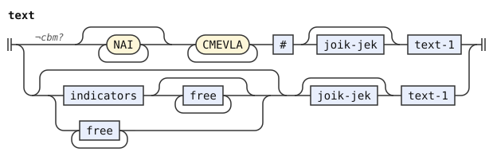</p>
<p></p>
<p>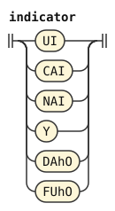</p>
<p>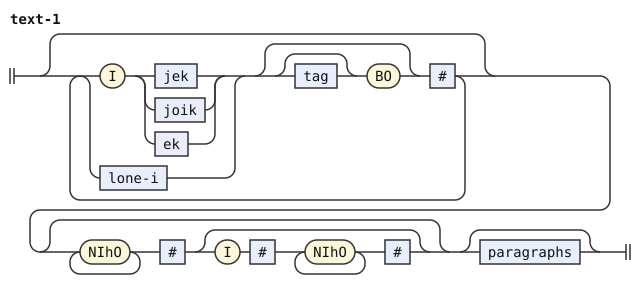</p>
<p>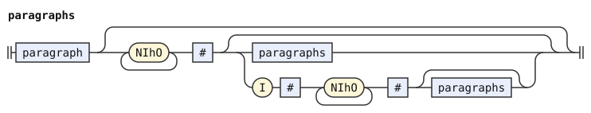</p>
<p>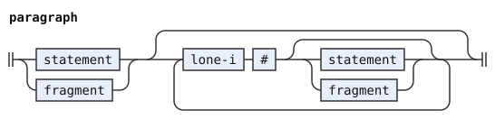</p>
<p>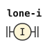</p>
</details>

## Statements and fragments

The connective after `.i` can be an ek or a VUhU as well as a joik or jek. A statement connective can also precede `.i`, as in `mi klama joi .i do klama`. Both are `statement-connective`. Before `bo` after `.i`, the connective can also be an ek, and the tense is a `stag`, which is a `tag` here.

A connective with an optional stag and `bo` can also precede `.i` inside a sentence, with a subsentence after it. A prenex can have no terms (`zo'u mi klama`). `statement-1` keeps the left recursion of the CLL rule, with both forms of connection. So its connections group from the left.

A bare `na` forms a term. So `na` and `na na` are terms fragments. A separate `na` alternative in `fragment` duplicates that reading.

```jbogenbau
%redefine-rule statement-1
  | statement-2
  | statement-1 I statement-connective [statement-2]
  | statement-1 statement-connective I # [statement-2]

%redefine-rule statement-2
  statement-3 [I [joik | jek | ek] [stag] BO # [statement-2]]

%redefine-rule statement-3
  sentence | [tag] TUhE # text-1 [+TUhU] #

%rule statement-connective
  joik # | jek # | ek # | VUhU #

%redefine-rule fragment
  ek # | gihek # | quantifier | terms [+VAU] # | prenex | relative-clauses | links | linkargs

%redefine-rule prenex
  [terms] ZOhU #
```

<details><summary>Railroad diagrams of the 6 rules from <code>statement-1</code> to <code>prenex</code></summary>
<p>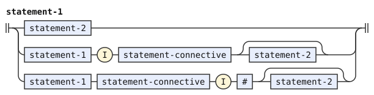</p>
<p>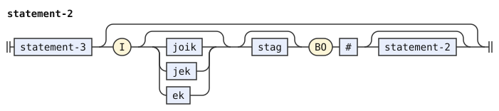</p>
<p>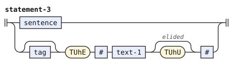</p>
<p>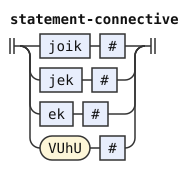</p>
<p>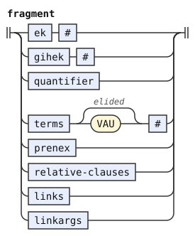</p>
<p>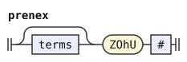</p>
</details>

## Sentences and bridi-tails

A bridi-tail can have terms before its selbri. The terms and `cu` before a selbri form a `bridi-tail-head`. In a head, runs of terms and single `cu` words alternate: `mi cu do klama`, `cu mi klama`. A head can stand before the first bridi-tail of a sentence, and after each connective between bridi-tails. Examples are `mi klama je do tavla` and `mi klama gi'e cu do tavla`.

A term in a head is a term of a list. There a tense or modal, or a bare `na`, is not a term where a selbri follows it ("Terms" below). So `mi pu klama` has the tense `pu` on its selbri, and so does `mi pu sei do klama se'u klama`. And `mi na klama` negates its selbri.

The afterthought connective between bridi-tails can be a gihek, joik, jek, ek or VUhU (`bridi-tail-connective`). Each of them can also open a `bo` or `ke` grouping of bridi-tails. So can a bare `gi` with a stag, as in `mi klama gi ba bo tavla`.

Connected bridi-tails group from the left, and `bridi-tail-1` uses left recursion.[^cll-s14-10] After a plain connective, a bridi-tail without a head does not begin with `ke`. The head pattern rejects an unclosed listed tag at its end, even inside a term connection. Without these limits, `gi'e ke` and `gi'e ba ke` can each open two constructs. A structural pattern tests a node and its children.

The same endpoint pattern applies to an initial head, a head after `ke`, a connected head, and a head after `bo`. A written KU or a final CU prevents that match.

```jbogenbau
%redefine-rule sentence
  (* sentence <- terms? bridi_tail_t1 ... (joik_jek (stag? BO_clause)? I_clause free* subsentence)* *)
  headed-bridi-tail [sentence-link]

%rule sentence-link
  statement-connective [stag] BO I # subsentence

%rule bridi-tail-head
  | {terms \ CU #} [CU #]
  | CU # [{terms \ CU #} [CU #]]

%rule headed-bridi-tail
  [$h(bridi-tail-head)] bridi-tail
%conditions
  $h ≇ @(⋱ @(tag KU="" [#]))

%rule headed-bridi-tail-2
  [$h(bridi-tail-head)] bridi-tail-2
%conditions
  $h ≇ @(⋱ @(tag KU="" [#]))

%redefine-rule bridi-tail
  bridi-tail-1 [(bridi-tail-connective [stag] | GI stag) KE # headed-bridi-tail [+KEhE] # tail-terms]

%redefine-rule bridi-tail-1
  bridi-tail-2 | bridi-tail-1 bridi-tail-connective connected-bridi-tail tail-terms

%rule connected-bridi-tail
  | $h(bridi-tail-head) bridi-tail-2
  | bridi-tail-2-not-starting-with-ke
%conditions
  $h ≇ @(⋱ @(tag KU="" [#]))

%redefine-rule bridi-tail-2
  bridi-tail-3 [(bridi-tail-connective [stag] | GI stag) BO # headed-bridi-tail-2 tail-terms]

%rule bridi-tail-2-not-starting-with-ke
  bridi-tail-3-not-starting-with-ke [(bridi-tail-connective [stag] | GI stag) BO # headed-bridi-tail-2 tail-terms]

%rule bridi-tail-3-not-starting-with-ke
  selbri-not-starting-with-ke tail-terms | gek-sentence

%redefine-rule gek-sentence
  gek subsentence gik subsentence tail-terms | [tag] KE # gek-sentence [+KEhE] # | NA # gek-sentence

%rule bridi-tail-connective
  gihek # | selbri-connective

%rule selbri-connective
  joik # | jek # | ek # | VUhU #

%redefine-rule tail-terms
  [terms] [+VAU] #
```

<details><summary>Railroad diagrams of the 15 rules from <code>sentence</code> to <code>tail-terms</code></summary>
<p>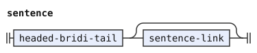</p>
<p>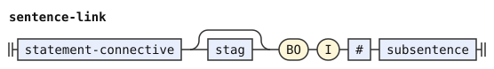</p>
<p>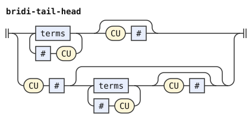</p>
<p>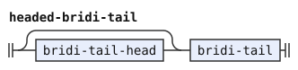</p>
<p>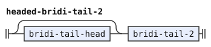</p>
<p>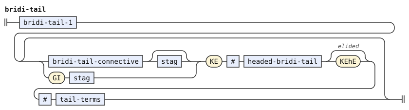</p>
<p>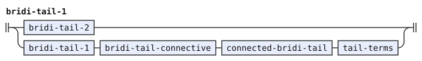</p>
<p>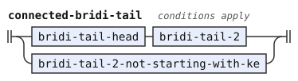</p>
<p>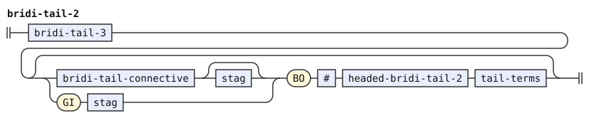</p>
<p>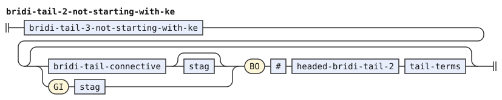</p>
<p>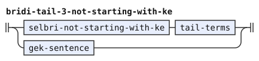</p>
<p>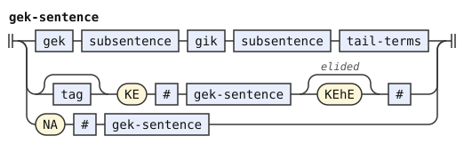</p>
<p>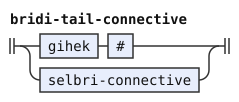</p>
<p>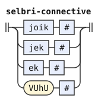</p>
<p>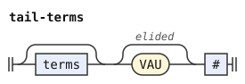</p>
</details>

## Terms

The layer joins terms at two levels. A connective, an optional stag and `bo` join terms into a `term-bo-group`. A plain connective joins those groups through `term-link`. So `bo` binds tighter: `broda be na ku .e bo na ku .a na ku` is `(na ku .e bo na ku) .a na ku`. The connectives are joik, jek, ek or VUhU (`term-connective`), so `mi joi do klama` has one term before its selbri.

The layer reads terms in two contexts. A `listed-term` stands in a sentence's head or tail terms, a prenex, a fragment or a `nu'i` termset. A tense or modal there cannot form a term if a selbri or gek-sentence follows its free modifiers. A bare `na` there cannot form a term where a selbri, gek-sentence or connective begins at it. A `term` follows `be`, `bei`, GOI, LAhE or NAhE, which each take one term.

A term in a branch of a bare forethought termset (`gek-terms`) also follows the single-term rules. These permit a following selbri or gek-sentence. So `mi pe na klama` has a bare `na` after `pe`.

After a plain term connective, two lookaheads, tests of following words, protect connections at other levels. The next group cannot begin with a stag and `bo` or `ke` before a selbri or a gek-sentence. It also cannot begin with a stag, `bo` and `.i`. These forms remain connections of bridi-tails and sentences.

`listed-term-bo-link` permits `bo` with or without a stag, as in `fa mi .e bo fe do klama`.

A connection that can be a sumti connection is one. Terms are connected only where the parts on the two sides of the connective cannot form one sumti. So `mi .e do klama` and `mi .e bo do klama` join two sumti. In `mi cadzu ca la pacac. bi'o la recac.`, the modal `ca` applies to one connected sumti. But `mi .e ca do klama` joins two terms, because `ca do` is a modal term and not a sumti.

Without this rule, each of the first three texts has two readings that elide the same terminators.

The rules `term` and `term-bo-group`, and their forms in a list of terms, state the rule. Each is left-recursive, so that its condition sees the part before a connective and the link after it. The condition refuses a link where the part before ends with a sumti that the connective can extend, and the link begins with a sumti. So the tree of three or more connected terms nests to the left, as they group.

Tags carry what the condition needs, so that it never parses the part before again. A tag `~link-extensible-end` says that a part ends with a sumti that a plain connective can extend. `~bo-extensible-end` says the same for a connective with `bo`. `~sumti-start` says that a link begins with a sumti. A tense or modal before the sumti keeps these tags. Each of these rules passes them up from its first or its last part.

`sumti-2` has both end tags, since a connective can always extend it. A `ke` group with a written `ke'e` has none, so `mi .e ke do ke'e .e ko'a klama` joins two terms. After `vu'o`, a plain connective can extend the sumti, but a connective with `bo` cannot. `$EXTENSIBLE-END` holds the two end tags.

A termset closed by a written `nu'u` is never a sumti for this rule, and a link that begins with one has no `~sumti-start`. So `mi .e ge do gi ti nu'u klama` joins two terms, the second a termset. Without `nu'u`, `mi .e ge do gi ti klama` joins two sumti, since the termset reading elides `nu'u`.

`pe'e` takes any statement connective. `terms-1` and its forethought form `gek-terms-1` are left chains. The added terms are bare `na` and a `soi` clause enabled by `soi-clause`. That clause contains a subsentence and ends with `se'u`. `fi'oi` and `xoi` are members of SOI.

A forethought termset needs no `nu'i`, and its two branches can hold different numbers of terms. The same words can often form a gek sumti or a termset.

The ranking prefers the sumti reading where both constructs can complete. The first branch of a termset, `termset-branch`, ends in `nu'u`, which the termset elides before `gi`. The sumti elides nothing there, so `late-elision` prefers it. So `ge mi gi do ce'e ti` is the sumti `ge mi gi do` followed by `ce'e ti`. But `broda be ge mi gi do ce'e ti be'o` has a termset, because the single argument of `be` cannot continue with `ce'e ti`.

The NUhI body ranks `gek-termset-body` before `terms-not-starting-with-bare-gek`. A qualified forethought body excludes a plain body over the same span. Thus `nu'i ge mi gi do nu'u` contains two termset branches. The excluded plain body wraps the connected sumti `ge mi gi do` inside NUhI. In `nu'i ge mi gi do ko'a klama`, the second branch contains `do ko'a`.

The first term inside the plain NUhI body cannot itself be a bare forethought termset. That restriction avoids repeating the forethought NUhI form.

NIhE keeps an ordinary elidable TEhU, so `ni'e broda` can end before `brode`. In `nu'i ge ni'e broda brode gi re mi nu'u klama`, the first branch contains one quantified sumti. NIhE supplies its quantifier, and `brode` supplies its predicate. The second branch contains `re mi`. In `nu'i ge ni'e broda brode gi re mi ko'a klama`, the second branch also contains `ko'a`.

The `-not-starting-with-bare-gek` rules state that restriction: they repeat the term rules with only the first term restricted. A chain repeats one item, so it cannot restrict only its first item. These rules write the restricted first item apart. `terms-1-not-starting-with-bare-gek` is left recursion, which groups as the chain `terms-1` does. The other two are a first item and an optional list, flat as `terms` and `terms-2` are.

```jbogenbau
%redefine-rule terms-1
  {... terms-2 \ PEhE # statement-connective}

%redefine-rule terms-2
  (* terms_2 <- abs_term (cehe_sa* CEhE_clause free* abs_term)* *)
  {listed-term \ CEhE #}

%redefine-rule term
  (* term_1 <- term_2 (joik_ek !tag_bo_ke_bridi_tail !tag_bo_subsentence term_2)* *)
  | term-bo-group
  | $t(term) $l(term-link) <tags($l) ∩ $EXTENSIBLE-END>
%conditions
  ~link-extensible-end ⊈ tags($t) ∨ ~sumti-start ⊈ tags($l)

%rule term-bo-group
  (* term_2 <- term_3 (joik_ek stag? BO_clause term_3)* *)
  | term-3
  | $g(term-bo-group) $l(term-bo-link) <(tags($g) ∩ ~sumti-start) ∪ (tags($l) ∩ $EXTENSIBLE-END)>
%conditions
  ~bo-extensible-end ⊈ tags($g) ∨ ~sumti-start ⊈ tags($l)

%rule term-bo-link
  term-connective [stag] BO # $u(term-3)
%tags
  tags($u) ∩ ($EXTENSIBLE-END ∪ ~sumti-start)

%rule term-link
  $c(term-connective) $g(term-bo-group)
%tags
  tags($g) ∩ ($EXTENSIBLE-END ∪ ~sumti-start)
%conditions
  ¬begins(after($c), tag-bo-ke-bridi-tail),
  ¬begins(after($c), tag-bo-subsentence)

%rule tag-bo-ke-bridi-tail
  (* tag_bo_ke_bridi_tail <- stag (BO_clause / KE_clause) CU_elidible free* (selbri / gek_sentence) *)
  stag (BO | KE) [CU] # (selbri | gek-sentence)

%rule tag-bo-subsentence
  (* tag_bo_subsentence <- stag BO_clause I_clause *)
  stag BO I

%rule term-connective
  joik # | jek # | ek # | VUhU #

%const $EXTENSIBLE-END ~link-extensible-end ∪ ~bo-extensible-end


%rule term-3
  (* term_3 <- sumti / tag_term / termset *)
  | $s(sumti) <tags($s) ∪ ~sumti-start>
  | tagged-term
  | termset
  | NA # KU #
  | bare-na
  | soi-clause? soi-term

%rule bare-na
  (* !gek !ek !joik_jek !gihek NA_clause free* KU_elidible free* *)
  $n(NA) #
%conditions
  ¬begins(from($n), na-connective)

%rule na-connective
  gek | ek | jek | joik | gihek

%rule soi-term
  SOI # subsentence [+SEhU] #

%rule tagged-term
  (* tag_term: !gek tag free* followed by a sumti or KU_elidible free* *)
  | $g(tag) $s(sumti) <tags($s) ∩ $EXTENSIBLE-END>
  | $g(tag) [+KU] #
%conditions
  ¬begins(from($g), gek)

%rule listed-term
  (* abs_term_1 <- abs_term_2 (joik_ek !tag_bo_ke_bridi_tail !tag_bo_subsentence abs_term_2)* *)
  | listed-term-bo-group
  | $t(listed-term) $l(listed-term-link) <tags($l) ∩ $EXTENSIBLE-END>
%conditions
  ~link-extensible-end ⊈ tags($t) ∨ ~sumti-start ⊈ tags($l)

%rule listed-term-bo-group
  (* abs_term_2 <- abs_term_3 (joik_ek stag BO_clause abs_term_3)*, with the stag optional *)
  | listed-term-3
  | $g(listed-term-bo-group) $l(listed-term-bo-link) <(tags($g) ∩ ~sumti-start) ∪ (tags($l) ∩ $EXTENSIBLE-END)>
%conditions
  ~bo-extensible-end ⊈ tags($g) ∨ ~sumti-start ⊈ tags($l)

%rule listed-term-bo-link
  term-connective [stag] BO # $u(listed-term-3)
%tags
  tags($u) ∩ ($EXTENSIBLE-END ∪ ~sumti-start)

%rule listed-term-link
  $c(term-connective) $g(listed-term-bo-group)
%tags
  tags($g) ∩ ($EXTENSIBLE-END ∪ ~sumti-start)
%conditions
  ¬begins(after($c), tag-bo-ke-bridi-tail),
  ¬begins(after($c), tag-bo-subsentence)

%rule listed-term-3
  (* abs_term_3 <- sumti / abs_tag_term / termset *)
  | $s(sumti) <tags($s) ∪ ~sumti-start>
  | listed-tagged-term
  | termset
  | NA # KU #
  | listed-bare-na
  | soi-clause? soi-term

%rule listed-tagged-term
  (* abs_tag_term: !gek tag free* !selbri !gek_sentence, then a sumti or an elided KU *)
  | $g(tag) $s(sumti) <tags($s) ∩ $EXTENSIBLE-END>
  | $g(tag) [+KU] #
%conditions
  ¬begins(from($g), gek),
  ¬begins(after($g), selbri-after-tag)

%rule selbri-after-tag
  # (selbri | gek-sentence)

%rule listed-bare-na
  (* !selbri !gek_sentence !ek !joik_jek !gihek NA_clause free* KU_elidible free* *)
  $n(NA) #
%conditions
  ¬begins(from($n), listed-na-follower)

%rule listed-na-follower
  selbri | gek-sentence | ek | jek | joik | gihek

%redefine-rule termset
  (* termset <- gek_termset / NUhI_clause free* gek terms NUhU_elidible free* gik terms NUhU_elidible free* / NUhI_clause free* terms NUhU_elidible free* *)
  | gek termset-branch gik gek-terms [+NUhU] #
  | termset-with-nuhi

%rule gek-termset-body
  (* NUhI_clause free* gek terms NUhU_elidible free* gik terms: tried before NUhI_clause free* terms *)
  gek terms [+NUhU] # gik terms

%rule termset-branch
  gek-terms [+NUhU] #

%rule gek-terms
  {gek-terms-1}

%rule gek-terms-1
  {... gek-terms-2 \ PEhE # statement-connective}

%rule gek-terms-2
  {term \ CEhE #}

%rule terms-not-starting-with-bare-gek
  terms-1-not-starting-with-bare-gek [{terms-1}]

%rule terms-1-not-starting-with-bare-gek
  | terms-2-not-starting-with-bare-gek
  | terms-1-not-starting-with-bare-gek PEhE # statement-connective terms-2

%rule terms-2-not-starting-with-bare-gek
  listed-term-not-starting-with-bare-gek [{CEhE # listed-term}]

%rule listed-term-not-starting-with-bare-gek
  | listed-term-bo-group-not-starting-with-bare-gek
  | $t(listed-term-not-starting-with-bare-gek) $l(listed-term-link) <tags($l) ∩ $EXTENSIBLE-END>
%conditions
  ~link-extensible-end ⊈ tags($t) ∨ ~sumti-start ⊈ tags($l)

%rule listed-term-bo-group-not-starting-with-bare-gek
  | listed-term-3-not-starting-with-bare-gek
  | $g(listed-term-bo-group-not-starting-with-bare-gek) $l(listed-term-bo-link) <(tags($g) ∩ ~sumti-start) ∪ (tags($l) ∩ $EXTENSIBLE-END)>
%conditions
  ~bo-extensible-end ⊈ tags($g) ∨ ~sumti-start ⊈ tags($l)

%rule listed-term-3-not-starting-with-bare-gek
  | $s(sumti) <tags($s) ∪ ~sumti-start>
  | listed-tagged-term
  | termset-with-nuhi
  | NA # KU #
  | listed-bare-na
  | soi-clause? soi-term

%rule termset-with-nuhi
  NUhI # (gek-termset-body ≻ terms-not-starting-with-bare-gek) [+NUhU] #
```

<details><summary>Railroad diagrams of the 36 rules from <code>terms-1</code> to <code>termset-with-nuhi</code></summary>
<p>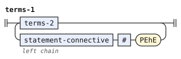</p>
<p>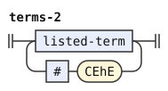</p>
<p>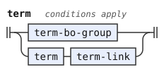</p>
<p>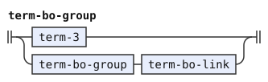</p>
<p>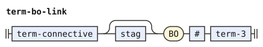</p>
<p>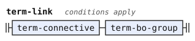</p>
<p>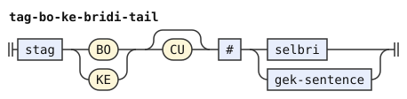</p>
<p>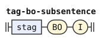</p>
<p>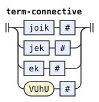</p>
<p>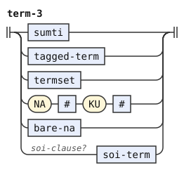</p>
<p>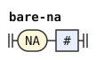</p>
<p>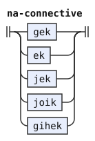</p>
<p>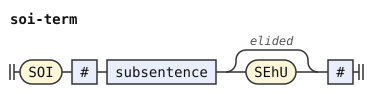</p>
<p>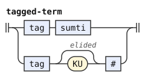</p>
<p>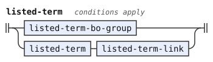</p>
<p>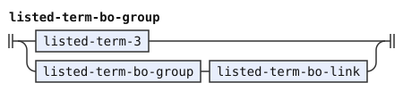</p>
<p>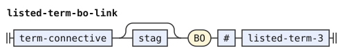</p>
<p>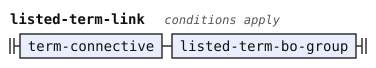</p>
<p>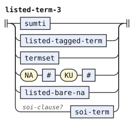</p>
<p>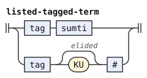</p>
<p>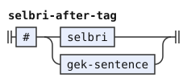</p>
<p>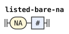</p>
<p>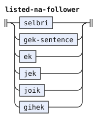</p>
<p></p>
<p></p>
<p></p>
<p></p>
<p></p>
<p></p>
<p></p>
<p></p>
<p></p>
<p></p>
<p></p>
<p></p>
<p></p>
</details>

## Sumti

Sumti connectives are ek, joik, jek or VUhU (`sumti-connective`). This change and the new mekso below leave the CLL rule `joik-ek` unused. After `vu'o`, a connected sumti can follow the relative clauses or replace them, and `vu'o` can also end the sumti (`mi vu'o`). Under `cbm` a cmevla is a selbri word, so the layer removes the `la CMEVLA` name form, and `la .alis.` is a description. That form begins with `la`, `lai` or `la'i`, which are words of LE here, and `name-marker` names them by their sound. The new sumti are these:

- `na'e` and `lu'u` surround a sumti, without `bo`.
- `la'e` or `na'e bo` around a term that is not a sumti, such as `na ku` or a tense or modal with its sumti or `ku`
- `na'e` around a term that is neither a sumti nor a tense or modal with its sumti or `ku`, such as `na ku`
- `lo'oi` and `ku'au` surround a subsentence as a description.
- The single-word quotes `zo'oi`, `la'oi` and `ra'oi`, whose bodies the word stage delimits

A bare NAhE cannot wrap one tagged term, even when that term omits KU. The pattern tests the actual `tagged-term` constructor. A connected term can begin with such a term, as in `na'e pu ku .e na ku lu'u`. This grammar also accepts `mi na'e pu .e ca lu'u klama`, with both inner KUs omitted.

The inner sumti of a description can be any sumti, including a connected one, as in `lo mi .e do broda`. It cannot use the quantified constructor. Thus `lo re mi broda` contains `lo re mi` and the selbri `broda`.

`quantifier-head` lists the selma'o that can begin a quantifier. A quantifier can also begin with a forethought connective, as in `lo ge pa gi re mi broda`. `$QUANTIFIED-SUMTI` tests that actual quantified constructor, with optional relative clauses.

A description can take a forethought sentence in place of a selbri, and so can a quantifier without a descriptor. Examples are `le ga mi klama gi do klama ku` and `re ga mi klama gi do klama ku`.

```jbogenbau
%const $QUANTIFIED-SUMTI @(quantifier sumti-6 [relative-clauses])

%redefine-rule sumti
  | sumti-1
  | sumti-1 VUhO # [relative-clauses] <~link-extensible-end>
  | sumti-1 VUhO # [relative-clauses] sumti-connective $i(sumti) <tags($i) ∩ $EXTENSIBLE-END>

%redefine-rule sumti-1
  | sumti-2
  | sumti-2 sumti-connective [stag] KE # $i(sumti) [+KEhE] # <KEhE ⊈ tags(head(after($i))) ⟹ tags($i) ∩ $EXTENSIBLE-END>

%redefine-rule sumti-2
  {... sumti-3 \ sumti-connective}
%tags
  $EXTENSIBLE-END

%redefine-rule sumti-3
  {sumti-4 ... \ sumti-connective [stag] BO #}

%rule sumti-connective
  ek # | joik # | jek # | VUhU #

%redefine-rule sumti-5
  [quantifier] sumti-6 [relative-clauses] | quantifier (selbri | gek-sentence) [+KU] # [relative-clauses]

%redefine-rule sumti-6
  | (LAhE # | NAhE BO # | NAhE #) [relative-clauses] sumti [+LUhU] #
  | (LAhE # | NAhE BO #) $t(term) [+LUhU] #
  | NAhE # $u(term) [+LUhU] #
  | KOhA #
  | lerfu-string free-after-lerfu-string
  | ¬cbm? name-marker # [relative-clauses] {CMEVLA} #
  | LE # sumti-tail [+KU] #
  | LOhOI # subsentence [+KUhAU] #
  | LI # mex [+LOhO] #
  | ZO any-word #
  | LU text [+LIhU] #
  | LOhU [{any-word}] LEhU #
  | ZOI any-word anything any-word #
  | ZOhOI anything #
%conditions
  $t ≇ @(sumti),
  $u ≇ @(sumti),
  $u ≇ @(tagged-term)

%redefine-rule sumti-tail
  | $s(sumti) sumti-tail-1
  | sumti-tail-1
  | relative-clauses sumti-tail-1
  | gek-sentence
%conditions
  ¬matches(head($s), quantifier-head),
  $s ≇ $QUANTIFIED-SUMTI

%rule quantifier-head
  PA | VEI | NIhE | MOhE | PEhO | FUhA
```

<details><summary>Railroad diagrams of the 9 rules from <code>sumti</code> to <code>quantifier-head</code></summary>
<p></p>
<p></p>
<p></p>
<p></p>
<p></p>
<p></p>
<p></p>
<p></p>
<p></p>
</details>

## Relative clauses

Consecutive relative clauses can be joined by a joik, a jek or an ek, as well as by `zi'e`. Two groups of them can be connected in forethought (`ge poi broda gi poi brode`).

```jbogenbau
%redefine-rule relative-clauses
  | {relative-clause \ ZIhE # | joik # | jek # | ek #}
  | gek relative-clauses gik relative-clauses

%redefine-rule relative-clause
  GOI # term [+GEhU] # | NOI # subsentence [+KUhO] #
```

<details><summary>Railroad diagrams of <code>relative-clauses</code> and <code>relative-clause</code></summary>
<p></p>
<p></p>
</details>

## Selbri and tanru

Selbri and tanru-unit connectives are joik, jek, ek or VUhU (`selbri-connective`). A bare `fa`, which matches the rule `tag`, can come before a selbri. The term after `be` or `bei` can be absent. The new tanru units are a cmevla, under `cbm`, and preposed linked arguments (`lo be mi broda`). `me'oi` with the word that it quotes is a tanru unit too (`le me'oi klama cu broda`).

`me-unit` ranks a sumti operand before a mekso operand. A sumti whose tests and conditions pass excludes a mekso over the same span. A sumti that cannot complete the construction excludes nothing.

The whole `mex MOI #` construction outranks an SE conversion over the same span. A mekso can begin with SE through a forethought `gek`, as in `mi se ga pa gi re moi`.

NAhE stays outside this group. Late elision puts `na'e` on `pa moi` in `la djonz. cu na'e pamoi cusku`, because the mekso option omits LUhU earlier.

In `mi me la'e ge my gi ny su'i zy moi`, ME takes the complete sumti operand. Its LAhE holds the forethought sumti and the following connection.

`selbri-4` keeps the left recursion of the CLL rule, and `selbri-5` is a right chain. In the plain form of `selbri-4`, the connective is `plain-selbri-connective`, the CLL rule `plain-joik-jek` with this layer's connectives. As in CLL, a joik directly before `ke` is `joik-before-ke`, and its unit cannot be only a `ke` group. So `mi broda joi ke brode ke'e` joins a `ke` group with `joi`, through `joik [stag] KE`.

Where only the plain reading parses, the layer keeps it. So `mi broda joi ke brode ke'e bo brodi` joins `broda` to the unit `ke brode ke'e bo brodi`.

The inherited `$KE-UNIT` pattern tests the actual KE constructor. `tanru-unit` uses one repetition with optional relative clauses. Additional children prevent the single-child match, as in the CLL grammar.

A group of preposed linked arguments comes before a whole `tanru-unit-1`. A `be` group attaches to the tanru unit before it, where there is one. So a unit without a group of its own cannot be directly followed by `be` (`tanru-unit-1`). A preposed group stands only where no such unit comes before it, as at the start of a selbri or after a connective.

So `zdani be mi vorme` gives `be mi` to `zdani`, and `le tutci be sigdanva le marna` gives an empty `be` group to `tutci`. Without the rule, each text has two readings that elide the same terminators.

In `be mi klama be do be ti`, `be do` belongs to `klama`, and `be ti` to the whole unit. In `be mi klama be do`, `be do` belongs to `klama`. The whole unit cannot take it, because `klama` then stands directly before `be`.

A tanru unit can take a selbri relative clause. The clause opens with `no'oi`, contains a subsentence, and ends with `ku'oi`. In that clause, `ke'a` refers to the selbri, as in `mi klama no'oi bajra`. They are joined as relative clauses are: by `zi'e`, a joik, a jek or an ek, or two groups of them in forethought.

```jbogenbau
%redefine-rule selbri-4
  | selbri-5
  | selbri-4 plain-selbri-connective selbri-5
  | selbri-4 joik-before-ke selbri-5-not-ke-group
  | selbri-4 joik [stag] KE # selbri-3 [+KEhE] #

%rule plain-selbri-connective
  | $j(joik) #
  | jek #
  | ek #
  | VUhU #
%conditions
  KE ⊈ tags(head(after($j)))

%redefine-rule selbri-5
  {selbri-6 ... \ selbri-connective [stag] BO #}

%rule selbri-not-starting-with-ke
  [tag] selbri-1-not-starting-with-ke

%rule selbri-1-not-starting-with-ke
  selbri-2-not-starting-with-ke | NA # selbri

%rule selbri-2-not-starting-with-ke
  selbri-3-not-starting-with-ke [CO # selbri-2]

%rule selbri-3-not-starting-with-ke
  selbri-4-not-starting-with-ke | selbri-3-not-starting-with-ke selbri-4

%rule selbri-4-not-starting-with-ke
  | selbri-5-not-starting-with-ke
  | selbri-4-not-starting-with-ke plain-selbri-connective selbri-5
  | selbri-4-not-starting-with-ke joik-before-ke selbri-5-not-ke-group
  | selbri-4-not-starting-with-ke joik [stag] KE # selbri-3 [+KEhE] #

%rule selbri-5-not-starting-with-ke
  selbri-6-not-starting-with-ke [selbri-connective [stag] BO # selbri-5]

%rule selbri-6-not-starting-with-ke
  tanru-unit-not-starting-with-ke [BO # selbri-6] | [NAhE #] guhek selbri gik selbri-6

%redefine-rule tanru-unit
  {tanru-unit-1 \ CEI #} [selbri-relative-clauses]

%redefine-rule tanru-unit-1
  | $u(tanru-unit-2)
  | tanru-unit-2 linkargs
%conditions
  BE ⊈ tags(head(after($u)))

%redefine-rule tanru-unit-2
  | KE # selbri-3 [+KEhE] #
  | BRIVLA #
  | cbm? CMEVLA #
  | GOhA [RAhO] #
  | me-unit
  | (mex MOI # ≻ SE # tanru-unit-2)
  | NUhA # operator
  | JAI # [tag] tanru-unit-2
  | NAhE # tanru-unit-2
  | abstractor-chain subsentence [+KEI] #
  | linkargs tanru-unit-1
  | MEhOI anything #

%rule me-unit
  ME # (sumti ≻ mex) [+MEhU] # [MOI #]

%rule tanru-unit-not-starting-with-ke
  tanru-unit-1-not-starting-with-ke [{CEI # tanru-unit-1}] [selbri-relative-clauses]

%rule tanru-unit-1-not-starting-with-ke
  | $u(tanru-unit-2-not-starting-with-ke)
  | tanru-unit-2-not-starting-with-ke linkargs
%conditions
  BE ⊈ tags(head(after($u)))

%rule tanru-unit-2-not-starting-with-ke
  | BRIVLA #
  | cbm? CMEVLA #
  | GOhA [RAhO] #
  | me-unit
  | (mex MOI # ≻ SE # tanru-unit-2)
  | NUhA # operator
  | JAI # [tag] tanru-unit-2
  | NAhE # tanru-unit-2
  | abstractor-chain subsentence [+KEI] #
  | linkargs tanru-unit-1
  | MEhOI anything #

%rule selbri-relative-clauses
  | {selbri-relative-clause \ ZIhE # | joik # | jek # | ek #}
  | gek selbri-relative-clauses gik selbri-relative-clauses

%rule selbri-relative-clause
  NOhOI # subsentence [+KUhOI] #

%redefine-rule linkargs
  BE # [term] [links] [+BEhO] #

%redefine-rule links
  BEI # [term] [links]
```

<details><summary>Railroad diagrams of the 21 rules from <code>selbri-4</code> to <code>links</code></summary>
<p></p>
<p></p>
<p></p>
<p></p>
<p></p>
<p></p>
<p></p>
<p></p>
<p></p>
<p></p>
<p></p>
<p></p>
<p></p>
<p></p>
<p></p>
<p></p>
<p></p>
<p></p>
<p></p>
<p></p>
<p></p>
</details>

## Numbers, lerfu strings and mekso

The layer reads mekso with the rules below. No reachable rule calls `operand`, `operand-1` to `operand-3` or `rp-operand`. The forms are these:

- A number is a run of PA words, `ni'e` selbri and `mo'e` sumti, with no lerfu word in it. A lerfu string is a run of lerfu words, with no PA word in it. So `li pa by` is two terms, and `mi viska cy no` is not a text.
- `mex-2` reads a number, a lerfu string, a `vei` group, a forethought connection, or a `la'e` or `na'e` reference. It can also be a `pe'o` forethought expression or a reverse Polish expression. The operands `ni'e` and `mo'e` are inside numbers. There is no `jo'i` array, although the lexicon has `jo'i`.
- `bo` after an operator, with an optional tense or modal, groups two operands tighter (`li pa su'i bo re`). There is no `bi'e`, and a forethought operator needs `pe'o`.
- An operator can be a connective, a joik, jek or ek. A joik or jek operator has one slot of free modifiers, the one at the end of `joik-jek`.
- `operator` joins operators with the CLL rules `plain-joik-jek` and `joik-before-ke`. So `li ci su'i joi ke pi'i ke'e re du li xa` joins `su'i` to the operator's own `ke` group. Where the operator goes on after its `ke` group, as in `ke pi'i ke'e je bo vu'u`, only the plain reading parses. The layer keeps it.
- A quantifier is a whole mekso, `pa su'i re broda`. It cannot begin with a lerfu word, `la'e` or `na'e`, where the grammar reads a sumti. It also cannot begin where a selbri begins. So in `mi piso'umei jimpe`, `pi so'u mei jimpe` is the selbri, and not a quantifier of a description.
- A quantifier also cannot begin with a forethought connection whose first half begins with one of those words. The rule `gek-barrier` finds such a start, also inside a nested connection. So in `ge nai abu gi no drata`, `ge nai ... gi` joins the two sumti `abu` and `no drata`. The quantifier `ge nai abu gi no` over `drata` is not a reading. In the same way, `ge ge abu gi by gi no drata` joins two sumti, and the first one connects `abu` and `by`.
- A forethought connection of numbers can form a quantifier, as in `lo ge pa gi re mi broda`.
- Where no sumti reading remains, `gek-barrier` rejects the text, as in `ge abu gi by broda cu klama`. In `lo ge by gi re mi broda`, `ge by gi re mi` is the possessor sumti, with `broda` inside the description.
- `me` takes a mekso as well as a sumti, a whole mekso takes `moi`, and `nu'a` takes a whole operator.

`mex` is the chain of operators itself, a left chain. So the CLL rule `mex-chain` is not reached here. A reverse Polish expression is not an infix chain, and stays a flat list. `operator` keeps the left recursion of the CLL rule.

A number is followed by `free-after-number`, and a lerfu string by `free-after-lerfu-string`, defined under "Free modifiers", and not by a plain `#`.

```jbogenbau
%redefine-rule quantifier
  (* quantifier <- !selbri !sumti_6 mex *)
  $m(mex)
%conditions
  ¬matches(head($m), quantifier-barrier),
  ¬begins(from($m), gek-barrier),
  ¬begins(from($m), selbri)

%rule quantifier-barrier
  BY | LAU | TEI | LAhE | NAhE

%rule gek-barrier
  gek (quantifier-barrier | gek-barrier)

%redefine-rule mex
  {... mex-1 \ operator}

%redefine-rule mex-1
  mex-2 [operator [stag] BO # mex-1]

%redefine-rule mex-2
  | number free-after-number
  | lerfu-string free-after-lerfu-string
  | VEI # mex [+VEhO] #
  | gek mex gik mex-2
  | (LAhE # | NAhE # [BO #]) mex [+LUhU] #
  | PEhO # operator {mex} [+KUhE] #
  | FUhA # rp-expression

%redefine-rule rp-expression
  mex-1 [{rp-expression operator}]

%redefine-rule operator
  | operator-1
  | operator plain-joik-jek operator-1
  | operator joik-before-ke operator-1-not-ke-group
  | operator joik [stag] KE # operator [+KEhE] #

%redefine-rule operator-2
  | mex-operator
  | KE # operator [+KEhE] #

%redefine-rule mex-operator
  | SE # mex-operator
  | NAhE # mex-operator
  | MAhO # mex [+TEhU] #
  | NAhU # selbri [+TEhU] #
  | VUhU #
  | joik-jek
  | ek #

%redefine-rule number
  {number-part}

%rule number-part
  PA | NIhE # selbri [+TEhU] # | MOhE # sumti [+TEhU] #

%redefine-rule lerfu-string
  {lerfu-word}
```

<details><summary>Railroad diagrams of the 13 rules from <code>quantifier</code> to <code>lerfu-string</code></summary>
<p></p>
<p></p>
<p></p>
<p></p>
<p></p>
<p></p>
<p></p>
<p></p>
<p></p>
<p></p>
<p></p>
<p></p>
<p></p>
</details>

## Logical and non-logical connectives

The indicator stage attaches every NAI after these connectives, so no separate `nai` reaches the syntax at those positions.

A joik permits `na` before a word of JOI. So `mi na joi do klama` has one term, `mi na joi do`. The condition of `listed-bare-na` excludes a bare `na` term here. The words can connect sumti or terms, and the term conditions keep the sumti reading.

A forethought connective can be `ga` or `gu` followed by a joik, jek, ek or VUhU, as in `ga je lo mlatu gi lo gerku`. With `ga`, it is a gek. With `gu`, it is a guhek, as in `mi gu je melbi gi kargydu'e`. The connective before `gi` in a gek can also be a jek or an ek (`je gi mi broda gi mi brode`). A gihek can be `gi` followed by a word of JOI, JA or A (`mi klama gi je tavla`).

The rules name the two words by their sound, `GA="ga"` and `GA="gu"`, which ignores stress. They keep the class GA, because a word that `zo` quotes has the sound but not the class.

```jbogenbau
%redefine-rule joik
  [NA] [SE] JOI | interval | GAhO interval GAhO

%redefine-rule gek
  | [SE] GA #
  | GA="ga" # (joik # | jek # | ek # | VUhU #)
  | (joik | jek | ek) GI #
  | stag gik

%redefine-rule guhek
  | [SE] GUhA #
  | GA="gu" # (joik # | jek # | ek # | VUhU #)

%redefine-rule gihek
  [NA] [SE] (GIhA | GI (JOI | JA | A))
```

<details><summary>Railroad diagrams of <code>joik</code>, <code>gek</code>, <code>guhek</code> and <code>gihek</code></summary>
<p></p>
<p></p>
<p></p>
<p></p>
</details>

## Tenses and modals

A tense or modal (the rule `tag`) is a run of atoms: `pu ba vi ca`, `ki ba`. So nothing reads the CLL rules `simple-tense-modal`, `time`, `time-offset`, `space`, `space-offset`, `space-interval`, `space-int-props` and `interval-property`. Each atom can have `na'e` and `se` before it, and free modifiers after it: `na'e pu na'e ca`, `jai se ki broda`. An atom is one of these:

- A word of BAI, CAhA, CUhE, KI, ZI, PU, VA, ZEhA, VEhA or VIhA
- A word of FAhA, with an optional `mo'i` before it
- A word of ROI after a number or a `vei` group, with an optional `fe'e` before them
- A word of TAhE or ZAhO, with an optional `fe'e` before it
- `fi'o` with a selbri

A joik, jek, ek or VUhU connects tenses and modals, and `tag` is a left chain of them. A run of atoms is a flat list, since nothing connects them. A `stag` is a `tag`. So a stag can be a run of atoms (`ko'a .e pu ba bo ko'e broda`). It can also be a `fi'o` selbri (`mi klama .i fi'o broda fe'u bo do klama`).

`fa` is an atom too, and it is the only way a place marker enters the grammar. So `fa` alone matches `tag` wherever that rule can stand: before a sumti (`fa mi`), a selbri (`mi fa klama`) or `bo`, and after `jai` (`jai fa broda`). It can be converted like a modal (`se fa`) or joined to other atoms (`mi fa pu klama`).

```jbogenbau
%redefine-rule tag
  {... tense-modal \ tag-connective}

%redefine-rule stag
  tag

%rule tag-connective
  joik # | jek # | ek # | VUhU #

%redefine-rule tense-modal
  {tense-atom}

%rule tense-atom
  | [NAhE] [SE] (BAI | CAhA | CUhE | KI | ZI | PU | VA | [MOhI] FAhA | ZEhA | VEhA | VIhA) #
  | [NAhE] [SE] [FEhE] ((number | VEI # mex [+VEhO] #) ROI | TAhE | ZAhO) #
  | [NAhE] [SE] FIhO # selbri [+FEhU] #
  | [NAhE] [SE] FA #
```

<details><summary>Railroad diagrams of the 5 rules from <code>tag</code> to <code>tense-atom</code></summary>
<p></p>
<p></p>
<p></p>
<p></p>
<p></p>
</details>

## Free modifiers, vocatives and indicators

A replacement quote is a free modifier. It has up to two runs of words, each opened by a word of LOhAI (`lo'ai` or `sa'ai`), and then `le'ai`. The word stage reads the words inside as raw words ([`../words/lohai.md`](../words/lohai.md)).

`soi` is a free modifier here only without `soi-clause`. Under `cbm`, the layer removes the form of a vocative with a run of names, because a cmevla is then a selbri word. With both forms, their two readings tie.

`free-after-number` and `free-after-lerfu-string` follow a number or a lerfu string. Each is an optional `boi` and the free-modifier slot. Where the `boi` is elided, the first free modifier does not begin with a word that the number or the string can read. After a number, that is a number part. After a lerfu string, it is a letter.

So `pa so mo'o` is the number `pa so`, and not `pa` followed by the ordinal `so mo'o`. But `li pa by mai lo'o` has the free modifier `by mai`. The elided `boi` is an elided node of the tree.

A subscript after a subscript nests. The second subscript belongs to the first.[^cll-s18-13] So in `xa xi xa xi xa`, the first `xa` has one subscript, and that subscript has its own. The condition on the `xi` form of `free` says that no `xi` directly follows the mekso of a subscript. Every mekso ends with a slot of free modifiers, so the nested reading is always there.

Without the rule, the two readings elide the same terminators.

A non-XI modifier in the subscript operand's final free slot attaches to the marked word. In `mi broda xi pa boi to do toi`, the subscript and parenthesis both belong to `broda`.

The second condition on XI tests `$FREE-ENDING` along the actual last-child path. That pattern finds a final free slot with a `$NON-XI-FREE` modifier. A modifier inside a terminated operand stays there, even when its terminator is omitted. An omitted closer stops the path only when no later child remains. A nonempty free slot after the closer remains the exposed final slot, as in `[+VEhO] #` or `[+BOI] #`. A written closer before the modifier leaves it in the exposed final slot.

The conditions exclude an exposed modifier attachment when the modifier belongs to the marked word. They keep a modifier inside VEI, LAhE, or PEhO when the actual constructor boundary follows that modifier.

```jbogenbau
%const $NON-XI-FREE @(free) ∖ @(XI ⋯)
%const $FREE-ENDING @(⋱ (# ∩ @(⋯ $NON-XI-FREE ⋯)))

%redefine-rule free
  | SEI # [terms [CU #]] selbri [+SEhU]
  | vocative [relative-clauses] selbri [relative-clauses] [+DOhU]
  | ¬cbm? vocative [relative-clauses] {CMEVLA} # [relative-clauses] [+DOhU]
  | vocative [sumti] [+DOhU]
  | mex-2 MAI
  | TO text [+TOI]
  | XI # $m(mex-2)
  | LOhAI [{lohai-word}] [LOhAI [{lohai-word}]] LEhAI
  | LEhAI
  | ¬soi-clause? SOI # sumti [sumti] [+SEhU]
%conditions
  XI ⊈ tags(head(after($m))),
  $m ≇ $FREE-ENDING

%rule name-marker
  LE="la" | LE="lai" | LE="la'i"

%rule free-after-number
  (* number BOI_elidible free*: after an elided boi, the number has read every number part *)
  [+BOI] $f(#)
%conditions
  begins($, spoken-boi) ∨ ¬begins($f, number-part)

%rule free-after-lerfu-string
  (* lerfu_string BOI_elidible free*: after an elided boi, the string has read every letter *)
  [+BOI] $f(#)
%conditions
  begins($, spoken-boi) ∨ ¬begins($f, lerfu-word)

%rule spoken-boi
  BOI

%rule lohai-word
  ~word∩(LOhAI ∪ LEhAI)=∅
```

<details><summary>Railroad diagrams of the 6 rules from <code>free</code> to <code>lohai-word</code></summary>
<p></p>
<p></p>
<p></p>
<p></p>
<p></p>
<p></p>
</details>

## Choosing among parses

Where a text has more than one parse, the stage follows [the notation document](../../docs/notation.md), under "Ranked choices", "Ambiguity", and "Elided terminators". A ranked choice filters alternatives at one written position. The stage ranks admitted derivations by `leftmost-longest`, then `late-elision`. `late-elision` counts the omitted terminators of each admitted derivation at each boundary. Fewer omitted terminators win at the first differing boundary. Two best derivations with equal counts at every boundary tie, and a tie is an error.

For example, `le sutra tavla` has two parses. One is a statement with the description `le sutra`, whose `ku` is elided before `tavla`, and the selbri `tavla`. The other is a fragment, the single description `le sutra tavla`, whose `ku` is elided at the end. `late-elision` takes the fragment, as in the CLL grammar.

## Differences from CLL and camxes-exp

camxes-exp, the experimental PEG (parsing expression grammar), is this layer's reference. A PEG tries alternatives in order. This layer considers complete readings and uses conditions or ranked choices to select among them. Its constructs developed after CLL.

The experimental lexicon follows camxes-exp's classes, including the classes absent from CLL. This layer never reads a CLL class that camxes-exp lacks, such as LA. The experimental dialect enables `cbm` and `soi-clause` because camxes-exp cannot disable them. A caller can disable either here. With `soi-clause` off, `soi` retains CLL's reciprocity form.

The layer writes `[+X] #` where CLL writes `[+X #]`. This permits free modifiers after omitted terminators and explains many restated rules. The number and lerfu conditions preserve maximal runs despite that extra slot. camxes-exp also reads those runs as far as possible. Both grammars give the sentence reading to `to mi klama` and `lu mi klama`.

The layer omits `elision-only` because some ambiguities concern constructs rather than terminators. camxes-exp settles those by alternative order. Here, the connective, term, linked-argument and subscript conditions settle them explicitly. The experimental terminators `ku'au` and `ku'oi` remain elidable, like CLL's terminators.

### Text and sentence connections

camxes-exp's joik includes A, so an ek can follow a text-leading `.i`. CLL instead reads `.i e` as `.i` before an ek fragment. CLL accepts `mi .i e` and `mi .i e .i do klama`. This layer rejects them because `.i e` requires a preceding statement, and `mi` is a fragment. It accepts `.i e .i mi klama`, `.i e .i e mi klama` and `.i e .ije mi klama`, as camxes-exp does.

A bare jek answers `je'i` in CLL's text-initial connective slot. Therefore CLL reads `.ije` as a connective. This layer applies the same choice to `.i e`, which agrees with camxes-exp. Both references keep `.i gi'e` and `mi klama .i gi'e` as fragment answers.

A free modifier can still separate `.i` from an ek fragment. Neither grammar permits bare `ge'i` or `gu'i` answers.[^cll-s14-13][^cll-e14-105] Both reject `.i e gi mi gi do` and `mi klama .i je gi mi gi do` because `.i` takes the initial connective.

The `.i ni'o` form extends the repaired initial CLL form to later topic boundaries, as usage puts a new topic inside a reply. A final `ni'o` also follows camxes-exp. With `cbm` on, neither grammar permits a text-leading run of address names. With it off, this layer retains CLL's form.

This layer keeps CLL's initial connective in `je mi klama`. camxes-exp contains the form, but its empty `paragraphs` makes `(!text_1 joik_jek)?` fail. Its PEG therefore rejects the text.

The statement connectives follow camxes-exp, including `mi klama joi .i do klama` and `mi klama .e pu bo .i do klama`. Prenexes can be empty. Statement and bridi-tail connections retain CLL's left grouping.[^cll-s14-7][^cll-s14-10] Bare `na` instead forms a term, which removes CLL's duplicate fragment alternative.

camxes-exp names its heads before bridi-tails JACU, after a proposal for simpler connectives. This layer permits the same heads and protects the same `gi'e ke` and `gi'e ba ke` boundaries. camxes-exp uses lookahead after its gihek. This layer tests the actual head pattern and following input.

### Terms and descriptions

The two levels of term connection correspond to camxes-exp's `term_1` and `term_2`. Its `joik_ek` and `joik_jek` include JOI, JA, A and VUhU. This layer uses those classes for term, sumti and selbri connectives too. Its listed terms correspond to `abs_tag_term`, while single terms and bare forethought branches correspond to `tag_term`. The latter has no `!selbri` or `!gek_sentence` lookahead. The two lookaheads after a plain term connective preserve connections of bridi-tails and sentences.

camxes-exp requires a stag before `bo` in `abs_term_2`. This layer permits its omission, so `fa mi .e bo fe do klama` parses here and fails there. camxes-exp prefers sumti over term connections by trying sumti first. This layer uses conditions because the competing readings elide the same terminators. Both therefore prefer the sumti when both readings complete.

Bare forethought termsets can have unequal branch lengths here, as CLL's bracketed termsets can. camxes-exp pairs the branches term by term. Where a forethought sumti also completes, its earlier choice agrees with this layer's elision ranking. The termset omits NUhU before GI, while the sumti omits nothing there.

Inside NUhI, this layer ranks the complete forethought body first. In `nu'i ge ni'e broda brode gi re mi nu'u klama`, NIhE can close before `brode`, which becomes the quantified sumti's predicate. camxes-exp greedily keeps `broda brode` inside NIhE and takes the plain body. This layer revisits inner choices when a whole construction needs them.

camxes-exp excludes every bare NAhE operand that starts with a tense or modal because `na'e pu` matches `tag`. This layer excludes only one actual tagged term, whose tag reading duplicates it. A connection of terms remains possible, even with omitted KUs.

The description's possessor can be any unquantified sumti. camxes-exp also reads an initial quantifier as `quantifier` followed by `sumti`. Thus `lo re mi broda` contains `lo re mi` followed by the selbri `broda`. Forethought sentences in descriptions follow camxes-exp's `sumti_tail` and `sumti_5`.

### Tanru and linked arguments

`me-unit` preserves camxes-exp's preference for sumti before mekso over the same span. It keeps the complete sumti in `mi me la'e ge my gi ny su'i zy moi`. camxes-exp's restrictive sumti lookahead instead takes a mekso. In `me my moi`, this layer takes a sumti and camxes-exp takes a mekso. This layer accepts `me my su'i pa` as mekso, while camxes-exp commits to a shorter sumti and rejects it.

After a joik directly before KE, this layer prefers the connective's KE group, as CLL does. camxes-exp first takes a plain connective before a KE tanru unit. In `mi broda joi ke brode ke'e`, both readings group the same words. Where only the plain reading completes, both grammars keep it. The official CLL lexer instead rejects `mi broda joi ke brode ke'e bo brodi`.

Preposed linked arguments follow camxes-exp. This layer, camxes-exp and camxes-std give a `be` group to the preceding unit when one exists. Thus `zdani be mi vorme` gives `be mi` to `zdani`, and `le tutci be sigdanva le marna` gives an empty group to `tutci`. The alternative attachments elide the same terminators. In `be mi klama be do`, both this layer and camxes-exp give `be do` to `klama`.

### Mekso and connectives

The mekso rules follow camxes-exp.peg from `quantifier` through `lerfu_string`. They leave CLL's operand rules and `rp-operand` unreachable. The new `mex` replaces `mex-chain` and retains CLL's left grouping.[^cll-s18-5] Reverse Polish expressions remain flat lists. NIhE and MOhE appear inside numbers. camxes-exp lists `jo'i` only in unreachable operand rules, so both grammars reject `li jo'i pa re te'u`.

A joik or jek operator has one effective free slot in both grammars. camxes-exp never reads the second `free*`. Its plain-first choice also reads `joi` before a KE operator, where this layer prefers the operator connective's KE group. Both keep the plain reading when the operator continues after that group, as in `ke pi'i ke'e je bo vu'u`.

The quantifier restrictions follow camxes-exp's `!sumti_6` and `!selbri`. The layer extends the sumti barrier into forethought connections. CLL also gives `ge nai abu gi no drata` a sumti reading because its quantifiers are numbers or VEI groups. camxes-exp instead takes the quantifier `ge nai abu gi no` before `drata`, as in `re prenu`.

Where no sumti reading remains, this layer and CLL reject `ge abu gi by broda cu klama`. camxes-exp takes the quantifier `ge abu gi by`. In `lo ge by gi re mi broda`, this layer takes `ge by gi re mi` as the possessor. camxes-exp takes `ge by gi re` as the quantifier of `mi`. Numeric forethought quantifiers remain possible, as in `lo ge pa gi re mi broda`.

The connective rules omit camxes-exp's optional NAI because the indicator stage attaches those words first. The inherited CLL `[NAI]` items receive no separate token there. The joik's initial NA, extended forethought forms, gihek forms, atomic tenses and FA atom follow camxes-exp. Only `ga` and `gu` introduce its extended forethought forms, so `ge je` and `gu'e je` remain invalid.

### Free modifiers and subscripts

The replacement quotes follow camxes-exp. Under `cbm`, a name is a predicate, so a separate name-run vocative form duplicates the selbri form. This layer removes it. With `soi-clause` on, `soi` is a term, as in camxes-exp. Without it, `soi` remains CLL's free modifier.

CLL describes a following subscript as a sub-subscript.[^cll-s18-13] camxes-exp also nests the second subscript of `xa xi xa xi xa`. camxes-std instead gives both subscripts to the first `xa`. The alternative readings omit the same terminators, so this layer requires nesting explicitly.

CLL has no free slot after a subscript: `XI # (number | lerfu-string) /BOI/`. This layer and the official CLL parser attach the parenthesis in `mi broda xi pa boi to do toi` to `broda`. camxes-exp reads the subscript operand as `mex_2`, whose final free slot takes the parenthesis. This layer excludes that exposed attachment but retains modifiers inside VEI, LAhE or PEhO when the actual constructor boundary follows them.

[^cll-s18-13]: [CLL 1.1, section 18.13](https://lojban.org/publications/cll/cll_v1.1_xhtml-section-chunks/section-subscripts-math.html).

[^cll-s14-13]: [CLL 1.1, section 14.13](https://lojban.org/publications/cll/cll_v1.1_xhtml-section-chunks/section-truth-and-connective-questions.html).

[^cll-s14-10]: [CLL 1.1, section 14.10](https://lojban.org/publications/cll/cll_v1.1_xhtml-section-chunks/section-multiple-compound-bridi.html).

[^cll-s14-7]: [CLL 1.1, section 14.7](https://lojban.org/publications/cll/cll_v1.1_xhtml-section-chunks/section-more-propositions.html).

[^cll-s18-5]: [CLL 1.1, section 18.5](https://lojban.org/publications/cll/cll_v1.1_xhtml-section-chunks/section-simple-infix.html).

[^cll-e14-105]: [CLL 1.1, section 14.13, example 14.105](https://lojban.org/publications/cll/cll_v1.1_xhtml-section-chunks/section-truth-and-connective-questions.html#c14e13d14).
