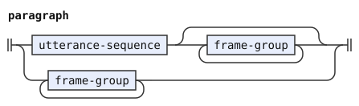
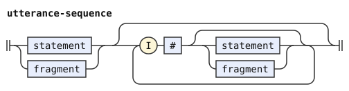
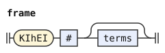

# The kihei syntax layer

This layer adds `ki'ei` phrases to the CLL grammar. A frame is a context for subsequent utterances. The proposed meaning sets the world in which those utterances hold as true.

A term is an argument or a tense/modal expression. A sumti is a predicate argument. A payload is the material after a marker. The payload after `ki'ei` accepts any number of CLL terms, including zero. Thus, `ki'ei ko'a .i broda` supplies a sumti, and `ki'ei pu zu ku .i broda` supplies a tense. The empty form `ki'ei .i broda` supplies no terms.

The [kihei dialect](../dialects/kihei.md) includes this layer after [the CLL grammar](cll.md). `%redefine-rule` replaces an existing rule. `%rule` defines a new rule. These declarations reuse CLL rules for terms and statements.

A paragraph contains utterances between `ni'o` markers. The replacement paragraph rule accepts an initial sequence of utterances and subsequent groups with frames. It also accepts groups with frames at the start of a paragraph.

```jbogenbau
%redefine-rule paragraph
  utterance-sequence [{frame-group}] | {frame-group}

%rule utterance-sequence
  (statement | fragment) [{I # [statement | fragment]}]

%rule frame-group
  frame [I # [utterance-sequence]]

%rule frame
  KIhEI # [terms]
```

<details><summary>Railroad diagrams of the 4 rules from <code>paragraph</code> to <code>frame</code></summary>
<p></p>
<p></p>
<p></p>
<p></p>
</details>

Each `frame-group` contains its frame and the subsequent utterances up to the next frame or paragraph boundary. In `ki'ei ko'a .i broda .i brode ki'ei ko'e .i brodi`, the first group contains two utterances. The second group contains one. An earlier utterance can precede the first group, as in `broda ki'ei ko'a .i brode`.

The terms end at `.i`, another `ki'ei`, `ni'o`, or the enclosing text boundary. The grammar requires `.i` before an utterance after a frame. It accepts a frame without subsequent utterances, as in `ki'ei ko'a`. It also accepts consecutive frames, as in `ki'ei ko'a ki'ei ko'e .i broda`.

The CLL rules place `ni'o` outside each paragraph. This layer places each frame above the `.i` sequence inside that paragraph. A quotation or parenthesis contains its own text and therefore its own paragraphs. The grammar records these boundaries without deciding how an interpreter carries context across them.

This example accepts terms as payloads. It rejects a full predicate payload, such as `ki'ei ce'u purci ce'u .i broda`. It adds no pronoun for the selected world.
