# The Zantufa grammar

This document is the syntax of the [Zantufa](../dialects/zantufa.md) dialect. A dialect is a pipeline of stages, defined by one pipeline document. Its reference is Guskant's Zantufa 1.9999, `zantufa-1.9999.peg` in the `gerna_cipra` repository, a PEG (parsing expression grammar). It is a grammar of its own, and it translates the reference rule by rule.

A translated rule keeps the reference rule's name, with hyphens, and its comment names that rule. Each other rule names part of a reference rule or a rule that a condition tests. Conditions state the reference's lookaheads, tests of the words that follow. An ordered choice in the reference tries alternatives in order. A span is a range between input token boundaries.

Two alternatives of an ordered choice can read the same words. At some of these positions, a ranked choice or a condition removes the later reading over the same span. The grammar settles these choices even when neither reading elides a terminator.

A cmavo is a particle, a short structure word. A selma'o is a word class of cmavo. [The Zantufa lexicon](../words/lexicon-zantufa.md) gives each cmavo the selma'o that Zantufa gives it. For example, most tense words are BAI, `ca'a` and `ka'e` are NA, and `je` is JOI. Also, `la` is LE, `ce'e` is BO, and `nai` and `sa` are UI.

The prose also uses these Lojban terms:

- A cmevla is a name word.
- A brivla is a predicate word.
- A gismu is a root word.
- A rafsi is a shortened word form used inside compounds.
- A selbri is the predicate of a sentence.
- A sumti is an argument of a selbri.
- A tanru is a compound selbri.
- A bridi-tail is a selbri with any terms after it.
- A lerfu word is a letter word, such as `.abu` or `xy.`.
- A mekso is a mathematical expression.
- A vocative addresses a listener.
- An attitudinal expresses an attitude.
- A free modifier adds information outside predicate arguments.
- A prenex puts quantified terms before their sentence.
- A gek is a forethought connective before two or more branches that `gi` separates.
- A joik is a connective built on a word of JOI. JOI includes the logical `je`, `ja`, `jo` and `ju` here.

A stage is one step of a pipeline, with its own grammar. The pipeline is the sequence of stages that reads a text. The indicator stage attaches `ba'e` and the other words of BAhE to the word after them, so this grammar does not read them. It reads every other word, the attitudinals included.

Zantufa lets free modifiers follow every word (`post_clause`), with a few exceptions. These are `bu`, `fa'o`, a word of SI or BAhE, and the words inside a quote. So the translation writes `#`, the slot for free modifiers, after each terminal and after each quote. An elidable terminator keeps its slot inside its brackets, `[+KU #]`, as the reference's `KU_elidible <- KU_clause?` does. After a PA word, the free modifiers do not begin with a number (`number_post_clause`). After a BY word they do not begin with a lerfu string, and after a COI word they do not begin with a vocative.

The word stage reads the magic words, the words such as `si` that act on other words. `zei` is SI there and erases a word, `sa` is an attitudinal, and `su` erases the whole text before it. SU instead supplies a letter base before BU, as the reference grammar specifies. "Differences from Zantufa 1.9999" explains how whole-text erasure differs inside nested texts.

[The notation document](../../docs/notation.md) explains the notation. A lookahead of the reference, such as `!terms`, is a condition with `begins`. The terminals of this grammar (the symbols that each match one input token) are selma'o. A tag marks a token by name, phoneme or character. The rules `any-word` and `anything` match tokens tagged `word` and `quoted-text`, respectively. The word stage puts these tags on the words of a quote and on a unit that a quote hands on whole.

A ranked choice filters alternatives at one written position. An option qualifies when its completed reading passes its recognition rules. A qualified earlier option excludes later options over the same span.

A derivation is one complete grammatical reading. An admitted derivation survives ranked filtering. No rule carries a `leftmost-longest` flag. The stage ranks admitted derivations by `late-elision`. Fewer omitted terminators win at the first differing boundary. Two best derivations with equal counts at every boundary tie, and a tie is an error.

The stage does not declare `elision-only`. A PEG repetition reads as far as it can, and late elision usually selects the same reading. Each terminator marked `_elidible` in the reference is elidable here, with an optional such as `[+KU]`. The separators `cu` and `i'au` remain ordinary optionals.

A condition parses the words that it tests, and that nested parse can elide terminators. It follows written-terminator priority ([engine §4](../../docs/engine.md#4-recognition)). So it cannot elide a terminator where the same construct can read on to that terminator as written. A PEG's lookahead reads on in the same way. So `cy to roi toi klama` parses as in Zantufa, with `roi` inside the parenthesis. The condition on a sumti term does not find the tag `cy roi` with an empty parenthesis there.

An unwritten `toi` or `se'u` closes only content that cannot extend further. Otherwise a condition can find an early closure and wrongly reject a longer reading.

The markers `[++TOI]` and `[++SEhU]` make these terminators maximal ([engine §4](../../docs/engine.md#4-recognition)). This restriction holds in the main parse and in each condition.

`cu` separates the terms from the bridi-tail and closes neither. `[CU #]` is therefore an ordinary optional. Its absence creates no elided node and adds nothing to the ranking.

Counting an absent `cu` as early elision favors a reading that closes a parenthesis, quote or `jai` too soon. In `to na cafne`, the parenthesis holds `na cafne`, rather than ending after `na`.

`i'au` separates a statement from its following terms and closes nothing. `[IAU #]` is an ordinary optional, and its absence creates no elided node.

The grammar also states the attachment conventions of the reference. These are the points where a greedy repetition or an ordered choice of the reference decides how words attach. A condition states each of them, so that the grammar gives the reading, and the ranking does not. These are the conventions:

- Free modifiers nest (see "Free modifiers").
- A connective joins sumti before it joins terms (see "Sumti").
- A run of operators is one unit (see "Mekso").
- A gek before bridi-tails begins a bridi-tail, not a connection of sentences (see "Sentences and bridi-tails").

Each of these conditions is a restriction of the grammar, not a preference among whole parses. It removes a reading where the words from a given point begin a given rule. It does not test whether the remaining reading gives a parse of the whole text.

```jbogenbau
%ambiguity-resolution late-elision

%rule #
  [{free}]

%rule any-word
  ~word

%rule anything
  ~quoted-text
```

<details><summary>Railroad diagrams of <code>#</code>, <code>any-word</code> and <code>anything</code></summary>
<p></p>
<p>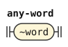</p>
<p></p>
</details>

## The text and its paragraphs

A text is free modifiers and then paragraphs, which `ni'o` and `no'i` separate. A run of `ni'o` can stand alone, or join two paragraphs with a connective, or with a connective or a tense or modal and `bo`. A paragraph is statements and fragments, separated by `.i`.

A quote preserves every leading free modifier as quoted content. This includes indicators and vocatives after LU and LUhEI. Otherwise a speaker cannot quote a text that starts with such a modifier.

The opener's slot takes every leading free modifier after TO. These modifiers remain outside the parenthesis body. An indicator there marks the whole bracketed remark.[^cll-e19-67]

```jbogenbau
%rule text
  (* text <- intro_null free* paragraphs? si_clause? SI_clause* faho_clause EOF? *)
  # [paragraphs]

%rule paragraphs
  (* paragraphs <- (NIhO_clause+ paragraphs_1?)+ / paragraphs_1 (NIhO_clause+ paragraphs_1?)* *)
  {NIhO #} [paragraphs-tail] | paragraphs-tail

%rule paragraphs-tail
  paragraphs-1 [{NIhO #} [paragraphs-tail]]

%rule paragraphs-1
  (* paragraphs_1 <- paragraphs_2 (NIhO_clause+ joik paragraphs_2)* *)
  {paragraphs-2 \ {NIhO #} joik}

%rule paragraphs-2
  (* paragraphs_2 <- paragraph (NIhO_clause+ joik? tag? BO_clause paragraph)* *)
  {paragraph \ {NIhO #} [joik] [tag] BO #}

%rule paragraph
  (* paragraph <- (I_clause (statement_terms / fragment)?)+
                / (statement_terms / fragment) (I_clause (statement_terms / fragment)?)* *)
  | {I # [statement-terms | fragment]}
  | (statement-terms | fragment) [{I # [statement-terms | fragment]}]
```

<details><summary>Railroad diagrams of the 6 rules from <code>text</code> to <code>paragraph</code></summary>
<p>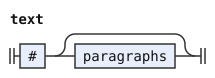</p>
<p>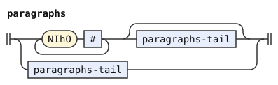</p>
<p>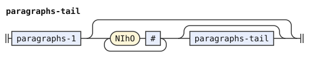</p>
<p>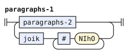</p>
<p>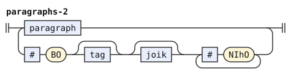</p>
<p>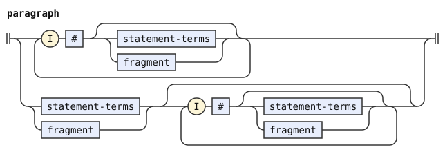</p>
</details>

## Statements and fragments

A statement can take terms after it, which `i'au` can introduce (`statement-terms`). A forethought connection of statements has any number of `gi` branches and an optional `gi'i`. `.i` with a connective, or with a connective or a tense or modal and `bo`, joins a statement to the one before it. So a text cannot begin that way.

The fragment conditions test the words at and after each fragment. A `gek` or `joik` fragment cannot begin terms. A `na` fragment cannot have terms or `ku` after it. A terms fragment cannot have a following mekso.

The ranked fragment choice puts `terms-vau` before `mex`. A qualified terms fragment excludes a mekso fragment over the same span. The sentence alternative stays outside this group.

A mekso fragment cannot have a `sumti-5` or selbri after it. Those words instead begin a term with that mekso as its quantifier.

In `lu by xi mo'e ke cy moi su'i dy moi li'u klama`, the quote contains a terms fragment. Its long subscript includes both MOI units. The sentence alternative competes with this fragment by ordinary ranking.

A structural pattern describes constructed nodes. Suppose every earlier branch is a whole sentence and the last branch starts with a sentence. Then the condition removes `gek-statement`, because the sentence rule already reads that structure. A prenex or TUhE blocks that final first-child path. A statement link in an earlier branch prevents the whole-sentence match. Links after the last sentence can continue outside the forethought connection.

`$BARE-NA-FRAGMENT` describes one NA clause with its own omitted KU and VAU. Written boundaries or added terms prevent that exact match. The condition excludes only this duplicate terms fragment.

```jbogenbau
%rule statement-terms
  (* statement_terms <- statement IAU_elidible terms? *)
  statement [IAU #] [terms]

%rule statement
  (* statement <- statement_1 / prenex statement *)
  statement-1 | prenex statement

%rule statement-1
  (* statement_1 <- statement_2 (I_clause joik statement_2)* *)
  {statement-2 \ I # joik}

%rule statement-2
  (* statement_2 <- statement_3 (I_clause joik? tag? BO_clause statement_3)* *)
  {statement-3 \ I # [joik] [tag] BO #}

%rule statement-3
  (* statement_3 <- sentence / tag? TUhE_clause paragraphs TUhU_elidible / gek_statement *)
  sentence | [tag] TUhE # paragraphs [+TUhU #] | gek-statement

%rule gek-statement
  (* gek_statement <- gek statement (gik statement)+ GIhI_elidible *)
  gek $a(gek-branches) gik $l(statement) [+GIhI #]
%conditions
  $a ≇ @({sentence \ gik}) ∨ $l ≇ @(sentence ⋰)

%rule gek-branches
  (* statement (gik statement)*: every branch but the last. Zantufa's sentence comes first in statement_3, and it
     succeeds where each of these is a sentence and the last branch is a sentence, perhaps with the .i links of
     statement_1 and statement_2 after it, which then continue the statement outside the forethought *)
  {statement \ gik}

%const $BARE-NA-FRAGMENT @(@(na-clause KU="") VAU="")

%rule fragment
  (* fragment <- prenex / !terms gek / !terms joik / ek / gihek / NA_clause !terms !KU
               / terms VAU_elidible !mex / mex / relative_clauses / links / linkargs *)
  | prenex
  | $g(gek)
  | $j(joik)
  | ek
  | gihek
  | $n(na-clause)
  | ($t(terms-vau) ≻ $m(mex))
  | relative-clauses
  | links
  | linkargs
%conditions
  ¬begins(from($g), terms),
  ¬begins(from($j), terms),
  ¬begins(after($n), terms),
  ¬begins(after($n), ku-word),
  ¬begins(after($t), mex),
  $t ≇ $BARE-NA-FRAGMENT,
  ¬begins(after($m), sumti-5),
  ¬begins(after($m), selbri)

%rule prenex
  (* prenex <- terms ZOhU_clause *)
  terms ZOhU #

%rule na-clause
  NA #

%rule terms-vau
  terms [+VAU #]

%rule ku-word
  KU
```

<details><summary>Railroad diagrams of the 12 rules from <code>statement-terms</code> to <code>ku-word</code></summary>
<p>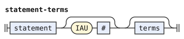</p>
<p>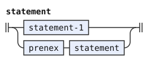</p>
<p>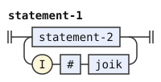</p>
<p>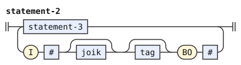</p>
<p>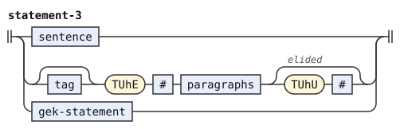</p>
<p>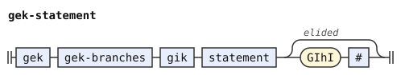</p>
<p>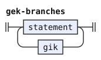</p>
<p>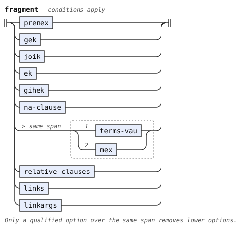</p>
<p></p>
<p>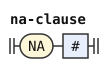</p>
<p>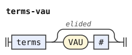</p>
<p>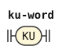</p>
</details>

## Sentences and bridi-tails

A sentence is terms, an optional `cu` and a bridi-tail, or a forethought connection of sentences. Terms stand only before the first bridi-tail. Bridi-tails connect at three levels.

A gek before bridi-tails begins a bridi-tail, not a forethought connection of sentences. So in `mi ge klama gi cadzu`, the gek is part of the bridi-tail after `mi`. There it begins a forethought tanru unit, `ge klama gi cadzu`. The condition on the second alternative of `sentence` states this. The condition prevents the forethought sentence alternative from competing with this complete bridi-tail.

The condition tests for a bridi-tail that no `gi` follows (`bridi-tail-before-no-gik`). The no-`gi` test rejects a bridi-tail that stops before `gi`. So in `ge broda gi brode gi brodi gi cu brodo`, the bridi-tail fails, and a forethought connection of sentences remains. A test for any bridi-tail finds the shorter `ge broda gi brode` there, and rejects the text.

The outer level takes a connective only where the inner one cannot. That is where `ke` follows it, with or without a tense or modal first, or where a tense or modal and `cu` follow it. The conditions reserve these forms for the outer level. After `ke`, the words are a group of bridi-tails, unless a selbri ends with `ke'e` there, and then they are a tanru.

The tenses and modals before `ke` and a forethought bridi-tail are one tag. `[tag]` takes the whole run. With repeated tags, `pu ba ke ge broda mi gi brode do ke'e` has two readings, with one tag or two. They elide the same terminators, so they tie.

```jbogenbau
%rule sentence
  (* sentence <- terms? CU_elidible bridi_tail / terms? gek sentence (gik sentence)+ GIhI_elidible tail_terms *)
  | [terms] [CU #] bridi-tail
  | [terms] $g(gek) sentence {gik sentence} [+GIhI #] tail-terms
%conditions
  ¬begins(from($g), bridi-tail-before-no-gik)

%rule bridi-tail-before-no-gik
  $b(bridi-tail)
%conditions
  ¬begins(after($b), gik)

%rule bridi-tail
  (* bridi_tail <- bridi_tail_1 (joik_gihek tag? CU_elidible bridi_tail_1)* *)
  bridi-tail-1 [{bridi-tail-link}]

%rule bridi-tail-link
  | $j(joik-gihek) tag [CU #] bridi-tail-1
  | $j(joik-gihek) $b(bridi-tail-1)
%conditions
  begins(after($j), tag-ke) ∨ begins(after($j), tag-cu),
  ¬begins(from($b), tag)

%rule tag-cu
  tag CU

%rule bridi-tail-1
  (* bridi_tail_1 <- bridi_tail_2 (joik_gihek !(tag? BO_clause) !(tag? KE_clause) CU_elidible bridi_tail_2 tail_terms)* *)
  bridi-tail-2 [{bridi-tail-1-link}]

%rule bridi-tail-1-link
  $j(joik-gihek) [CU #] bridi-tail-2 tail-terms
%conditions
  ¬begins(after($j), tag-bo),
  ¬begins(after($j), tag-ke)

%rule tag-bo
  [tag] BO

%rule tag-ke
  [tag] KE

%rule bridi-tail-2
  (* bridi_tail_2 <- bridi_tail_3 ((tag / joik_gihek tag?) BO_clause CU_elidible bridi_tail_3 tail_terms)* *)
  bridi-tail-3 [{(tag | joik-gihek [tag]) BO # [CU #] bridi-tail-3 tail-terms}]

%rule bridi-tail-3
  (* bridi_tail_3 <- KE_clause !(selbri_2 KEhE) bridi_tail KEhE_elidible tail_terms / selbri tail_terms / gek_bridi_tail *)
  | $k(ke-clause) bridi-tail [+KEhE #] tail-terms
  | $s(selbri) tail-terms
  | gek-bridi-tail
%conditions
  ¬begins(after($k), selbri-2-kehe),
  ¬begins(from($s), ke-word) ∨ begins(from($s), ke-selbri-2-kehe)

%rule ke-selbri-2-kehe
  KE # selbri-2 KEhE

%rule ke-clause
  KE #

%rule selbri-2-kehe
  selbri-2 KEhE

%rule gek-bridi-tail
  (* gek_bridi_tail <- gek bridi_tail (gik bridi_tail)+ !(gik (term / CU)) GIhI_elidible tail_terms
                     / tag* KE_clause gek_bridi_tail KEhE_elidible / NA_clause gek_bridi_tail *)
  | gek bridi-tail $g(gik-bridi-tails) [+GIhI #] tail-terms
  | [tag] KE # gek-bridi-tail [+KEhE #]
  | NA # gek-bridi-tail
%conditions
  ¬begins(after($g), gik-term)

%rule gik-bridi-tails
  {gik bridi-tail}

%rule gik-term
  gik (term | CU)

%rule tail-terms
  (* tail_terms <- term* VAU_elidible *)
  [{term}] [+VAU #]
```

<details><summary>Railroad diagrams of the 18 rules from <code>sentence</code> to <code>tail-terms</code></summary>
<p>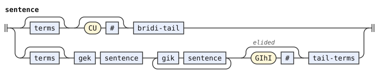</p>
<p>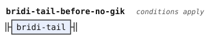</p>
<p>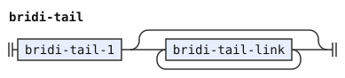</p>
<p>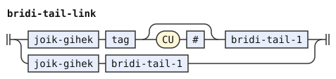</p>
<p>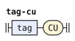</p>
<p></p>
<p>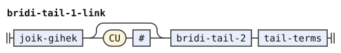</p>
<p>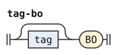</p>
<p>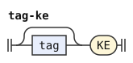</p>
<p>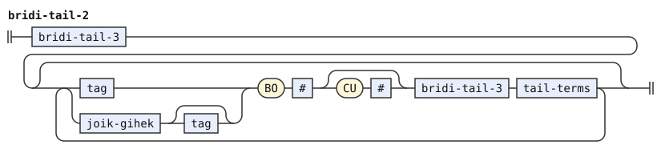</p>
<p>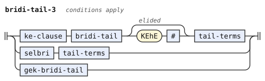</p>
<p>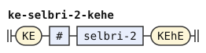</p>
<p>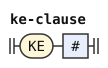</p>
<p>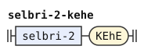</p>
<p>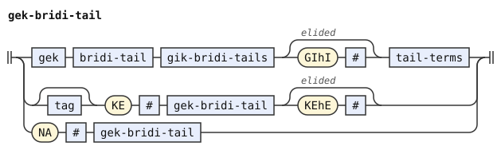</p>
<p>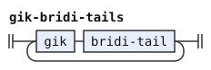</p>
<p>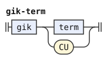</p>
<p>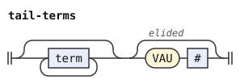</p>
</details>

## Terms

Zantufa has no termsets. A term is a `xoi` clause, a `ke` group of terms, a tense or modal with its sumti, or a sumti. It can also be a briga'i form (`noi'a` with a selbri, or a bare `na`), or a forethought connection of terms. A sumti takes priority over a forethought term over the same words.

In a term, no forethought bridi-tail, `bo` or selbri directly follows a tense or modal, under the following-input conditions. No further part of a tense or modal follows it either, because a tense or modal reads as far as it can. The condition rejects every following selbri. So `mi pe pu ba broda` has no parse, and `mi pe pu ku ba broda` has one.

The condition `¬begins(after($t), free)` excludes a tag term that leaves a following free modifier unread. So in `sei abu pensi ba ju'o rinka`, the tag is `ba ju'o`, and the selbri `rinka` follows it. The condition on a selbri then removes the term, and the statement of the `sei` ends after `pensi`, as in Zantufa.

This grammar gives a `ke` group of terms priority over a sumti that begins with `ke`. Where `ke'e` is elided, both can read the same words. So `ke mi klama` is a group of terms, `ke mi`, and then the selbri. It is not the sumti `ke mi` with an elided `ke'e`. Both readings elide one `ke'e`, so without a condition they tie. The condition on the sumti alternative (`ke-group-of-terms`) removes the sumti reading exactly where the group of terms begins.

```jbogenbau
%rule terms
  (* terms <- term+ *)
  {term}

%rule term
  (* term <- term_1 (!(joik tag BO_clause? CU) joik_ek term_1)* *)
  term-1 [{term-link}]

%rule term-link
  $j(joik-ek) term-1
%conditions
  ¬begins(from($j), joik-tag-cu)

%rule joik-tag-cu
  joik tag [BO #] CU

%rule term-1
  (* term_1 <- term_2 (joik_ek? BO_clause term_2)* *)
  {term-2 \ [joik-ek] BO #}

%rule term-2
  (* term_2 <- XOI_clause statement SEhU_elidible / KE_clause !(sumti KEhE) term+ KEhE_elidible
              / tag_term / !tag sumti / brigahi / gek_term *)
  | XOI # statement [++SEhU #]
  | $k(ke-clause) {term} [+KEhE #]
  | tag-term
  | $s(sumti)
  | brigahi
  | $g(gek-term)
%conditions
  ¬begins(from($g), sumti) ∨ begins(from($g), tag),
  ¬begins(after($k), sumti-kehe),
  ¬begins(from($s), tag),
  ¬begins(from($s), ke-group-of-terms)

%rule ke-group-of-terms
  $k(ke-clause) terms
%conditions
  ¬begins(after($k), sumti-kehe)

%rule sumti-kehe
  sumti KEhE

%rule brigahi
  (* brigahi <- (POIhA_clause free* selbri / NA_clause !bridi_tail !joik_gihek) KU_elidible *)
  | POIhA # selbri [+KU #]
  | $n(na-clause) [+KU #]
%conditions
  ¬begins(after($n), bridi-tail),
  ¬begins(after($n), joik-gihek)

%rule tag-term
  (* tag_term <- !gek (tag !(!tag selbri) !gek_bridi_tail !BO
                      / (FA_clause (joik FA_clause)* / JAI_clause tag?) !tanru_unit_1) (sumti / KU_elidible) *)
  | $t(tag) tag-term-argument
  | $f(fa-jai) tag-term-argument
%conditions
  ¬begins(from($t), gek),
  ¬begins(after($t), free),
  ¬begins(after($t), tcita-selci),
  ¬begins(after($t), selbri),
  ¬begins(after($t), gek-bridi-tail),
  ¬begins(after($t), bo-word),
  ¬begins(after($f), tanru-unit-1)

%rule tag-term-argument
  sumti | [+KU #]

%rule fa-jai
  {FA # \ joik} | JAI # [tag]

%rule bo-word
  BO

%rule gek-term
  (* gek_term <- gek term+ (gik term+)+ GIhI_elidible *)
  gek {term} {gik {term}} [+GIhI #]
```

<details><summary>Railroad diagrams of the 14 rules from <code>terms</code> to <code>gek-term</code></summary>
<p>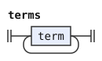</p>
<p>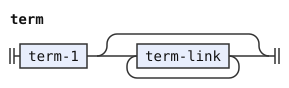</p>
<p>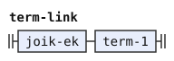</p>
<p>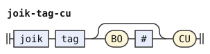</p>
<p>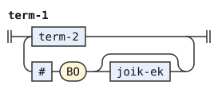</p>
<p>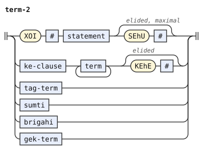</p>
<p>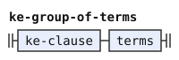</p>
<p>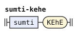</p>
<p>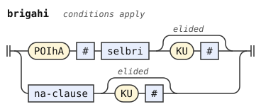</p>
<p>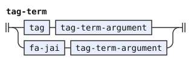</p>
<p>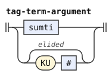</p>
<p>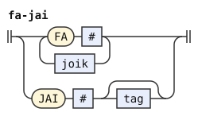</p>
<p></p>
<p>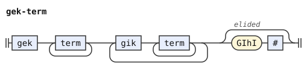</p>
</details>

## Sumti

A pro-sumti is an argument pronoun, such as `mi`. A sumti can be a `ra'oi`, `zo`, `zoi` or `lo'u` quote, a lerfu string, a `lu` quote, a `la'e` form, or a pro-sumti. It can also be a `lo'oi` abstraction over a statement, a description, a `li` mekso, or `na'e` with a sumti. A lerfu string is a sumti only where no mekso operator follows it, under two following-input conditions. The inner sumti of a description does not begin with a quantifier.

A connective after a sumti joins that sumti to the next one, not the term to the next term. So `ba mi .e do klama` has one term, the tense `ba` with the sumti `mi .e do`. The term rule sees a connective only where the sumti cannot take it. A term reads its whole sumti first. The conditions prevent that sumti from stopping before another link.

The conditions on `sumti-1` and `sumti-2` state this. Each says that no further link follows the whole run of sumti. The run is a rule of its own, which the condition captures, since a list in braces is never captured. The rules `sumti-1-link` and `sumti-2-link` are only for the conditions, and the trees do not contain them.

```jbogenbau
%rule sumti
  (* sumti <- sumti_1 (VUhO_clause relative_clauses)? *)
  sumti-1 [VUhO # relative-clauses]

%rule sumti-1
  (* sumti_1 <- sumti_2 (joik_ek sumti_2)* *)
  $r(sumti-1-run)
%conditions
  ¬begins(after($r), sumti-1-link)

%rule sumti-1-run
  {sumti-2 \ joik-ek}

%rule sumti-1-link
  joik-ek sumti-2

%rule sumti-2
  (* sumti_2 <- sumti_3 (joik_ek? tag? BO_clause sumti_3)* *)
  $r(sumti-2-run)
%conditions
  ¬begins(after($r), sumti-2-link)

%rule sumti-2-run
  {sumti-3 \ [joik-ek] [tag] BO #}

%rule sumti-2-link
  [joik-ek] [tag] BO # sumti-3

%rule sumti-3
  (* sumti_3 <- (KE_clause sumti KEhE_elidible / sumti_4 / gek sumti (gik sumti)+ GIhI_elidible) relative_clauses? *)
  (KE # sumti [+KEhE #] | sumti-4 | gek sumti {gik sumti} [+GIhI #]) [relative-clauses]

%rule sumti-4
  (* sumti_4 <- quantifier? sumti_5 / quantifier selbri KU_elidible *)
  [quantifier] sumti-5 | quantifier selbri [+KU #]

%rule sumti-5
  (* sumti_5 <- RAhOI_clause / ZO_clause / ZOI_clause / LOhU_clause
              / lerfu_string BOI_elidible !(BO_clause* operand* !(joik_ek (sumti / relative_clause)) operator) !(operand KEhE)
              / LU_clause text LIhU_elidible / (LAhE_clause / NAhE_clause BO_clause) relative_clauses? sumti LUhU_elidible
              / KOhA_clause / LOhOI_clause (joik LOhOI_clause)* statement KUhAU_elidible / LE_clause sumti_tail KU_elidible
              / li_clause / NAhE_clause sumti_3 *)
  | RAhOI anything #
  | ZO any-word #
  | ZOI any-word anything any-word #
  | LOhU [{any-word}] LEhU #
  | $l(lerfu-boi)
  | LU text [+LIhU #]
  | (LAhE # | NAhE # BO #) [relative-clauses] sumti [+LUhU #]
  | KOhA #
  | {LOhOI # \ joik} statement [+KUhAU #]
  | LE # sumti-tail [+KU #]
  | LI # mex [+LOhO #]
  | NAhE # sumti-3
%conditions
  ¬begins(after($l), lerfu-operator),
  ¬begins(after($l), operand-kehe)

%rule lerfu-boi
  lerfu-string [+BOI #]

%rule lerfu-operator
  [{BO #}] [{operand}] $o(operator)
%conditions
  ¬begins(from($o), joik-ek-sumti)

%rule joik-ek-sumti
  joik-ek (sumti | relative-clause)

%rule operand-kehe
  operand KEhE

%rule sumti-tail
  (* sumti_tail <- relative_clauses? (!quantifier sumti)? sumti_tail_1 *)
  | [relative-clauses] sumti-tail-1
  | [relative-clauses] $s(sumti) sumti-tail-1
%conditions
  ¬begins(from($s), quantifier)

%rule sumti-tail-1
  (* sumti_tail_1 <- tag? quantifier? selbri / quantifier sumti *)
  | tag quantifier selbri
  | $t(tag) $u(selbri)
  | quantifier selbri
  | $s(selbri)
  | quantifier sumti
%conditions
  ¬begins(from($u), tcita-selci),
  ¬begins(from($s), tag)
```

<details><summary>Railroad diagrams of the 16 rules from <code>sumti</code> to <code>sumti-tail-1</code></summary>
<p>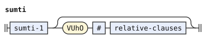</p>
<p>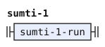</p>
<p></p>
<p></p>
<p></p>
<p></p>
<p></p>
<p></p>
<p></p>
<p></p>
<p></p>
<p></p>
<p></p>
<p></p>
<p></p>
<p></p>
</details>

## Relative clauses

Relative clauses can stand side by side, joined by a joik or by nothing. They follow a sumti, and they can follow a selbri too (see "Selbri and tanru").

```jbogenbau
%rule relative-clauses
  (* relative_clauses <- relative_clause (joik? relative_clause)* *)
  {relative-clause \ [joik]}

%rule relative-clause
  (* relative_clause <- GOI_clause term GEhU_elidible / NOI_clause statement KUhO_elidible *)
  GOI # term [+GEhU #] | NOI # statement [+KUhO #]
```

<details><summary>Railroad diagrams of <code>relative-clauses</code> and <code>relative-clause</code></summary>
<p></p>
<p></p>
</details>

## Selbri and tanru

A selbri can take a tense, a modal or `na` before it, and relative clauses and `cei` after it. A tanru unit can be a name, because Zantufa reads a name as a selbri. It can also be a quote of GOhOI, MUhOI or LUhEI, such as a `go'oi` quote, or a mekso with `moi`. `me` makes a tanru unit of a sumti, operators, a mekso, or a tense or modal.

The ME choice ranks sumti, mekso, then `tag`. A qualified earlier operand excludes later operands over the same span. A run of operators is a separate alternative, with its own prefix conditions.

The follower conditions keep a following unit outside this operand. Thus `me su'i pa moi` forms two tanru units, `me su'i` and `pa moi`. A mekso after ME cannot precede words that make it a quantifier. A following tanru unit cannot begin with a joik and a `selbri_5`. Those words connect inside the preceding unit.

In `mi me by xi mo'e ke cy moi su'i dy moi`, the letter sumti excludes its competing mekso over the same span. Ordinary elision keeps the long subscript.

A gek tanru unit takes priority over conversion with `se`, `fa`, or `na'e`. A gek can itself begin with `se`, and it can begin with a tag such as `na'e bai`. So `mi se ge klama gi cadzu` has two readings with the same elisions. In one, `se ge` is the gek. In the other, `se` converts the gek tanru unit `ge klama gi cadzu`.

The first reading, where `se` belongs to the connective, takes priority. Without that priority, the readings tie and the text is an error.

The conditions enforce that priority. `se`, `fa` and `na'e` do not take a tanru unit where the words from them begin a gek tanru unit (`gek-tanru-unit`). And the gek alternative does not begin with `na'e`, because the optional NAhE before the gek takes it first. So in `na'e bai gi broda gi brode`, `na'e` comes before the gek `bai gi`.

`mex MOI #` precedes SE and NAhE conversion over the whole tanru unit. A qualified mekso with MOI excludes those conversions over the same span. The conditions of the SE and NAhE options reserve a gek tanru unit. FA and JAI stay outside the group because neither can start a mekso.

So `mi na'e pa moi` is the mekso `na'e pa` with `moi`. `mi se su'i pa re moi` is `se su'i pa re` with `moi`.

A run of `cei` nests to the right. The selbri after the first `cei` already reads every later `cei`. So in `broda cei brode cei brodi`, the second `cei` is inside the selbri `brode cei brodi`. Here `selbri-1` takes at most one `cei` and the selbri after it. Repeating `CEI # selbri` here gives two readings with the same elisions, and so a tie.

```jbogenbau
%rule selbri
  (* selbri <- selbri_1 / tag selbri / NA_clause selbri *)
  selbri-1 | tag $s(selbri) | NA # selbri
%conditions
  ¬begins(from($s), tcita-selci)

%rule selbri-1
  (* selbri_1 <- (!KE selbri_2 KEhE_clause linkargs / selbri_2) relative_clauses? (CEI_clause selbri)* *)
  | $s(selbri-2) KEhE # linkargs [relative-clauses] [CEI # selbri]
  | selbri-2 [relative-clauses] [CEI # selbri]
%conditions
  ¬begins(from($s), ke-word)

%rule ke-word
  KE

%rule selbri-2
  (* selbri_2 <- selbri_3 (CO_clause selbri_3)* *)
  {selbri-3 \ CO #}

%rule selbri-3
  (* selbri_3 <- selbri_4+ *)
  selbri-4 [{later-selbri-4}]

%rule later-selbri-4
  (* selbri_4's (joik selbri_5)* reads a joik and a selbri_5 before the next selbri_4 can begin with them *)
  $x(selbri-4)
%conditions
  ¬begins(from($x), joik-selbri-5)

%rule joik-selbri-5
  joik selbri-5

%rule selbri-4
  (* selbri_4 <- selbri_5 (joik selbri_5)* *)
  {selbri-5 \ joik}

%rule selbri-5
  (* selbri_5 <- selbri_6 (joik tag? BO_clause selbri_6)* *)
  {selbri-6 \ joik [tag] BO #}

%rule selbri-6
  (* selbri_6 <- tanru_unit (BO_clause tanru_unit)* *)
  {tanru-unit \ BO #}

%rule tanru-unit
  (* tanru_unit <- tanru_unit_1 linkargs? *)
  tanru-unit-1 [linkargs]

%rule tanru-unit-1
  (* tanru_unit_1 <- CMEVLA_clause / BRIVLA_clause / GOhA_clause / KE_clause selbri_2 KEhE_elidible
                   / NAhE_clause? gek selbri_2 (gik selbri_2)+ !(gik? (term / CU)) GIhI_elidible
                   / MUhOI_clause / GOhOI_clause / LUhEI_clause text LIhAU_elidible
                   / ME_clause (sumti / operator+ / mex / tag) MEhU_elidible MOI_clause? / mex MOI_clause
                   / (FA_clause (joik FA_clause)* / SE_clause) tanru_unit_1 / JAI_clause tag? tanru_unit_1
                   / NAhE_clause tanru_unit_1 / NU_clause (joik NU_clause)* statement KEI_elidible *)
  | CMEVLA #
  | BRIVLA #
  | GOhA #
  | KE # selbri-2 [+KEhE #]
  | NAhE # gek selbri-2 $g(gik-selbris) [+GIhI #]
  | $k(gek) selbri-2 $g(gik-selbris) [+GIhI #]
  | MUhOI any-word anything any-word #
  | GOhOI any-word #
  | LUhEI text [+LIhAU #]
  | ME # (sumti ≻ $m(mex) ≻ $t(tag)) [+MEhU #] [MOI #]
  | ME # {operator} [+MEhU #] [MOI #]
  | (mex MOI #
     ≻ SE # $w(tanru-unit-1)
     ≻ $n(NAhE) # tanru-unit-1)
  | {FA # \ joik} $w(tanru-unit-1)
  | JAI # [tag] tanru-unit-1
  | {NU # \ joik} statement [+KEI #]
%conditions
  ¬begins(after($g), gik-term-or-cu),
  ¬begins(after($m), sumti-5),
  ¬begins(after($m), selbri),
  ¬begins(from($m), operator),
  ¬begins(from($t), operator),
  ¬begins(from($k), nahe-word),
  $n ⟹ ¬begins(from($), gek-tanru-unit),
  $w ⟹ ¬begins(from($), gek-tanru-unit)

%rule gek-tanru-unit
  [NAhE #] gek selbri-2 $g(gik-selbris)
%conditions
  ¬begins(after($g), gik-term-or-cu)

%rule nahe-word
  NAhE

%rule gik-selbris
  {gik selbri-2}

%rule gik-term-or-cu
  [gik] (term | CU)

%rule linkargs
  (* linkargs <- BE_clause term links? BEhO_elidible *)
  BE # term [links] [+BEhO #]

%rule links
  (* links <- BEI_clause term links? *)
  BEI # term [links]
```

<details><summary>Railroad diagrams of the 18 rules from <code>selbri</code> to <code>links</code></summary>
<p></p>
<p></p>
<p></p>
<p></p>
<p></p>
<p></p>
<p></p>
<p></p>
<p></p>
<p></p>
<p></p>
<p></p>
<p></p>
<p></p>
<p></p>
<p></p>
<p></p>
<p></p>
</details>

## Mekso

The MAhO choice ranks mekso, selbri, then sumti. The MOhE choice ranks selbri before sumti. A qualified earlier operand excludes later operands over the same span. A failed higher operand removes nothing.

Zantufa's mekso is flat: operands and runs of operators alternate, `bo` and `ke` group them, and `bi'e` raises the precedence of the operators after it. Reverse Polish takes `fu'a`, and forethought takes `pe'o` or a bare operator. A quantifier is a mekso that begins no `sumti-5` and no selbri, under the following-input conditions. These are prefix tests, as a PEG's are.

The grammar reads a run of operators whole. So in `li re su'i ni'u pa`, `su'i ni'u` is one run. It is not an operator without an operand and then a link of its own. The rule `operators` states this, with a condition that no operator follows the run. This keeps consecutive operators, such as `[pi'i pi'i]`, in one unit.

The operand after a run of operators is greedy too. The optional operand reads a mekso wherever one follows. So a run of operators ends a mekso only where no operand follows it. The first alternative of `mex-link` and of `bihe-link` has a condition that states this.

Thus `by su'i cy klama` has the quantifier `by su'i cy` before `klama`. And `mi me my su'i ny me'u` has the mekso `my su'i ny` after `me`. Both use the complete operator run and its following operand.

`mex-forethought` reads an optional PEhO, an operator, one or more `mex-2` operands, and its KUhE terminator.

The condition removes a connective operator whose first word is SE. The alternative `SE # operator` reads that SE instead. Initial NA or GAhO prevents this exact transformation. The separate following-CU condition remains in place.

```jbogenbau
%rule quantifier
  (* quantifier <- !sumti_5 !selbri mex relative_clauses? *)
  $m(mex) [relative-clauses]
%conditions
  ¬begins(from($m), sumti-5),
  ¬begins(from($m), selbri)

%rule mex
  (* mex <- mex_1 (operator+ mex_1?)* *)
  mex-1 [{mex-link}]

%rule mex-link
  $o(operators) | operators $x(mex-1)
%conditions
  ¬begins(from($x), operator),
  ¬begins(after($o), mex-1)

%rule mex-1
  (* mex_1 <- (KE_clause mex_2+ KEhE_elidible / mex_2 (BO_clause mex_2)* )
              (BIhE_clause operator+ (KE_clause mex_2+ KEhE_elidible / mex_2 (BO_clause mex_2)* )?)* *)
  mex-group [{bihe-link}]

%rule bihe-link
  BIhE # $o(operators) | BIhE # operators $x(mex-group)
%conditions
  ¬begins(from($x), operator),
  ¬begins(after($o), mex-group)

%rule mex-group
  KE # {mex-2} [+KEhE #] | {mex-2 \ BO #}

%rule mex-2
  (* mex_2 <- operand / mex_rp / mex_forethought *)
  operand | mex-rp | mex-forethought

%rule mex-rp
  (* mex_rp <- FUhA_clause mex_2+ operator (mex_2* operator)* KUhE_elidible *)
  FUhA # {mex-2} operator [{[{mex-2}] operator}] [+KUhE #]

%rule mex-forethought
  (* mex_forethought <- !(lerfu_string BOI_elidible) operator mex_2+ mex_forethought? KUhE_elidible
                      / PEhO_clause operator mex_2+ mex_forethought? KUhE_elidible *)
  [PEhO #] operator {mex-2} [+KUhE #]

%rule operator
  (* operator <- SE_clause operator / NAhE_clause operator / MAhO_clause (mex / selbri / sumti) TEhU_elidible
               / VUhU_clause / joik_ek !CU *)
  | SE # operator
  | NAhE # operator
  | MAhO # (mex ≻ selbri ≻ sumti) [+TEhU #]
  | VUhU #
  | $j(joik-ek)
%conditions
  ¬begins(after($j), cu-word),
  $j ≇ @(SE ⋯)

%rule operators
  (* operator+, which reads every operator that follows *)
  $r(operator-run)
%conditions
  ¬begins(after($r), operator)

%rule operator-run
  {operator}

%rule cu-word
  CU

%rule operand
  (* operand <- number BOI_elidible / lerfu_string BOI_elidible / VEI_clause mex VEhO_elidible
              / MOhE_clause (selbri / sumti) TEhU_elidible / (LAhE_clause / NAhE_clause BO_clause) mex LUhU_elidible
              / NAhE_clause operand *)
  | number [+BOI #]
  | lerfu-string [+BOI #]
  | VEI # mex [+VEhO #]
  | MOhE # (selbri ≻ sumti) [+TEhU #]
  | (LAhE # | NAhE # BO #) mex [+LUhU #]
  | NAhE # operand

%rule number
  (* number <- PA_clause+;  PA_post <- number_post_clause *)
  {PA number-post}

%rule lerfu-string
  (* lerfu_string <- lerfu_word+ *)
  {lerfu-word}

%rule lerfu-word
  (* lerfu_word <- BY_clause / LAU_clause lerfu_word / TEI_clause lerfu_string FOI_clause;  BY_post <- lerfu_post_clause *)
  BY lerfu-post | LAU # lerfu-word | TEI # lerfu-string FOI #
```

<details><summary>Railroad diagrams of the 17 rules from <code>quantifier</code> to <code>lerfu-word</code></summary>
<p></p>
<p></p>
<p></p>
<p></p>
<p></p>
<p></p>
<p></p>
<p></p>
<p></p>
<p></p>
<p></p>
<p></p>
<p></p>
<p></p>
<p></p>
<p></p>
<p></p>
</details>

## Connectives

`je`, `ja`, `jo` and `ju` belong to JOI and form joiks. `ga'o` or `ke'i` can stand on either side of a joik. A gek is a word of GA, or `gi` with a joik or a tense or modal on either side of it. It can take `bo`.

```jbogenbau
%rule ek
  (* ek <- NA_clause? SE_clause? A_clause *)
  [NA #] [SE #] A #

%rule gihek
  (* gihek <- NA_clause? SE_clause? GIhA_clause *)
  [NA #] [SE #] GIhA #

%rule joik
  (* joik <- GAhO_clause? NA_clause? SE_clause? JOI_clause GAhO_clause? *)
  [GAhO #] [NA #] [SE #] JOI # [GAhO #]

%rule joik-ek
  (* joik_ek <- joik / ek *)
  joik | ek

%rule joik-gihek
  (* joik_gihek <- joik / gihek *)
  joik | gihek

%rule gek
  (* gek <- (SE_clause? GA_clause / GI_clause (joik / tag) / (joik / tag) GI_clause) BO_clause? *)
  ([SE #] GA # | GI # (joik | tag) | (joik | tag) GI #) [BO #]

%rule gik
  (* gik <- GI_clause *)
  GI #
```

<details><summary>Railroad diagrams of <code>ek</code>, <code>gihek</code>, <code>joik</code>, <code>joik-ek</code>, <code>joik-gihek</code>, <code>gek</code> and <code>gik</code></summary>
<p></p>
<p></p>
<p></p>
<p></p>
<p></p>
<p></p>
<p></p>
</details>

## Tenses and modals

A tense or modal (the rule `tag`) is a run of `tcita-selci` joined by joiks. Each is a modal, a ROI word with an optional mekso before it, `fi'o` with a selbri, or one of these after `na'e` or `se`. The grammar reads a tense or modal whole. Where the words after a `tcita-selci` can begin another one, the grammar reads that one, not a joik. And a tense or modal in a term or before a selbri never leaves a `tcita-selci` after it.

The mekso prefix pattern tests an actual NAhE or SE constructor over an operand or operator. That prefix can move to the modal. NAhE BO is a different constructor because BO cannot begin the remaining modal. Its LUhU boundary remains part of that operand. An outer NAhE can still move while an inner NAhE BO stays intact.

```jbogenbau
%rule tag
  (* tag <- tcita_selci+ (joik tcita_selci+)* *)
  {tcita-selci} [{tag-link}]

%rule tag-link
  $j(joik) {tcita-selci}
%conditions
  ¬begins(from($j), tcita-selci)

%rule tcita-selci
  (* tcita_selci <- (NAhE_clause / SE_clause) tcita_selci / BAI_clause / mex? ROI_clause / FIhO_clause selbri FEhU_elidible *)
  | (NAhE # | SE #) tcita-selci
  | BAI #
  | ROI #
  | $m(mex) ROI #
  | FIhO # selbri [+FEhU #]
%conditions
  $m ≇ @(((NAhE ∪ SE) [#] (operand ∪ operator)) ⋰)
```

<details><summary>Railroad diagrams of <code>tag</code>, <code>tag-link</code> and <code>tcita-selci</code></summary>
<p></p>
<p></p>
<p></p>
</details>

## Free modifiers

A free modifier is a `sei` clause over a statement, a vocative, a mekso with `mai`, or a `to` parenthesis. It can also be a subscript, a replacement quote, or an attitudinal with its own free modifiers after it. A vocative takes a selbri or a sumti.

A free modifier nests in the nearest slot that can take it. So no free modifier follows another one in the same slot. The condition on `free` states this. In `ui nai`, the `nai` is in the slot of `ui`. In `coi ui coi do`, `coi do` is in the slot of `ui`, which is in the slot of the first `coi`. In `xy boi xi by boi xi vo`, the second subscript is inside the first one.

An attitudinal slot takes the next free modifier. A vocative slot takes a free modifier that is not a vocative.

The condition on `free` removes a modifier when another follows at the same level. It does not require each slot to read everything that can follow it.

A vocative takes a selbri or a sumti as its address, as in Zantufa. Zantufa merges cmevla and brivla, so a name is an ordinary tanru unit. The selbri of the address reads as far as it can, as Zantufa's does. So in `doi djan klama`, the address is the selbri `djan klama`, and the text has no bridi. To address someone by name before a bridi, a speaker ends the vocative with `do'u`, as in `doi djan do'u klama`.

Nested vocatives can take separate addresses. In `pe'usai doi xod ko jmina`, the vocative `doi xod` is in the slot of `sai`, and `sai` is in the slot of `pe'u`. The address of `doi` is the selbri `xod`, which ends before `ko`. Then `pe'u` takes `ko` as its own address, a sumti. So the bridi `jmina` has no first place, and `ko` is not the one who adds.

```jbogenbau
%rule free
  (* free <- SEI_clause statement SEhU_elidible / vocative relative_clauses? selbri DOhU_elidible
           / vocative sumti? DOhU_elidible / mex_2 MAI_clause / TO_clause text TOI_elidible / xi_clause
           / LOhAI_clause / (UI_clause !BU_clause)+ *)
  | SEI # statement [++SEhU #]
  | vocative [sumti | [relative-clauses] selbri] [+DOhU #]
  | mex-2 MAI #
  | TO # parenthesis-text [++TOI #]
  | XI # mex-2
  | [LOhAI [{lohai-word}] [LOhAI [{lohai-word}]]] LEhAI #
  | UI #
%conditions
  ¬begins(after($), free)

%rule parenthesis-text
  text
%conditions
  ¬begins(from($), free)

%rule vocative
  (* vocative <- COI_clause+;  COI_post <- vocative_post_clause *)
  {COI vocative-post}

%rule number-post
  (* number_post_clause <- spaces? !BU_clause (!number free)* *)
  [{free-not-number}]

%rule lohai-word
  ~word∩(LOhAI ∪ LEhAI)=∅

%rule free-not-number
  $f(free)
%conditions
  ¬begins(from($f), number)

%rule lerfu-post
  (* lerfu_post_clause <- spaces? !BU_clause (!lerfu_string free)* *)
  [{free-not-lerfu}]

%rule free-not-lerfu
  $f(free)
%conditions
  ¬begins(from($f), lerfu-string)

%rule vocative-post
  (* vocative_post_clause <- spaces? !BU_clause (!vocative free)* *)
  [{free-not-vocative}]

%rule free-not-vocative
  $f(free)
%conditions
  ¬begins(from($f), vocative)
```

<details><summary>Railroad diagrams of the 10 rules from <code>free</code> to <code>free-not-vocative</code></summary>
<p></p>
<p></p>
<p></p>
<p></p>
<p></p>
<p></p>
<p></p>
<p></p>
<p></p>
<p></p>
</details>

## Differences from Zantufa 1.9999

The dialect reads some texts differently from Zantufa 1.9999. The [dialect policy](../dialects/zantufa.md#differences-from-zantufa-and-cll) accounts for most of them. The first three sections group differences by cause. The last records translation choices by grammar area, including where this grammar keeps Zantufa's reading.

### Ordered choice and preferred readings

A PEG commits to the first alternative that matches, and a repetition reads as far as it can. So Zantufa rejects some texts that its rules allow, and the dialect accepts them. In `are`, Zantufa reads `a` as a whole fragment, and `re` is left over. In `le vi'ofagri`, the vocative after `le` takes `fagri`, and the description has no selbri. In `la poi ke'a barda .djan.`, the relative clause takes the name. Each of these parses here.

In `li ma'o me my su'i pa`, only the mekso ME operand completes the surrounding construction. This dialect accepts it. The literal reference rejects it because its earlier sumti choice commits before that continuation.

In `mi na'e mo'e ke by .e cy moi su'i dy moi`, the outer mekso includes NAhE. The literal PEG rejects this text after committing inside KE and MOhE. This dialect revisits those inner choices, so the outer mekso ends at the last MOI.

In `li ma'o ke by .e cy jo'u dy pa`, MAhO takes the long mekso operand. The final PA lies outside it. Shorter mekso operands close TEhU earlier and lose by late elision. The literal PEG rejects this text because its grouped mekso commits to an inner choice.

In `li mo'e ke by xi mo'e ke cy moi jo'u dy xi mo'e ke zy moi`, the outer MOhE takes a selbri. The literal reference takes a sumti after its committed selbri attempt fails. This dialect revisits the inner subscript choices, so its selbri completes. The ranked choice then takes that selbri.

Where a PEG's greed gives a reading that the ranking of this stage does not choose, the dialect keeps its own reading. The ranking is the order of preference of the stage among parses. In `mi klama pamai le zarci .e remai le zdani`, Zantufa's `.e` takes `re mai` as its own free modifier. Here the free modifier is the mekso `.e re` with `mai`, after `zarci`. In the same way, `ui .e re mai` puts the free modifier `.e re` with `mai` in the slot of `ui`. Zantufa reads `ui` and then a `.e` fragment, with `re mai` in its slot.

In `coi poi broda klama`, Zantufa's relative clause reads the tanru `broda klama`. Then the vocative has no selbri, so Zantufa reads a bare `coi` and a fragment of relative clauses. Here `coi` takes the relative clause `poi broda` and the selbri `klama`. `doi poi broda djan.` reads in the same way.

In a reverse Polish mekso, Zantufa's greedy `mex_2+` can read an operator and an operand as a forethought mekso. So in `li fu'a pa su'i re pi'i`, it reads `su'i re` as one operand of `pi'i`. Here `su'i` is an operator of the reverse Polish mekso itself, as in *The Complete Lojban Language* (CLL).

### Maximal terminators

The reference PEG reads TO and SEI content as far as it can. For these clauses, the dialect keeps that commitment despite its general policy. The [introduction](#the-zantufa-grammar) explains why conditions need maximal TOI and SEhU.

A `to` or `sei` therefore reads as far as it can, even where the whole text then fails.

In `metonymy`, read as `me to ny my`, the parenthesis takes `ny my`, and `me` is left without a sumti. In `genai do gletu le do tanbo gi to prami le do tanbo`, the parenthesis takes `prami le do tanbo`. This leaves the gek's second branch empty.

In `.u'i nypyry cu cusku lesedu'u le xindo cu cusku lesedu'u le kisto soi xy cu ca sarji le terpa sonci`, `soi` is SEI. Its statement reads `le terpa sonci`, because the description can take `sonci`. Then the last `du'u` has the sumti `le kisto` and no selbri.

The dialect rejects all three texts, as Zantufa does.

These texts illustrate the maximal boundaries, with Zantufa's reading. In `so to recap` and `so to mi klama`, the parenthesis holds the rest of the text, and the text is one mekso. In ` o'ocu'i is mere tolerance`, the parenthesis after `re` holds `le rance`. In `ro sei ny rere'u basna mutce cusku`, the `sei` holds `ny rere'u basna mutce cusku`.

The marker `++` is transitional. GitHub issues [#138](https://github.com/int19h/gencmu/issues/138) and [#139](https://github.com/int19h/gencmu/issues/139) track its replacement.

### Word processing and quotation boundaries

A lookahead here sees the words that the syntax reads, after erasure and without `ba'e`. Zantufa erases and reads `ba'e` inside its grammar, so its lookaheads see those words. So Zantufa accepts `li pa je ba'e cu broda`, `li pa je brode si cu broda` and `ba'e ke broda ke'e ke'e be mi`, and the dialect rejects them. And Zantufa reads `ke mi ba'e ke'e` as a group of terms, and the dialect as a grouped sumti.

CLL writes both `LU text` and `TO text`.[^cll-s21-1] Those rules alone do not distinguish the openers. This grammar preserves leading free modifiers as quoted content after LU and LUhEI. Zantufa instead puts them in the opener's slot. The CLL text-initial exception gives initial indicators scope over what follows.[^cll-s13-9] This grammar extends that boundary to every leading free modifier and to LUhEI.

The slot after TO takes leading free modifiers, as Zantufa's `TO_post <- post_clause` specifies. In a CLL example, `sa'a` after `to'i` marks the whole bracketed remark.[^cll-e19-67] The [indicator explanation](../indicators/cll.md#quotation-boundaries) gives the reason for LU. The indicator document's [closing comparison](../indicators/cll.md#differences-from-cll-and-camxes-std) describes the official parser, CLL's reference implementation.

Zantufa retains the older camxes rules for LU. After the 2015-2016 bpfk-list discussion "lo nu broda ba brode", Ilmen changed camxes-exp, the experimental grammar of the camxes parser, on March 21, 2016. The ilmentufa commit is `ca30cc4c26a397b8f00bbeaf729ec39b2d548cd4`. camxes-std, the standard grammar of the camxes parser, followed on August 14, 2016, in commit `654144ee3362fb59083e30a48ed3b6cec0b225b0`. Zantufa forked camxes before that standard change and did not adopt it. This dialect records its LU and LUhEI boundary as a departure from Zantufa's reference grammar.

The word stage reads a stray `si` or `bu` at the start of a text as the Magic Words proposal does. So `si mi` is `mi`, and `bu si` is nothing. Zantufa rejects both, because its `si` and `bu` need a word before them there.

`su` erases the whole text before it. Zantufa scans for `su` from the start of each text. The scan passes a letter word, or a `su`, together with the free modifiers after it. A parenthesis among those free modifiers, or a quote inside one, holds a text with its own start. A `su` inside that text erases only back to that start.

So Zantufa reads `mi bu to mi su do toi broda` and `su to mi su do toi broda` with the inner `su` erasing only `mi`. Here it erases back to the start of the whole text, and the `toi` is left without its `to`.

The forms stage reads the rafsi or gismu form after `ra'oi` before the word stage knows whether that `ra'oi` opens a quote. So where `ra'oi` is itself quoted or is a `zoi` delimiter, the forms stage still divides the letters after it. It divides them as the form of a `ra'oi` quote. There Zantufa reads them as ordinary words, and the dialect rejects the text: `zo ra'oi broda`, `go'oi ra'oi broda`, `lo'u ra'oi broda le'u`, `lo'ai ra'oi broda le'ai` and `zoi ra'oi x ra'oi broda`. A `zoi` body, a closing `zoi` delimiter and the text after `fa'o` take the form as it is. So `zoi gy ra'oi broda gy`, `zoi broda ra'oi broda` and `fa'o ra'oi broda` read as in Zantufa.

Here, `su` cannot erase a quote word that opens no quote. So the dialect rejects `zoi su mi` and `mi lo'ai su klama`. Zantufa's `su` passes such a word with its `any_word` fallback, and accepts both.

`ba'e` is not a magic word, as the Magic Words proposal says. The word stage first removes `fa'o` and what follows it. So `mi ba'e fa'o` leaves a `ba'e` with nothing to mark. The proposal calls this an error. Zantufa reads `ba'e` inside its grammar, and accepts the text.

The phoneme stage accepts commas and the other conventions of `phonemes/latin.md`. Zantufa reads only two of them: `h` as the apostrophe, and `?` and `!` as pauses. It rejects commas, digits, accents and other punctuation. The stage ignores a comma, so a comma is not the syllable break of CLL[^cll-s3-3] here.

### Translation choices by grammar area

#### Text, statements and terms

The reference writes `CU_elidible`, while CLL writes `[CU #]`.[^cll-s21-1] This translation uses an ordinary separator, as the [introduction](#the-zantufa-grammar) explains. Zantufa holds `na cafne` inside the parenthesis in `to na cafne`, and this grammar agrees.

The reference writes `IAU_elidible` between a statement and its following terms. Here `statement-terms` uses the ordinary optional `[IAU #]`, as the [introduction](#the-zantufa-grammar) explains.

`fragment` agrees with Zantufa on the terms fragment and long subscript in the [quoted fragment example](#statements-and-fragments).

Zantufa has no JACU, a proposal for simpler connectives, so `sentence` permits terms only before its first bridi-tail. Its three connection levels follow camxes.

`sentence` gives a gek bridi-tail priority over a forethought sentence. The reference tries the bridi-tail first. Its dated comments show the intended trees.

`bridi-tail-before-no-gik` rejects a bridi-tail that stops before another GI. The reference's runs of `gik` read as far as they can. The condition preserves that boundary when testing the sentence alternative.

`sumti-1` and `sumti-2` read connected sumti before terms can connect. The reference gives no comment for that priority. CLL and camxes give the same reading, though CLL has no term connections.

`term-2` gives a KE group of terms priority over a KE sumti. The reference's ordered choice tries that group first, as in the [KE example](#terms).

`tag-term` rejects every following selbri after its maximal tag. The reference lookahead `!(!tag selbri)` permits a following selbri that begins with a tag. That permission never applies after a maximal tag, because no leading tag remains. The reference's final word clause consumes following free modifiers before its lookaheads. This grammar states that boundary with `¬begins(after($t), free)`.

#### Selbri and tanru

`tanru-unit-1` gives a gek unit priority over SE, FA or NAhE conversion. The reference tries that gek alternative first. This grammar therefore selects the same first reading in the [conversion example](#selbri-and-tanru).

`tanru-unit-1` also agrees with Zantufa on the long ME subscript and both MOI readings in [the rule examples](#selbri-and-tanru).

`gek-bridi-tail` uses one optional tag before KE and forethought bridi-tails. The reference writes `tag*`, but its `tag` already reads the whole tense or modal run. Repeated tags give duplicate readings with identical elisions.

`selbri-1` takes one optional CEI link because its following selbri already reads all later links. The reference repeats `(CEI_clause selbri)*`. Repeating that link here duplicates the same right-nested reading and gives equal elisions.

#### Mekso and connectives

`mex-forethought` does not translate two parts of the reference's rule. Its lookahead `!(lerfu_string BOI_elidible)` never fails before an operator, because no operator begins with a lerfu word. And its `mex_forethought?` after `mex_2+` adds nothing, because `mex_2+` already reads a forethought mekso as one of its parts.

`operators` reads an operator run whole, as the reference's greedy repetition does. The reference comment explicitly shows `[pi'i pi'i]` as one operator unit. Zantufa gives the same quantifier and ME operand in the [two operator examples](#mekso).

`joik` uses JOI words that include `je`, `ja`, `jo` and `ju`. Those words cover the connections that CLL calls jek.

#### Free modifiers

Zantufa nests a following free modifier in the nearest available slot. Its `post_clause <- free*` reads as far as it can. An attitudinal uses `post_clause`. A vocative uses `vocative_post_clause`, whose `!vocative free` repetition excludes a following vocative.

A comment of the reference, from camxes, says that UI words are eaten after a word. And in CLL, an indicator applies to the word before it, as in `ui nai`. camxes-std keeps a run of vocatives or subscripts flat, but the dialect follows Zantufa.

The condition is on `free`, not on each slot. So it removes a free modifier that another free modifier follows at the same level. But it does not make each slot read as far as it can. This keeps a departure from Zantufa, in `mi klama pamai le zarci .e remai le zdani` (see [preferred readings](#ordered-choice-and-preferred-readings)). There the slot of `.e` stays empty, and `.e re` with `mai` is one free modifier after `zarci`.

`free` agrees with Zantufa on the separate inner and outer addresses in the [nested-vocative example](#free-modifiers).

[^cll-s21-1]: [CLL 1.1, section 21.1](https://lojban.org/publications/cll/cll_v1.1_xhtml-section-chunks/chapter-grammars.html#section-EBNF).

[^cll-s13-9]: [CLL 1.1, section 13.9](https://lojban.org/publications/cll/cll_v1.1_xhtml-section-chunks/section-scope.html).

[^cll-s3-3]: [CLL 1.1, section 3.3](https://lojban.org/publications/cll/cll_v1.1_xhtml-section-chunks/section-lojban-characters.html).

[^cll-e19-67]: [CLL 1.1, section 19.12, example 19.67](https://lojban.org/publications/cll/cll_v1.1_xhtml-section-chunks/section-parentheses.html#c19e12d2).
