# BPFK working word forms

This document is the family part of the forms stage in the [BPFK](../dialects/bpfk.md), [experimental](../dialects/experimental.md) and [Zantufa](../dialects/zantufa.md) dialects. A stage is one step of a pipeline, with its own grammar ([engine §1](../../docs/engine.md#1-tokens)). A family is a set of word forms that dialects use. The loader stitches this document in after [forms.md](forms.md). The experimental dialect stitches [experimental.md](experimental.md) after it, and the Zantufa dialect stitches [zantufa.md](zantufa.md). [The notation document](../../docs/notation.md) explains jbogenbau, the notation of these grammars.

This document gives the working word-form grammar of the BPFK (a Lojban committee). It translates the morphology part of `camxes.peg`, a parsing expression grammar (PEG). The executable baseline is ilmentufa commit [`778ea138f7d150121ca722db7536ce3b123943ac`](https://github.com/lojban/ilmentufa/blob/778ea138f7d150121ca722db7536ce3b123943ac/camxes.peg). [CLL 1.3.4](https://github.com/int19h/cll/blob/v1.3.4/chapters/a02.xml) (*The Complete Lojban Language*) prints that grammar in appendix A2.

The prose uses these Lojban terms for words:

- A cmavo is a particle, a short structure word.
- A selma'o is a word class of cmavo.
- A brivla is a predicate word.
- A cmevla is a name word.
- A gismu is a root word.
- A lujvo is a compound word.
- A rafsi is a shortened word form used inside compounds.

This document translates the PEG rule by rule. Each rule here has the name of the PEG rule that it translates, in lower case and with hyphens for underscores. A comment gives the PEG rule. A rule that the PEG does not have is one of two kinds. It is a part of a PEG rule that needs a name of its own here, or a rule that a condition tests. Its comment says which.

C denotes a consonant. V denotes `a`, `e`, `i`, `o`, or `u`.

## How the PEG is written here

A PEG reads the text from left to right. When an alternative fails, the PEG goes back to where that alternative began and tries the next one. But once a choice or a repetition succeeds, a later failure never reopens it. A PEG differs from a jbogenbau grammar in three ways, and each has a fixed translation:

1. A choice `A / B` tries `A` first. It tries `B` only if `A` does not begin at that point. Here the choice is two alternatives, and the second has the condition that the first does not begin where the second begins: `¬begins(from($b), a)`.
2. A repetition `A*` reads `A` for as long as it can, and stops only where `A` does not begin. Here it is a rule of its own, such as `unstressed-syllables`. The rule has two alternatives: `A` followed by the rule, or `nothing` where `A` does not begin. An optional `A?` is a rule such as `h-opt`, with the alternatives `A`, or `nothing` where `A` does not begin.
3. A lookahead `&A` or `!A` tests whether `A` begins at a point, and reads nothing. Here it is a condition `begins(from($x), a)` or `begins(after($x), a)`, which looks at the text from the start or from the end of the part `$x`. A lookahead can look past the end of the word, into the words after it, but no further than the next pause.

So each rule here derives exactly what the PEG rule reads, at exactly the points where the PEG rule begins, and in one way only. The rules that the PEG uses only in lookaheads are the one exception, as the next paragraph says: for them only whether they begin matters.

The translation leaves out a condition in two cases, where the condition cannot change the result.

In the first case, no two alternatives of a choice can both begin at the same point. This is because each pair of them reads different letters at some position. For example, one reads a consonant where the other reads a vowel. No alternative of such a choice can be empty. The comment on the rule names the positions.

In the second case, the PEG uses the rule only in lookaheads, directly or at the end of another such rule. A lookahead asks only whether the rule begins, not where it ends. So a choice that ends such a rule needs no order, because the rule begins if any of its alternatives begins. And the translation can leave out a part at its end that can only make it longer. The third and later consonants of `cluster`, the repeats of `consonant+`, are such a part. The comment says "only a lookahead".

## Words

The phoneme stage supplies normalized phonemes and pause tokens. The forms stage reads three word shapes, `cmevla-shape`, `cmavo-shape` and `brivla-shape`. It reads them in the order of the PEG's `lojban_word`: a cmevla, then a cmavo, then a brivla. The document [forms.md](forms.md) says what a word is and how words join.

The PEG's lookaheads decide where each word ends and which words can stand together without a pause. So every word here is `continued`: the rules of the word decide whether another word can follow it without a pause. A nucleus is the vowel or diphthong of a syllable. A word has `onset` when it does not begin with a nucleus, because the PEG's `post_word` lets only such a word follow another word directly.

The PEG's `CMAVO` is a list of the selma'o, each a set of spellings, followed by `cmavo` for every other cmavo. Each selma'o rule begins with `&cmavo` and ends with `&post_word`. So every spelling but one reads exactly what `cmavo` reads, and the lexicon gives each cmavo its selma'o.

Before BU, the stage separates the final y from any prolonged hesitation. The word stage drops the prefix and forms the letter word from the final y. The division preserves source positions and leaves quote bodies unjoined.

`cmavo-shape` reads `cmavo`. A cmavo made only of `y` letters is hesitation, which [forms.md](forms.md) reads as `y-run`, so this document redefines `y-run` as that cmavo.

A `y` is a nucleus exactly where no nucleus follows it. So the first `y` of a run is a nucleus exactly when the run has an odd number of letters. A run with an even number can follow a word directly: `kyyykerlo` is `ky yy kerlo`, but `bayyy` is no text. So a run of `y` has `onset` where no nucleus begins it.

```jbogenbau
%rule cmevla-shape            (* CMEVLA <- cmevla *)
  $n(cmevla) <~continued ∪ (¬begins(from($n), nucleus) ⟹ ~onset)>

%rule cmavo-shape             (* CMAVO, less hesitation and ybu *)
  $c(cmavo) <~continued ∪ (¬begins(from($c), nucleus) ⟹ ~onset)>
%conditions
  ¬matches($c, y-letters)

%rule brivla-shape            (* BRIVLA, after CMEVLA and CMAVO in lojban_word *)
  $b(brivla-word) <~continued ∪ (¬begins(from($b), nucleus) ⟹ ~onset)>
%conditions
  ¬begins(from($b), cmevla),
  ¬begins(from($b), cmavo)

%redefine-rule y-run          (* a CMAVO of y letters: cmavo_form's y+, or one y *)
  $h(cmavo) <(¬begins(from($h), nucleus) ⟹ ~onset)>
%conditions
  matches($h, y-letters)

%rule y-letters               (* a run of y letters, which a condition tests *)
  any-y | any-y y-letters
```

<details><summary>Railroad diagrams of the 5 rules from <code>cmevla-shape</code> to <code>y-letters</code></summary>
<p>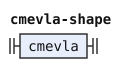</p>
<p>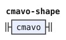</p>
<p>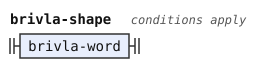</p>
<p>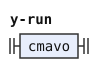</p>
<p>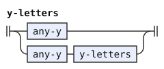</p>
</details>

The PEG's `lojban_word` is what `post_word` looks for after a word.

```jbogenbau
%rule lojban-word             (* lojban_word <- CMEVLA / CMAVO / BRIVLA *)
  | cmevla
  | $m(cmavo)
  | $b(brivla-word)
%conditions
  ¬begins(from($m), cmevla),
  ¬begins(from($b), cmevla),
  ¬begins(from($b), cmavo)

%rule brivla-word             (* BRIVLA <- gismu / lujvo / fuhivla *)
  | gismu
  | $l(lujvo)
  | $f(fuhivla)
%conditions
  ¬begins(from($l), gismu),
  ¬begins(from($f), gismu),
  ¬begins(from($f), lujvo)

%rule lujvo                   (* lujvo <- !gismu !fuhivla brivla *)
  $b(brivla)
%conditions
  ¬begins(from($b), gismu),
  ¬begins(from($b), fuhivla)

%rule post-word               (* post_word <- pause / !nucleus lojban_word; only a lookahead *)
  | pause
  | $w(lojban-word)
%conditions
  ¬begins(from($w), nucleus)

%rule pause                   (* pause <- comma* space_char+ / EOF; only a lookahead *)
  PAUSE | end-of-text

%rule end-of-text             (* EOF <- comma* !. *)
  ε
%conditions
  matches(after($), nothing)

%rule nothing                 (* the empty text: the empty alternative of an optional or a repetition, and what EOF tests *)
  ε
```

<details><summary>Railroad diagrams of the 7 rules from <code>lojban-word</code> to <code>nothing</code></summary>
<p>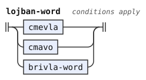</p>
<p>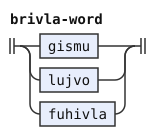</p>
<p>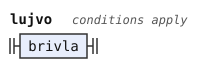</p>
<p>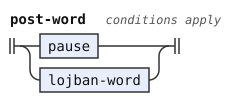</p>
<p>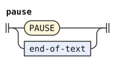</p>
<p>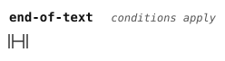</p>
<p>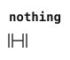</p>
</details>

## Cmevla

A name is a run of letters that ends in a consonant and is followed by a pause. The PEG reads it in two ways. A glide is an `i` or `u` before a nucleus. `zifcme` reads any run of nuclei, glides, apostrophes and consonants, and `jbocme` reads the same run as syllables, when it can. Both end at the pause, so they read the same letters.

```jbogenbau
%rule cmevla                  (* cmevla <- jbocme / zifcme *)
  | jbocme
  | $z(zifcme)
%conditions
  ¬begins(from($z), jbocme)

%rule zifcme                  (* zifcme <- !h (nucleus / glide / h / consonant !pause / digit)* consonant &pause *)
  $s(zifcme-sounds) $c(consonant)
%conditions
  ¬begins(from($s), h),
  begins(after($c), pause)

%rule zifcme-sounds           (* (nucleus / glide / h / consonant !pause)* *)
  | $n(nothing)
  | zifcme-sound zifcme-sounds
%conditions
  ¬begins(from($n), zifcme-sound)

%rule zifcme-sound            (* nucleus / glide / h / consonant !pause; h and consonant begin with letters no other alternative begins with *)
  | nucleus
  | $g(glide)
  | h
  | $c(consonant)
%conditions
  ¬begins(from($g), nucleus),
  ¬begins(after($c), pause)

%rule jbocme                  (* jbocme <- &zifcme (any_syllable / digit)+ &pause *)
  $s(any-syllables)
%conditions
  begins(from($s), zifcme),
  begins(after($s), pause)

%rule any-syllables           (* (any_syllable)+ *)
  any-syllable more-any-syllables

%rule more-any-syllables      (* the rest of (any_syllable)+ *)
  | $n(nothing)
  | any-syllable more-any-syllables
%conditions
  ¬begins(from($n), any-syllable)
```

<details><summary>Railroad diagrams of the 7 rules from <code>cmevla</code> to <code>more-any-syllables</code></summary>
<p>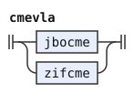</p>
<p>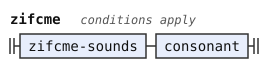</p>
<p>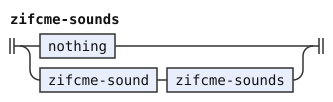</p>
<p>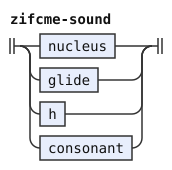</p>
<p>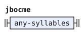</p>
<p>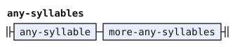</p>
<p>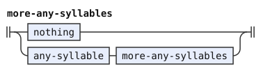</p>
</details>

## Cmavo

A cmavo is not the start of a name, and not the start of a lujvo that begins with a CVC rafsi and a y-hyphen. Its form is an onset and nuclei joined by apostrophes, or a run of `y`. A pause or another word follows it. `CVCy_lujvo` is what keeps `bajykla` one lujvo, and not `ba jy kla`.

```jbogenbau
%rule cmavo                   (* cmavo <- !cmevla !CVCy_lujvo cmavo_form &post_word *)
  $f(cmavo-form)
%conditions
  ¬begins(from($f), cmevla),
  ¬begins(from($f), cvcy-lujvo),
  begins(after($f), post-word)

%rule cvcy-lujvo              (* CVCy_lujvo <- CVC_rafsi y h? initial_rafsi* brivla_core / stressed_CVC_rafsi y short_final_rafsi; only a lookahead *)
  | cvc-rafsi y h-opt initial-rafsis brivla-core
  | stressed-cvc-rafsi y short-final-rafsi

%rule cmavo-form              (* cmavo_form <- !h !cluster onset (nucleus h)* (!stressed nucleus / nucleus !cluster) / y+ / digit *)
  | cmavo-form-with-onset
  | $y(ys)
%conditions
  ¬begins(from($y), cmavo-form-with-onset)

%rule cmavo-form-with-onset   (* !h !cluster onset (nucleus h)* (!stressed nucleus / nucleus !cluster) *)
  $o(onset) nucleus-h-pairs cmavo-last-nucleus
%conditions
  ¬begins(from($o), h),
  ¬begins(from($o), cluster)

%rule nucleus-h-pairs         (* (nucleus h)* *)
  | $n(nothing)
  | nucleus-h-pair nucleus-h-pairs
%conditions
  ¬begins(from($n), nucleus-h-pair)

%rule nucleus-h-pair          (* nucleus h, repeated in (nucleus h)* *)
  nucleus h
```

<details><summary>Railroad diagrams of the 6 rules from <code>cmavo</code> to <code>nucleus-h-pair</code></summary>
<p>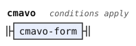</p>
<p>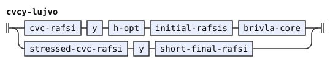</p>
<p>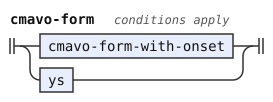</p>
<p>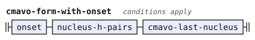</p>
<p>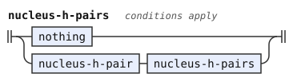</p>
<p>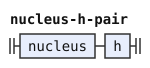</p>
</details>

The last nucleus of a cmavo is unstressed, or it is not followed by a consonant cluster. So `MIklama` is not `mI klama`. The second alternative of the PEG's choice applies where the first does not begin: where a nucleus begins, that is where it is stressed.

```jbogenbau
%rule cmavo-last-nucleus      (* !stressed nucleus / nucleus !cluster *)
  | $n(nucleus)
  | $m(nucleus)
%conditions
  ¬begins(from($n), stressed),
  begins(from($m), stressed),
  ¬begins(after($m), cluster)

%rule ys                      (* y+ *)
  y more-ys

%rule more-ys                 (* the rest of y+ *)
  | $n(nothing)
  | y more-ys
%conditions
  ¬begins(from($n), y)
```

<details><summary>Railroad diagrams of <code>cmavo-last-nucleus</code>, <code>ys</code> and <code>more-ys</code></summary>
<p>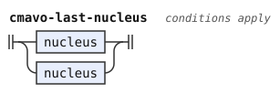</p>
<p>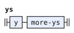</p>
<p>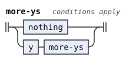</p>
</details>

## Brivla

A brivla is not a cmavo. It is any number of rafsi followed by a core. The core is a borrowing, a gismu, a CVV final rafsi, or a stressed rafsi followed by a short final rafsi.

```jbogenbau
%rule brivla                  (* brivla <- !cmavo initial_rafsi* brivla_core *)
  $r(initial-rafsis) brivla-core
%conditions
  ¬begins(from($r), cmavo)

%rule initial-rafsis          (* initial_rafsi* *)
  | $n(nothing)
  | initial-rafsi initial-rafsis
%conditions
  ¬begins(from($n), initial-rafsi)

%rule brivla-core             (* brivla_core <- fuhivla / gismu / CVV_final_rafsi / stressed_initial_rafsi short_final_rafsi *)
  | fuhivla
  | $g(gismu)
  | $v(cvv-final-rafsi)
  | $s(stressed-initial-rafsi) short-final-rafsi
%conditions
  ¬begins(from($g), fuhivla),
  ¬begins(from($v), fuhivla),
  ¬begins(from($v), gismu),
  ¬begins(from($s), fuhivla),
  ¬begins(from($s), gismu),
  ¬begins(from($s), cvv-final-rafsi)

%rule stressed-initial-rafsi  (* stressed_initial_rafsi <- stressed_extended_rafsi / stressed_y_rafsi / stressed_y_less_rafsi *)
  | stressed-extended-rafsi
  | $y(stressed-y-rafsi)
  | $l(stressed-y-less-rafsi)
%conditions
  ¬begins(from($y), stressed-extended-rafsi),
  ¬begins(from($l), stressed-extended-rafsi),
  ¬begins(from($l), stressed-y-rafsi)
```

<details><summary>Railroad diagrams of the 4 rules from <code>brivla</code> to <code>stressed-initial-rafsi</code></summary>
<p></p>
<p>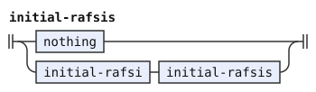</p>
<p>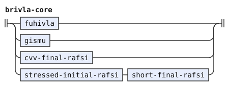</p>
<p>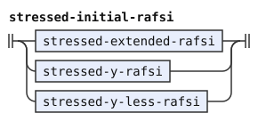</p>
</details>

A rafsi without a y-hyphen stands before the core only where neither it nor the part after it begins an extended rafsi or a borrowing. So `spageti'ybroda` begins with the extended rafsi `spageti'y`, and `selspageti` is one borrowing.

```jbogenbau
%rule initial-rafsi           (* initial_rafsi <- extended_rafsi / y_rafsi / !any_extended_rafsi y_less_rafsi !any_extended_rafsi *)
  | extended-rafsi
  | $y(y-rafsi)
  | $l(y-less-rafsi)
%conditions
  ¬begins(from($y), extended-rafsi),
  ¬begins(from($l), extended-rafsi),
  ¬begins(from($l), y-rafsi),
  ¬begins(from($l), any-extended-rafsi),
  ¬begins(after($l), any-extended-rafsi)

%rule any-extended-rafsi      (* any_extended_rafsi <- fuhivla / extended_rafsi / stressed_extended_rafsi; only a lookahead *)
  fuhivla | extended-rafsi | stressed-extended-rafsi
```

<details><summary>Railroad diagrams of <code>initial-rafsi</code> and <code>any-extended-rafsi</code></summary>
<p>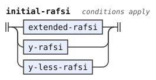</p>
<p>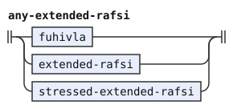</p>
</details>

## Borrowings and extended rafsi

A borrowing is a head of unstressed syllables, a stressed syllable, any number of consonantal syllables and a final syllable. Its head does not begin with a string of rafsi, and it is not a cmavo or a consonant followed by a string of rafsi. That last test is the slinku'i test of CLL[^cll-s4-7].

An extended rafsi lets a brivla or a borrowing, whole or cut short, stand before a y-hyphen inside a compound. A `brivla_rafsi` is a head of two syllables or more, followed by `'y`, as `klama'y` in `klama'ybroda`. A `fuhivla_rafsi` is the head of a borrowing followed by an onset and `y`. The onset is a consonant, as in `aktyiismu`, or a glide, as in `spageiybroda`. Each has a stressed form, which stands before a short final rafsi.

```jbogenbau
%rule fuhivla                 (* fuhivla <- fuhivla_head stressed_syllable consonantal_syllable* final_syllable *)
  fuhivla-head stressed-syllable consonantal-syllables final-syllable

%rule stressed-extended-rafsi (* stressed_extended_rafsi <- stressed_brivla_rafsi / stressed_fuhivla_rafsi *)
  | stressed-brivla-rafsi
  | $f(stressed-fuhivla-rafsi)
%conditions
  ¬begins(from($f), stressed-brivla-rafsi)

%rule extended-rafsi          (* extended_rafsi <- brivla_rafsi / fuhivla_rafsi *)
  | brivla-rafsi
  | $f(fuhivla-rafsi)
%conditions
  ¬begins(from($f), brivla-rafsi)

%rule stressed-brivla-rafsi   (* stressed_brivla_rafsi <- &unstressed_syllable brivla_head stressed_syllable h y *)
  $b(brivla-head) stressed-syllable h y
%conditions
  begins(from($b), unstressed-syllable)

%rule brivla-rafsi            (* brivla_rafsi <- &(syllable consonantal_syllable* syllable) brivla_head h y h? *)
  $b(brivla-head) h y h-opt
%conditions
  begins(from($b), two-syllables)

%rule two-syllables           (* syllable consonantal_syllable* syllable *)
  syllable consonantal-syllables syllable

%rule stressed-fuhivla-rafsi  (* stressed_fuhivla_rafsi <- fuhivla_head stressed_syllable consonantal_syllable* !h onset y *)
  fuhivla-head stressed-syllable $c(consonantal-syllables) onset y
%conditions
  ¬begins(after($c), h)

%rule fuhivla-rafsi           (* fuhivla_rafsi <- &unstressed_syllable fuhivla_head !h onset y h? *)
  $f(fuhivla-head) onset y h-opt
%conditions
  begins(from($f), unstressed-syllable),
  ¬begins(after($f), h)

%rule fuhivla-head            (* fuhivla_head <- !rafsi_string brivla_head *)
  $b(brivla-head)
%conditions
  ¬begins(from($b), rafsi-string)

%rule brivla-head             (* brivla_head <- !cmavo !slinkuhi !h &onset unstressed_syllable* *)
  $s(unstressed-syllables)
%conditions
  ¬begins(from($s), cmavo),
  ¬begins(from($s), slinkuhi),
  ¬begins(from($s), h),
  begins(from($s), onset)

%rule unstressed-syllables    (* unstressed_syllable* *)
  | $n(nothing)
  | unstressed-syllable unstressed-syllables
%conditions
  ¬begins(from($n), unstressed-syllable)

%rule slinkuhi                (* slinkuhi <- !rafsi_string consonant rafsi_string; only a lookahead *)
  $c(consonant) rafsi-string
%conditions
  ¬begins(from($c), rafsi-string)
```

<details><summary>Railroad diagrams of the 12 rules from <code>fuhivla</code> to <code>slinkuhi</code></summary>
<p>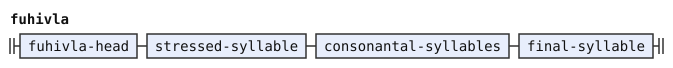</p>
<p>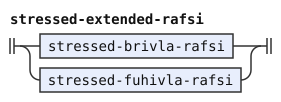</p>
<p>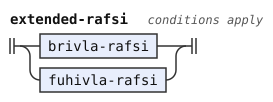</p>
<p>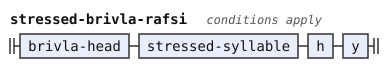</p>
<p>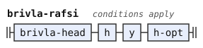</p>
<p>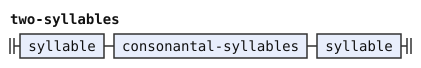</p>
<p>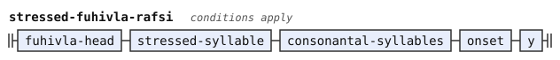</p>
<p>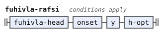</p>
<p>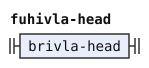</p>
<p>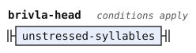</p>
<p>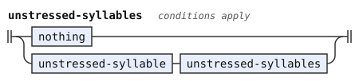</p>
<p>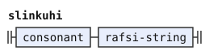</p>
</details>

The slinku'i test and a borrowing's head look for a string of rafsi. That is any number of rafsi without a y-hyphen, and then a part that can end a lujvo or that has a y-hyphen. The PEG uses it only in lookaheads.

```jbogenbau
%rule rafsi-string            (* rafsi_string <- y_less_rafsi* (...); only a lookahead *)
  y-less-rafsis rafsi-string-end

%rule y-less-rafsis           (* y_less_rafsi* *)
  | $n(nothing)
  | y-less-rafsi y-less-rafsis
%conditions
  ¬begins(from($n), y-less-rafsi)

%rule rafsi-string-end        (* gismu / CVV_final_rafsi / stressed_y_less_rafsi short_final_rafsi / y_rafsi / stressed_y_rafsi / stressed_y_less_rafsi? initial_pair y / hy_rafsi / stressed_hy_rafsi; only a lookahead *)
  | gismu
  | cvv-final-rafsi
  | stressed-y-less-rafsi short-final-rafsi
  | y-rafsi
  | stressed-y-rafsi
  | stressed-y-less-rafsi-opt initial-pair y
  | hy-rafsi
  | stressed-hy-rafsi

%rule stressed-y-less-rafsi-opt  (* stressed_y_less_rafsi? *)
  | stressed-y-less-rafsi
  | $n(nothing)
%conditions
  ¬begins(from($n), stressed-y-less-rafsi)
```

<details><summary>Railroad diagrams of the 4 rules from <code>rafsi-string</code> to <code>stressed-y-less-rafsi-opt</code></summary>
<p>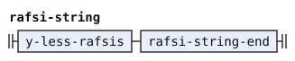</p>
<p>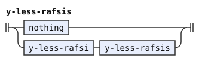</p>
<p>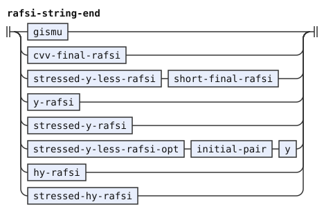</p>
<p>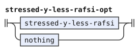</p>
</details>

## Rafsi

The core of a brivla ends it, and a pause or another word follows it. Its final syllable has an unstressed nucleus and is not followed by a name.

```jbogenbau
%rule gismu                   (* gismu <- (initial_pair stressed_vowel / consonant stressed_vowel consonant) &final_syllable consonant vowel &post_word *)
  gismu-start $c(consonant) $v(vowel)
%conditions
  begins(from($c), final-syllable),
  begins(after($v), post-word)

%rule gismu-start             (* initial_pair stressed_vowel / consonant stressed_vowel consonant; the second letter is a consonant in one and a vowel in the other *)
  initial-pair stressed-vowel | consonant stressed-vowel consonant

%rule cvv-final-rafsi         (* CVV_final_rafsi <- consonant stressed_vowel h &final_syllable vowel &post_word *)
  consonant stressed-vowel h $v(vowel)
%conditions
  begins(from($v), final-syllable),
  begins(after($v), post-word)

%rule short-final-rafsi       (* short_final_rafsi <- &final_syllable (consonant diphthong / initial_pair vowel) &post_word *)
  $r(short-final-body)
%conditions
  begins(from($r), final-syllable),
  begins(after($r), post-word)

%rule short-final-body        (* consonant diphthong / initial_pair vowel; the second letter is a vowel in one and a consonant in the other *)
  consonant diphthong | initial-pair vowel

%rule stressed-y-rafsi        (* stressed_y_rafsi <- (stressed_long_rafsi / stressed_CVC_rafsi) y *)
  | stressed-long-rafsi y
  | $c(stressed-cvc-rafsi) y
%conditions
  ¬begins(from($c), stressed-long-rafsi)

%rule stressed-y-less-rafsi   (* stressed_y_less_rafsi <- stressed_CVC_rafsi !y / stressed_CCV_rafsi / stressed_CVV_rafsi; CVC and CCV differ in the second letter, CVC and CVV in the third, CCV and CVV in the second *)
  | $c(stressed-cvc-rafsi)
  | stressed-ccv-rafsi
  | stressed-cvv-rafsi
%conditions
  ¬begins(after($c), y)

%rule stressed-long-rafsi     (* stressed_long_rafsi <- initial_pair stressed_vowel consonant / consonant stressed_vowel consonant consonant; they differ in the second letter *)
  initial-pair stressed-vowel consonant | consonant stressed-vowel consonant consonant

%rule stressed-cvc-rafsi      (* stressed_CVC_rafsi <- consonant stressed_vowel consonant *)
  consonant stressed-vowel consonant

%rule stressed-ccv-rafsi      (* stressed_CCV_rafsi <- initial_pair stressed_vowel *)
  initial-pair stressed-vowel

%rule stressed-cvv-rafsi      (* stressed_CVV_rafsi <- consonant (unstressed_vowel h stressed_vowel / stressed_diphthong) r_hyphen? *)
  consonant stressed-cvv-body r-hyphen-opt

%rule stressed-cvv-body       (* unstressed_vowel h stressed_vowel / stressed_diphthong; the second letter is an apostrophe in one and a vowel in the other *)
  unstressed-vowel h stressed-vowel | stressed-diphthong

%rule y-rafsi                 (* y_rafsi <- (long_rafsi / CVC_rafsi) y h? *)
  | long-rafsi y h-opt
  | $c(cvc-rafsi) y h-opt
%conditions
  ¬begins(from($c), long-rafsi)

%rule y-less-rafsi            (* y_less_rafsi <- !y_rafsi !stressed_y_rafsi !hy_rafsi !stressed_hy_rafsi (CVC_rafsi / CCV_rafsi / CVV_rafsi) !h *)
  $r(y-less-rafsi-body)
%conditions
  ¬begins(from($r), y-rafsi),
  ¬begins(from($r), stressed-y-rafsi),
  ¬begins(from($r), hy-rafsi),
  ¬begins(from($r), stressed-hy-rafsi),
  ¬begins(after($r), h)

%rule y-less-rafsi-body       (* CVC_rafsi / CCV_rafsi / CVV_rafsi; CVC and CCV differ in the second letter, CVC and CVV in the third, CCV and CVV in the second *)
  cvc-rafsi | ccv-rafsi | cvv-rafsi
```

<details><summary>Railroad diagrams of the 15 rules from <code>gismu</code> to <code>y-less-rafsi-body</code></summary>
<p>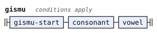</p>
<p></p>
<p></p>
<p></p>
<p></p>
<p></p>
<p></p>
<p></p>
<p></p>
<p></p>
<p></p>
<p></p>
<p></p>
<p></p>
<p></p>
</details>

A rafsi followed by `'y` is a `hy_rafsi`. The PEG uses it only to end a string of rafsi, so it builds no lujvo.

```jbogenbau
%rule hy-rafsi                (* hy_rafsi <- (long_rafsi vowel / CCV_rafsi / CVV_rafsi) h y h? *)
  hy-rafsi-body h y h-opt

%rule hy-rafsi-body           (* long_rafsi vowel / CCV_rafsi / CVV_rafsi; CVV differs from each of the others in its second or third letter *)
  | long-rafsi-vowel
  | $c(ccv-rafsi)
  | cvv-rafsi
%conditions
  ¬begins(from($c), long-rafsi-vowel)

%rule long-rafsi-vowel        (* long_rafsi vowel *)
  long-rafsi vowel

%rule stressed-hy-rafsi       (* stressed_hy_rafsi <- (long_rafsi stressed_vowel / stressed_CCV_rafsi / stressed_CVV_rafsi) h y *)
  stressed-hy-rafsi-body h y

%rule stressed-hy-rafsi-body  (* long_rafsi stressed_vowel / stressed_CCV_rafsi / stressed_CVV_rafsi; as hy-rafsi-body *)
  | long-rafsi-stressed-vowel
  | $c(stressed-ccv-rafsi)
  | stressed-cvv-rafsi
%conditions
  ¬begins(from($c), long-rafsi-stressed-vowel)

%rule long-rafsi-stressed-vowel  (* long_rafsi stressed_vowel *)
  long-rafsi stressed-vowel

%rule long-rafsi              (* long_rafsi <- initial_pair unstressed_vowel consonant / consonant unstressed_vowel consonant consonant; they differ in the second letter *)
  initial-pair unstressed-vowel consonant | consonant unstressed-vowel consonant consonant

%rule cvc-rafsi               (* CVC_rafsi <- consonant unstressed_vowel consonant *)
  consonant unstressed-vowel consonant

%rule ccv-rafsi               (* CCV_rafsi <- initial_pair unstressed_vowel *)
  initial-pair unstressed-vowel

%rule cvv-rafsi               (* CVV_rafsi <- consonant (unstressed_vowel h unstressed_vowel / unstressed_diphthong) r_hyphen? *)
  consonant cvv-body r-hyphen-opt

%rule cvv-body                (* unstressed_vowel h unstressed_vowel / unstressed_diphthong; the second letter is an apostrophe in one and a vowel in the other *)
  unstressed-vowel h unstressed-vowel | unstressed-diphthong

%rule r-hyphen                (* r_hyphen <- r &consonant / n &r *)
  | $r(r)
  | $n(n)
%conditions
  begins(after($r), consonant),
  begins(after($n), r)

%rule r-hyphen-opt            (* r_hyphen? *)
  | r-hyphen
  | $n(nothing)
%conditions
  ¬begins(from($n), r-hyphen)
```

<details><summary>Railroad diagrams of the 13 rules from <code>hy-rafsi</code> to <code>r-hyphen-opt</code></summary>
<p></p>
<p></p>
<p></p>
<p></p>
<p></p>
<p></p>
<p></p>
<p></p>
<p></p>
<p></p>
<p></p>
<p></p>
<p></p>
</details>

## Syllables and stress

A vowel, diphthong or syllable is stressed in two cases. In one, the letter after its onset is a capital vowel (`stressed`). In the other, one more syllable follows it before a pause (`stress`). It is unstressed when it is neither. A capital glide, or a capital second letter of a diphthong, marks nothing.

So an unmarked brivla is stressed on its penultimate syllable, and a pause must follow it. Another word can directly follow a brivla whose stress is marked.

```jbogenbau
%rule final-syllable          (* final_syllable <- onset !y !stressed nucleus !cmevla &post_word *)
  $o(onset) $n(nucleus)
%conditions
  ¬begins(after($o), y),
  ¬begins(after($o), stressed),
  ¬begins(after($n), cmevla),
  begins(after($n), post-word)

%rule stressed-syllable       (* stressed_syllable <- &stressed syllable / syllable &stress *)
  | $s(syllable)
  | $t(syllable)
%conditions
  begins(from($s), stressed),
  ¬begins(from($t), stressed),
  begins(after($t), stress)

%rule stressed-diphthong      (* stressed_diphthong <- &stressed diphthong / diphthong &stress *)
  | $s(diphthong)
  | $t(diphthong)
%conditions
  begins(from($s), stressed),
  ¬begins(from($t), stressed),
  begins(after($t), stress)

%rule stressed-vowel          (* stressed_vowel <- &stressed vowel / vowel &stress *)
  | $s(vowel)
  | $t(vowel)
%conditions
  begins(from($s), stressed),
  ¬begins(from($t), stressed),
  begins(after($t), stress)

%rule unstressed-syllable     (* unstressed_syllable <- !stressed syllable !stress / consonantal_syllable *)
  | unstressed-plain-syllable
  | $c(consonantal-syllable)
%conditions
  ¬begins(from($c), unstressed-plain-syllable)

%rule unstressed-plain-syllable  (* !stressed syllable !stress *)
  $s(syllable)
%conditions
  ¬begins(from($s), stressed),
  ¬begins(after($s), stress)

%rule unstressed-diphthong    (* unstressed_diphthong <- !stressed diphthong !stress *)
  $d(diphthong)
%conditions
  ¬begins(from($d), stressed),
  ¬begins(after($d), stress)

%rule unstressed-vowel        (* unstressed_vowel <- !stressed vowel !stress *)
  $v(vowel)
%conditions
  ¬begins(from($v), stressed),
  ¬begins(after($v), stress)

%rule stress                  (* stress <- (consonant / glide)* h? y? syllable pause; only a lookahead *)
  stress-onsets h-opt y-opt $s(syllable)
%conditions
  begins(after($s), pause)

%rule stress-onsets           (* (consonant / glide)*; a consonant and a glide are different letters *)
  | $n(nothing)
  | stress-onset stress-onsets
%conditions
  ¬begins(from($n), stress-onset)

%rule stress-onset            (* consonant / glide, repeated in (consonant / glide)* *)
  consonant | glide

%rule stressed                (* stressed <- onset comma* [AEIOU] *)
  onset stress-mark

%rule stress-mark             (* [AEIOU], a letter and not a vowel rule *)
  /A/ | /E/ | /I/ | /O/ | /U/
```

<details><summary>Railroad diagrams of the 13 rules from <code>final-syllable</code> to <code>stress-mark</code></summary>
<p></p>
<p></p>
<p></p>
<p></p>
<p></p>
<p></p>
<p></p>
<p></p>
<p></p>
<p></p>
<p></p>
<p></p>
<p></p>
</details>

A syllable is an onset, a nucleus and an optional coda. A consonantal syllable is a consonant before a syllabic consonant, and a coda. A coda is a consonant before another syllable, or at most a syllabic consonant and a consonant before a pause.

```jbogenbau
%rule any-syllable            (* any_syllable <- onset nucleus coda? / consonantal_syllable *)
  | onset-nucleus-coda
  | $c(consonantal-syllable)
%conditions
  ¬begins(from($c), onset-nucleus-coda)

%rule onset-nucleus-coda      (* onset nucleus coda? *)
  onset nucleus coda-opt

%rule syllable                (* syllable <- onset !y nucleus coda? *)
  $o(onset) nucleus coda-opt
%conditions
  ¬begins(after($o), y)

%rule consonantal-syllable    (* consonantal_syllable <- consonant &syllabic coda *)
  $c(consonant) coda
%conditions
  begins(after($c), syllabic)

%rule consonantal-syllables   (* consonantal_syllable* *)
  | $n(nothing)
  | consonantal-syllable consonantal-syllables
%conditions
  ¬begins(from($n), consonantal-syllable)

%rule coda                    (* coda <- !any_syllable consonant &any_syllable / syllabic? consonant? &pause *)
  | coda-before-syllable
  | $p(coda-before-pause)
%conditions
  ¬begins(from($p), coda-before-syllable)

%rule coda-before-syllable    (* !any_syllable consonant &any_syllable *)
  $c(consonant)
%conditions
  ¬begins(from($c), any-syllable),
  begins(after($c), any-syllable)

%rule coda-before-pause       (* syllabic? consonant? &pause *)
  syllabic-opt $c(consonant-opt)
%conditions
  begins(after($c), pause)

%rule coda-opt                (* coda? *)
  | coda
  | $n(nothing)
%conditions
  ¬begins(from($n), coda)

%rule onset                   (* onset <- h / glide / initial; h and glide begin with different letters, and initial can be empty *)
  | h
  | glide
  | $i(initial)
%conditions
  ¬begins(from($i), h),
  ¬begins(from($i), glide)

%rule nucleus                 (* nucleus <- vowel / diphthong / y !nucleus; y is a letter that no vowel or diphthong begins with *)
  | vowel
  | $d(diphthong)
  | $y(y)
%conditions
  ¬begins(from($d), vowel),
  ¬begins(after($y), nucleus)

%rule glide                   (* glide <- (i / u) &nucleus *)
  $g(i-or-u)
%conditions
  begins(after($g), nucleus)

%rule i-or-u                  (* i / u *)
  i | u

%rule diphthong               (* diphthong <- (a i !i / a u !u / e i !i / o i !i) !nucleus *)
  $d(diphthong-letters)
%conditions
  ¬begins(after($d), nucleus)

%rule diphthong-letters       (* a i !i / a u !u / e i !i / o i !i; they differ in the first or the second letter *)
  | a $i(i)
  | a $u(u)
  | e $j(i)
  | o $k(i)
%conditions
  ¬begins(after($i), i),
  ¬begins(after($u), u),
  ¬begins(after($j), i),
  ¬begins(after($k), i)

%rule vowel                   (* vowel <- (a / e / i / o / u) !nucleus *)
  $v(vowel-letter)
%conditions
  ¬begins(after($v), nucleus)

%rule vowel-letter            (* a / e / i / o / u *)
  a | e | i | o | u
```

<details><summary>Railroad diagrams of the 17 rules from <code>any-syllable</code> to <code>vowel-letter</code></summary>
<p></p>
<p></p>
<p></p>
<p></p>
<p></p>
<p></p>
<p></p>
<p></p>
<p></p>
<p></p>
<p></p>
<p></p>
<p></p>
<p></p>
<p></p>
<p></p>
<p></p>
</details>

## Letters

A vowel letter is plain or capital. A `y` is not followed by a nucleus, unless that nucleus is another `y`. An apostrophe is followed by a nucleus.

```jbogenbau
%rule a                       (* a <- comma* [aA] *)
  /a/ | /A/

%rule e                       (* e <- comma* [eE] *)
  /e/ | /E/

%rule i                       (* i <- comma* [iI] *)
  /i/ | /I/

%rule o                       (* o <- comma* [oO] *)
  /o/ | /O/

%rule u                       (* u <- comma* [uU] *)
  /u/ | /U/

%rule y                       (* y <- comma* [yY] !(!y nucleus) *)
  $y(any-y)
%conditions
  ¬begins(after($y), non-y-nucleus)

%rule non-y-nucleus           (* !y nucleus *)
  $n(nucleus)
%conditions
  ¬begins(from($n), y)

%rule h                       (* h <- comma* ['h] &nucleus *)
  $h(/'/)
%conditions
  begins(after($h), nucleus)
```

<details><summary>Railroad diagrams of <code>a</code>, <code>e</code>, <code>i</code>, <code>o</code>, <code>u</code>, <code>y</code>, <code>non-y-nucleus</code> and <code>h</code></summary>
<p></p>
<p></p>
<p></p>
<p></p>
<p></p>
<p></p>
<p></p>
<p></p>
</details>

## Consonants

An initial pair is two consonants that can begin a word. `initial` says which: an affricate, or a sibilant, another consonant and a liquid, each optional, where no consonant or glide follows. An affricate joins a stopped sound with friction. A sibilant is a hissing consonant. The liquids here are `l` and `r`.

```jbogenbau
%rule cluster                 (* cluster <- consonant consonant+; only a lookahead, so the first two consonants decide it *)
  consonant consonant

%rule initial-pair            (* initial_pair <- &initial consonant consonant !consonant *)
  $a(consonant) $b(consonant)
%conditions
  begins(from($a), initial),
  ¬begins(after($b), consonant)

%rule initial                 (* initial <- (affricate / sibilant? other? liquid?) !consonant !glide *)
  | $a(affricate)
  | $p(initial-parts)
%conditions
  ¬begins(after($a), consonant),
  ¬begins(after($a), glide),
  ¬begins(from($p), affricate),
  ¬begins(after($p), consonant),
  ¬begins(after($p), glide)

%rule initial-parts           (* sibilant? other? liquid? *)
  sibilant-opt other-opt liquid-opt

%rule affricate               (* affricate <- t c / t s / d j / d z; they differ in the first or the second letter *)
  t c | t s | d j | d z

%rule liquid                  (* liquid <- l / r *)
  l | r

%rule other                   (* other <- p / t !l / k / f / x / b / d !l / g / v / m / n !liquid *)
  | p | $t(t) | k | f | x | b | $d(d) | g | v | m | $n(n)
%conditions
  ¬begins(after($t), l),
  ¬begins(after($d), l),
  ¬begins(after($n), liquid)

%rule sibilant                (* sibilant <- c / s !x / (j / z) !n !liquid *)
  | c
  | $s(s)
  | $j(j-or-z)
%conditions
  ¬begins(after($s), x),
  ¬begins(after($j), n),
  ¬begins(after($j), liquid)

%rule j-or-z                  (* j / z *)
  j | z

%rule consonant               (* consonant <- voiced / unvoiced / syllabic *)
  voiced | unvoiced | syllabic

%rule syllabic                (* syllabic <- l / m / n / r *)
  l | m | n | r

%rule voiced                  (* voiced <- b / d / g / j / v / z *)
  b | d | g | j | v | z

%rule unvoiced                (* unvoiced <- c / f / k / p / s / t / x *)
  c | f | k | p | s | t | x
```

<details><summary>Railroad diagrams of the 13 rules from <code>cluster</code> to <code>unvoiced</code></summary>
<p></p>
<p></p>
<p></p>
<p></p>
<p></p>
<p></p>
<p></p>
<p></p>
<p></p>
<p></p>
<p></p>
<p></p>
<p></p>
</details>

Each consonant letter refuses a following apostrophe that begins a syllable, a glide, or the same consonant. Each letter also refuses consonants of the other voicing, and some letters refuse other letters, as CLL[^cll-s3-6] says.

```jbogenbau
%rule l                       (* l <- comma* [lL] !h !glide !l *)
  $c(/l/)
%conditions
  ¬begins(after($c), h),
  ¬begins(after($c), glide),
  ¬begins(after($c), l)

%rule m                       (* m <- comma* [mM] !h !glide !m !z *)
  $c(/m/)
%conditions
  ¬begins(after($c), h),
  ¬begins(after($c), glide),
  ¬begins(after($c), m),
  ¬begins(after($c), z)

%rule n                       (* n <- comma* [nN] !h !glide !n !affricate *)
  $c(/n/)
%conditions
  ¬begins(after($c), h),
  ¬begins(after($c), glide),
  ¬begins(after($c), n),
  ¬begins(after($c), affricate)

%rule r                       (* r <- comma* [rR] !h !glide !r *)
  $c(/r/)
%conditions
  ¬begins(after($c), h),
  ¬begins(after($c), glide),
  ¬begins(after($c), r)

%rule b                       (* b <- comma* [bB] !h !glide !b !unvoiced *)
  $c(/b/)
%conditions
  ¬begins(after($c), h),
  ¬begins(after($c), glide),
  ¬begins(after($c), b),
  ¬begins(after($c), unvoiced)

%rule d                       (* d <- comma* [dD] !h !glide !d !unvoiced *)
  $c(/d/)
%conditions
  ¬begins(after($c), h),
  ¬begins(after($c), glide),
  ¬begins(after($c), d),
  ¬begins(after($c), unvoiced)

%rule g                       (* g <- comma* [gG] !h !glide !g !unvoiced *)
  $c(/g/)
%conditions
  ¬begins(after($c), h),
  ¬begins(after($c), glide),
  ¬begins(after($c), g),
  ¬begins(after($c), unvoiced)

%rule v                       (* v <- comma* [vV] !h !glide !v !unvoiced *)
  $c(/v/)
%conditions
  ¬begins(after($c), h),
  ¬begins(after($c), glide),
  ¬begins(after($c), v),
  ¬begins(after($c), unvoiced)

%rule j                       (* j <- comma* [jJ] !h !glide !j !z !unvoiced *)
  $c(/j/)
%conditions
  ¬begins(after($c), h),
  ¬begins(after($c), glide),
  ¬begins(after($c), j),
  ¬begins(after($c), z),
  ¬begins(after($c), unvoiced)

%rule z                       (* z <- comma* [zZ] !h !glide !z !j !unvoiced *)
  $c(/z/)
%conditions
  ¬begins(after($c), h),
  ¬begins(after($c), glide),
  ¬begins(after($c), z),
  ¬begins(after($c), j),
  ¬begins(after($c), unvoiced)

%rule s                       (* s <- comma* [sS] !h !glide !s !c !voiced *)
  $c(/s/)
%conditions
  ¬begins(after($c), h),
  ¬begins(after($c), glide),
  ¬begins(after($c), s),
  ¬begins(after($c), c),
  ¬begins(after($c), voiced)

%rule c                       (* c <- comma* [cC] !h !glide !c !s !x !voiced *)
  $c(/c/)
%conditions
  ¬begins(after($c), h),
  ¬begins(after($c), glide),
  ¬begins(after($c), c),
  ¬begins(after($c), s),
  ¬begins(after($c), x),
  ¬begins(after($c), voiced)

%rule x                       (* x <- comma* [xX] !h !glide !x !c !k !voiced *)
  $c(/x/)
%conditions
  ¬begins(after($c), h),
  ¬begins(after($c), glide),
  ¬begins(after($c), x),
  ¬begins(after($c), c),
  ¬begins(after($c), k),
  ¬begins(after($c), voiced)

%rule k                       (* k <- comma* [kK] !h !glide !k !x !voiced *)
  $c(/k/)
%conditions
  ¬begins(after($c), h),
  ¬begins(after($c), glide),
  ¬begins(after($c), k),
  ¬begins(after($c), x),
  ¬begins(after($c), voiced)

%rule f                       (* f <- comma* [fF] !h !glide !f !voiced *)
  $c(/f/)
%conditions
  ¬begins(after($c), h),
  ¬begins(after($c), glide),
  ¬begins(after($c), f),
  ¬begins(after($c), voiced)

%rule p                       (* p <- comma* [pP] !h !glide !p !voiced *)
  $c(/p/)
%conditions
  ¬begins(after($c), h),
  ¬begins(after($c), glide),
  ¬begins(after($c), p),
  ¬begins(after($c), voiced)

%rule t                       (* t <- comma* [tT] !h !glide !t !voiced *)
  $c(/t/)
%conditions
  ¬begins(after($c), h),
  ¬begins(after($c), glide),
  ¬begins(after($c), t),
  ¬begins(after($c), voiced)
```

<details><summary>Railroad diagrams of the 17 rules from <code>l</code> to <code>t</code></summary>
<p></p>
<p></p>
<p></p>
<p></p>
<p></p>
<p></p>
<p></p>
<p></p>
<p></p>
<p></p>
<p></p>
<p></p>
<p></p>
<p></p>
<p></p>
<p></p>
<p></p>
</details>

## Greedy optionals

Each optional of the PEG is a rule that reads the optional part wherever it begins.

```jbogenbau
%rule h-opt                   (* h? *)
  | h
  | $n(nothing)
%conditions
  ¬begins(from($n), h)

%rule y-opt                   (* y? *)
  | y
  | $n(nothing)
%conditions
  ¬begins(from($n), y)

%rule syllabic-opt            (* syllabic? *)
  | syllabic
  | $n(nothing)
%conditions
  ¬begins(from($n), syllabic)

%rule consonant-opt           (* consonant? *)
  | consonant
  | $n(nothing)
%conditions
  ¬begins(from($n), consonant)

%rule sibilant-opt            (* sibilant? *)
  | sibilant
  | $n(nothing)
%conditions
  ¬begins(from($n), sibilant)

%rule other-opt               (* other? *)
  | other
  | $n(nothing)
%conditions
  ¬begins(from($n), other)

%rule liquid-opt              (* liquid? *)
  | liquid
  | $n(nothing)
%conditions
  ¬begins(from($n), liquid)
```

<details><summary>Railroad diagrams of the 7 rules from <code>h-opt</code> to <code>liquid-opt</code></summary>
<p></p>
<p></p>
<p></p>
<p></p>
<p></p>
<p></p>
<p></p>
</details>

## Differences from CLL and the reference PEG

The [checkpoint record](https://mw.lojban.org/index.php?title=BPFK_Checkpoints&oldid=109606) defers morphology. CLL 1.3.4[^cll-later-a3-3] describes this working grammar and its extended rafsi as practice without a vote.

The phoneme stage reads the text before this stage does. In four ways, the text that this stage reads differs from the text that the PEG reads:

- The PEG reads a digit as a cmavo, and lets a digit stand in a name (its rule `digit`). The phoneme stage reads each digit as the letters of its number word, so `2` is `re`. So this translation has no rule `digit`. `.b1b.` is not a name, and `.dj2n.` is the name `djren`.
- The PEG ignores a comma before any letter (`comma*` in each letter rule). The phoneme stage drops every comma, so the translation leaves out `comma*`, with the same result, except in the letter word `ybu`.

  The PEG's `ybu` reads pause characters between the `y` and the `bu`, but no comma, unless the comma stands directly before the `bu`. Where `ybu` fails, the PEG reads the `y` as hesitation, which is space. So the PEG rejects `y, bu` and `y , bu`, and reads `doi y, bu` as the letter word `doi bu`. The word stage reads the one letter word `y bu` in these texts (below). Both read `y ,bu` as that letter word.
- The PEG reads `h` as an apostrophe, and a consonant in either case. The phoneme stage emits both apostrophes as `'` and every consonant in lower case, so the translation reads only those. A capital vowel is a stressed vowel for both. The phoneme stage also reads an accent as stress. It reads a run of two vowel groups or more in which every vowel is a capital as a run without stress marks. The PEG reads neither.
- The PEG's pauses are whitespace and the characters `.`, `?` and `!`. The phoneme stage reads other punctuation as a pause too, and it emits a run of pause characters as one `PAUSE`.

The exception is the first spelling of `BY`, the rule `ybu <- Y space_char* BU`. It reads a run of `y`, any pause, and `bu` as one letter word: `ybu`, `y bu` and `yyybu` are each one word. That is the letter word `.y bu`, which the Magic Words proposal forms "before any other processing of any kind". This stage reads each run on its own, so it reads the `y` and the `bu` as two words. Before BU, the forms stage separates the final y from any prolonged hesitation. The shared word reader then forms the letter word ([stream.md](stream.md)).

Where the PEG's `ybu` begins, `cmavo` reads its run of `y` as one word in two cases. The run has one letter, or it has an even number of them. When it has an odd number, three or more, `cmavo` reads the first `y` alone and then the rest as one word. This is because `cmavo_form` reads first a single `y` that is a nucleus. So `yyybu` is `y`, `yy` and `bu`. `cmavo` then reads the `bu`, with the conditions of the PEG's `BU`.

So the division is the PEG's, with each `ybu` split into its hesitation words and its `bu`. Before BU, this stage splits each prolonged piece into a prefix and a final y. The word stage drops the prefix and forms the letter word from the final y.

The BPFK approved the consonant-glide-vowel ban on December 27, 2014 (CLL 1.3.4[^cll-later-a3-3]). The consonant rules retain that restriction.

[^cll-s4-7]: [CLL 1.1, section 4.7](https://lojban.org/publications/cll/cll_v1.1_xhtml-section-chunks/section-fuhivla.html).

[^cll-s3-6]: [CLL 1.1, section 3.6](https://lojban.org/publications/cll/cll_v1.1_xhtml-section-chunks/section-clusters.html).

[^cll-later-a3-3]: [CLL 1.3.4, appendix A3.3](https://github.com/int19h/cll/blob/v1.3.4/chapters/a03.xml#L155-L243). This later approval record has no CLL 1.1 counterpart.
