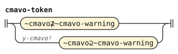
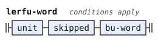

# The CLL word stream

This document is part of the word stage in the [CLL](../dialects/cll-ebnf.md) dialect. A stage is one step of a pipeline, with its own grammar. A token is one unit that a stage reads or emits. Each stage reads the tokens that the stage before it emitted, and emits new tokens. The dialect includes this document after [stream.md](stream.md). [The notation document](../../docs/notation.md) explains the notation.

The rules follow *The Complete Lojban Language* (CLL). A cmavo is a particle, a short structure word. A letteral is a letter word of class BY, as [stream.md](stream.md) defines it. This document warns about cmavo with `y` as a vowel and requires pauses around a name that `bu` takes.

The word forms admit a cmavo with `y` as one more vowel unit. Examples are `ka'y` and `ky'a` ([cll.md](cll.md)). The forms stage gives each such word the tag `cmavo-warning`. A tag marks a token by name, phoneme or character.

This stage reads the word under the warning `y-cmavo`. The stage always reads the word. A feature is a named switch that the grammars test. A caller who turns on the feature `y-cmavo` gets a warning for each such word.

The stage gives the warning where it reads the word as a Lojban word. That is, the word can be a word of the text, a quoted word, or a word inside `lo'u ... le'u`. It can also be a `zoi` delimiter or an operand of `zei`, erased or not. The warning is absent for the word inside a `zoi` body or after `fa'o`, because the stage does not read that word as Lojban.

```jbogenbau
%redefine-rule cmavo-token
  | ~cmavo⊉~cmavo-warning
  | y-cmavo! ~cmavo⊇~cmavo-warning
```

<details><summary>Railroad diagram of <code>cmavo-token</code></summary>
<p></p>
</details>

A name that `bu` takes needs a pause on both sides of it in the source (CLL[^cll-s17-4]). The forms stage requires a pause or the end of the text after every name, as CLL requires.[^cll-s4-9] It tags the first word of each run `run-initial`. A run is a stretch with no internal pause.

In CLL, a name that is not the first word of its run follows `la`, `lai`, `la'i` or `doi` directly, with no pause before it. So the name must be the first word of its run. Thus `ladjan.bu` and `ladjan.mi si bu` are no texts, and `la.djan.bu` is `la` and a letteral.

A replacement name keeps its source boundary. Thus `ladjan. sa .djim. bu` leaves `la` and the letteral of `djim`. A name inside a compound is not the operand: `ladjan. zei mi bu` makes a letteral of the compound. Inside `lo'u ... le'u`, where `bu` does nothing, `lo'u ladjan.bu le'u` is valid.

```jbogenbau
%redefine-rule lerfu-word
  $u(unit) skipped bu-word <~word ∪ BY ∪ ~fault ∩ tags($u)>
%conditions
  CMEVLA ⊈ tags($u) ∨ ~run-initial ⊆ tags($u)
%emits
  $
```

<details><summary>Railroad diagram of <code>lerfu-word</code></summary>
<p></p>
</details>

## Differences from CLL and BPFK

The `y`-cmavo forms extend those that CLL gives, as [cll.md](cll.md) explains. The word forms of the BPFK, the Lojban language planning committee, omit those forms and the CLL-specific pause test for names before BU.

[^cll-s17-4]: [CLL 1.1, section 17.4](https://lojban.org/publications/cll/cll_v1.1_xhtml-section-chunks/section-bu.html).

[^cll-s4-9]: [CLL 1.1, section 4.9, rule 2](https://lojban.org/publications/cll/cll_v1.1_xhtml-section-chunks/section-pauses.html).
