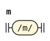
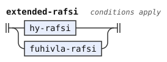
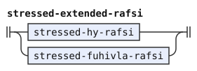
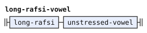
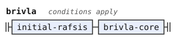
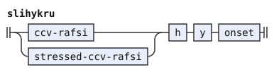
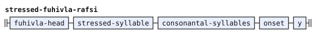
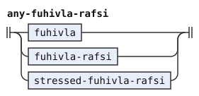

# Experimental word forms

This document is part of the forms stage in the [experimental](../dialects/experimental.md) dialect. The forms stage is the second stage of the pipeline. It divides the phonemes of the text into words. The loader stitches this document into the stage after [bpfk.md](bpfk.md).

A layer is a document that changes earlier rules. This layer changes the translated word forms in [bpfk.md](bpfk.md). A lookahead tests input without reading it.

The reference is camxes-exp, the experimental grammar of the camxes parser, written as a parsing expression grammar (PEG). Each rule here has the name of the camxes-exp rule that it translates, and its comment gives that rule, as in bpfk.md. The [Zantufa](../dialects/zantufa.md) dialect makes only the first change, in [zantufa.md](zantufa.md). [The notation document](../../docs/notation.md) explains the notation.

The prose uses these Lojban terms for words:

- A brivla is a predicate word.
- A gismu is a root word.
- A lujvo is a compound word.
- A rafsi is a shortened word form used inside compounds.

## The pair mz

A diphthong combines two vowels in one syllable. A nucleus is a syllable's vowel or diphthong. A glide is an `i` or `u` before a nucleus.

The rule for `m` rejects a following apostrophe, glide or `m`, but permits `z`. Thus `kamzi`, `bamzda` and `.djeimz.` have permissible consonant pairs.

```jbogenbau
%redefine-rule m              (* m <- comma* [mM] !h !glide !m *)
  $c(/m/)
%conditions
  ¬begins(after($c), h),
  ¬begins(after($c), glide),
  ¬begins(after($c), m)
```

<details><summary>Railroad diagram of <code>m</code></summary>
<p></p>
</details>

## Extended rafsi

An extended rafsi is a whole or shortened word before a y-hyphen. `extended-rafsi` chooses `hy-rafsi` first, then a borrowing rafsi. `hy-rafsi` takes a long rafsi with an unstressed vowel, a CCV rafsi, or a CVV rafsi before `'y`. Its stressed form follows the same choice. After these redefinitions, nothing reads the rules `brivla-rafsi`, `stressed-brivla-rafsi` and `two-syllables` of bpfk.md.

```jbogenbau
%redefine-rule extended-rafsi (* extended_rafsi <- hy_rafsi / fuhivla_rafsi *)
  | hy-rafsi
  | $f(fuhivla-rafsi)
%conditions
  ¬begins(from($f), hy-rafsi)

%redefine-rule stressed-extended-rafsi (* stressed_extended_rafsi <- stressed_hy_rafsi / stressed_fuhivla_rafsi *)
  | stressed-hy-rafsi
  | $f(stressed-fuhivla-rafsi)
%conditions
  ¬begins(from($f), stressed-hy-rafsi)

%redefine-rule long-rafsi-vowel (* long_rafsi unstressed_vowel, in hy_rafsi *)
  long-rafsi unstressed-vowel
```

<details><summary>Railroad diagrams of the 3 rules from <code>extended-rafsi</code> to <code>long-rafsi-vowel</code></summary>
<p></p>
<p></p>
<p></p>
</details>

A CCV `hy-rafsi` can otherwise begin a brivla, as in `bla'ykla`. `brivla` rejects that start with a CCV rafsi, `'y` and the next onset, which `slihykru` tests. Thus `kerlybla'ykla` is one word, but `bla'ykla` is not. The plain and stressed CCV choices need no order because their vowel stress differs.

```jbogenbau
%redefine-rule brivla         (* brivla <- !cmavo !slihykru initial_rafsi* brivla_core *)
  $r(initial-rafsis) brivla-core
%conditions
  ¬begins(from($r), cmavo),
  ¬begins(from($r), slihykru)

%rule slihykru                (* slihykru <- (CCV_rafsi / stressed_CCV_rafsi) h y onset; only a lookahead *)
  (ccv-rafsi | stressed-ccv-rafsi) h y onset
```

<details><summary>Railroad diagrams of <code>brivla</code> and <code>slihykru</code></summary>
<p></p>
<p></p>
</details>

The onset after a borrowing rafsi head can be an apostrophe. So `kerlyfa'u'yiismu` is one word: the rafsi `kerly` and `fa'u'y`, and the borrowing `iismu`.

```jbogenbau
%redefine-rule fuhivla-rafsi  (* fuhivla_rafsi <- &unstressed_syllable fuhivla_head onset y h? *)
  $f(fuhivla-head) onset y h-opt
%conditions
  begins(from($f), unstressed-syllable)

%redefine-rule stressed-fuhivla-rafsi (* stressed_fuhivla_rafsi <- fuhivla_head stressed_syllable consonantal_syllable* onset y *)
  fuhivla-head stressed-syllable consonantal-syllables onset y
```

<details><summary>Railroad diagrams of <code>fuhivla-rafsi</code> and <code>stressed-fuhivla-rafsi</code></summary>
<p></p>
<p></p>
</details>

`initial-rafsi` chooses an extended rafsi, then a y-rafsi, then a rafsi without a y-hyphen. The last choice cannot start a borrowing or borrowing rafsi, or stand directly before one. No rule reads `any-extended-rafsi` after this replacement.

```jbogenbau
%redefine-rule initial-rafsi  (* initial_rafsi <- extended_rafsi / y_rafsi / !any_fuhivla_rafsi y_less_rafsi !any_fuhivla_rafsi *)
  | extended-rafsi
  | $y(y-rafsi)
  | $l(y-less-rafsi)
%conditions
  ¬begins(from($y), extended-rafsi),
  ¬begins(from($l), extended-rafsi),
  ¬begins(from($l), y-rafsi),
  ¬begins(from($l), any-fuhivla-rafsi),
  ¬begins(after($l), any-fuhivla-rafsi)

%rule any-fuhivla-rafsi       (* any_fuhivla_rafsi <- fuhivla / fuhivla_rafsi / stressed_fuhivla_rafsi; only a lookahead *)
  fuhivla | fuhivla-rafsi | stressed-fuhivla-rafsi
```

<details><summary>Railroad diagrams of <code>initial-rafsi</code> and <code>any-fuhivla-rafsi</code></summary>
<p></p>
<p></p>
</details>

## A bare nai

The implication marks every NAI word `indicator`, as [the experimental lexicon](lexicon-experimental.md) marks the attitudinals. The mark comes from an implication, which the forms stage applies to each word that it emits. The indicator stage then attaches a bare `nai` to the word before it ([the experimental indicators](../indicators/experimental.md)).

```jbogenbau
%implies NAI ⟹ ~indicator
```

## Differences from CLL, BPFK and camxes-exp

camxes-exp extends the working word forms of the BPFK, the Lojban language planning committee. This layer retains its changes except the redundant glide lookahead described in [the dialect departures](../dialects/experimental.md#where-it-reads-texts-differently-from-camxes-exp).

*The Complete Lojban Language* (CLL) forbids the consonant pair `mz`.[^cll-s3-6] The working morphology, the word-form grammar that bpfk.md translates, forbids it too: its letter rule for `m` refuses a following `z`. The letter rule for `m` in camxes-exp refuses only another `m` among the consonants. So camxes-exp accepts `mz` wherever a permissible pair can stand. Examples are the gismu `kamzi`, the lujvo `bamzda` and the name `.djeimz.`.

The working morphology has two kinds of extended rafsi, which let a word, whole or cut short, stand before a y-hyphen inside a compound. A `brivla_rafsi` is the head of a brivla of two syllables or more, followed by `'y`, as in `klama'ybroda`. A `fuhivla_rafsi` is the head of a borrowing, followed by an onset and `y`, as in `spageiybroda`.

camxes-exp replaces the first kind with `hy_rafsi`, which the working morphology uses only in lookaheads. A `hy_rafsi` is a long rafsi and an unstressed vowel, a CCV rafsi, or a CVV rafsi, followed by `'y`. So `klama'ybroda` is one word in both grammars, but only camxes-exp reads `kerlybai'ybroda` as one word.

By itself, a `hy_rafsi` can also begin a brivla with a CCV rafsi, `'y` and the next rafsi. camxes-exp refuses that start, which it calls `slihykru`. So camxes-exp reads `kerlybla'ykla` as one word, but not `bla'ykla`, which the working morphology rejects too.

The working morphology rejects `kerlyfa'u'yiismu` because its borrowing rafsi onset cannot be an apostrophe. This layer follows camxes-exp and permits that onset.

In the working morphology, a short rafsi without a y-hyphen cannot stand where an extended rafsi or a borrowing begins, or directly before one. In camxes-exp, it cannot stand where a borrowing or the rafsi of a borrowing begins, or directly before one.

camxes-exp's `indicator` rule accepts a bare NAI like an attitudinal. This layer marks NAI as an indicator so that the indicator stage can attach it.

[^cll-s3-6]: [CLL 1.1, section 3.6](https://lojban.org/publications/cll/cll_v1.1_xhtml-section-chunks/section-clusters.html).
