# Word shapes

This document is part of the forms stage in the [CLL](../dialects/cll-ebnf.md) dialect. A stage is one step of a pipeline, with its own grammar ([engine §1](../../docs/engine.md#1-tokens)).

A diphthong combines two vowels in one syllable.

The document holds the sounds of the word forms in *The Complete Lojban Language* (CLL). These are the consonants and their pairs, the vowels and diphthongs, and the stress. The loader stitches it into the stage after [forms.md](forms.md) and before [cll.md](cll.md), which builds the words from these parts. The other dialects read the word forms of the BPFK (a Lojban committee) in [bpfk.md](bpfk.md) instead, and use nothing here. [The notation document](../../docs/notation.md) explains the notation.

Before this stage, the phoneme stage folds consonants to lowercase and writes every apostrophe as `/'/`. A token is one unit that a stage reads or emits. The only capital tokens are the stressed vowels `/A/ /E/ /I/ /O/ /U/ /Y/`. A comma reaches this stage only where it stands between two vowels, as the syllable break `/,/`.

A borrowing is a word taken from another language.

## Consonants

CLL[^cll-s3-6] lists the permissible consonant pairs. A pair is never the same consonant twice, never a voiced and an unvoiced consonant together, and never two of `c j s z`. CLL[^cll-s3-6] also forbids the pairs `cx`, `kx`, `xc`, `xk` and `mz`. The voiced consonants are `b d g v j z`, and the unvoiced ones are `p t k f c s x`. `l m n r` are neither. For each consonant C, the rule `after-C` lists the consonants that can follow C, 179 pairs in all.

CLL[^cll-s3-7] lists the 48 pairs that can begin a word. A longer cluster can begin a borrowing if each adjacent pair in it is one of the 48 (CLL[^cll-s4-7]). So `spraile` is a borrowing, but not `ktraile` or `trkaile`. `long-initial-run` is every such cluster of three consonants or more. CLL[^cll-s3-7] forbids the triples `ndj ndz ntc nts`, except in a name.

```jbogenbau
%rule consonant
  | /b/ | /c/ | /d/ | /f/ | /g/ | /j/ | /k/ | /l/ | /m/
  | /n/ | /p/ | /r/ | /s/ | /t/ | /v/ | /x/ | /z/

%rule initial-pair
  | /b/ /l/ | /b/ /r/
  | /c/ /f/ | /c/ /k/ | /c/ /l/ | /c/ /m/ | /c/ /n/ | /c/ /p/ | /c/ /r/ | /c/ /t/
  | /d/ /j/ | /d/ /r/ | /d/ /z/
  | /f/ /l/ | /f/ /r/
  | /g/ /l/ | /g/ /r/
  | /j/ /b/ | /j/ /d/ | /j/ /g/ | /j/ /m/ | /j/ /v/
  | /k/ /l/ | /k/ /r/
  | /m/ /l/ | /m/ /r/
  | /p/ /l/ | /p/ /r/
  | /s/ /f/ | /s/ /k/ | /s/ /l/ | /s/ /m/ | /s/ /n/ | /s/ /p/ | /s/ /r/ | /s/ /t/
  | /t/ /c/ | /t/ /r/ | /t/ /s/
  | /v/ /l/ | /v/ /r/
  | /x/ /l/ | /x/ /r/
  | /z/ /b/ | /z/ /d/ | /z/ /g/ | /z/ /m/ | /z/ /v/

%rule consonant-pair
  | /b/ after-b | /c/ after-c | /d/ after-d | /f/ after-f | /g/ after-g | /j/ after-j
  | /k/ after-k | /l/ after-l | /m/ after-m | /n/ after-n | /p/ after-p | /r/ after-r
  | /s/ after-s | /t/ after-t | /v/ after-v | /x/ after-x | /z/ after-z

%rule after-b
  /d/ | /g/ | /j/ | /v/ | /z/ | /l/ | /m/ | /n/ | /r/

%rule after-d
  /b/ | /g/ | /j/ | /v/ | /z/ | /l/ | /m/ | /n/ | /r/

%rule after-g
  /b/ | /d/ | /j/ | /v/ | /z/ | /l/ | /m/ | /n/ | /r/

%rule after-v
  /b/ | /d/ | /g/ | /j/ | /z/ | /l/ | /m/ | /n/ | /r/

%rule after-j
  /b/ | /d/ | /g/ | /v/ | /l/ | /m/ | /n/ | /r/

%rule after-z
  /b/ | /d/ | /g/ | /v/ | /l/ | /m/ | /n/ | /r/

%rule after-c
  /f/ | /k/ | /p/ | /t/ | /l/ | /m/ | /n/ | /r/

%rule after-s
  /f/ | /k/ | /p/ | /t/ | /x/ | /l/ | /m/ | /n/ | /r/

%rule after-x
  /f/ | /p/ | /s/ | /t/ | /l/ | /m/ | /n/ | /r/

%rule after-k
  /c/ | /f/ | /p/ | /s/ | /t/ | /l/ | /m/ | /n/ | /r/

%rule after-f
  /c/ | /k/ | /p/ | /s/ | /t/ | /x/ | /l/ | /m/ | /n/ | /r/

%rule after-p
  /c/ | /f/ | /k/ | /s/ | /t/ | /x/ | /l/ | /m/ | /n/ | /r/

%rule after-t
  /c/ | /f/ | /k/ | /p/ | /s/ | /x/ | /l/ | /m/ | /n/ | /r/

%rule after-l
  /b/ | /c/ | /d/ | /f/ | /g/ | /j/ | /k/ | /m/ | /n/ | /p/ | /r/ | /s/ | /t/ | /v/ | /x/ | /z/

%rule after-r
  /b/ | /c/ | /d/ | /f/ | /g/ | /j/ | /k/ | /l/ | /m/ | /n/ | /p/ | /s/ | /t/ | /v/ | /x/ | /z/

%rule after-m
  /b/ | /c/ | /d/ | /f/ | /g/ | /j/ | /k/ | /l/ | /n/ | /p/ | /r/ | /s/ | /t/ | /v/ | /x/

%rule after-n
  /b/ | /c/ | /d/ | /f/ | /g/ | /j/ | /k/ | /l/ | /m/ | /p/ | /r/ | /s/ | /t/ | /v/ | /x/ | /z/

%rule initial-cluster
  initial-pair | long-initial-run

%rule n-affricate
  /n/ /t/ /c/ | /n/ /t/ /s/ | /n/ /d/ /j/ | /n/ /d/ /z/

%rule consonants
  consonant | consonants consonant

%rule has-n-affricate
  [consonants] n-affricate [consonants]
```

<details><summary>Railroad diagrams of the 24 rules from <code>consonant</code> to <code>has-n-affricate</code></summary>
<p>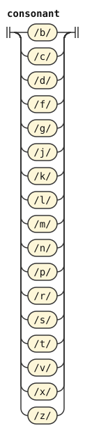</p>
<p>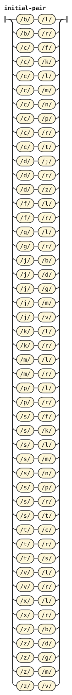</p>
<p>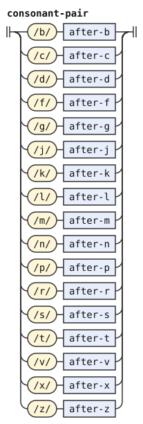</p>
<p></p>
<p>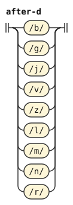</p>
<p></p>
<p></p>
<p>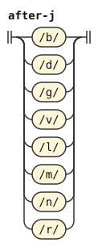</p>
<p>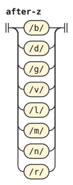</p>
<p>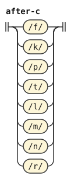</p>
<p>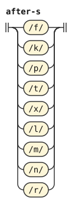</p>
<p></p>
<p>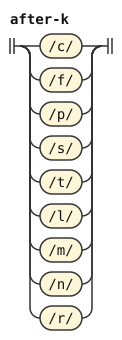</p>
<p>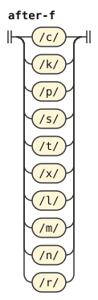</p>
<p>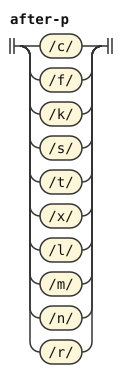</p>
<p>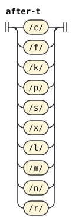</p>
<p></p>
<p>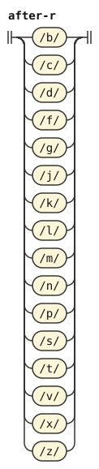</p>
<p>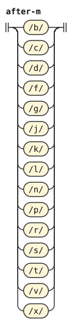</p>
<p>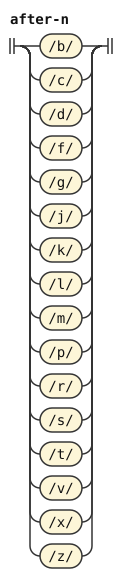</p>
<p>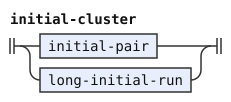</p>
<p>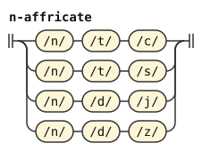</p>
<p>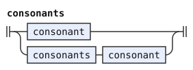</p>
<p>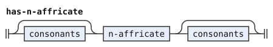</p>
</details>

A permissible run is a run of consonants whose adjacent pairs are all permissible. A name can have such a run anywhere (CLL[^cll-s3-7]), and so can the middle of a borrowing (CLL[^cll-s4-7]). A run that ends in a consonant C is C alone. Or it is a run that ends in a consonant that can precede C, followed by C. So `.tlaiv.` and `.ekstcat.` are names, but `.djeimz.` and `.bobb.` are not.

```jbogenbau
%rule permissible-run
  | run-b | run-c | run-d | run-f | run-g | run-j | run-k | run-l | run-m
  | run-n | run-p | run-r | run-s | run-t | run-v | run-x | run-z

%rule run-b
  /b/ | run-before-b /b/

%rule run-c
  /c/ | run-before-c /c/

%rule run-d
  /d/ | run-before-d /d/

%rule run-f
  /f/ | run-before-f /f/

%rule run-g
  /g/ | run-before-g /g/

%rule run-j
  /j/ | run-before-j /j/

%rule run-k
  /k/ | run-before-k /k/

%rule run-l
  /l/ | run-before-l /l/

%rule run-m
  /m/ | run-before-m /m/

%rule run-n
  /n/ | run-before-n /n/

%rule run-p
  /p/ | run-before-p /p/

%rule run-r
  /r/ | run-before-r /r/

%rule run-s
  /s/ | run-before-s /s/

%rule run-t
  /t/ | run-before-t /t/

%rule run-v
  /v/ | run-before-v /v/

%rule run-x
  /x/ | run-before-x /x/

%rule run-z
  /z/ | run-before-z /z/

%rule run-before-b
  run-d | run-g | run-j | run-l | run-m | run-n | run-r | run-v | run-z

%rule run-before-c
  run-f | run-k | run-l | run-m | run-n | run-p | run-r | run-t

%rule run-before-d
  run-b | run-g | run-j | run-l | run-m | run-n | run-r | run-v | run-z

%rule run-before-f
  run-c | run-k | run-l | run-m | run-n | run-p | run-r | run-s | run-t | run-x

%rule run-before-g
  run-b | run-d | run-j | run-l | run-m | run-n | run-r | run-v | run-z

%rule run-before-j
  run-b | run-d | run-g | run-l | run-m | run-n | run-r | run-v

%rule run-before-k
  run-c | run-f | run-l | run-m | run-n | run-p | run-r | run-s | run-t

%rule run-before-l
  | run-b | run-c | run-d | run-f | run-g | run-j | run-k | run-m
  | run-n | run-p | run-r | run-s | run-t | run-v | run-x | run-z

%rule run-before-m
  | run-b | run-c | run-d | run-f | run-g | run-j | run-k | run-l
  | run-n | run-p | run-r | run-s | run-t | run-v | run-x | run-z

%rule run-before-n
  | run-b | run-c | run-d | run-f | run-g | run-j | run-k | run-l
  | run-m | run-p | run-r | run-s | run-t | run-v | run-x | run-z

%rule run-before-p
  run-c | run-f | run-k | run-l | run-m | run-n | run-r | run-s | run-t | run-x

%rule run-before-r
  | run-b | run-c | run-d | run-f | run-g | run-j | run-k | run-l
  | run-m | run-n | run-p | run-s | run-t | run-v | run-x | run-z

%rule run-before-s
  run-f | run-k | run-l | run-m | run-n | run-p | run-r | run-t | run-x

%rule run-before-t
  run-c | run-f | run-k | run-l | run-m | run-n | run-p | run-r | run-s | run-x

%rule run-before-v
  run-b | run-d | run-g | run-j | run-l | run-m | run-n | run-r | run-z

%rule run-before-x
  run-f | run-l | run-m | run-n | run-p | run-r | run-s | run-t

%rule run-before-z
  run-b | run-d | run-g | run-l | run-n | run-r | run-v
```

<details><summary>Railroad diagrams of the 35 rules from <code>permissible-run</code> to <code>run-before-z</code></summary>
<p>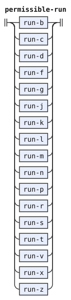</p>
<p></p>
<p>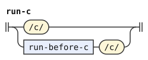</p>
<p></p>
<p></p>
<p></p>
<p>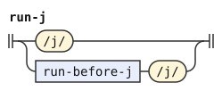</p>
<p>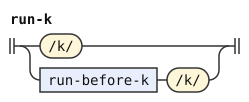</p>
<p></p>
<p></p>
<p></p>
<p></p>
<p></p>
<p></p>
<p></p>
<p></p>
<p></p>
<p></p>
<p>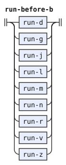</p>
<p>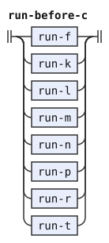</p>
<p>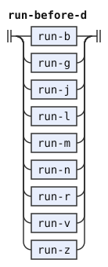</p>
<p>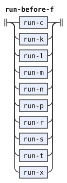</p>
<p></p>
<p>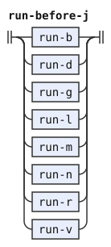</p>
<p>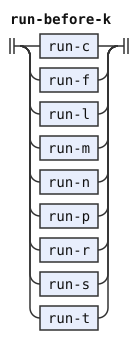</p>
<p>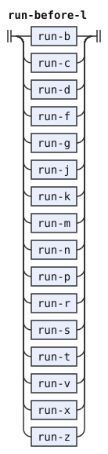</p>
<p>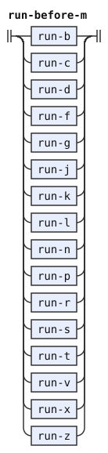</p>
<p>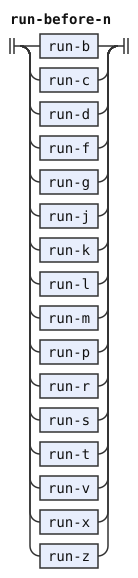</p>
<p>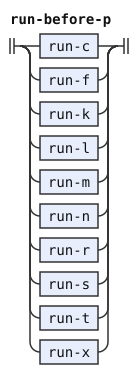</p>
<p>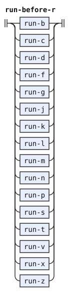</p>
<p>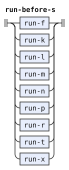</p>
<p>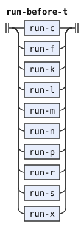</p>
<p>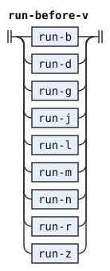</p>
<p>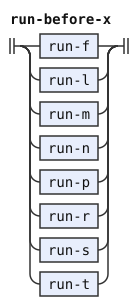</p>
<p>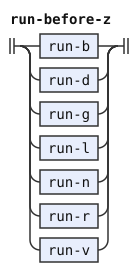</p>
</details>

```jbogenbau
%rule long-initial-run
  | initial-run-b /l/
  | initial-run-b /r/
  | initial-run-c /f/
  | initial-run-c /k/
  | initial-run-c /l/
  | initial-run-c /m/
  | initial-run-c /n/
  | initial-run-c /p/
  | initial-run-c /r/
  | initial-run-c /t/
  | initial-run-d /j/
  | initial-run-d /r/
  | initial-run-d /z/
  | initial-run-f /l/
  | initial-run-f /r/
  | initial-run-g /l/
  | initial-run-g /r/
  | initial-run-j /b/
  | initial-run-j /d/
  | initial-run-j /g/
  | initial-run-j /m/
  | initial-run-j /v/
  | initial-run-k /l/
  | initial-run-k /r/
  | initial-run-m /l/
  | initial-run-m /r/
  | initial-run-p /l/
  | initial-run-p /r/
  | initial-run-s /f/
  | initial-run-s /k/
  | initial-run-s /l/
  | initial-run-s /m/
  | initial-run-s /n/
  | initial-run-s /p/
  | initial-run-s /r/
  | initial-run-s /t/
  | initial-run-t /c/
  | initial-run-t /r/
  | initial-run-t /s/
  | initial-run-v /l/
  | initial-run-v /r/
  | initial-run-z /b/
  | initial-run-z /d/
  | initial-run-z /g/
  | initial-run-z /m/
  | initial-run-z /v/

%rule initial-run-b
  | /j/ /b/
  | /z/ /b/
  | initial-run-j /b/
  | initial-run-z /b/

%rule initial-run-c
  | /t/ /c/
  | initial-run-t /c/

%rule initial-run-d
  | /j/ /d/
  | /z/ /d/
  | initial-run-j /d/
  | initial-run-z /d/

%rule initial-run-f
  | /c/ /f/
  | /s/ /f/
  | initial-run-c /f/
  | initial-run-s /f/

%rule initial-run-g
  | /j/ /g/
  | /z/ /g/
  | initial-run-j /g/
  | initial-run-z /g/

%rule initial-run-j
  | /d/ /j/
  | initial-run-d /j/

%rule initial-run-k
  | /c/ /k/
  | /s/ /k/
  | initial-run-c /k/
  | initial-run-s /k/

%rule initial-run-m
  | /c/ /m/
  | /j/ /m/
  | /s/ /m/
  | /z/ /m/
  | initial-run-c /m/
  | initial-run-j /m/
  | initial-run-s /m/
  | initial-run-z /m/

%rule initial-run-p
  | /c/ /p/
  | /s/ /p/
  | initial-run-c /p/
  | initial-run-s /p/

%rule initial-run-s
  | /t/ /s/
  | initial-run-t /s/

%rule initial-run-t
  | /c/ /t/
  | /s/ /t/
  | initial-run-c /t/
  | initial-run-s /t/

%rule initial-run-v
  | /j/ /v/
  | /z/ /v/
  | initial-run-j /v/
  | initial-run-z /v/

%rule initial-run-z
  | /d/ /z/
  | initial-run-d /z/
```

<details><summary>Railroad diagrams of the 14 rules from <code>long-initial-run</code> to <code>initial-run-z</code></summary>
<p>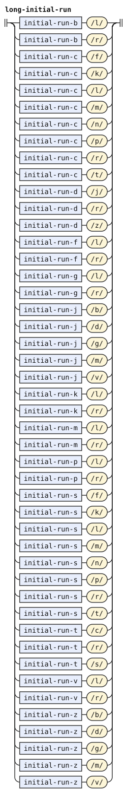</p>
<p></p>
<p></p>
<p>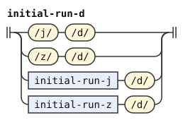</p>
<p></p>
<p></p>
<p>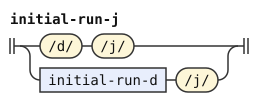</p>
<p>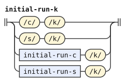</p>
<p>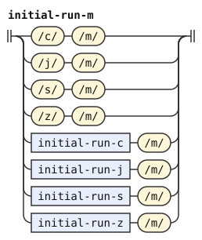</p>
<p>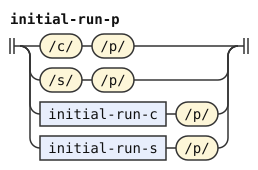</p>
<p>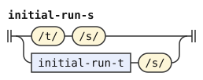</p>
<p>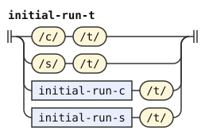</p>
<p>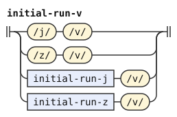</p>
<p>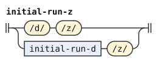</p>
</details>

## Vowels

A vowel of a word form is one of `a e i o u`, in either case. `y` is not one of them. It is a hyphen in a compound word (lujvo), a vowel of a name, a letter of a few particles (cmavo), and hesitation. A capital vowel marks stress, and nothing else about the word changes with the case of a letter.

The diphthongs of CLL[^cll-s3-4] are the falling `ai ei oi au` and the rising `ia ie ii io iu ua ue ui uo uu`. The rising ones can stand only in names and borrowings, and in a cmavo only as the whole word. A name can also have `iy` and `uy`. A diphthong can have a capital on either letter or on both, and it then marks one stressed syllable.

A vowel letter is either phoneme, plain or stressed, since the stress of a cmavo is free (CLL[^cll-s3-9]). [forms.md](forms.md) reads `any-y` in the same way.

```jbogenbau
%rule vowel
  any-a | any-e | any-i | any-o | any-u

%rule any-a
  /a/ | /A/

%rule any-e
  /e/ | /E/

%rule any-i
  /i/ | /I/

%rule any-o
  /o/ | /O/

%rule any-u
  /u/ | /U/

%rule capital-vowel
  /A/ | /E/ | /I/ | /O/ | /U/

%rule capital-letter
  capital-vowel | /Y/

%rule i-or-u
  any-i | any-u

%rule e-or-o
  any-e | any-o

%rule falling-diphthong
  any-a any-i | any-e any-i | any-o any-i | any-a any-u

%rule rising-diphthong
  i-or-u vowel

%rule y-diphthong
  i-or-u any-y

%rule r-letter
  /r/

%rule any-letters
  any-letter | any-letters any-letter

%rule any-letter
  consonant | vowel | any-y | /'/ | /,/

%rule stress-mark
  [any-letters] capital-letter [any-letters]
```

<details><summary>Railroad diagrams of the 17 rules from <code>vowel</code> to <code>stress-mark</code></summary>
<p>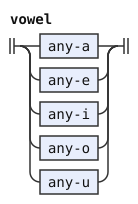</p>
<p></p>
<p></p>
<p></p>
<p></p>
<p></p>
<p></p>
<p></p>
<p></p>
<p></p>
<p></p>
<p></p>
<p></p>
<p></p>
<p></p>
<p></p>
<p></p>
</details>

## Syllables and stress

A run of vowels with no apostrophe or comma in it divides into syllables from the left (CLL[^cll-s3-5]). At each point, the next two vowels are one syllable if they form a diphthong that the word allows. Otherwise the next vowel is a syllable alone. So `briau` is `bria-u`, and `.meiin.` is `mei-in`. A name or a borrowing can have two vowels that form no diphthong, each its own syllable, as in the `korea` of `bangrkorea`.

The stress of a word depends on its syllables. CLL[^cll-s3-9] counts the syllables of `a e i o u` and their diphthongs. It does not count a syllable of `y`, `iy` or `uy`, or of a syllabic consonant. A syllabic consonant is still a consonant here, so it adds no syllable at all.

A brivla is a predicate word. It is stressed on its penultimate counted syllable. If a capital vowel marks the stress, every capital vowel of the brivla must be in that syllable, and exactly one counted syllable follows it. So `BAjykla` is right, because CLL[^cll-s3-9] does not count the `y`, and `bAIkla` is right, because `aI` is one syllable. A capital `Y` never stands in a brivla.

`brivla-scan` reads the letters of a brivla one syllable nucleus at a time, from the left. Its tags, the names that it puts on what it reads, say where the stress is. A nucleus is a vowel or a diphthong of a brivla. A vowel can stand alone before another vowel only if the two form no diphthong. So the reading is unique, and it is CLL's grouping. The tags are:

- `s0`, `s1` and `s2` track the marked nucleus. `s0` holds before the scan reads a capital vowel, and `s1` after the one marked nucleus. `s2` holds after the marked nucleus and one more counted nucleus. A second marked nucleus, or a second counted nucleus after the marked one, leaves no `s` tag.
- `n0`, `n1`, `n2` and `n3`, for no counted nucleus, one, two, and three or more
- `first-marked`, when the first counted nucleus is the marked one
- `single-end`, when the last letter read is a vowel that is a nucleus by itself

So a brivla with marked stress has `s2`, and one without any capital vowel has `s0` and at least `n2`. [cll.md](cll.md) applies these tests.

```jbogenbau
%rule brivla-scan
  | $i(brivla-item)
      <(~counted ⊆ tags($i) ⟹ ~n1) ∪ (~counted ⊈ tags($i) ⟹ ~n0)
       ∪ (~marked ⊆ tags($i) ⟹ ~s1 ∪ ~first-marked) ∪ (~marked ⊈ tags($i) ⟹ ~s0)
       ∪ ~single-end ∩ tags($i)>
  | $s(brivla-scan) $j(brivla-item)
      <(~s0 ⊆ tags($s) ∧ ~marked ⊈ tags($j) ⟹ ~s0)
       ∪ (~s0 ⊆ tags($s) ∧ ~marked ⊆ tags($j) ⟹ ~s1)
       ∪ (~s1 ⊆ tags($s) ∧ ~counted ⊈ tags($j) ⟹ ~s1)
       ∪ (~s1 ⊆ tags($s) ∧ ~counted ⊆ tags($j) ∧ ~marked ⊈ tags($j) ⟹ ~s2)
       ∪ (~s2 ⊆ tags($s) ∧ ~counted ⊈ tags($j) ⟹ ~s2)
       ∪ (~counted ⊈ tags($j) ⟹ (~n0 ∪ ~n1 ∪ ~n2 ∪ ~n3) ∩ tags($s))
       ∪ (~counted ⊆ tags($j) ∧ ~n0 ⊆ tags($s) ⟹ ~n1)
       ∪ (~counted ⊆ tags($j) ∧ ~n1 ⊆ tags($s) ⟹ ~n2)
       ∪ (~counted ⊆ tags($j) ∧ (~n2 ∪ ~n3) ∩ tags($s) ≠ ∅ ⟹ ~n3)
       ∪ ~first-marked ∩ tags($s)
       ∪ (~n0 ⊆ tags($s) ∧ ~marked ⊆ tags($j) ⟹ ~first-marked)
       ∪ ~single-end ∩ tags($j)>
%conditions
  ~single-end ⊈ tags($s)
    ∨ ¬matches(head($j), vowel)
    ∨ ¬matches(last($s), i-or-u)
      ∧ (¬matches(last($s), any-a) ∨ ¬matches(head($j), i-or-u))
      ∧ (¬matches(last($s), e-or-o) ∨ ¬matches(head($j), any-i))

%rule brivla-item
  | consonant | /y/ | /'/ | /,/
  | $v(vowel) <~counted ∪ ~single-end ∪ (matches($v, capital-vowel) ⟹ ~marked)>
  | $d(brivla-diphthong) <~counted ∪ (matches($d, stress-mark) ⟹ ~marked)>

%rule brivla-diphthong
  falling-diphthong | rising-diphthong
```

<details><summary>Railroad diagrams of <code>brivla-scan</code>, <code>brivla-item</code> and <code>brivla-diphthong</code></summary>
<p></p>
<p></p>
<p></p>
</details>

A cmavo or a name can have capital vowels on any of its syllables, `Y` included (CLL[^cll-s3-9] lets their stress fall anywhere). A name with no capital vowel is stressed on its penultimate counted syllable if it has two or more. It is stressed on its only counted syllable if it has one, and nowhere if it has none. `name-scan` reads a name as `brivla-scan` reads a brivla, with the diphthongs a name allows. A `y` is a nucleus of its own, and never the first letter of a diphthong. Its tags are:

- `n0` to `n3` and `single-end`, as above
- `v0` before the scan reads a nucleus, and `v1` after the first nucleus
- `first-counted`, when the first nucleus is counted, and `first-marked`, when it has a capital vowel
- `any-marked`, when some nucleus has a capital vowel

The forms stage uses the stress on the first syllable of a name, for CLL[^cll-s4-2]'s pause between two stressed syllables. That is where `la` or `doi` comes before a name with no pause.

```jbogenbau
%rule name-scan
  | $i(name-item)
      <(~nucleus ⊆ tags($i) ⟹ ~v1) ∪ (~nucleus ⊈ tags($i) ⟹ ~v0)
       ∪ (~counted ⊆ tags($i) ⟹ ~n1 ∪ ~first-counted) ∪ (~counted ⊈ tags($i) ⟹ ~n0)
       ∪ (~marked ⊆ tags($i) ⟹ ~first-marked ∪ ~any-marked)
       ∪ ~single-end ∩ tags($i)>
  | $s(name-scan) $j(name-item)
      <(~v1 ⊆ tags($s) ∨ ~nucleus ⊆ tags($j) ⟹ ~v1)
       ∪ (~v0 ⊆ tags($s) ∧ ~nucleus ⊈ tags($j) ⟹ ~v0)
       ∪ ~first-counted ∩ tags($s)
       ∪ (~v0 ⊆ tags($s) ∧ ~counted ⊆ tags($j) ⟹ ~first-counted)
       ∪ ~first-marked ∩ tags($s)
       ∪ (~v0 ⊆ tags($s) ∧ ~marked ⊆ tags($j) ⟹ ~first-marked)
       ∪ ~any-marked ∩ tags($s)
       ∪ (~marked ⊆ tags($j) ⟹ ~any-marked)
       ∪ (~counted ⊈ tags($j) ⟹ (~n0 ∪ ~n1 ∪ ~n2 ∪ ~n3) ∩ tags($s))
       ∪ (~counted ⊆ tags($j) ∧ ~n0 ⊆ tags($s) ⟹ ~n1)
       ∪ (~counted ⊆ tags($j) ∧ ~n1 ⊆ tags($s) ⟹ ~n2)
       ∪ (~counted ⊆ tags($j) ∧ (~n2 ∪ ~n3) ∩ tags($s) ≠ ∅ ⟹ ~n3)
       ∪ ~single-end ∩ tags($j)>
%conditions
  ~single-end ⊈ tags($s)
    ∨ ¬matches(head($j), name-vowel)
    ∨ ¬matches(last($s), i-or-u)
      ∧ (¬matches(last($s), any-a) ∨ ¬matches(head($j), i-or-u))
      ∧ (¬matches(last($s), e-or-o) ∨ ¬matches(head($j), any-i))

%rule name-item
  | consonant | /'/ | /,/
  | $v(vowel) <~nucleus ∪ ~counted ∪ ~single-end ∪ (matches($v, capital-vowel) ⟹ ~marked)>
  | $y(any-y) <~nucleus ∪ (matches($y, stress-mark) ⟹ ~marked)>
  | $d(brivla-diphthong) <~nucleus ∪ ~counted ∪ (matches($d, stress-mark) ⟹ ~marked)>
  | $e(y-diphthong) <~nucleus ∪ (matches($e, stress-mark) ⟹ ~marked)>

%rule name-vowel
  vowel | any-y
```

<details><summary>Railroad diagrams of <code>name-scan</code>, <code>name-item</code> and <code>name-vowel</code></summary>
<p></p>
<p></p>
<p></p>
</details>

[^cll-s3-6]: [CLL 1.1, section 3.6](https://lojban.org/publications/cll/cll_v1.1_xhtml-section-chunks/section-clusters.html).

[^cll-s3-7]: [CLL 1.1, section 3.7](https://lojban.org/publications/cll/cll_v1.1_xhtml-section-chunks/section-initial-pairs.html).

[^cll-s4-7]: [CLL 1.1, section 4.7](https://lojban.org/publications/cll/cll_v1.1_xhtml-section-chunks/section-fuhivla.html).

[^cll-s3-4]: [CLL 1.1, section 3.4](https://lojban.org/publications/cll/cll_v1.1_xhtml-section-chunks/section-diphthongs.html).

[^cll-s3-9]: [CLL 1.1, section 3.9](https://lojban.org/publications/cll/cll_v1.1_xhtml-section-chunks/section-stress.html).

[^cll-s3-5]: [CLL 1.1, section 3.5](https://lojban.org/publications/cll/cll_v1.1_xhtml-section-chunks/section-vowel-pairs.html).

[^cll-s4-2]: [CLL 1.1, section 4.2](https://lojban.org/publications/cll/cll_v1.1_xhtml-section-chunks/section-cmavo.html).
