# The word stream

This document defines the word stage of cll-ebnf, bpfk, experimental, and Zantufa. A stage reads the tokens from the previous stage and emits tokens for the next stage.

The [forms stage](forms.md) supplies source words. This stage applies quotes, compounds, erasers, hesitation, and FAhO. The [notation document](../../docs/notation.md) explains the notation of the rules below.

A unit is one item on which an operation acts. A token is one emitted item for the next stage. An opaque unit hides its internal words from later operations. Every quote and compound is one opaque unit, even when its emission contains several tokens.

A letteral is a letter word of class BY. The y letteral sounds like ybu.

The shared grammar processes operations from left to right. Zantufa adds two local exceptions ([zantufa-stream.md](zantufa-stream.md)). Later operations act on whole quote and compound units.

## The stream of elements

The stream contains live units and erased regions. A live unit is a unit that no eraser removes.

Each operator acts on the units that survive when the stage reaches it. No operator reaches inside a unit.

A shared word reader supplies every requested word. It joins hesitation with a following `bu` before any operation takes that word. This exception applies inside ZO quotes, LOhU and LOhAI bodies, delimiters, and ZEI operands.

An erased region emits nothing. Later operators skip that region and use the surviving units beside it. Erasure never restores an earlier erased word.

A dangling `bu` creates a unit with a missing-base fault. A dangling `le'u` creates a unit with an unopened-quote fault. Constructors preserve these faults, and erasers remove the whole units.

A second `bu` wraps a fault unit like any other unit. Thus `bu bu si` leaves nothing. If a fault survives to the text end or an active `fa'o`, the word stage rejects the text.

Hesitation emits nothing unless the word reader joins it with `bu`. The reader treats `yybu` as hesitation followed by the y letteral. The reader also forms the y letteral from `.yy. bu` and `.yyy. bu`.

An active `fa'o` ends the text. The stage reads no words after it. A quoted `fa'o` or a right operand of `zei` does not end the text.

BAhE marks the next word in the indicator stage. It remains a separate unit during word operations. The dialects keep `mi ba'e fa'o` rejected because the surviving BAhE has no target.

The rule `empty` reads a prefix that leaves no units. Its first three alternatives read the text start, stray SI, and an erased stretch. The next three read SU after an empty prefix, whole-prefix SU, and boundary-aware SU without a boundary. The last three read unmatched SA and trailing SA after an empty or nonempty prefix. The rule `su-cleared` keeps its boundary test beside the stream that it tests.

```jbogenbau
%ambiguity-resolution lazy

%rule text
  | empty [faho-group]
  | $s(stream) spacing [faho-group]
%conditions
  ~fault ⊈ tags($s)

%rule text-start
  ε
%conditions
  initial($)

%rule empty
  | text-start spacing
  | empty si-word spacing
  | empty erasure spacing
  | sa-su? empty su-word spacing
  | sa-su? ¬su-boundary? stream spacing su-word spacing
  | su-cleared
  | sa-su? sa-wiped spacing
  | sa-su? empty sa-tail
  | sa-su? stream spacing sa-tail
%emits
  ε

%rule su-cleared
  sa-su? su-boundary? $s(stream) spacing su-word spacing
%conditions
  classes($s) ∩ $SU-STOPS = ∅

%rule stream
  | empty $u(unit) <tags($u)>
  | $s(stream) spacing $u(unit) <tags($s) ∪ tags($u)>
  | $s(stream) spacing erasure <tags($s)>

%rule unit
  word | quote | lerfu-word | zei-compound | fault-unit | su-survivor

%rule spacing
  [PAUSE] [hesitations [PAUSE]]

%rule skipped
  spacing [erasures spacing]

%rule erasures
  erasure | erasures spacing erasure

%rule erasure
  si-erasure | sa-su? sa-erasure

%rule fault-unit
  | empty bu-word <~word ∪ BY ∪ ~fault>
  | lehu-marker <~word ∪ LEhU ∪ ~fault>
%emits
  $

%rule hesitation
  $h(y-run) <∅>
%conditions
  ¬begins(from($h), y-bu-word)
%emits
  ε

%rule y-run
  ~hesitation

%rule faho-group
  faho-word [raw-tokens]
%emits
  ε

%rule faho-word
  read-word∩FAhO≠∅

%rule sa-tail
  sa-su? sa-run spacing
%conditions
  ¬begins(after($), read-word)
```

<details><summary>Railroad diagrams of the 16 rules from <code>text</code> to <code>sa-tail</code></summary>
<p>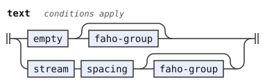</p>
<p>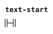</p>
<p>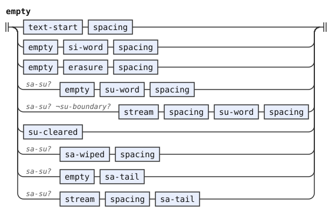</p>
<p>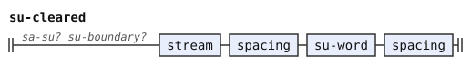</p>
<p>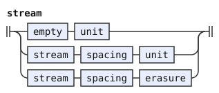</p>
<p>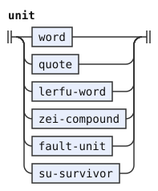</p>
<p>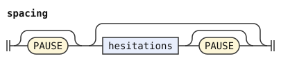</p>
<p>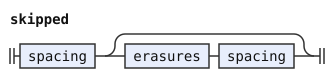</p>
<p>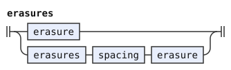</p>
<p>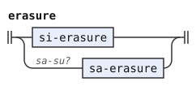</p>
<p>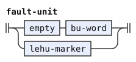</p>
<p></p>
<p>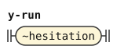</p>
<p>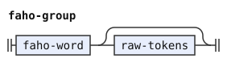</p>
<p>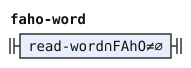</p>
<p>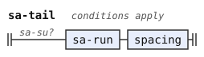</p>
</details>

## Words

The forms stage supplies source words, their lexical classes, and their run boundaries. A run is a stretch without a pause. This stage does not divide ordinary runs again.

The shared reader reads a cmavo, brivla, cmevla, or the y letteral. A cmavo is a particle. A brivla is a predicate word. A cmevla is a name word.

Every cmavo read uses `cmavo-token`. The dialect of *The Complete Lojban Language* (CLL) adds optional word-form warnings there. A word read in the chosen derivation keeps its warning even if an eraser later removes the word.

A failed word stage publishes no warnings from that stage. A successful stage keeps warnings from its chosen derivation. Raw quote bodies and the suffix after active `fa'o` supply no word reads.

The lexicon gives each cmavo its classes. Operators use these classes rather than spelling. The experimental syntax can treat names as predicates without changing their lexical class.

The feature `sa-su` enables the two long-range erasers. Without that feature, SA and SU are ordinary words. The libraries turn on `sa-su` for a text that needs it ([engine §13](../../docs/engine.md#13-the-pipeline)). The rule `word` identifies such texts by tagging SA and SU only when that feature is off.

```jbogenbau
%const $MAGIC-WORDS
  ZO ∪ ZOI ∪ LOhU ∪ LEhU ∪ ZOhOI ∪ MEhOI ∪ FAhO ∪ BU ∪ ZEI ∪ SI ∪ SA ∪ SU

%rule read-word
  | $c(cmavo-token) <tags($c)>
  | $b(BRIVLA) <tags($b)>
  | $n(CMEVLA) <tags($n)>
  | $y(y-bu-word) <tags($y)>

%rule y-bu-word
  $b(y-key) [PAUSE] $u(bu-word)
%tags
  ~word ∪ BY ∪ ~y-letter ∪ tags($b) ∪ ~run-initial ∩ tags(head($b)) ∪ ~run-final ∩ tags(last($u))
%emits
  $

%rule word
  | sa-su? $c(read-word) <tags($c)>
  | ¬sa-su? $e(read-word) <tags($e)>
%conditions
  classes($c) ∩ $MAGIC-WORDS = ∅,
  classes($e) ∩ ($MAGIC-WORDS ∖ (SA ∪ SU)) = ∅,
  ¬begins(from($c), quote),
  ¬begins(from($e), quote)
%emits
  $

%rule cmavo-token
  $c(~cmavo) <tags($c)>

```

<details><summary>Railroad diagrams of <code>read-word</code>, <code>y-bu-word</code>, <code>word</code> and <code>cmavo-token</code></summary>
<p>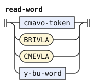</p>
<p>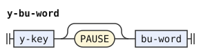</p>
<p>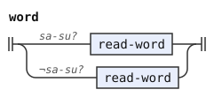</p>
<p>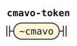</p>
</details>

## Quotes

Every complete quote is one opaque unit. Later operations see its opening marker class and no class from its contents or closing marker. The indicator and syntax stages receive the quote's emitted tokens.

A quote marker keeps its word kind and classes but drops the `indicator` mark. Otherwise the indicator stage can detach a marker from its quoted contents.

ZO quotes one word from the shared reader. Inside that quote, an eraser, compounder, or quote marker executes no operation. The reader still forms the y letteral.

ZOhOI and MEhOI quote one raw run in the experimental dialect. After a pause, they skip ordinary hesitation. The quote must finish at the end of its run.

In `zo'oi .y. bu`, the quote takes the raw y run as its payload. BU then forms a letteral from the whole quote. The same rule keeps the prolonged raw run in `zo'oi .yyy. bu`.

The words of ZOI, `zoi` and `la'o`, skip hesitation and read the next real word as their opening delimiter. Hesitation never serves as a delimiter. They close at the first matching whole run by canonical sound. Canonical sound ignores case and commas.

The y letteral used as a delimiter can close on one `ybu` run or adjacent `y` and `bu` runs. The reader accepts both opening spellings. The closing test preserves adjacency and never joins the body into words.

Extra y sounds before the opening BU remain hesitation, even across a pause. The delimiter then sounds like ybu. A raw yybu or yyybu run cannot close it. Neither can a raw prolonged y run followed by BU.

Thus `zoi .yy. bu. foo .yy. bu.` fails, and `zoi .yy. bu. foo .y. bu.` succeeds. The opening reader drops extra y sounds, and the raw closing comparison keeps them.

The rule `zoi-y-quote` reads letteral delimiters formed from hesitation. Zantufa also forms such a delimiter from `ie'o`, as [zantufa.md](zantufa.md) describes. The rule `zoi-quote` reads other delimiters. Each rule includes empty and nonempty bodies.

The body remains raw and opaque. In `zoi bu. foo .y. bu.`, the final `bu` closes the quote. The preceding y remains body text.

Ordinary compounds cannot become delimiters because the marker reads the delimiter before a later compounder acts. Empty quotes still emit an opaque body token. Pauses delimit the body and the closing run.

A LOhU quote ends at the first LEhU. Its body reads Lojban words through the shared reader without executing operations. No magic word acts there, including BU, ZEI, and FAhO. An unread run makes the quote fail.

The completed LOhU unit exposes LOhU alone to SA. LEhU closes the quote but supplies no later search target inside it. Replacement quotes and dialect quote kinds follow the same opacity rule.

```jbogenbau
%rule quote
  quoted-word | zoi-y-quote | zoi-quote | lohu-quote | single-word-quote

%rule quoted-word
  $m(word-quote-marker) quote-gap $w(read-word) <tags($m)>
%emits
  $m, $w <~word>

%rule word-quote-marker
  $q(read-word) <classes($q) ∪ ~word ∪ ~cmavo>
%conditions
  ZO ⊆ classes($q)

%rule single-word-quote
  | $m(single-marker) $r(zohoi-payload) <tags($m)>
  | $m(single-marker) PAUSE [zohoi-hesitations [PAUSE]] $s(zohoi-payload) <tags($m)>
%conditions
  ~run-final ⊆ tags(last($r)),
  ~run-final ⊆ tags(last($s)),
  ~hesitation ⊈ tags(head($s)) ∨ begins(from(head($s)), raw-y-letter)
%emits
  $m, $r <~quoted-text>, $s <~quoted-text>

%rule single-marker
  $q(read-word) <classes($q) ∪ ~word ∪ ~cmavo>
%conditions
  classes($q) ∩ (ZOhOI ∪ MEhOI) ≠ ∅

%rule zoi-y-quote
  | $m(zoi-marker) delimiter-gap $open(delimiter) PAUSE $content(raw-tokens) PAUSE $close(raw-close)
  | $m(zoi-marker) delimiter-gap $open(delimiter) PAUSE $content(empty-zoi-body) $close(raw-close)
%tags
  tags($m)
%conditions
  ~y-letter ⊆ tags($open),
  tags($open) ∖ $Y-PROPERTIES = tags($close),
  tags($open) ∖ $Y-PROPERTIES ⊈ tags($content, body-with-y-close)
%emits
  $m, $open <~word>, $content <~quoted-text>, $close <~word>

%rule zoi-quote
  | $m(zoi-marker) delimiter-gap $open(delimiter) PAUSE $content(raw-tokens) PAUSE $close(raw-close)
  | $m(zoi-marker) delimiter-gap $open(delimiter) PAUSE $content(empty-zoi-body) $close(raw-close)
%tags
  tags($m)
%conditions
  ~y-letter ⊈ tags($open),
  phonemes($open) = phonemes($close),
  phonemes($open) ∉ split(phonemes($content), ".")
%emits
  $m, $open <~word>, $content <~quoted-text>, $close <~word>

%const $Y-PROPERTIES
  ~word ∪ BY ∪ ~y-letter ∪ ~run-initial ∪ ~run-final

%rule delimiter
  $w(read-word)
%conditions
  Y ⊈ classes($w)

%rule delimiter-gap
  [PAUSE] [delimiter-hesitations [PAUSE]]

%rule delimiter-hesitations
  delimiter-hesitation | delimiter-hesitations [PAUSE] delimiter-hesitation

%rule delimiter-hesitation
  $h(y-run)
%conditions
  ¬begins(from($h), y-bu-word)
%emits
  ε

%rule y-key
  $y(y-run)
%tags
  (phonemes($y) = "ie'o" ⟹ ~ieho) ∪ (phonemes($y) ≠ "ie'o" ⟹ tag(phonemes($y)))

%rule raw-close
  raw-run | raw-y-close

%rule raw-run
  $r(raw-run-parts)
%conditions
  ~run-final ⊆ tags(last($r))

%rule raw-run-parts
  matched-close-token | raw-run-parts matched-close-token

%rule matched-close-token
  cmavo-token | payload-token⊉~cmavo

%rule raw-y-close
  $y(raw-y-key) [PAUSE] $b(matched-close-token)
%tags
  tags($y)
%conditions
  phonemes($b) = "bu",
  ~run-initial ⊆ tags(head($y)),
  ~run-final ⊆ tags(last($b))

%rule raw-y-base
  | y-run
  | $b(raw-y-base) $h(y-run)
%conditions
  phonemes($b) ≠ "ie'o",
  phonemes($h) ≠ "ie'o"

```

<details><summary>Railroad diagrams of the 18 rules from <code>quote</code> to <code>raw-y-base</code></summary>
<p>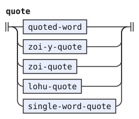</p>
<p>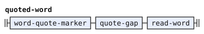</p>
<p></p>
<p>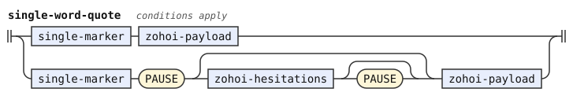</p>
<p>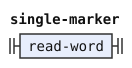</p>
<p>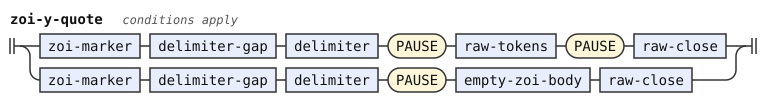</p>
<p>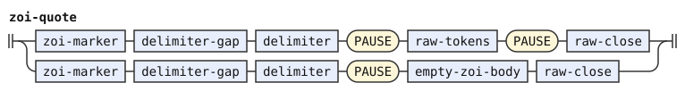</p>
<p>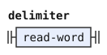</p>
<p>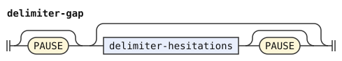</p>
<p>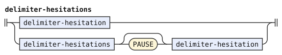</p>
<p>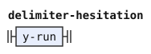</p>
<p>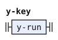</p>
<p>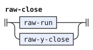</p>
<p>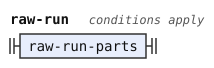</p>
<p>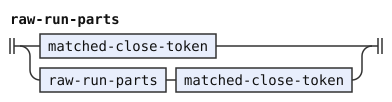</p>
<p>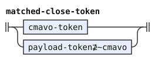</p>
<p>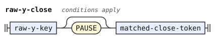</p>
<p>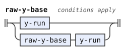</p>
</details>

The raw rule rejoins every piece of one y run. A drawn-out raw run retains its extra y sounds and cannot close a ybu delimiter. Zantufa's [`ie'o` exception](zantufa.md) keeps each `ie'o` separate from adjacent hesitation.

```jbogenbau
%rule raw-y-key
  $y(raw-y-base)
%tags
  (phonemes($y) = "ie'o" ⟹ ~ieho) ∪ (phonemes($y) ≠ "ie'o" ⟹ tag(phonemes($y)))

%rule raw-y-letter
  raw-y-base [PAUSE] bu-word

%rule zohoi-hesitation
  $h(y-run)
%conditions
  ¬begins(from($h), raw-y-letter)
%emits
  ε

%rule zohoi-hesitations
  zohoi-hesitation | zohoi-hesitations [PAUSE] zohoi-hesitation

%rule body-with-y-close
  [raw-tokens] $c(raw-y-close) [raw-tokens] <tags($c)>

%rule empty-zoi-body
  ε
%opaque

%rule zoi-marker
  $q(read-word) <classes($q) ∪ ~word ∪ ~cmavo>
%conditions
  ZOI ⊆ classes($q)

%rule lohu-quote
  | $m(lohu-marker) spacing lohu-stream spacing lehu-marker <tags($m)>
  | $m(lohu-marker) [PAUSE] lehu-marker <tags($m)>

%rule lohu-marker
  $q(read-word) <classes($q) ∪ ~word ∪ ~cmavo>
%conditions
  LOhU ⊆ classes($q)
%emits
  $

%rule lehu-marker
  $q(read-word) <classes($q) ∪ ~word ∪ ~cmavo>
%conditions
  LEhU ⊆ classes($q)
%emits
  $ <LEhU>

%rule lohu-stream
  | lohu-element
  | lohu-stream PAUSE lohu-element
  | lohu-stream lohu-element

%rule lohu-element
  lohu-word | hesitation

%rule lohu-word
  $w(read-word)
%conditions
  LEhU ⊈ classes($w)
%emits
  $ <~word>

%rule quote-gap
  [PAUSE] | [PAUSE] hesitations PAUSE | [PAUSE] hesitations

%rule hesitations
  | hesitation
  | hesitations PAUSE hesitation
  | hesitations hesitation

%rule raw-tokens
  any-token | raw-tokens any-token
%opaque

%rule zohoi-payload
  payload-token | zohoi-payload payload-token
%opaque

%rule any-token
  payload-token | PAUSE

%rule payload-token
  ~word | ~hesitation | UNREAD
```

<details><summary>Railroad diagrams of the 19 rules from <code>raw-y-key</code> to <code>payload-token</code></summary>
<p>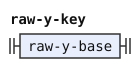</p>
<p>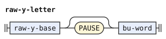</p>
<p>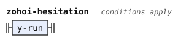</p>
<p>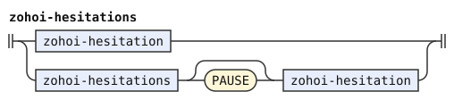</p>
<p>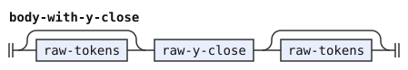</p>
<p>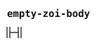</p>
<p>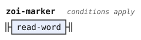</p>
<p>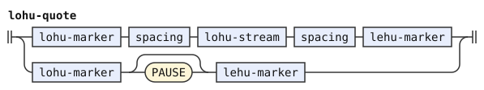</p>
<p>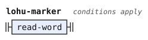</p>
<p>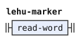</p>
<p>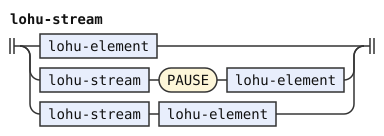</p>
<p>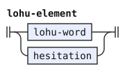</p>
<p>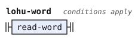</p>
<p>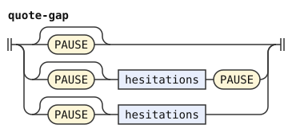</p>
<p></p>
<p></p>
<p></p>
<p></p>
<p></p>
</details>

## Compounds

BU takes the preceding live unit and forms one letteral. ZEI takes that unit and the next word as read, then forms one BRIVLA unit.

The right word of ZEI executes no operation. Thus `.abu zei bu` has a literal BU operand. In `da zei de bu`, the final BU takes the completed compound.

The constructors can repeat and combine without exposing their operands. Each result keeps any fault of its base. SI erases the complete result as one unit.

Erased regions and ordinary hesitation can separate an operand from its operator. The compound's sound and label omit these regions. Its text retains the original source span, including erased words. Their warnings still belong to the chosen derivation.

The CLL dialect requires pauses around a direct name base of BU. It tests the source run boundary. A name inside a compound does not make that compound a direct name.

```jbogenbau
%rule lerfu-word
  $u(unit) skipped bu-word <~word ∪ BY ∪ ~fault ∩ tags($u)>
%emits
  $

%rule bu-word
  $q(cmavo-token)
%conditions
  BU ⊆ classes($q)

%rule zei-compound
  $l(unit) skipped zei-word spacing $r(read-word)
%tags
  ~word ∪ BRIVLA ∪ ~fault ∩ tags($l)
%emits
  $

%rule zei-word
  $q(cmavo-token)
%conditions
  ZEI ⊆ classes($q)
```

<details><summary>Railroad diagrams of <code>lerfu-word</code>, <code>bu-word</code>, <code>zei-compound</code> and <code>zei-word</code></summary>
<p></p>
<p></p>
<p></p>
<p></p>
</details>

## Erasure by `si`

SI erases the preceding live unit. Quotes and compounds each count as one unit. A run of SI removes that many units and then does nothing on an empty stream.

SI skips hesitation and erased regions. It never erases an already executed SA or SU as a word. A fault unit is an ordinary operand for erasure.

```jbogenbau
%rule si-erasure
  unit skipped si-word
%emits
  ε

%rule si-word
  $q(cmavo-token)
%conditions
  SI ⊆ classes($q)
```

<details><summary>Railroad diagrams of <code>si-erasure</code> and <code>si-word</code></summary>
<p></p>
<p></p>
</details>

## Erasure by `sa` and `su`

SA reads its key from the next word before that word executes. It erases through the nearest preceding unit whose class matches that key. The next word stays and then executes normally.

The key of `sa .ebu` is the class of `.e`. BU has not yet formed that letteral. A letteral has class BY, so `sa bu` finds no BU inside it.

A cmavo missing from the lexicon has no class and matches no unit, even the same spelling. SA with such a key erases everything before it.

With no matching unit, SA erases everything before it. Thus `mi bu sa bu` removes the letteral and leaves a dangling BU fault. A later eraser can remove that fault.

Counted SA selects the second-nearest match for two markers, the third-nearest for three, and so on. The grammar nests one reach per marker. Too few matches erase the whole prefix.

SA at normal end has no key and erases back to the start of the text. SA before active FAhO uses FAhO as its key, erases the prefix, and then ends the text.

A reach is the stretch from a candidate unit to SA. Its tags keep classes of its first unit that no later live unit shares. Thus a surviving class identifies the nearest candidate for that key. Each nested SA intersects the possible target classes from its reaches. The rule `sa-wipe-core` handles too few matching units. No reach searches inside a quote or compound.

In cll-ebnf and Zantufa, SU erases everything before it. In bpfk and experimental, SU stops at the last NIhO, LU, TUhE, or TO unit. That boundary survives.

The feature `su-boundary` makes SU keep its stopping boundary. A boundary inside an opaque unit cannot stop SU. With no boundary, SU erases the whole prefix. When a boundary survives SU, the grammar groups both into one unit. Thus `unit` includes `su-survivor`.

These examples show the target choice. `le broda le brode sa le` leaves `le broda le`. `le broda le brode sa sa le` leaves `le`. `mi bu sa bu` fails. `broda sa` leaves nothing.

The rule `sa-key` refuses an SA key because a run of SA forms one counted erasure. The rule `next-word-class` tests the whole remaining span through `tags(after($), next-word-class)`. Its optional `raw-tokens` reads everything after the key, including material after FAhO ([notation, Conditions](../../docs/notation.md#conditions)). The rule reads those tokens without word operations, as quote bodies and the active FAhO suffix do.

```jbogenbau
%rule sa-erasure
  $s(sa-nest) spacing $k(sa-key)
%conditions
  classes($s) ∩ tags($k) ≠ ∅
%emits
  ε

%rule sa-nest
  | $u(sa-open) spacing sa-word <classes($u)>
  | $u(sa-open) spacing $n(sa-nest) spacing sa-word <classes($u) ∩ classes($n)>
%conditions
  classes($u) ≠ ∅,
  classes($u) ∩ classes($n) ≠ ∅

%rule sa-open
  | $u(unit) <classes($u)>
  | $s(sa-open) spacing $u(unit) <classes($s) ∖ classes($u)>
  | $s(sa-open) spacing erasure <classes($s)>
%conditions
  classes($) ≠ ∅

%rule sa-key
  ε
%tags
  tags(after($), next-word-class)
%conditions
  SA ⊈ tags($)

%rule next-word-class
  spacing $w(read-word) [raw-tokens] <classes($w) ∪ ~has-word>

%rule sa-word
  $q(cmavo-token)
%conditions
  SA ⊆ classes($q)

%rule sa-run
  sa-word | sa-run spacing sa-word

%rule sa-run-twice
  sa-word spacing sa-run

%rule sa-wiped
  | empty sa-run spacing $k(sa-key)
  | $s(stream) spacing sa-run spacing $k(sa-key)
  | empty $n(sa-wipe-core) spacing $k(sa-key)
  | $s(stream) spacing $n(sa-wipe-core) spacing $k(sa-key)
%conditions
  ~has-word ⊆ tags($k),
  classes($s) ∩ tags($k) = ∅,
  classes($n) ∩ tags($k) ≠ ∅
%emits
  ε

%rule sa-wipe-core
  | $u(sa-open) spacing sa-run-twice <classes($u)>
  | $u(sa-open) spacing $n(sa-wipe-core) spacing sa-word <classes($u) ∩ classes($n)>
%conditions
  classes($u) ∩ classes($n) ≠ ∅

%const $SU-STOPS
  NIhO ∪ LU ∪ TUhE ∪ TO

%rule su-survivor
  sa-su? su-boundary? $b(unit) skipped su-suffix <tags($b)>
%conditions
  classes($b) ∩ $SU-STOPS ≠ ∅

%rule su-suffix
  | su-word
  | su-reach spacing su-word
%emits
  ε

%rule su-reach
  | unit∩$SU-STOPS=∅
  | su-reach spacing unit∩$SU-STOPS=∅
  | su-reach spacing erasure

%rule su-word
  $q(cmavo-token)
%conditions
  SU ⊆ classes($q)
```

<details><summary>Railroad diagrams of the 14 rules from <code>sa-erasure</code> to <code>su-word</code></summary>
<p></p>
<p></p>
<p></p>
<p></p>
<p></p>
<p></p>
<p></p>
<p></p>
<p></p>
<p></p>
<p></p>
<p></p>
<p></p>
<p></p>
</details>

## Choosing among parses

The stage uses lazy ambiguity resolution. It compares the first structural difference and favors closing a constituent over another token. The rules exclude readings that violate left-to-right operations.

The forms stage fixes ordinary word boundaries before this stage. The shared reader forms the y letteral when an operation requests a word. The stage adds no normalization step.

## Departures from CLL, Magic Words, and the reference parsers

### CLL and Magic Words

The dialects follow the [Magic Words proposal](https://mw.lojban.org/papri/Magic_Words) with the departures below. The maintainer chooses opaque units where that proposal exposes internal markers.

CLL describes erasure,[^cll-s19-13] hesitation,[^cll-s19-14] FAhO,[^cll-s19-15] and their interactions.[^cll-s19-16] These sections do not specify one complete processing order.

The dialects keep six established departures from CLL.[^cll-c19] Items 2 and 4 differ in Zantufa. There ZEI erases, and hesitation attached to a word has class Y ([zantufa-stream.md](zantufa-stream.md)).

1. SI, BU, and ZEI each take a whole quote or compound as one unit. The CLL examples[^cll-e19-77][^cll-e19-79] count quotation markers and contents separately. CLL[^cll-s19-16] defines BU and ZEI by the preceding word, and CLL[^cll-s17-4] limits BU to one word.
2. ZEI takes any next word as its right operand. CLL[^cll-s19-16] excludes several magic words from that interaction.
3. BU forms a letteral over BAhE. CLL[^cll-s17-4][^cll-s19-16] exclude BAhE as a BU base.
4. Ordinary hesitation counts as space, not a word. CLL[^cll-s19-14] gives y the class Y. Only the shared reader forms the y letteral.
5. LOhU closes at the first LEhU. CLL[^cll-s19-16] excludes a LEhU after ZO, and CLL permits a ZOI quote inside LOhU.[^cll-s19-10]
6. ZOI compares whole raw runs by sound. The CLL examples[^cll-e19-50][^cll-e19-51] instead forbid the delimiter's spelling or sound inside a longer run.

The [proposal's BU page](https://mw.lojban.org/papri/bu) lets SA BU reach inside a letteral. Its main page marks this interpretation controversial. These dialects instead keep the letteral opaque. SA ZEI likewise finds no ZEI inside a compound.

The proposal's ZEI paragraph writes "ZEI+BU grabs back to the last ZEI". The maintainer reads "ZEI+BU" as a typo for "SA+ZEI". The page's discussion records the unclear wording. This grammar permits no such search inside a compound.

The proposal also exposes a completed LOhU quote's LEhU ending to SA. These dialects expose only the opening class. A constructor keeps the unopened-quote fault. `le'u bu` still fails, and `le'u bu si` is empty.

A dangling BU is also a fault unit that BU or ZEI can wrap. An eraser can remove the result, so `bu zei klama si` leaves nothing. The proposal's BU page instead forbids ZEI to bind a dangling BU on its left.

### Erasure in camxes and the dialects

camxes-std, the standard grammar of the camxes parser, follows the grammatical reading of CLL[^cll-s19-13], without a class key. SA erases back to the start of a construct that the following words continue. Such a construct can be a term or sentence. camxes-std applies this rule unevenly. It accepts `broda sa broda` but rejects `lo broda sa broda`.

A run of letterals forms one camxes sumti, an argument of a predicate. Thus `by cy sa .ebu` erases both letters. In `by boi cy sa .ebu`, BOI ends the first sumti, so SA keeps `by`. `mi do sa ti` keeps `mi`, and `mi broda le brode sa ti` gives `mi broda ti`.

camxes-std reads `sa sa` as one SA. It rejects a trailing SA and an SA with no construct before it. Thus it rejects `mi do sa brodi`, `sa broda`, and `broda sa`. It also rejects `bu si` and `.abu sa bu`. It rejects `mi ni'o do su si`, which cll-ebnf accepts as empty.

These dialects instead use the next word's class and select the nearest matching unit. Counted SA selects successively earlier matches. A trailing SA clears the text, as the `bu sa` row of the proposal's BU page specifies. The opaque-unit rule keeps `.abu sa bu` rejected in cll-ebnf, bpfk, and experimental.

Zantufa gives SA class UI, so it performs no SA erasure.

The cll-ebnf SU policy follows CLL[^cll-s19-13]. Zantufa also erases the whole preceding text, as its reference grammar specifies. Bpfk and experimental preserve a boundary unit by the maintainer's decision. The Magic Words proposal names those boundaries but does not say whether they survive.

### Final markers and Zantufa exceptions

The dialects keep `mi ba'e fa'o` rejected. The stranded BAhE cannot mark a word after FAhO ends the text. This policy differs from acceptance by camxes-exp, the experimental grammar of the camxes parser ([experimental.md](../dialects/experimental.md)).

Zantufa retains its reference parser's quote-first fallback and SU-before-BU letter-base exception. [The dialect document](../dialects/zantufa.md) defines both exceptions.

[^cll-s19-16]: [CLL 1.1, section 19.16](https://lojban.org/publications/cll/cll_v1.1_xhtml-section-chunks/section-cmavo-interactions.html).

[^cll-s17-4]: [CLL 1.1, section 17.4](https://lojban.org/publications/cll/cll_v1.1_xhtml-section-chunks/section-bu.html).

[^cll-s19-14]: [CLL 1.1, section 19.14](https://lojban.org/publications/cll/cll_v1.1_xhtml-section-chunks/section-hesitation.html).

[^cll-s19-13]: [CLL 1.1, section 19.13](https://lojban.org/publications/cll/cll_v1.1_xhtml-section-chunks/section-erasure.html).

[^cll-e19-77]: [CLL 1.1, section 19.13, example 19.77](https://lojban.org/publications/cll/cll_v1.1_xhtml-section-chunks/section-erasure.html#c19e13d3).

[^cll-e19-79]: [CLL 1.1, section 19.13, example 19.79](https://lojban.org/publications/cll/cll_v1.1_xhtml-section-chunks/section-erasure.html#c19e13d5).

[^cll-e19-50]: [CLL 1.1, section 19.10, example 19.50](https://lojban.org/publications/cll/cll_v1.1_xhtml-section-chunks/section-more-quotations.html#c19e10d3).

[^cll-e19-51]: [CLL 1.1, section 19.10, example 19.51](https://lojban.org/publications/cll/cll_v1.1_xhtml-section-chunks/section-more-quotations.html#c19e10d4).

[^cll-s19-15]: [CLL 1.1, section 19.15](https://lojban.org/publications/cll/cll_v1.1_xhtml-section-chunks/section-faho.html).

[^cll-s19-10]: [CLL 1.1, section 19.10](https://lojban.org/publications/cll/cll_v1.1_xhtml-section-chunks/section-more-quotations.html).

[^cll-c19]: [CLL 1.1, chapter 19](https://lojban.org/publications/cll/cll_v1.1_xhtml-section-chunks/chapter-structure.html).
