# The Zantufa word stream

A letteral is a letter word of class BY, as [stream.md](stream.md) defines it.

This document is part of the word stage in the [Zantufa](../dialects/zantufa.md) dialect. A stage is one step of a pipeline, with its own grammar. A token is one unit that a stage reads or emits. Each stage reads the tokens that the stage before it emitted, and emits new tokens.

The dialect includes this document after [the word stream](stream.md). The document changes what the Zantufa lexicon's classes alone do not. The reference is Zantufa 1.9999, whose rules the comments give. [The notation document](../../docs/notation.md) explains the notation.

The prose uses these Lojban terms for words:

- A cmavo is a particle, a short structure word.
- A gismu is a root word.
- A lujvo is a compound word.
- A rafsi is a shortened word form used inside compounds.

Magic words act on other words. Examples are quotes and erasers. Most of Zantufa's magic words follow from its lexicon. SI is `si`, `zei`, `ze'ei` and `si'u'i`, so each erases the word before it, and no word joins two words into a lujvo. `sa` is an attitudinal. ZO is `zo`, `ma'oi` and `ra'ai`, LOhU is `lo'u` and `la'ai`, and ZOI is `zoi` and `la'o`.

A word of GOhOI (`go'oi`, `ze'oi`, `ta'ai` and `bo'ei`) quotes the next Lojban word, as `zo` does. It does not quote the rest of a run (a stretch with no internal pause), so `go'oi mido` quotes `mi` and leaves `do`. The Zantufa lexicon has no word of ZOhOI or MEhOI. So no Zantufa word quotes the rest of a run.

```jbogenbau
%redefine-rule word-quote-marker
  (* ZO_pre <- pre_clause ZO spaces? any_word spaces?;  GOhOI_pre <- pre_clause GOhOI spaces? any_word spaces? *)
  $q(read-word) <classes($q) ∪ ~word ∪ ~cmavo>
%conditions
  classes($q) ∩ (ZO ∪ GOhOI) ≠ ∅
```

<details><summary>Railroad diagram of <code>word-quote-marker</code></summary>
<p>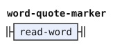</p>
</details>

`ra'oi` quotes the rafsi or gismu form that the forms stage read after it ([zantufa.md](zantufa.md)), with or without a pause between them.

```jbogenbau
%extend-rule quote
  rahoi-quote

%rule rahoi-quote
  $m(rahoi-marker) quote-gap $f(~rafsi-form) <tags($m)>
%emits
  $m, $f <~quoted-text>

%rule rahoi-marker
  $q(read-word) <classes($q) ∪ ~word ∪ ~cmavo>
%conditions
  RAhOI ⊆ classes($q)
```

<details><summary>Railroad diagrams of <code>quote</code>, <code>rahoi-quote</code> and <code>rahoi-marker</code></summary>
<p>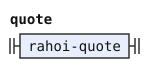</p>
<p>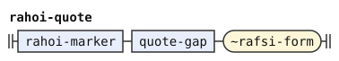</p>
<p>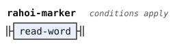</p>
</details>

`mu'oi` quotes a body between two delimiters, as `zoi` does. Zantufa compares the two delimiters in lower case, so `zoi .ko. x .kO.` is a quote. So does every dialect, which compares them by their canonical sound ([the word stream](stream.md)). So the dialect needs only the marker.

```jbogenbau
%redefine-rule zoi-marker
  (* ZOI_pre <- pre_clause ZOI spaces? zoi_open spaces? zoi_word* zoi_close spaces?;  MUhOI_pre likewise *)
  $q(read-word) <classes($q) ∪ ~word ∪ ~cmavo>
%conditions
  classes($q) ∩ (ZOI ∪ MUhOI) ≠ ∅
```

<details><summary>Railroad diagram of <code>zoi-marker</code></summary>
<p></p>
</details>

Zantufa reads `y` and `ie'o` as space only after a pause or at the start of the text, because its `spaces` begins with `!Y`. A hesitation attached to the word before it, with no pause between them, is a word of class Y there. So `zoie'o mi` quotes `ie'o` and leaves `mi`, while `zo ie'o mi` quotes `mi`. Such a word has no place in the syntax except in a quote, so the dialect rejects `mi cuyy klama`, as Zantufa does. Before `bu`, hesitation stays the base of a letteral.

In a `lo'u` or `lo'ai` quote, the stage tags such a word `word` only, like every other quoted word. The shared reader handles both quote bodies.

```jbogenbau
%redefine-rule hesitation
  (* spaces <- !Y initial_spaces *)
  $h(y-run) <∅>
%conditions
  ¬begins(from($h), y-bu-word),
  (~run-initial ∪ ~spacing) ∩ tags($h) ≠ ∅ ∨ ~y-letters ⊆ tags($h) ∧ begins(after($h), y-letter-ahead)
%emits
  ε

%rule y-letter-ahead
  y-bu-word | ~hesitation y-letter-ahead

%rule attached-y
  $h(~hesitation) <~word ∪ ~cmavo ∪ Y>
%conditions
  (~run-initial ∪ ~spacing) ∩ tags($h) = ∅,
  ~y-letters ⊈ tags($h) ∨ ¬begins(after($h), y-letter-ahead),
  ¬begins(from($h), y-bu-word)
%emits
  $

%extend-rule read-word
  attached-y

```

<details><summary>Railroad diagrams of the 4 rules from <code>hesitation</code> to <code>read-word</code></summary>
<p>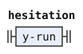</p>
<p>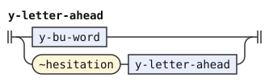</p>
<p>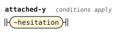</p>
<p>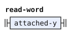</p>
</details>

A magic word is never a plain word. `$MAGIC-WORDS` adds RAhOI, GOhOI, MUhOI, LOhAI and LEhAI to the shared list. Their bare markers require SI or BU after them, as the later `unit` rule states.

A word of LU, TO or LUhEI, the classes of `$TEXT-OPENERS`, that this stage reads as an unquoted word opens a text of its own. The forms stage gives the tag `opener-space` to the hesitation after such a word. A tag marks a token by name, phoneme or character. So that hesitation is space, and the word takes it with it. Inside a quote, such a hesitation is an attached Y word, as in `zo luyy si`, which erases the `yy` and keeps `zo lu`.

```jbogenbau
%redefine-const $MAGIC-WORDS
  $MAGIC-WORDS ∪ RAhOI ∪ GOhOI ∪ MUhOI ∪ LOhAI ∪ LEhAI

%const $TEXT-OPENERS
  LU ∪ TO ∪ LUhEI

%redefine-rule word
  | sa-su? $c(read-word) <tags($c)>
  | ¬sa-su? $e(read-word) <tags($e)>
  | $o(text-opener) $p(opener-spaces) <tags($o)>
%conditions
  ¬begins(after($p), opener-space-token),
  classes($c) ∩ $TEXT-OPENERS = ∅ ∨ ¬begins(after($c), opener-space-token),
  classes($e) ∩ $TEXT-OPENERS = ∅ ∨ ¬begins(after($e), opener-space-token),
  classes($c) ∩ $MAGIC-WORDS = ∅,
  classes($e) ∩ ($MAGIC-WORDS ∖ (SA ∪ SU)) = ∅,
  ¬begins(from($c), quote),
  ¬begins(from($e), quote)
%emits
  $

%rule text-opener
  $q(cmavo-token) <tags($q)>
%conditions
  classes($q) ∩ $TEXT-OPENERS ≠ ∅
%emits
  $

%rule opener-spaces
  $h(opener-space-token) [opener-spaces]
%emits
  ε

%rule opener-space-token
  (* initial_spaces <- (space_char / !ybu Y)+: a hesitation before bu is no space *)
  $h(~hesitation)
%conditions
  ~opener-space ⊆ tags($h),
  ¬begins(from($h), y-bu-word)
```

<details><summary>Railroad diagrams of the 4 rules from <code>word</code> to <code>opener-space-token</code></summary>
<p>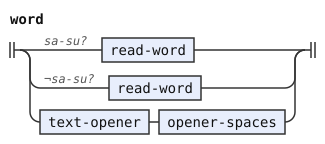</p>
<p>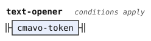</p>
<p>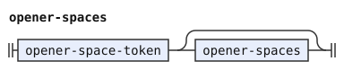</p>
<p>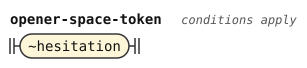</p>
</details>

The forms stage hands on the form after `ra'oi` as a `rafsi-form` token, even where that `ra'oi` opens no quote. So a `zoi` body, a `zoi` delimiter and the text after `fa'o` take that token as they take any other word. `fa'o ra'oi broda` is `fa'o` and what it ignores, and `zoi broda ra'oi broda` quotes `ra'oi`, as in Zantufa.

```jbogenbau
%extend-rule payload-token
  ~rafsi-form

%extend-rule delimiter
  ~rafsi-form
```

<details><summary>Railroad diagrams of <code>payload-token</code> and <code>delimiter</code></summary>
<p>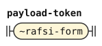</p>
<p>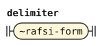</p>
</details>

A quote word that opens no quote is an ordinary word in Zantufa, which `si` erases. Zantufa's `si_word` tries the quotes first, and then reads any cmavo but `bu`, a word of SI or SU, and `fa'o`. So `zoi si broda` is `broda`, and `lo'u si` is nothing. A bare marker can occupy a unit before SI or BU. It remains bare only where no complete quote begins.

`zo` and the words of GOhOI always quote the next word, so they are never bare. So a bare marker is a word of ZOI, MUhOI, LOhU, LOhAI or RAhOI, the other quotes of `si_word`.

```jbogenbau
%extend-rule unit
  $b(bare-marker) <tags($b)>
%conditions
  ¬begins(from($b), quote),
  begins(after($b), bare-marker-tail)

%rule bare-marker-tail
  skipped si-word | skipped bu-word

%rule bare-marker
  $q(read-word)
%conditions
  classes($q) ∩ (ZOI ∪ MUhOI ∪ LOhU ∪ LOhAI ∪ RAhOI) ≠ ∅
```

<details><summary>Railroad diagrams of <code>unit</code>, <code>bare-marker-tail</code> and <code>bare-marker</code></summary>
<p>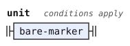</p>
<p>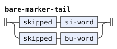</p>
<p>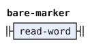</p>
</details>

The shared BU constructor also takes a bare marker when no quote begins there. Zantufa keeps its reference parser's quote-first fallback. A complete quote takes priority over a bare marker.

Zantufa also keeps SU as a letter base before BU binds. Such a SU erases nothing, so `mi su bu si` leaves `mi`. This exception follows `bu_clause_no_pre` in Zantufa 1.9999.

The lookahead skips erased regions before BU. Thus `su mi si bu` forms the letteral of SU. Without a following BU, SU erases the whole preceding text. NIhO, LU, TUhE, and TO do not stop it.

```jbogenbau
%extend-rule unit
  $s(su-letter-base) skipped bu-word <~word ∪ BY>
%emits
  $

%rule su-letter-base
  $q(read-word)
%conditions
  SU ⊆ classes($q)

%rule su-letter-tail
  skipped bu-word

%redefine-rule su-word
  $q(read-word)
%conditions
  SU ⊆ classes($q),
  ¬begins(after($q), su-letter-tail)
```

<details><summary>Railroad diagrams of <code>unit</code>, <code>su-letter-base</code>, <code>su-letter-tail</code> and <code>su-word</code></summary>
<p>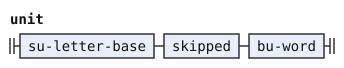</p>
<p>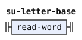</p>
<p>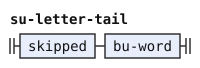</p>
<p>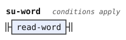</p>
</details>

## Differences from the shared word stream

The shared list lacks RAhOI, GOhOI and MUhOI, which only Zantufa uses. It also omits LOhAI and LEhAI because the experimental dialect permits their bare markers as plain words. Zantufa instead restricts bare markers to the SI and BU fallback positions described above.
